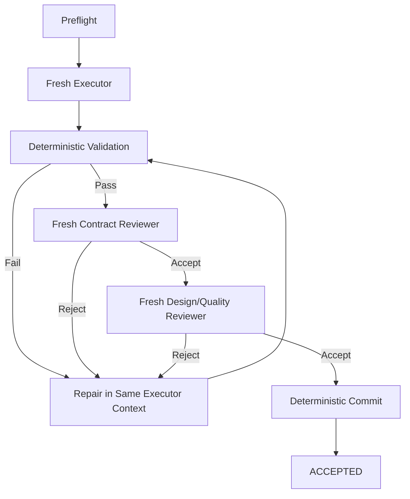

# 05 — Execution Factory

## Recommended initial factory boundary

Input:

> An approved, ready vertical ticket plus references to approved design artifacts.

Output:

> An accepted commit or an explicit terminal/escalation state.

Do not initially make the core factory responsible for inventing the feature design.

---

## Ticket factory

Suggested interface:

```text
factory run <ticket.md>
```

Conceptual pipeline:



Bounded repair attempts prevent infinite loops.

---

## Preflight

Deterministic checks should include as appropriate:

- ticket schema valid
- all referenced upstream artifacts exist
- required gates are approved
- blocking tickets are complete
- repository/worktree is clean enough to start
- baseline commit matches expected state
- ticket is not already active elsewhere
- validation commands are declared
- file-scope policy can be resolved

---

## Executor contract

The executor receives:

- ticket
- minimal referenced upstream design sections
- relevant repository context
- explicit allowed/expected scope
- validator commands
- previous repair feedback for this ticket

It may:

- implement
- run local exploratory commands
- repair failures
- report design conflicts

It may not:

- silently amend approved upstream contracts
- declare its own work accepted
- bypass mandatory validators
- mutate authoritative workflow state directly

---

## Deterministic validation

Known checks belong to code, not a “tester agent.”

Examples:

- build
- unit/integration tests
- linters/analyzers
- formatting
- architecture dependency checks
- schema validation
- generated-code consistency
- browser assertions where automatable
- touched-file scope checks

Result should be structured and stored.

---

## Repair loop

Ordinary failure:

```text
validator failure
→ feed exact evidence to same executor
→ repair
→ re-run all relevant deterministic checks
```

Reviewer rejection:

```text
fresh reviewer rejects
→ feed structured findings to same executor
→ repair
→ deterministic checks again
→ fresh review again
```

Why keep executor context?

> Implementation context is valuable state.

Why refresh reviewer context?

> Review context is dangerous state because of anchoring.

---

## Terminal state: `DESIGN_BLOCKED`

A crucial state distinct from `FAILED`.

Use when:

> The approved design cannot be implemented without violating an upstream contract or an assumption necessary for the design is false.

Example:

```text
DESIGN_BLOCKED
reason:
  Program design assumes DeviceManager is thread-safe; codebase evidence proves it is not.
impacted_contract:
  40-program-design.md#execution-lifetime
suggested_resolution:
  reconsider execution ownership
```

The feature runner stops and escalates to the design-control loop.

---

## Commit ownership

Commit should be performed by deterministic code after all required ticket gates pass.

Benefits:

- commit boundary exactly matches accepted ticket
- predictable message format
- no accidental unrelated staging
- easier rollback/bisect
- clean evidence mapping

---

## Feature runner

Suggested interface:

```text
factory run-feature .planning/<feature>
```

Responsibilities:

- load ticket dependency graph
- resolve next unblocked ticket
- invoke ticket factory
- persist ticket state
- stop on terminal/escalation conditions
- enforce policy checkpoints
- optionally parallelize later

Parallelism should be conservative initially.

---

## Whole-feature factory

After all tickets are accepted:

```text
full deterministic validation
→ whole-feature contract review
→ architecture/program-design drift review
→ standards/maintainability review
→ conditional specialty reviews
→ package run evidence
→ push branch
→ create draft PR
```

---

## PR creation

PR creation belongs inside the factory because it is primarily packaging and state transition.

The factory has unusually rich information for the PR description:

- intent/spec
- approved architecture/design
- ticket graph
- commits
- validations
- review results
- repairs
- amendments
- unresolved warnings

The default should be a **draft PR**.

Human review remains the merge authority initially.
