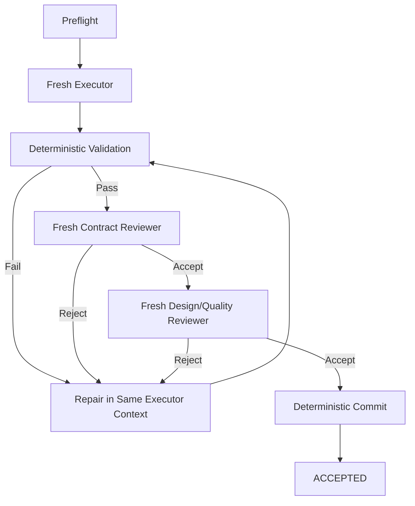

# 05 — Execution Factory

## Recommended initial factory boundary

Input:

> An approved, ready vertical ticket drawn from an exact accepted ticket graph, plus references to its
> applicable accepted design artifacts and frozen repository baseline.

Output:

> An accepted commit or an explicit terminal/escalation state.

Do not initially make the core factory responsible for inventing the feature design.

---

## Ticket factory

Conceptual invocation inputs:

```text
exact accepted ticket-graph binding + selected ticket identity
```

The concrete CLI is a Program Design choice. A ticket path by itself is never sufficient authority.

Conceptual pipeline:



Bounded repair attempts prevent infinite loops.

---

## Preflight

Deterministic checks should include as appropriate:

- exact accepted ticket-graph version/hash exists and contains this ticket
- the graph's acceptance is current under the downstream planning controller
- all applicable accepted upstream bindings still match their exact versions/hashes
- the execution run manifest's immutable source baseline matches the graph's frozen target baseline
- the current worktree HEAD matches the expected chain of accepted ticket commits rooted at that baseline
- ticket schema valid
- all referenced upstream artifacts exist
- required gates are approved
- graph is acyclic and its readiness/proof contract is valid
- every ticket prerequisite and external readiness condition is demonstrably satisfied
- repository/worktree is clean enough to start
- ticket is not already active elsewhere
- validation commands are declared
- file-scope policy can be resolved

Preflight verifies and consumes the accepted ticket-graph binding. It does not create, record, or
manufacture graph acceptance, and it does not silently recompile a stale graph. A missing, stale, or
mismatched binding fails closed before any ticket becomes active. The frozen baseline is the run's
immutable starting point, not a requirement that worktree HEAD remain equal to it after accepted
ticket commits; the expected accepted-commit chain supplies that later currency check. A graph whose
readiness/proof contract is invalid fails before a builder attempt, preserves evidence, and is not
silently recompiled or weakened by the executor.

---

## Executor contract

The trusted supervisor derives a compact execution brief through fixed projection rules. The brief
has no independent acceptance and contains only the selected ticket plus mechanically selected
material from:

- the exact accepted graph and applicable selected-path source bindings;
- frozen Stage 0 on direct/`trivial` paths;
- current repository baseline/accepted-commit-chain facts;
- evidence satisfying ticket and external prerequisite conditions;
- frozen execution configuration/staffing and validated runtime-produced values;
- relevant Program Design touchpoints and validator/review proof paths; and
- previous repair findings for this ticket.

Prefer exact references and excerpts over duplicated planning history. The raw user prompt is
provenance rather than a coequal instruction. No planner or summarizer agent authors this brief.
Program Design touchpoints are normative expectations, not an exhaustive file allowlist; runtime
write capability is enforced separately.

The executor may:

- implement
- run local exploratory commands
- repair failures
- report design conflicts

It may not:

- select or replace the supervisor-selected ticket;
- change Atlas phase/owner, roster policy, accepted dependency truth, governance, or validation policy;
- delegate ticket ownership or Atlas authority;
- introduce an execution-time planner/controller;
- silently amend approved upstream contracts;
- declare its own work accepted;
- bypass mandatory validators;
- mutate authoritative planning/runtime state directly;
- commit, push, publish, or merge.

A harness's internal helper agents, when any, remain inside the selected worker attempt under the
containment contract in `12-capabilities-and-trust.md`; they do not relax this executor contract.

---

## Deterministic validation

Known checks belong to code, not a “tester agent.”

Examples:

- build
- unit/integration tests
- linters/analyzers
- formatting
- architecture dependency checks
- schema validation
- generated-code consistency
- browser assertions where automatable
- touched-file scope checks

Result should be structured and stored. Before validators run, deterministic code fixes the canonical
candidate-tree identity for the exact proposed bytes. Validator receipts and every required ticket
review bind that same identity together with the run/ticket/graph, expected accepted-chain HEAD,
validator semantics, applicable baseline expectation, verdict, and evidence as defined in
`13-runtime-protocol.md`. A passing command or review detached from those identities cannot authorize
a ticket or feature transition.

---

## Repair loop

Ordinary failure:

```text
validator failure
→ feed exact evidence to same executor
→ repair
→ re-run all relevant deterministic checks
```

Reviewer rejection:

```text
fresh reviewer rejects
→ feed structured findings to same executor
→ repair
→ deterministic checks again
→ fresh review again
```

Why keep executor context?

> Implementation context is valuable state.

Why refresh reviewer context?

> Review context is dangerous state because of anchoring.

---

## Terminal state: `DESIGN_BLOCKED`

A crucial state distinct from `FAILED`.

Use when:

> The approved design cannot be implemented without violating an upstream contract or an assumption necessary for the design is false.

Example:

```text
DESIGN_BLOCKED
reason:
  Program design assumes DeviceManager is thread-safe; codebase evidence proves it is not.
impacted_contract:
  40-program-design.md#execution-lifetime
suggested_resolution:
  reconsider execution ownership
```

The feature runner stops and escalates to the design-control loop.

---

## Commit ownership

Commit should be performed by deterministic code after all required ticket gates pass.

Immediately before any commit, deterministic code revalidates the exact accepted ticket-graph
binding, its applicable accepted upstream sources, the run manifest's frozen target baseline, the
expected accepted-commit chain against current downstream planning acceptance, and exact equality
between the to-be-committed tree and the canonical candidate-tree identity bound by every passing
ticket gate. If the graph is stale, a binding mismatches, or worktree HEAD is not the expected chain
tip, there must be no commit: the ticket enters `DESIGN_BLOCKED`, the worktree/evidence is retained
for diagnosis, and the feature runner escalates upstream. A candidate-tree mismatch instead stales
validator/reviewer evidence and reruns the ticket gates on a newly fixed candidate identity; it cannot
commit unreviewed bytes. These checks close the intervals between ticket preflight, proof, review,
and commit without giving execution authority to mutate planning acceptance.

Benefits:

- commit boundary exactly matches accepted ticket
- predictable message format
- no accidental unrelated staging
- easier rollback/bisect
- clean evidence mapping

---

## Feature runner

Suggested interface:

```text
factory run-feature <planning-root>/<feature>
```

The feature path is a lookup key, not execution authority. The runner must resolve and verify the
current exact accepted ticket-graph binding before selecting any ticket.

Responsibilities:

- load the exact accepted ticket graph
- derive readiness from all accepted ticket and external conditions
- maintain one repository-scoped workspace at the expected accepted-commit-chain tip
- admit at most one active ticket in a repository-scoped V1 run
- select the first ready ticket in canonical graph order
- invoke ticket factory
- persist ticket state and an evidence-bearing external/human wait record
- on explicit `continue`/`resume`, reload and revalidate rather than grant readiness
- bind runtime-produced values only after evidence satisfies the accepted condition
- durably harvest required evidence before destructive cleanup
- stop on terminal/escalation conditions
- enforce policy checkpoints
- optionally parallelize later

Dependencies remain real prerequisites; canonical order is a separate tie-break among ready tickets.
V1 does not poll CI, registries, deployment systems, or human processes. A manual wake followed by
revalidation is the complete initial external-wait behavior. Parallelism should be conservative
initially.

---

## Whole-feature factory

Ticket acceptance proves one ticket into one exact deterministic commit. Feature promotion is a
separate boundary: the exact integrated commit-chain tip/tree receives the complete configured
promotion proof before publication. That proof includes:

```text
full deterministic validation against the exact tip/tree
→ whole-feature contract review
→ architecture/program-design drift review
→ standards/maintainability review
→ conditional specialty reviews
→ package run evidence bound to that tip/tree
→ push branch
→ create draft PR
```

Any later HEAD/tree change stales the promotion proof. Historical validation cannot authorize
publication of a different tree.

---

## PR creation

PR creation begins delivery packaging; it does not retroactively redefine implementation completion.
An accepted local commit proves no PR review, CI, package publication, deployment, or downstream
repository condition. Those remain separate evidence-bearing facts under the supervisor.

PR creation belongs inside the factory because it is primarily packaging and state transition.

The factory has unusually rich information for the PR description:

- intent/spec
- approved architecture/design
- ticket graph
- commits
- validations
- review results
- repairs
- amendments
- unresolved warnings

The default should be a **draft PR**.

Human review remains the merge authority initially.
