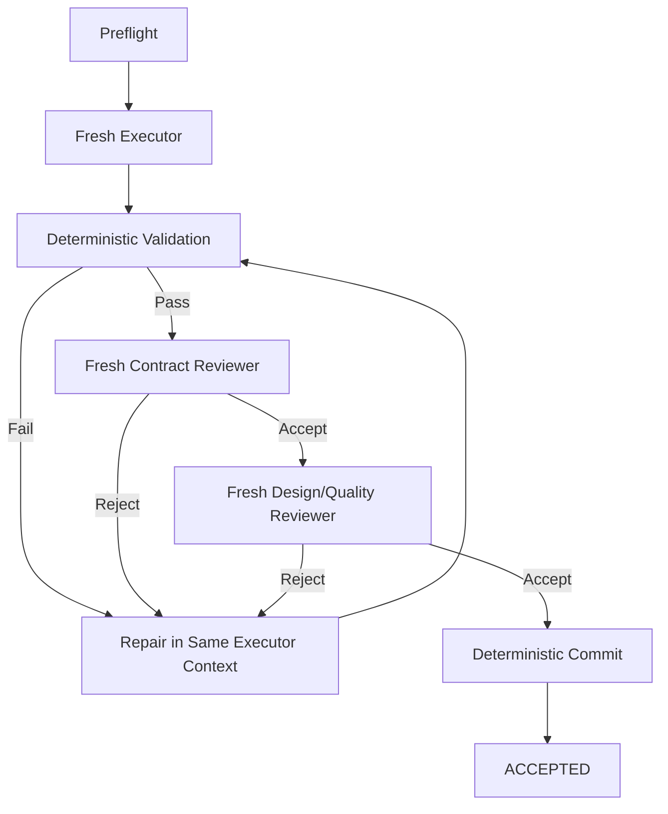

# 00 — Architecture Governance and Continuity Protocol

**Version introduced:** v0.4

**Snapshot date:** 2026-08-25

**Purpose:** Preserve architectural integrity as the project evolves across long conversations, different agents/sessions, external reference reviews, and Git-backed implementation.

---

## 1. Canonical-source rule

The Atlas repository on GitHub is the canonical artifact authority. `main` is the current canonical architecture state.

Chat remains the primary architecture/design reasoning workspace. It is **not** the canonical architecture.

The precedence order is:

```text
architecture documents on `main`
        ↓
recorded decisions / learnings
        ↓
current implementation once it exists
        ↓
conversation / model recollection
```

When conversational recollection or prompt text conflicts with the repository state on `main`, the repository wins until intentionally amended through the governance process.

A consequential architectural answer must never rely on "I think earlier we meant..." when the relevant source documents can be read.

> **Chat is the whiteboard. Atlas on GitHub is the artifact authority, and `main` is architectural truth.**

---

## 2. Mandatory grounding rule for material architecture work

Before recommending a material architectural change:

1. classify the discussion as `EXPLORATION`, `CANDIDATE`, or `CHANGE`;
2. identify the architectural areas the proposal touches;
3. read the relevant current canonical documents;
4. identify affected invariants and prior decisions;
5. check the learnings/course-corrections log for previously explored or reversed variants;
6. evaluate the proposal as a **delta** against the current architecture rather than redesigning from memory;
7. recommend `ACCEPT`, `DEFER`, or `REJECT` with rationale;
8. only if accepted, update the canonical documents surgically and record the decision.

For cross-cutting changes, the rolling monolith may be used as the retrieval source, but edits should still be applied to the modular documents first.

---

## 3. Conversation states

### `EXPLORATION`

An idea is being investigated or compared. No architecture modification is implied.

Examples:

- review an external repository for ideas;
- brainstorm a possible execution mode;
- compare two model-routing approaches.

Exploration may remain conversational and need not trigger document changes.

### `CANDIDATE`

An idea appears applicable enough that it may alter the architecture.

Before recommending adoption, the canonical architecture **must be consulted**.

Candidates do not silently overwrite current decisions.

### `CHANGE`

The proposal has been intentionally accepted.

A change requires:

- surgical updates to affected canonical documents;
- a decision record;
- an entry in the learnings/course-corrections log when the change reverses, supersedes, or meaningfully reframes prior thinking;
- consistency verification before the new snapshot is called canonical.

The user does not need to label these states explicitly; the architecture process should infer and state the transition when material.

---

## 4. Core architecture invariants

These are not immutable forever, but they require explicit challenge and amendment rather than casual drift.

1. **Workflow defines capability; policy defines authority.**
2. **Pre-implementation progressively reduces degrees of freedom.**
3. **The product contract, system design, program design, and executable tickets have distinct responsibilities.**
4. **Downstream execution cannot silently rewrite approved upstream decisions.**
5. **Deterministic code owns deterministic workflow mechanics and authoritative state transitions.**
6. **Agent claims are evidence/proposals, never authoritative lifecycle truth.**
7. **Reviewers remain independent from builders; review and repair are separate responsibilities.**
8. **Human authority is represented explicitly by governance policy, not by prompt convention.**
9. **Features pay for seams.** Do not implement speculative generalization before a real second use case earns it.
10. **External repositories contribute evidence and candidates, not automatic architecture changes.**
11. **V1 complexity must be justified by a current problem or a very cheap invariant.** Future paths may be documented without being implemented.
12. **Models/harnesses are replaceable workers staffing durable project roles.** Historical performance informs but does not create authority.
13. **The canonical architecture must be reconstructable without the conversation.**
14. **Chat is never the sole source of an important architectural decision.**

Any proposal that materially touches one or more of these invariants should say which ones.

---

## 5. Candidate promotion test

Before promoting a candidate into the architecture, answer:

1. **What problem in our current design does this solve?**
2. **Does that problem exist now, or are we imagining a future problem?**
3. **Can we preserve the useful principle now while deferring the mechanism?**
4. **Does the proposal simplify an existing component or add a new noun/subsystem?**
5. **Is it grounded in working implementation, operational failure history, design prose, or speculation?**
6. **If implementation-grounded, what pressure caused the feature to exist?**
7. **Does it conflict with an accepted invariant or decision?**
8. **Have we considered/rejected a similar idea before?**
9. **What is the simplest version that preserves the benefit?**
10. **Can a concrete future trigger be named for deferred complexity?**

Recency, elegance, popularity, or a polished demo are not sufficient promotion criteria.

---

## 6. External-reference maturity model

External ideas should be tracked using two separate dimensions:

### Architectural disposition

```text
REUSE      code may be a practical donor after license/fit review
ADAPT      implementation or pattern is useful but must be reshaped
CONCEPT    idea is useful; do not assume code reuse
REFERENCE  revisit when implementing the affected subsystem
REJECT     deliberately incompatible or unnecessary
```

### Maturity in our design

```text
OBSERVED
    Interesting external idea.

CANDIDATE
    Appears to solve a problem we actually have.

ACCEPTED_PRINCIPLE
    Belongs in the architecture independent of exact mechanism.

IMPLEMENTATION_REFERENCE
    Grounding material to revisit when implementing the subsystem.

DEFERRED
    Valuable only after a named trigger occurs.

ADOPTED
    Actually implemented in our system.

REJECTED
    Considered and intentionally not pursued.
```

A new repository review should not silently change either dimension for prior references.

---

## 7. Surgical-delta rule

Future architecture versions should be generated as:

```text
current canonical snapshot
        +
accepted deltas
        ↓
surgical modifications
        ↓
consistency audit
        ↓
new snapshot
```

Do **not** regenerate the architecture wholesale from conversation memory.

The modular documents are edited first. The rolling monolith is generated from those sources afterward.

A version bump is appropriate when a meaningful architectural/process decision has been accepted. Minor typo/format corrections need not create a conceptual version change unless they alter meaning.

---

## 8. Snapshot consistency audit

Every substantial snapshot should verify at least:

### Structural consistency

- all numbered canonical documents are present;
- the rolling monolith contains the canonical documents exactly and in order;
- README/version labels match the actual snapshot;
- Markdown/code fences are balanced;
- checksums/package integrity succeed.

### Semantic consistency

- principles and concrete workflow do not contradict each other;
- artifact responsibilities remain non-overlapping;
- examples/config do not encode superseded policy;
- mandatory generated projections remain explicitly non-authoritative;
- open questions that were resolved are marked resolved or removed;
- deferred ideas are not presented as V1 requirements;
- rejected ideas are not reintroduced without explicit reconsideration;
- terminology is consistent across documents;
- current standing can be reconstructed without reading the chat;
- new decisions are reflected in all affected documents, not only the decision log.

### Complexity audit

Ask:

- Did this version add an abstraction before a second real use case exists?
- Did an external reference introduce platform complexity that our V1 does not need?
- Could a mechanism be documented as a future path instead of implemented now?
- Did a new subsystem earn its operational cost?

---

## 9. Environment and artifact-authority health check

At every substantial architecture checkpoint, explicitly assess whether chat remains an appropriate primary design room.

### `CHAT_NATIVE`

Use while:

- work is predominantly architecture reasoning/comparison;
- canonical docs can be updated as manageable deltas;
- implementation details do not yet materially constrain architecture;
- a future agent can reconstruct current standing by reading the packet;
- snapshot packaging is cheap relative to the reasoning work.

### `GIT_READY`

Migration would materially improve work, but chat can still remain the reasoning interface.

Signals include:

- frequent multi-file architecture edits where real diffs would help;
- need for branches or competing architecture proposals;
- multiple agents/people need to consume or modify the packet independently;
- architecture starts naming concrete source interfaces/modules;
- version packaging becomes repetitive or error-prone;
- implementation is about to begin.

### `GIT_REQUIRED`

Continuing without a repository creates unacceptable architecture risk.

Triggers include:

- implementation code materially influences architecture decisions;
- architecture and implementation must evolve atomically;
- important decisions cannot be reconstructed from the packet alone;
- changes require reliable merge/diff/review history;
- multiple concurrent writers need conflict-safe coordination;
- artifact authority is ambiguous without repository history.

### `GIT_ACTIVE`

Git is in use as the artifact and history authority while chat remains the primary reasoning interface. Architecture mutations occur on branches and are reviewed as diffs before human-controlled merge into `main`.

### Current status

```text
GIT_ACTIVE — chat remains the primary architecture/design reasoning interface
```

Atlas has completed the artifact-authority transition anticipated by v0.4. The canonical architecture is the repository state on `main`; chat remains the primary venue for exploration, synthesis, and architecture/design reasoning.

---

## 10. Hidden-intent stop condition

If a consequential discussion reaches:

> “I think earlier we meant...”

and the answer cannot be resolved by reading the canonical packet, **stop architectural evolution** until the missing intent is reconstructed and recorded.

That is evidence that chat history has become an unsafe hidden dependency.

---

## 11. Current Git operating model

Atlas preserves the conversational design room while using Git as artifact authority:

```text
Chat / architecture discussion
        ↓
explicitly accepted CHANGE
        ↓
Git branch / patch
        ↓
diff + architecture consistency review
        ↓
human-controlled merge into `main`
```

Repository mutations are currently performed through coding agents such as Codex or through a manual Git workflow. Changes are made on branches, inspected as diffs, and reviewed through draft pull requests. Agents do not merge autonomously.

### Agent operating-contract routing

The repository-root `AGENTS.md` defines rules shared by builders, reviewers, and architecture agents. `architecture/AGENTS.md` layers architecture-evolution rules on top of that common contract and points back to this governance protocol rather than duplicating it.

Agents should leave observable evidence by naming the governing files they consulted and the validation they actually performed, including required behavior that was not directly verified. Repository authority does not license silent reconciliation: apparent contradictions among authoritative sources must be reported with their locations unless the task explicitly authorizes resolving them.

---

## 12. Instructions for future agents/sessions

When asked to continue this project:

1. follow the root `AGENTS.md` operating contract;
2. for architecture work, also follow `architecture/AGENTS.md`;
3. do not assume conversational memory is sufficient;
4. locate/read `architecture/00-architecture-governance.md` first;
5. identify the latest canonical snapshot/version;
6. read the relevant modular docs or rolling monolith before material recommendations;
7. respect recorded `ACCEPTED`, `DEFERRED`, `REJECTED`, and course-correction history;
8. treat external repositories as candidate evidence only;
9. propose deltas rather than rewriting architecture from memory;
10. use a branch and draft PR for repository mutations, and never merge autonomously.

> **The process is successful when a future agent can forget the conversation and still reconstruct the architecture, its rationale, and the legal way to evolve it from the repository/design packet alone.**

---

# 01 — Architectural Principles

## 1. Separate design judgment from execution mechanics

The system should concentrate fuzzy reasoning and high-cost decisions before implementation, then progressively constrain execution with approved contracts and objective validators.

```text
fuzzy intent
  ↓
behavioral contract
  ↓
system contract
  ↓
program contract
  ↓
execution graph
  ↓
implementation
  ↓
objective validation + independent review
```

The goal is not to eliminate reasoning. It is to put reasoning where it has the highest leverage and to reduce unnecessary degrees of freedom during implementation.

## 2. Workflow defines capability; policy defines authority

A workflow stage answers: **what can the system do?**

A policy/gate answers: **who is allowed to accept the result and advance?**

This prevents individual skills from hard-coding assumptions about autonomy.

Examples:

- Program design can always be generated.
- One profile may auto-accept it after agent review.
- Another may require human approval.
- Another may require human approval only if architecture materially changed.

Participation is a third, independent question: **how does the user collaborate in producing the
artifact?** System Design may be `agent_led` (the default) or `co_design`, but that choice neither
changes what `30-system-design.md` means nor grants acceptance authority. The classifier neither
recommends nor selects the participation mode; intake neutrally presents both and only the user
selects it. Gate policy still independently resolves
`AGENT_REVIEW`, `HUMAN_IF_CHANGED`, or `HUMAN`.

## 3. One artifact, one abstraction level, one exclusive job

Each artifact must resolve a distinct class of uncertainty.

If two artifacts repeatedly restate one another, one of the abstraction boundaries is wrong.

The intended progression is:

1. **Decision discovery** — what is still unresolved?
2. **Product contract (living PRD)** — what must become true?
3. **System design** — where does it fit and what boundaries/contracts change?
4. **Program design** — what shape will the code take?
5. **Execution compilation** — what independent vertical slices implement the approved design?

Each stage should reduce degrees of freedom without reopening resolved upstream decisions.

Decision discovery and the product contract are authored by one producer and separated by the
Product Definition Approval boundary rather than by two stages (D-066, D-067).

The System Design / Program Design boundary is determined by **reliance horizon**, not by the
overloaded word “module.” A system-observable commitment, or a choice that requires a caller, peer,
or operator to adjust, belongs to System Design. A codebase-local realization that can change
without another party adjusting and without changing an accepted guarantee belongs to Program
Design. Composite decisions split: the invariant is upstream; its realization is downstream.

The two artifacts may be drafted side-by-side to pressure-test interfaces, but their acceptance is
sequential when both stages are selected: System Design is accepted first. Program Design remains
provisional until it is bound, rechecked, and finalized against the exact upstream source selected
by the run: accepted System Design when selected; the accepted PRD when System Design is
`NOT_REQUIRED` but Product Definition Approval is selected; or the exact frozen Stage 0 effective intake when
both upstream semantic boundaries are `NOT_REQUIRED`. An omitted boundary never manufactures an
approval or a nonexistent artifact.

## 4. Downstream stages may discover problems, but cannot silently redesign upstream decisions

Downstream design and implementation agents are allowed to discover that an approved design is
invalid.

They are **not** allowed to self-authorize architectural changes. In particular, Program Design may
report feasibility findings upstream but cannot accept or silently rewrite a System Design
commitment. If Program Design requires such a change, it returns `DESIGN_BLOCKED`; any accepted
System Design change makes the Program Design candidate stale.

The same monotonic rule continues through execution compilation. The downstream planning controller
owns System Design, Program Design, and ticket-graph acceptance as separate outcomes under one
pre-execution authority. A changed accepted upstream design makes every dependent accepted ticket
graph stale in the same logical atomic transition. Execution may verify an accepted graph; it may
not create the acceptance it depends on.

If execution requires violating an approved contract, the correct state is:

```text
DESIGN_BLOCKED
    ↓
escalate
    ↓
amend upstream design
    ↓
review / approve
    ↓
resume
```

This preserves provenance and prevents architecture from drifting invisibly during implementation.

## 5. Agents reason; deterministic code governs

Use agents where judgment is required.

Use deterministic code for known mechanics:

- test/build/lint commands
- dependency graph traversal
- file-scope enforcement
- git status / diff / commit
- worktree lifecycle
- state transitions
- retry counters
- artifact existence/schema checks
- PR creation
- branch push

A model may propose a state change, but deterministic code should own authoritative state when practical.

## 6. Review and implementation are separate authorities

Reviewer responsibilities:

- inspect
- reason
- cite evidence
- accept/reject
- identify blocking vs non-blocking findings

Executor responsibilities:

- write
- repair
- validate

A reviewer should not silently fix the code it is judging.

## 7. Preserve builder context; refresh reviewer context

Within a ticket:

- Keep the same builder context across ordinary test failures and reviewer repair cycles, because implementation knowledge is useful state.
- Prefer fresh reviewer contexts on re-review, because prior conclusions create anchoring and confirmation bias.

## 8. Human involvement is an authority policy, not a workflow primitive

Do not build separate `safe`, `fast`, `refactor`, and `prototype` factories.

Build one workflow graph and configure authority/gates.

Human approval should be injected by policy at meaningful boundaries.

Human attention is reserved for judgment and authority, not orchestration. Internal stages, skills,
and controllers must route and hand off work without asking the user to drive the workflow. Atlas may
interrupt only when the required answer genuinely belongs to the user or when policy requires explicit
human authority. The user supplies judgment; Atlas supplies orchestration.

## 9. A draft PR is an appropriate factory output; merge initially is not

The factory should ideally produce:

> A draft PR that it believes is excellent, with evidence supporting that claim.

The initial definition of done should **not** be:

> The system merged its own code.

Human PR review remains the final authority until evidence from real use supports relaxing that rule for narrow classes of change.

## 10. Stable artifact semantics across profiles

Profiles may decide to:

- skip an artifact
- generate it
- review it
- human-approve it

But they should not change what the artifact means.

`program-design.md` must have the same semantic contract under every profile.

## 11. Risk can increase scrutiny automatically; it should not silently reduce requested scrutiny

At least initially, automatic classification should be advisory.

If later policy permits automatic routing:

- the classifier may raise minimum scrutiny when risk is detected;
- it should not silently downgrade a profile explicitly chosen by the user.

## 12. Build the smallest useful factory first

The first implementation should automate one bounded unit: a ready ticket.

Do not begin by building an enormous orchestration platform. Run real work, observe failure modes, and grow the control plane around evidence.

---

# 02 — End-to-End Workflow

## Overview

The architecture contains an **outer design-control loop** and an **inner execution-control loop**.

### Outer loop — design control

Question:

> Does the proposed system still represent what we actually want to build?

Authority:

> Human + reasoning agents, under configurable governance.

### Inner loop — execution control

Question:

> Does the implementation satisfy the approved contract?

Authority:

> Deterministic validators + bounded agents, with escalation when the contract itself proves invalid.

---

## Stage 0 — Intake and classification

Input:

- fuzzy goal
- existing repository context
- optional explicit workflow/profile selection
- optional System Design participation selection when `system_design` is selected:
  `agent_led` (default) or `co_design`

Output:

- recommended workflow depth
- recommended first producer stage within that workflow
- recommended governance profile
- a neutral System Design participation choice when that stage is selected
- structured risk assessment
- resolved run configuration, including the user-selected participation mode, after human
  acceptance/override

Classifier behavior for workflow depth, producer stage, governance, and risk should initially be
**recommend-only**. Participation mode is deliberately excluded from that recommendation surface.

Participation and acceptance authority are separate intake axes. The classifier neither recommends
nor selects `co_design`; intake neutrally presents `agent_led` and `co_design`, and the user may
explicitly choose either whenever System Design is selected. That choice does not alter the gate
authority resolved from governance.

Example:

```text
Goal: Add asynchronous device job scheduling

Recommended workflow: ARCHITECTURAL
Recommended governance: STANDARD

Why:
- crosses multiple modules
- introduces durable job state
- changes execution ownership
- affects failure/recovery semantics

Human gates:
- Product Definition Approval
- final PR

Conditional gates:
- system design if boundaries change
- tracer slice if implementation risk becomes high

System Design participation: agent_led (user-selectable as co_design)
```

The resolved run configuration is snapshotted into the planning directory and becomes part of the run's audit trail.

A small number of intake clarifications may make an already-small task bounded enough for the
`trivial` path. If the accepted goal can be expressed as one independently verifiable ticket, intake
selects direct ticket execution; it does not invoke Discovery merely to produce a smaller PRD. If
real product decisions remain unresolved after intake, Discovery is selected regardless of the
expected code-change size. If system-observable or code-shape decisions remain, select the matching
design producer rather than hiding design inside a “trivial” ticket.

Stage selection and boundary acceptance are different decisions. Stage 0 always initializes and
classifies the run, but the first **producer** action may occur later in the pipeline:

- If the selected workflow does not require an artifact boundary, that boundary is conceptually
  `NOT_REQUIRED`. Its omission is not an approval.
- If a required upstream artifact already exists, producing it again may be unnecessary, but the
  artifact must pass that stage's ordinary boundary judge and configured authority before downstream
  admission. Reuse may skip production; it never skips Product Definition Approval.

The classifier therefore recommends the earliest admissible producer stage, while the control plane
proves any required upstream contracts before allowing work to begin there.

The shipped Stage 0–2 initializer enforces that distinction. When discovery is selected,
initialization creates its mutable gate and acceptance slot and starts there. When discovery is omitted,
initialization creates no discovery gate or acceptance and starts at the first selected downstream
phase for fail-closed handoff to its owner. It rejects pre-existing decision-log or amendment state
before `control.json`; a pre-existing `20-prd.md` may coexist with initialization but receives no
acceptance from that fact. Any reused candidate at a prescribed artifact path remains untrusted until
it passes the ordinary judge/authority path.

---

## Stage 1 — Decision discovery, living PRD maintenance, and Product Definition Approval

Stage 2 was the former behavioral-specification stage; v0.6 folds it into Stage 1's
Product Definition Approval boundary. The “Stages 0–2” control-plane scope name remains for state-key
coherence.

Purpose:

> Determine which decisions actually need to be made before engineering design can stabilize, and
> continuously maintain the decision ledger and living product PRD as those decisions settle.

Potential resolution modes:

```text
OPEN DECISION
    │
    ├── human judgment required ───► GRILL
    ├── factual uncertainty ───────► RESEARCH
    ├── codebase uncertainty ──────► EXPLORE
    └── experiential uncertainty ──► SPIKE
```

For very large/foggy work, use a Wayfinder-style frontier of currently answerable decisions rather than pretending the entire project can be decomposed up front.

Output is **resolved decisions/evidence plus a living product PRD**, not implementation tickets.

### Exit boundary — Product Definition Approval

Question:

> Has discovery reconciled every live decision into one reviewable product contract that is ready
> to hand off to engineering design?

For a HUMAN gate, present this exact user-facing copy:

- stage label: `Product Definition Approval`
- action: `Approve the product definition`
- helper: `Confirm the PRD and recorded decisions are complete enough to proceed to the next selected planning stage.`

Discovery owns both `10-decisions.md` and `20-prd.md` continuously; v0.6 removes the separate
specification translation producer. Product Definition Approval is discovery's single exit boundary,
not a new authoring stage or durable phase name.

Approval requires:

- a complete `10-decisions.md` with the required PRD-alignment retrospective;
- a current `20-prd.md` whose `derived_from` binds the exact decision-log version and hash it was
  reconciled against;
- a current `20-prd.html` projection regenerated from that Markdown;
- deterministic reconciliation checks plus configured semantic acceptance.

The accepted PRD defines the **product contract** and remains understandable and approvable without
requiring implementation knowledge.

---

## Stage 3 — System design

Question:

> Where does this change fit in the existing system?

Stage 3 owns **system-observable commitments** and choices requiring coordinated change across a
seam:

- current system
- proposed system
- responsibilities and system seams
- authoritative data owner
- cross-module and external contracts
- target schema/protocol
- end-to-end lifecycle, data flow, failure, and recovery
- compatibility commitments
- trust, security, and operational commitments
- rejected alternatives

The ownership test is reliance, not whether someone calls the thing a “module”: if changing a choice
requires any caller, peer, or operator to adjust, or changes an accepted guarantee, it belongs here.
Composite decisions split: Stage 3 owns the invariant while Stage 4 owns its realization.

### Participation modes

`agent_led` is the default. `co_design` is user-selected at intake, never silently selected by the
classifier, and is available whenever System Design is selected. It changes the collaboration UX,
not artifact semantics or acceptance authority.

In co-design, chat is the primary interactive control surface. Work one system seam or decision at
a time. For each, ask one plain question; present two or three concrete alternatives; give a
recommendation and its strongest counterargument; and assign a stable label. The user may redirect
or zoom in. Accepted conversational choices are written into canonical `30-system-design.md`;
conversation alone never has artifact or acceptance authority.

For each material choice, present a decision packet rather than prose alone: a concise comparison
matrix using the same criteria for every option, plus the minimum useful visual that exposes the
decision-relevant structure. Select the fitting view from topology/component, sequence or data flow,
schema/protocol, state/lifecycle, and failure/recovery; pair it with a plain-language explanation of
the trade-offs, operational consequences, and failure modes it changes. If no visual adds
decision-relevant clarity, state why no visual adds clarity rather than creating decoration.
Decision-time visuals are ephemeral,
non-authoritative aids until the settled choice is written into canonical Markdown.

Begin every material decision packet, and every preview of the exact decision or next question, in
simplified technical English. State the exact decision or next question, why it matters now, the fixed
constraints, what is not yet decided, the same evaluation criteria and trade-off axes, what each option
optimizes, and whether the options are genuine choices or rejected controls retained for evidence.
When constraints determine the answer, synthesize the resulting consequence; do not manufacture a
preference picker. Prefer one combined context-plus-diagram phone-first packet over separate context
and topology visuals.

In `agent_led`, whenever the analysis presents materially different alternatives, persist equivalent
decision evidence in canonical `30-system-design.md`. Keep that evidence within the existing twelve
required sections: summarize the selected route in the Decision map and retain the alternatives and
reasoning in the owning section. This rule does not require `30-system-design.html`; HTML is not
created solely for this evidence rule.

Current decision groups use unique owning H3 identities and unique standalone `Option <number> — ...`
labels; comparison matrices support rather than replace those labels. A settled route uses
`(selected)`. The Decision map uses `Decision`, `Selected route`, free-form
`Relationship / disposition`, and `Implementation consequence`. Renderer readiness comes only from
the parsed frontmatter Boolean. Legacy markers render only for exact previously accepted candidate
bytes.

Co-design also requires `30-system-design.html`, a deterministic, self-contained visual board bound
to the exact Markdown source path/hash and renderer version. It contains precise architecture views,
not decorative generative imagery: current/proposed topology, seam/ownership map,
interface/contract view, end-to-end sequence or data flow, applicable schema/protocol deltas,
failure/recovery paths, open decisions, and rejected alternatives. An inapplicable view states why.
Feedback returns through chat using the stable labels. Generated chat images or snapshots are
ephemeral projections; HTML bytes never acquire independent acceptance authority.

Stage 3 stops before codebase-local realization inside the accepted seams.

At its boundary, System Design reads the effective selected stages and chooses exactly one
admission/provenance binding:

- Product Definition Approval selected → exact accepted `20-prd.md` version/hash;
- Product Definition Approval `NOT_REQUIRED` → exact accepted/frozen Stage 0 intake and effective configuration,
  bound by `control.json.base_run_sha256`, `effective_config_hash`, and
  `effective_config_revision`.

An omitted Product Definition Approval creates no PRD or approval. A change to whichever bound source makes
accepted System Design stale; Program Design that depends on it becomes stale transitively in the
same logical downstream transition.

---

## Stage 4 — Program design

Question:

> What shape should the implementation take inside the codebase?

Stage 4 owns **codebase-local realization** without changing system-observable commitments. When
System Design is selected, this means realization inside its exact accepted seams. On a direct
Program Design path, the accepted/frozen Stage 0 intake and effective run configuration supply the
applicable upstream constraints:

- file/package/module placement
- new vs modified files
- important types and language-level signatures
- internal interfaces
- internal state mutation and ownership mechanics
- call stacks / interaction chains
- locking, concurrency, and lifetime mechanics
- test seams
- migration implementation order and local expand/contract mechanics

No production method bodies.

Program design resolves the architecture-ish decisions that otherwise emerge invisibly during implementation.

The decision test is: if the choice can change without any caller, peer, or operator adjusting and
without changing an accepted guarantee, it belongs in Stage 4; otherwise it belongs in Stage 3.

### Paired drafting, sequential acceptance

`30-system-design.md` and `40-program-design.md` may be drafted side-by-side so codebase feasibility
can pressure-test interfaces. The Program Design draft is provisional: it may report feasibility
findings upstream, but it cannot accept or silently rewrite Stage 3.

There are two distinct judges and outcomes, never one bundle verdict. The process must accept
System Design first when that stage is selected. Program Design then binds, rechecks, and finalizes
against the source required by the actual selected path:

- selected System Design → exact accepted `30-system-design.md` candidate;
- System Design `NOT_REQUIRED` with selected Product Definition Approval → exact accepted `20-prd.md` candidate;
- both upstream semantic boundaries `NOT_REQUIRED` → exact accepted/frozen Stage 0 intake and
  effective run configuration that authorized direct Program Design admission.

The last branch binds `control.json.base_run_sha256`, `effective_config_hash`, and
`effective_config_revision`; it does not manufacture an upstream artifact or approval. Any accepted
Stage 3 change makes Stage 4 stale. If Stage 4 discovers that a system commitment must change, it
returns `DESIGN_BLOCKED` upstream rather than escalating merely to a human inside Stage 4.

Program Design always has semantic questions and therefore never uses raw `AUTO`. Its recommended
standard authority is `AGENT_REVIEW`; `HUMAN` remains available under governance or high assurance.
An independent fresh review remains mandatory.

### Bounded selected-System-Design repair

D-082 adds one exception to forward-only Stage 4 progression. While Program Design is `PENDING`, has
null acceptance, and is bound to currently accepted System Design, exact frozen repository evidence
may prove that the accepted commitment cannot be faithfully realized without changing it. Producer
prose or `DESIGN_BLOCKED` alone cannot route the run. `control-planning` must obtain the independent
`reviews/program-design-upstream-block-v1.json` judgment; only
`CONFIRMED_UPSTREAM_CONTRADICTION` authorizes the existing downstream controller to mutate state.

That mutation is one atomic invalidation-and-replacement transition, not rollback or reopen: status
becomes `BLOCKED`, phase returns to `system_design`, the System Design gate becomes `STALE`, its old
acceptance remains auditable but non-current, Program Design remains `PENDING` with null acceptance,
the bounded episode is recorded in the existing `blocked_reason`, and revision increments once.

The System Design producer may then create exactly version `N+1` with a different hash and the same
still-current source binding. It receives fresh checks, fresh review/classification when configured,
and the unchanged configured authority. Reacceptance advances to Program Design inside the same
episode, but status
remains `BLOCKED`; only fresh Program Design acceptance against N+1 clears the episode and restores
`PLANNING`. Across replacement System Design and resumed Program Design, exactly four
controller-authorized producer attempts are available. The controller reserves and persists each
attempt before candidate bytes change, so a crash consumes it; reviews, controller actions, and
approvals do not. Restarts cannot reset the budget, a second contradiction cannot nest or reset it,
and exhaustion is loud and durable.

This path does not apply to Product Definition Approval, direct Stage 0, accepted Program Design, or Stage 5 and
tickets. Their current fail-closed boundaries remain unchanged.

### Human replanning escalation after non-convergence

If D-082 exhausts its budget or resumed Program Design still cannot converge, autonomous replanning
ends and the run remains durably `BLOCKED` with its evidence preserved. Atlas first diagnoses the
shared failure assumptions, nearest accepted truth plausibly responsible, credible untried
architecture families, and consequences of changing product or run assumptions. Diagnosis is
recommendation evidence, not authority.

The human then chooses the substance: try another materially different architecture, reconsider an
upstream product commitment, reframe the work as a corrected successor run, or stop/defer. Atlas does
not ask the user to select an internal stage or command. D-083 defines this authority boundary only;
it adds no second repair episode, reopen path, successor-run contract, state transition, or recovery
runtime. Stage 5 remains the next substantive implementation.

A design review should explicitly challenge:

- shallow wrappers
- unjustified interfaces
- seams invented only for unit testing
- poor locality
- vocabulary drift
- state ownership ambiguity
- unnecessary new abstractions
- failure semantics

---

## Stage 5 — Execution compilation

Question:

> How can the approved design be built as independent, verifiable vertical slices?

This stage should be treated as a **compiler**, not another open-ended design step.

Its ticket graph is an execution ordering for early seam validation, not a decomposition of work
volume by architectural layer. Every non-enabling ticket must establish observable behavior, cross
every boundary required by that behavior (not every possible layer), be independently verifiable,
and stay within the applicable accepted selected-path sources; selected Program Design remains the
exact decomposition contract. The first frontier takes the thinnest real path through the riskiest
or most important seams rather than the easiest fraction of the work.

A standalone enabling ticket must name and block an imminent vertical slice and explain why it cannot
safely live there. Unconsumed foundation epics and layer slabs are not vertical slices.

The same accepted graph must also be execution-complete. A dependency remains a real prerequisite
and states what the downstream ticket relies on it establishing. Separately, canonical graph order
preserves the risk-informed preference among tickets that are already ready. V1 selects the first
ready ticket in that order; no agent chooses between ready tickets.

Readiness is closed over every accepted execution-preventing condition, including a non-ticket
external prerequisite such as merge, CI, or exact artifact publication. Topology or an accepted
upstream commit alone cannot prove that external fact. Stage 5 preserves the observable satisfaction
condition and accepted proof path but does not invent a missing delivery contract. `continue` or
`resume` later wakes deterministic revalidation; it never grants the awaited truth.

Inputs are the applicable accepted sources for the actual selected path:

- exact accepted product PRD when Product Definition Approval is selected;
- exact accepted System Design when System Design is selected;
- exact accepted Program Design when Program Design is selected;
- accepted/frozen Stage 0 intake and effective run configuration for a direct admission path across
  omitted upstream semantic boundaries.

An omitted boundary contributes neither an artifact nor an approval. Compilation preserves the
accepted bindings carried by the selected path rather than requiring every possible upstream file.
When Product Definition Approval, System Design, and Program Design are all omitted, the `trivial` path compiles
one one-node ticket graph directly from the accepted/frozen Stage 0 intake, effective configuration,
and target repository baseline. It creates no substitute PRD or design artifact.

Outputs:

- one execution-complete ticket graph whose manifest version is exact integer `2`;
- truthful blocking relationships plus canonical preferred order;
- observable external-prerequisite satisfaction conditions where applicable;
- explicit proof paths linking promised outcomes to validators/review gates;
- the real tracer ticket where useful; and
- exact per-ticket `context.sources` declarations selected by the compiler, with purpose and exact
  upstream H2 sections for every applicable semantic source.

Stage 5 is the final pre-execution planning boundary. The compiler proposes the complete ticket
graph; it does not accept its own output. A read-only ticket-graph judge evaluates verticality,
dependency completeness, validation contracts, repository targeting, and semantic context
completeness. The current manifest version is exact integer `2`; version 1 is raw historical evidence
only and is not loadable or factory-executable. There is no converter, projection, or fallback.
The configured `tickets` authority decides whether the downstream planning controller may record
acceptance. That controller records the exact graph version/SHA-256, every applicable accepted
upstream binding, and each target repository baseline.

The downstream planning controller is one logical authority for Stages 3–5, while preserving each
stage's distinct outcome. A System Design or Program Design change marks every dependent accepted
ticket graph stale in the same logical atomic transition as the upstream state change. Its exact
file, schema, lock, and implementation decomposition remain Program Design choices. There is no
separate compilation controller.

Each ticket replaces top-level `references` with exact `context: {sources: [...]}`. Every applicable
selected-path source kind appears exactly once with exact `kind`, `sections`, and nonempty `purpose`.
Stage 0 sections are empty; semantic-source sections are nonempty, unique, and resolve to existing H2
headings. Ticket body H2s are exactly `What becomes true`, `Acceptance`, and `Execution context`.

compile-tickets owns semantic context selection. Execution receives only the exact accepted
ticket-graph binding; it may verify that acceptance and currency but may not create or record them.
The supervisor deterministically validates and materializes accepted declarations plus current
runtime facts into a deterministic non-authoritative worker brief. It must not select sources, add sections, write
purposes, summarize missing context, or fill context gaps. Missing declared material is a
packaging/preflight blocker; missing accepted judgment is `DESIGN_BLOCKED`. Repository facts within
inspection authority remain discoverable. The supervisor does not invoke a planner or treat the raw
user prompt as a coequal contract.

---

## Stage 6 — Optional tracer checkpoint

For high-risk or foundational changes, run one minimal end-to-end tracer slice before authorizing the remainder of the graph.

Possible policy:

```text
exact accepted ticket graph
   ↓
preflight verifies graph acceptance, applicable upstream bindings, and repository baseline
   ↓
selected tracer ticket factory
   ↓
automated validation/review
   ↓
HUMAN CHECKPOINT
   ↓
remaining accepted graph
```

This captures Dex's incremental steering principle without forcing human review of every ticket.

---

## Stage 7 — Ticket factory

Each ready ticket enters a bounded autonomous execution loop:

```text
preflight
→ executor
→ deterministic validators
→ contract reviewer
→ design/quality reviewer
→ bounded repair if rejected
→ accepted commit
```

Possible terminal states:

- `ACCEPTED`
- `FAILED`
- `DESIGN_BLOCKED`

`DESIGN_BLOCKED` is semantically distinct from a failed implementation attempt.

---

## Stage 8 — Feature runner

The feature runner owns global dependency traversal across the accepted planning graph and dispatches
work into the repository-scoped run/workspace named by each ticket. Repository-scoped runs execute
that work; they do not select or admit it.

Pseudo-flow:

```text
load exact accepted ticket-graph version/hash and verify its accepted upstream/baseline bindings
load authoritative per-ticket state from every repository record plus current external evidence
reconstruct prerequisite satisfaction and the only legal next action after restart
while nonterminal tickets remain:
    if no ticket is active:
        derive readiness across the entire accepted planning graph
        admit at most one active ticket across the entire accepted planning graph
        select the first currently ready ticket in global canonical order
        dispatch it only to the repository-scoped run/workspace named by that ticket

    run TicketFactory(active_ticket)

    if ACCEPTED:
        persist accepted or terminal completion plus its associated accepted commit/tree and evidence binding
        continue

    if DESIGN_BLOCKED:
        persist terminal evidence
        stop and escalate upstream

    if FAILED:
        persist terminal evidence
        stop and report
```

A repository-scoped run cannot select, admit, or execute a ticket targeting another repository.
Parallel admission remains deferred in V1; any future parallel policy must be promoted explicitly.

---

## Stage 9 — Whole-feature validation and review

After all tickets in one repository slice are accepted, bind validation and review to that slice's
exact integrated accepted-commit-chain tip/tree. Review against the applicable accepted upstream
sources: the product contract when selected, System Design when selected, Program Design when
selected, and the frozen Stage 0 binding on a direct path. Then run:

- full build/test/lint suite for that repository slice
- integration/system tests
- architecture/scope checks
- repository-slice applicable-contract compliance review
- repository-slice architecture/program-design drift review
- maintainability/standards review
- conditional ops/security/migration/UI review

This catches interactions that cannot be judged at individual ticket scope. Passing Stage 9 proves
only that repository slice. No repository slice declares the planning effort globally ready; the
trusted supervisor evaluates global readiness from every required repository slice and
external/dependency condition in the accepted graph.

---

## Stage 10 — Package and create draft PR

For each repository slice that passes Stage 9, the system deterministically assembles evidence from
that repository-scoped run:

- source planning bundle
- approved design versions
- completed tickets for the slice
- commits per ticket
- validation results bound to the exact integrated tip/tree
- automated reviewer outcomes
- repairs performed
- design amendments
- unresolved warnings

Then:

- push that repository's branch
- create one draft PR for that repository slice
- attach or summarize evidence

This is a mechanical repository-slice packaging step and belongs inside the factory. There is no
single cross-repository branch or PR, and packaging a slice does not establish global readiness.

---

## Stage 11 — Human PR review

Initial final authority for each repository-scoped draft PR:

> Human.

The factory should make each human review unusually high leverage by presenting a polished repository
slice plus provenance and validation evidence. Merge remains a human action initially.

---

# 03 — Artifact Model

## Recommended directory layout

```text
<planning-root>/
└── <feature-slug>/
    ├── run.yaml
    ├── control.json
    ├── 00-state.md
    ├── 10-decisions.md
    ├── 20-prd.md
    ├── 20-prd.html
    ├── 30-system-design.md
    ├── 30-system-design.html        # required only for co_design
    ├── 40-program-design.md
    ├── 50-ticket-graph.json         # current Stage 5 candidate manifest, exact version 2
    │
    ├── evidence/
    │   ├── current-state.md
    │   └── research-*.md
    │
    ├── spikes/
    │   └── <spike-name>/
    │
    ├── tickets/
    │   ├── 01-tracer.md
    │   ├── 02-*.md
    │   └── ...
    │
    ├── reviews/
    │   ├── ticket-graph-v1.json     # evidence envelope; candidate_version is 2
    │   ├── ticket-01-contract.json
    │   ├── ticket-01-design.json
    │   └── final-*.json
    │
    └── amendments/
        └── 001-*.md
```

## Planning root

`<planning-root>` is resolved from configuration (`artifacts.planning_root`), not fixed by this document. It takes one of two forms:

- **Repository-relative** — the default, `.planning/` inside the repository being changed. `.planning/` is preferred over `docs/` because these are working engineering artifacts. Durable architectural knowledge may later graduate into `CONTEXT.md`, `docs/adr/`, or permanent documentation.
- **External** — an absolute path or a separate planning repository, shared by many code repositories.

The external form exists because a change is not always confined to one repository. Where an organization has many small repositories rather than a monorepo, a single unit of work commonly spans several, and no one of them is an honest home for the artifacts describing it. Forcing such work into one repository's `.planning/` requires nominating an arbitrary owning repository, which misrepresents the change.

An external planning root is a location with an access model, not merely a path. A root reachable only by its author cannot be referenced by collaborators; a shared planning repository can. Configuration therefore records the root, and no artifact records an absolute path that resolves differently for different readers.

**An external root resolves to an already-usable local filesystem path.** Configuration names a directory that exists and is readable when a run begins. Cloning, authentication, fetch and push lifecycle, synchronization, remote locking, conflict resolution, and repository provisioning are **outside this architecture**. Where the planning root happens to be a checkout of a shared repository, keeping that checkout current is the operator's responsibility, not the factory's. The contract here concerns artifact location and reference semantics, not remote repository management.

### `repos`

A feature that affects more than one repository declares them. Each affected repository is named in the feature's `run.yaml` and mirrored into `00-state.md` frontmatter, so the question *which planning artifacts touched this repository* is answerable by query against the planning root rather than by search across repositories.

The planning effort also preserves the relevant baseline for **each** affected repository. The architecture does not freeze a larger multi-repository schema here; the invariant is the pair itself — repository identity plus the baseline against which that repository was planned. Without one baseline per repository, later compilation cannot tell which version of each codebase the approved design describes.

`repos` and their planning baselines are **descriptive planning metadata**. They record what a body of work concerns. They grant no access, and they do not widen any agent's write scope.

Before a stage may inspect repository bytes, D-081 resolves each stable identity through the
machine-local `repositories.bindings` configuration. The binding is not copied into any run artifact.
It names one already-usable local Git repository/object source, from which Atlas verifies and reads
the exact full baseline commit tree directly. Current `HEAD`, index, and working-tree bytes are only
drift context and never baseline authority. Missing local access is `BLOCKED`; a contradiction found
after exact inspection is `DESIGN_BLOCKED` only when accepted upstream truth must change.

### Planning scope is not execution scope

One planning effort may describe work spanning several repositories. Factory execution remains **repository-scoped**:

- Each executable ticket identifies exactly one target repository unambiguously. Compilation may partition a multi-repository planning effort into repository-scoped ticket sets; it may not leave target selection to the executor.
- An executable factory run and its immutable run manifest resolve **one repository, one worktree, and that repository's baseline**. The baseline is the corresponding repository-baseline pair preserved by planning.
- Cross-repository atomic execution, synchronized branches, coordinated integration, multi-repository rollback, and multi-pull-request transaction semantics are **not** capabilities of this architecture. A planning effort spanning several repositories is executed as several repository-scoped runs.

The planning root and the execution scope are separate concerns. Widening the first does not widen the second.

### Consequences of an external root

These are costs, not defects, and are accepted deliberately:

- **Contract and code no longer share a commit.** With a repository-relative root, the approved contract and the change implementing it appear in one history; with an external root they do not. Correlation is by explicit reference, not by construction.
- **Review loses ambient context.** A reviewer reading a pull request cannot see the contract unless the planning root is resolvable in their environment. Contract review therefore depends on configuration being correct wherever review runs.
- **Atomicity is lost.** Repository-relative planning gives history, blame, and atomic contract-plus-code commits for free. An external root gives none of these unless it is itself version-controlled.

Where a repository benefits from a permanent local record — a public repository, or one whose readers cannot reach the planning root — a decision may **graduate** into that repository as an ADR under `artifacts.adr_path`. Graduation is a deliberate act producing a durable record, not an automatic mirror of planning state.

---

## `run.yaml`

Purpose:

> Immutable resolved configuration snapshot for this run.

Contains:

- selected workflow depth
- resolved ordered stages, including the earliest producer stage
- selected System Design participation (`agent_led` by default, or user-selected `co_design`)
- selected governance profile
- explicit overrides
- risk classification
- gate policy
- execution policy
- model roles
- artifact paths
- resolved planning root
- affected repositories (`repos`)
- planning baseline for each affected repository

Do not rely on changing global config to reconstruct historical behavior.

Machine-local `repositories.bindings` is the deliberate exception to resolved-config snapshotting:
its paths are excluded from `run.yaml` and `effective_config_hash`, then resolved fresh on each
repository-inspection/check/acceptance attempt. The portable identity plus full baseline commit is
the stable truth; the current binding is only an environment route to those exact bytes.

---

## `control.json`

Purpose:

> Machine-canonical planning-control state for Stages 0–2.

It records only the current planning phase and revision, gate outcomes, the immutable intake
hash/effective amendment revision, and accepted candidate version/hash provenance. The
controller replaces this one JSON file atomically. It is not execution runtime state and does
not contain ticket ownership, attempts, retries, or repository-scoped factory events. Its mutable
`gates` map contains the discovery boundary only when selected. Immutable `run.yaml` retains
later-stage and conditional policy. When discovery is omitted, `phase` begins at the first selected
downstream stage with no mutable gate; after Product Definition Approval acceptance, `phase` may likewise name
the next selected stage without creating mutable state for that stage.

An accepted Product Definition Approval candidate remains in its prescribed artifact path.
Acceptance records its current version and content hash in `control.json`; V1 does not create a
second approved copy or retain a separate acceptance history. The Stage 0–2 controller provides no
post-closure reopen. D-082 does not alter that rule: its one replacement path is owned by the
downstream planning controller and reaches only selected System Design from pending Program Design.
Any live Stage 0–2 mismatch after acceptance still fails closed (see 08 — State and Governance).

Stages 3–5 do not widen this file. One downstream planning controller is the logical mutable authority
for their separate System Design, Program Design, and ticket-graph outcomes, exact
candidate/version/hash bindings, and monotonic staleness. A changed accepted upstream design marks
all directly dependent downstream acceptances stale in the same logical atomic transition. The
controller ends at Stage 5 and owns no repository-scoped execution state. Its exact file, storage
representation, schema fields, lock, and module/CLI decomposition remain implementation choices;
v0.8 adds no separate compilation controller or generalized router.

D-082 constrains that existing downstream state without prescribing a new schema. During its one
selected-System-Design repair episode, the existing `blocked_reason` slot carries the active bounded
episode and attempt usage. The independently judged contradiction is stored at
`reviews/program-design-upstream-block-v1.json`; it is not a Program Design candidate review and
requires no ready candidate. Its one canonical nested predecessor-acceptance object immutably binds
the complete live System Design acceptance before that acceptance becomes stale. No candidate body,
history array, event log, approved-copy store, or additional top-level control field is introduced.

---

## `00-state.md`

Purpose:

> Generated human-readable projection of `control.json`.

Example projection:

```yaml
---
source: control.json
feature: async-device-jobs
status: planning
phase: discovery
revision: 3

gates:
  discovery: PENDING

blocked_reason: null
---
```

The controller may regenerate this projection after a successful transition, but never reads
it to decide transition legality. If projection and `control.json` disagree, `control.json`
wins and the projection is stale.

---

## `10-decisions.md`

Purpose:

> Durable record of important discovery decisions, their rationale, and the reconciliation
> provenance that binds them to the living PRD.

Possible schema:

```markdown
## DEC-004 — Job execution ownership

Status: resolved
Source: grill
Decision: Worker owns device execution; scheduler only enqueues.
Why: ...
Alternatives: ...
Consequences: ...
```

This is not necessarily required for every small feature.

`10-decisions.md` also owns a required `## PRD alignment retrospective` table. That table is the
mechanical reconciliation surface for Product Definition Approval: it is exhaustive over identifiers and
best-effort over meaning, and the semantic reviewer judges whether its mappings and
`NO_NORMATIVE_EFFECT` reasons are honest.

---

## `20-prd.md`

Owns:

> The living product contract discovery continuously maintains for Product Definition Approval.

Should answer:

- what problem exists?
- what must become true?
- what is explicitly not required?
- what invariants must hold?
- what behaviors constitute acceptance?

Its frontmatter includes `derived_from`, binding the exact `10-decisions.md` version and SHA-256
the PRD was reconciled against. It must not become an implementation plan.

---

## `20-prd.html`

Owns:

> A mandatory generated projection of `20-prd.md` for cold-read review.

It is regenerated whenever the PRD changes and must declare the exact current Markdown source path,
source SHA-256, and renderer version before Product Definition Approval can pass. The controller verifies this
metadata binding without re-rendering, so “current” does not claim byte-for-byte body recomputation
during verification. It is never authoritative and never contributes its own acceptance hash.

---

## `30-system-design.md`

Owns:

> System-observable commitments: responsibilities, seams, authoritative data ownership,
> cross-module/external contracts, target schema/protocol, end-to-end lifecycle and
> failure/recovery, compatibility, trust, security, and operations.

The decision boundary is the reliance horizon. A choice belongs here when changing it requires a
caller, peer, or operator to adjust, or changes an accepted guarantee. It should remain
architecture-level rather than file/class-level. Composite decisions record the invariant here and
leave its local realization to Program Design.

Its admission/provenance applicability test reads the effective selected stages and chooses exactly
one binding:

- exact accepted `20-prd.md` version/hash when Product Definition Approval is selected;
- exact accepted/frozen Stage 0 intake and effective configuration when Product Definition Approval is
  `NOT_REQUIRED`, using `control.json.base_run_sha256`, `effective_config_hash`, and
  `effective_config_revision`.

The omitted Product Definition Approval branch creates no PRD or approval. A change to the bound source makes
accepted System Design stale and transitively stales any dependent Program Design in the same
logical downstream transition.

In the D-082 repair state only, the stale accepted candidate remains at this canonical path as
non-current provenance until version `N+1` replaces it. N+1 must have a different content hash and
the same still-current source binding, and must pass fresh mechanical checks, fresh semantic
review/classification when configured, and the unchanged configured authority. Every repair
replacement also has a hash-bound System Design evidence envelope whose `repair_context` carries the
complete validated contradiction finding, immediate superseded acceptance, and original
contradiction reference/hash.
For direct `HUMAN`, its semantic/materiality fields are null; it grants no authority, and human
approval remains the acceptance authority. This conditional repair evidence is not a normal-path
review requirement and does not widen the acceptance schema. It records one immediate predecessor,
not a recursive chain or history.

---

## `30-system-design.html`

Owns:

> A mandatory generated visual board when System Design participation is `co_design`.

`30-system-design.md` remains canonical. The HTML is deterministic, self-contained, and
non-authoritative; it embeds the exact Markdown source path, source SHA-256, and renderer version.
It provides precise current/proposed topology, seam/ownership, interface/contract, end-to-end
sequence or data-flow, applicable schema/protocol delta, failure/recovery, open-decision, and
rejected alternatives views. A view that does not apply states why rather than disappearing or being
replaced with decorative imagery.

Stable labels connect board views to chat feedback. Generated chat images and snapshots are
ephemeral projections. Neither they nor the HTML bytes receive an independent acceptance hash or
authority.

---

## `40-program-design.md`

Owns:

> Codebase-local realization inside the exact accepted System Design seams when that stage is selected,
> or inside the accepted/frozen applicable upstream source on a direct path.

Typical details:

```text
src/
  scheduling/
    JobScheduler.cs       MODIFY
    ScheduledJob.cs       NEW
    IJobQueue.cs          NEW

  workers/
    DeviceJobWorker.cs    NEW
```

and language-level signatures, internal state mutation, call chains, locking/concurrency/lifetime
mechanics, migration implementation order, and test seams.

It is provisional while paired drafting pressure-tests System Design. Before acceptance, its
applicability test reads the run's actual selected stages and chooses exactly one upstream binding:

- exact accepted `30-system-design.md` version/hash when System Design is selected;
- exact accepted `20-prd.md` version/hash when System Design is `NOT_REQUIRED` and Product Definition Approval
  is selected;
- exact accepted/frozen Stage 0 intake and effective configuration when both upstream semantic
  boundaries are `NOT_REQUIRED`, using `control.json.base_run_sha256`, `effective_config_hash`, and
  `effective_config_revision`.

The direct-admission branch does not manufacture an approval or require a nonexistent PRD. Tickets
compiled from direct Program Design cite the accepted Program Design and its frozen Stage 0 binding;
they omit references to nonexistent PRD or System Design artifacts. Program Design has a distinct
judge and outcome; there is no joint design-bundle verdict. An accepted System Design change makes it
stale. A finding that requires changing a system commitment returns `DESIGN_BLOCKED` upstream rather
than being approved inside Stage 4.

For the one D-082 path, that return begins before candidate readiness: pending Program Design has
null acceptance, and `reviews/program-design-upstream-block-v1.json` independently confirms whether
the exact accepted System Design and exact frozen repository evidence prove that Program Design
cannot faithfully realize the commitment without changing it. Producer text alone cannot invalidate
the upstream acceptance. After System Design N+1 is accepted, this same Program Design candidate may
remain version 1, but its bytes and fresh review must bind N+1 before acceptance.

---

## `evidence/`

Purpose:

> Preserve factual findings that informed decisions without polluting normative design artifacts.

Examples:

- current code flow
- dependency inventory
- benchmark results
- external API constraints
- repository archaeology

Evidence is descriptive; the PRD and designs are normative.

---

## `spikes/`

Purpose:

> Isolated learning experiments used to reduce uncertainty.

A spike is not automatically production code and does not automatically require human review.

See `07-spikes-and-discovery.md` for detailed semantics.

---

## `tickets/*.md`

Purpose:

> Agent-grabbable vertical execution contracts.

Exact version-2 frontmatter:

```yaml
---
id: async-jobs-02
kind: vertical
status: ready
repository: stable-repository-id
blocked_by:
  - ticket: async-jobs-01
    establishes: The accepted queue seam exists for cancellation behavior.
tracer: false
enabling: null
context:
  sources:
    - kind: program_design
      sections:
        - Call and data flow
        - Test seams and validation plan
      purpose: Constrain implementation to the accepted queue flow and proof seams.
external_prerequisites: []
validators:
  - id: cancellation-behavior
    command: dotnet test --filter JobCancellation
    success: exit_zero
outcomes:
  - id: cancellation-behavior
    promise: A scheduled job can be cancelled before dispatch.
    acceptance:
      - Cancellation succeeds for an existing pending job.
      - Cancelled jobs are never dispatched.
    validator_ids:
      - cancellation-behavior
reviews:
  - design
---
```

The illustrative `status: ready` is planning prose, not execution readiness authority. Runtime
readiness is derived from the current accepted graph plus demonstrated satisfaction of every
execution-preventing condition; editing a ticket file cannot make work runnable.

The ticket's top-level `context` has exactly `sources`; each source has exactly `kind`, `sections`, and
`purpose`. The compiler emits every applicable accepted selected-path source kind exactly once.
Product Definition Approval, System Design, and Program Design entries appear only when those boundaries are
selected. A direct Program Design path lists the accepted Program Design and its frozen Stage 0
binding, not nonexistent upstream artifacts. Stage 0 has empty `sections`; each semantic source has
one or more unique section names that resolve to existing H2s in the bound artifact. Every `purpose`
is nonempty. Legacy top-level `references` is invalid and is never projected or converted.

A `trivial` path with no semantic producer has one ticket and therefore one one-node graph; its sole
planning source is the frozen Stage 0 intake/effective configuration, plus the target repository
baseline. It neither requires nor manufactures a PRD, System Design, or Program Design artifact.

The complete set of ticket files plus dependency relationships forms the **ticket-graph candidate**.
Before execution, the downstream planning controller records an acceptance binding over the exact
graph version and SHA-256, its applicable accepted upstream sources, and the frozen baseline of each
target repository. This is an acceptance of the complete graph, not permission for each ticket to
self-approve. Any bound upstream acceptance or baseline change makes the graph stale. The artifact
model fixes the current representation: `50-ticket-graph.json` has exact integer version `2` and
indexes exact ticket bytes. Version 1 is raw historical evidence only and is not loadable or factory-executable. The
review evidence remains `reviews/ticket-graph-v1.json`, envelope version 1, with
`candidate_version: 2`.

That same candidate preserves truthful prerequisite meaning, a preferred order distinct from edges,
observable satisfaction conditions for any non-ticket external prerequisite, explicit proof paths
for each promised outcome, and tracer identity where applicable. It is acyclic. External facts and
runtime-produced values join execution evidence only when they satisfy the graph's accepted
condition; they do not mutate planning truth. Relevant Program Design touchpoints remain normative
expectations rather than an exhaustive runtime file allowlist.

Human-readable body:

```markdown
# Cancellation

## What becomes true

A scheduled but not-yet-executing job can be cancelled.

## Acceptance

- Cancellation succeeds for an existing pending job.
- Cancelled jobs are never dispatched.
- Cancellation is idempotent.

## Execution context

- `program_design` — sections: `Call and data flow`; `Test seams and validation plan` — purpose: Constrain implementation to the accepted queue flow and proof seams.
```

Ticket body headings are exactly `What becomes true`, `Acceptance`, and `Execution context`.
`Execution context` contains exactly one ordered canonical line per `context.sources` entry, carrying
the same source kind, all declared sections (or `none` for Stage 0), and normalized purpose. Tickets
should not duplicate upstream architecture/program design. Stage 5 owns semantic context selection;
the supervisor validates/materializes the accepted declaration plus current runtime facts.

---

## `reviews/`

Prefer structured reviewer output where practical.

Example:

```json
{
  "decision": "reject",
  "findings": [
    {
      "severity": "blocking",
      "contract": "program-design §3.2",
      "problem": "Cancellation ownership moved into DeviceAdapter",
      "evidence": "..."
    }
  ]
}
```

This allows deterministic routing without requiring code to parse prose sentiment.

The D-082 upstream-block envelope is deliberately separate from those candidate-bound reviews. It
has exactly three verdicts: `CONFIRMED_UPSTREAM_CONTRADICTION`, `NOT_CONFIRMED`, and `UNAVAILABLE`.
Only `CONFIRMED_UPSTREAM_CONTRADICTION` may authorize a state change. Its bound evidence includes the
current planning identity/revision, complete immediate predecessor System Design acceptance, ordered
effective repository baselines, the code-cited contradiction, and the smallest required upstream
change. That predecessor is one canonical nested object; retained episode and later review-context
copies must match it exactly and grant no authority. The envelope is evidence for one active episode,
not an acceptance or history ledger.

For the discovery Product Definition Approval `AGENT_REVIEW` gate, the invoker persists the read-only judge's
structured output as `reviews/product_closure-v<version>.json`. It binds `run`; a `stage` field
whose value is the boundary label `product_closure` and which the controller accepts only when it
equals the report's `boundary`; candidate `version` and SHA-256, `verdict: PASS|BLOCKED`, and an
array of gaps; each gap includes a stable
code, artifact, problem, and resume stage/action. A PASS envelope has no gaps. The controller
validates and hashes this envelope but never asks it to modify the artifact or state. V1 does not
add authenticated reviewer identities or signatures: the invoker must obtain the envelope from
a fresh read-only context, while the controller enforces only schema and current run/version/hash
binding. After acceptance, those exact review bytes remain required at the canonical run-relative
path and their hash is rechecked with the accepted PRD/decision provenance. This limitation is
explicit rather than implying cryptographic independence.

---

## `amendments/`

Approved upstream artifacts should not be silently edited by implementers.

A change in an approved contract should produce an explicit amendment containing:

- trigger/evidence
- affected artifact/section
- proposed change
- impact on tickets already completed
- required re-review/re-validation
- approval

The system may later fold approved amendments back into canonical documents, but provenance should remain visible.

For Stages 0–2, an accepted intake correction uses the existing ordered
`amendments/NNN-*.md` form with machine-parseable frontmatter. `control.json` records the
accepted amendment count and resulting effective-configuration hash. V1 does not add a
separate amendment ledger, per-amendment receipt file, or hash chain.

---

# 04 — Control Plane, Policy Dimensions, and Gates

## Why the control plane exists

The control plane prevents autonomy policy from leaking into individual agents/skills.

Without it, one skill might ask for human approval, another might auto-advance, and another might open a PR based on whatever instructions happened to be in its prompt.

The control plane centralizes:

- workflow depth;
- stage admission;
- System Design participation;
- governance / gate authority;
- execution policy;
- environment policy;
- model/harness roster;
- risk/classifier recommendations;
- reviewer requirements;
- retry limits;
- artifact locations;
- state-transition authority.

---

## Configuration dimensions

Keep these dimensions independent even if a named preset resolves several at once.

### `system_design_participation`

Question:

> How does the user collaborate while the System Design candidate is produced?

Values are `agent_led` (default) and `co_design`. This dimension exists only when System Design is
selected, and intake prompts the user with both choices. The classifier does not recommend or select
the participation mode; `co_design` exists only through the user's explicit intake choice.
Participation does not alter artifact semantics, review independence, or the authority resolved from
governance.

### `workflow`

Question:

> How much reasoning/artifact decomposition does this work warrant?

Possible starting values:

- `trivial`
- `normal`
- `architectural`
- `fog_of_war`

Example shapes:

```text
TRIVIAL
Goal → Ticket → Implement → Validate → PR
```

```text
NORMAL
Goal → Discovery + Product Definition Approval → Program Design → Tickets → Factory
```

```text
ARCHITECTURAL
Goal → Discovery + Product Definition Approval → System Design → Program Design → Tickets → Factory
```

```text
FOG_OF_WAR
Goal → Wayfinder / Research / Spikes → stabilize decisions → architecture pipeline
```

### `governance`

Question:

> Who has authority to advance through the selected workflow?

Possible starting postures:

- `exploratory`
- `standard`
- `high_assurance`
- `autonomous`

A security-sensitive small change might be `normal + high_assurance`.
A large personal experiment might be `architectural + autonomous`.

### `execution_policy`

Question:

> How aggressively does the execution factory operate?

Controls things such as:

- repair limits;
- concurrency/parallelism;
- mandatory vs conditional reviewers;
- tracer checkpoints;
- commit strategy;
- timeout/budget behavior.

### `environment_policy`

Question:

> Where/how does execution run and what isolation/retention rules apply?

**V1 default:** `local_worktree`.

Future values can be added only when a concrete runtime earns them.

### `roster`

Question:

> Which model/harness staffs each reasoning role?

Keep this separate from assurance. “High assurance” should not intrinsically mean one specific vendor/model.

### `preset`

A convenience name resolving the above dimensions, for example:

```yaml
preset: important_refactor
```

might resolve to:

```yaml
workflow: architectural
governance: standard
execution_policy: conservative
environment_policy: local_worktree
roster: frontier
```

Do not create combinatorial named profiles for every possible combination.

---

## Stage selection and boundary admission

The selected workflow determines which semantic artifact boundaries are required. It does not grant
approval to artifacts merely because a later starting point is convenient.

Two cases are intentionally distinct:

1. **Boundary not selected:** the artifact is not required by this workflow. Its gate is conceptually
   `NOT_REQUIRED`; no approval is implied or fabricated.
2. **Required artifact already exists:** its production step may be reused, but the artifact must pass
   the same boundary contract and configured authority as a newly produced candidate. Only the
   resulting accepted version/hash binding permits downstream admission.

This keeps “skip work we do not need” separate from “trust work that already exists.” It also keeps
semantic routing orthogonal to later execution-framework selection: Stage 0 chooses which approved
contracts the run needs; Stages 5–7 may later choose how implementation work executes. A library of
execution playbooks is deferred until those stages have a concrete consumer.

---

## Configuration hierarchy

Recommended precedence:

```text
global defaults
    <
repository configuration
    <
selected preset / explicit dimension choices
    <
explicit run overrides
```

Possible files:

```text
~/.factory/config.yaml
<repo>/.factory/config.yaml
<planning-root>/<feature>/run.yaml
<repo>/.factory/runs/<run-id>/run-manifest.json
```

`run.yaml` can preserve the human-visible intake/policy decision for the engineering effort.

`run-manifest.json` is the machine-canonical fully resolved execution snapshot for an actual factory run, including source/planning hashes and exact roster/config versions.

---

## Gate vocabulary

### `AUTO`

Output can advance immediately once deterministic prerequisites are satisfied **only when the
boundary contract declares no semantic acceptance question**. A successful automatic gate is
recorded as `AUTO_PASSED`, never `AGENT_APPROVED`.

Discovery's Product Definition Approval boundary requires semantic acceptance in this revision, so its
configured authority is `AGENT_REVIEW` or `HUMAN`, not `AUTO`.

### `AGENT_REVIEW`

A separate reviewer must approve before progression; no human approval required.

### `HUMAN`

Human approval required regardless of whether agent reviews pass.

### `CONDITIONAL`

Policy evaluates structured conditions to determine whether escalation is required.

### `HUMAN_IF_CHANGED`

Human approval is required only if the stage introduces a material change relative to an exact
repository/current-system baseline on one or more stage-specific material dimensions. System Design
uses responsibilities/system seams, authoritative data ownership, cross-module/external contracts,
target schema/protocol, end-to-end lifecycle/failure/recovery, compatibility guarantees, and
trust/security/operational commitments.

An independent read-only classifier compares the exact candidate with that baseline and emits
evidence per dimension. Deterministic policy maps any material dimension to `HUMAN`; no material
dimension maps to `AGENT_REVIEW`. Candidate/baseline identities and hashes plus classification
evidence are persisted. If the baseline or classification cannot be established, the gate fails
closed to `HUMAN`. A baseline or candidate change makes the result stale and requires
reclassification/reapproval. Semantic design boundaries never use raw `AUTO`.

---

## Reviews and gates are different concepts

A review asks:

> Is this good/correct?

A gate asks:

> Who has authority to allow progression?

Example:

```yaml
program_design:
  reviews:
    - program_design_critic
    - testability_critic
  gate:
    authority: HUMAN
```

The human becomes the decision authority rather than the primary bug finder.

### Boundary labels are not state keys

`control.json.phase`, the `gates` map, the `acceptances` map, and every gap's resume stage remain
keyed by the controlled producer name `discovery`. `product_closure` is the retained machine/API
compatibility identifier for discovery's exit boundary: it names the review envelope while the
human-facing label is **Product Definition Approval**. It never becomes a phase value, gate key, or
acceptance key. This keeps stage-index coherence unchanged while making the boundary explicit (D-067).

### Stage 0–2 boundary seam

For discovery and its Product Definition Approval boundary, keep four responsibilities distinct:

```text
producer completes a candidate
  → read-only boundary judge returns PASS/BLOCKED with all gaps and resume points
  → PASS goes to the configured authority; BLOCKED returns to the producer without mutation
  → deterministic controller records one legal acceptance or explicit HUMAN rejection
```

The producer's completion claim is input, not acceptance. The judge reads only evidence for
that boundary and never edits the candidate or planning state. Objective structure and
cross-reference checks may be deterministic; semantic completeness is judged by a fresh
reviewer under `AGENT_REVIEW`, or by the human under `HUMAN`. The controller validates the
candidate identity/hash, the applicable judge or human authority, and transition legality; it
does not grade prose.

### Stages 3–5 downstream planning seam

Stages 3 through 5 use the same separation of producer, independent read-only judge, configured
authority, and deterministic transition recording, but their state does not belong in the Stage
0–2 `control.json`. One downstream planning controller is the logical mutable authority for their
separate exact candidate/version/hash bindings, distinct outcomes, dependency chain, and staleness
propagation. It records every downstream invalidation directly caused by an upstream state change in
the same logical atomic transition. Its exact storage/schema remains an implementation choice; it
ends at Stage 5 and owns no execution state. v0.8 adds neither a separate compilation controller nor
a generalized router.

Paired drafting does not merge gates. When selected, System Design is accepted first. Program Design
is then bound, rechecked, and finalized against the selected path's applicable source: the accepted
System Design when selected; the accepted PRD when System Design is `NOT_REQUIRED` but Product
Definition Approval is selected; or the accepted/frozen Stage 0 intake and effective-configuration hashes when
both upstream semantic boundaries are `NOT_REQUIRED`. The downstream judge reads the effective
selected stages, chooses exactly one branch, and never treats `NOT_REQUIRED` as approval. Program
Design requires independent semantic review and never raw `AUTO`; the recommended standard
authority is `AGENT_REVIEW`, with `HUMAN` available under governance/high assurance. A Stage 4
finding that would change a Stage 3 commitment returns `DESIGN_BLOCKED` upstream as evidence, not as
state authority.

D-082 permits this controller to act on that evidence only for pending Program Design bound to
selected accepted System Design, and only after the separate read-only upstream-block judge returns
`CONFIRMED_UPSTREAM_CONTRADICTION`. The controller atomically opens one `BLOCKED` repair episode,
marks System Design `STALE`, preserves its acceptance as non-current provenance, returns the phase to
`system_design`, and leaves Program Design `PENDING` with null acceptance. System Design N+1
reacceptance advances to Program Design without ending the episode; fresh Program Design acceptance
against N+1 ends it and restores `PLANNING`. Before opening the episode, the controller proves the
original no-clobber upstream-block envelope's single complete predecessor-acceptance object exactly
equals the live current System Design acceptance under JSON-type-sensitive comparison. That
immutable object remains authoritative for all later episode validation; retained and review-context
copies must match it exactly and grant no authority of their own.

The episode has exactly four producer attempts shared across replacement System Design and resumed
Program Design. The controller reserves and persists an attempt before candidate bytes change; a
crash consumes it. Reviews, controller actions, and approvals do not. Restart cannot reset the
budget, a second contradiction cannot nest or reset the episode, and exhaustion remains loud and
durable. These constraints use the existing `blocked_reason` slot and leave storage representation
to Program Design; they add no generalized router, rollback/reopen facility, or history/event system.

D-083 adds no controller transition after that stop. Exhaustion or non-convergence leaves the current
run `BLOCKED`; a fresh diagnosis may recommend which accepted assumption to reconsider but grants no
authority. Only explicit human judgment may widen the search, and the mechanism that translates a
substantive direction into a later System Design attempt, product reconsideration, successor run, or
stop/defer outcome remains future work. The controller must not emulate an unsupported direction by
resetting D-082 or exposing internal stage routing to the user.

Stage 5 has its own boundary inside that same controller:

```text
execution compiler proposes complete version-2 ticket graph with compiler-selected semantic context
  → independent read-only ticket-graph judge returns PASS/BLOCKED with all gaps
  → PASS goes to the configured tickets authority; BLOCKED returns to compilation
  → downstream planning controller records exact graph/version/hash acceptance
  → execution preflight verifies the accepted binding, context declarations, and currency
```

The current ticket-graph manifest version is exact integer `2`; version 1 is raw historical evidence
only and is not loadable or factory-executable. The Stage 5 compiler owns semantic context selection. Every ticket declares
each applicable selected-path source kind exactly once, with empty Stage 0 sections, unique existing
semantic H2s, and a nonempty purpose. The Stage 5 judge examines semantic completeness, verticality,
dependency completeness, validation contracts, repository targeting, and exact context declarations.
The controller binds the accepted graph to each applicable accepted upstream source and each target
repository baseline. It does not grade the graph's prose. Execution preflight and the supervisor may
validate and materialize only accepted declarations plus current runtime facts; they cannot select or
fill semantic context or manufacture acceptance. Missing declared material is a packaging/preflight
blocker; missing accepted judgment is `DESIGN_BLOCKED`. Repository facts within inspection authority
remain discoverable.

---

## Classifier behavior

Initial behavior:

> **Recommend; do not silently route.**

Classifier should produce structured evidence:

```yaml
risk:
  scope: high
  reversibility: medium
  architecture_change: true
  schema_change: false
  public_contract_change: true
  security_sensitive: false
  operational_impact: medium
  testability: high
```

Then the user accepts or overrides the recommendation.

When System Design is selected, intake separately prompts for `agent_led` or `co_design`; this is an
explicit collaboration preference, not a classifier output. The classifier does not determine or
recommend participation, and the choice does not change gate authority.

An explicit user-selected assurance level should not be silently downgraded. Future policy may automatically raise minimum scrutiny for known high-risk conditions after the system earns that trust.

---

## Stable artifact semantics

Policy can decide whether an artifact is skipped/generated/reviewed/approved.

Policy should **not redefine the artifact's semantic meaning**.

For example, `program-design.md` means the same kind of thing under `exploratory` and `high_assurance`; only whether it is required/reviewed/human-approved changes.

This stability allows agents and deterministic tools to consume artifacts reliably across the system.

---

# 05 — Execution Factory

## Recommended initial factory boundary

Input:

> An approved, ready vertical ticket drawn from an exact accepted version-2 ticket graph, together
> with its accepted `context.sources` declarations and frozen repository baseline.

Output:

> An accepted commit or an explicit terminal/escalation state.

Do not initially make the core factory responsible for inventing the feature design.

---

## Ticket factory

Conceptual invocation inputs:

```text
exact accepted ticket-graph binding + selected ticket identity
```

The concrete CLI is a Program Design choice. A ticket path by itself is never sufficient authority.

Conceptual pipeline:



Bounded repair attempts prevent infinite loops.

---

## Preflight

Deterministic checks should include as appropriate:

- exact accepted ticket-graph version/hash exists, has candidate version 2, and contains this ticket
- the graph's acceptance is current under the downstream planning controller
- all applicable accepted upstream bindings still match their exact versions/hashes
- the execution run manifest's immutable source baseline matches the graph's frozen target baseline
- the current worktree HEAD matches the expected chain of accepted ticket commits rooted at that baseline
- ticket schema valid
- all declared context-source material exists and every semantic section still resolves to its H2
- required gates are approved
- graph is acyclic and its readiness/proof contract is valid
- every ticket prerequisite and external readiness condition is demonstrably satisfied
- repository/worktree is clean enough to start
- ticket is not already active elsewhere
- validation commands are declared
- file-scope policy can be resolved

Preflight verifies and consumes the accepted ticket-graph binding and declarations. It does not
create, record, convert, project, or manufacture graph acceptance or semantic context, and it does not
silently recompile a stale graph. Version 1 is raw historical evidence only and is not loadable or factory-executable. A
missing, stale, or mismatched binding fails closed before any ticket becomes active. The frozen baseline is the run's
immutable starting point, not a requirement that worktree HEAD remain equal to it after accepted
ticket commits; the expected accepted-commit chain supplies that later currency check. A graph whose
readiness/proof contract is invalid fails before a builder attempt, preserves evidence, and is not
silently recompiled or weakened by the executor.

---

## Executor contract

The trusted supervisor validates the current accepted version-2 graph and materializes a compact
execution brief through fixed rules. The brief has no independent acceptance and contains only the
selected ticket, its accepted declarations, and current runtime facts from:

- the exact accepted graph, applicable selected-path source bindings, and each ticket-declared
  `context.sources` entry;
- frozen Stage 0 on direct/`trivial` paths;
- current repository baseline/accepted-commit-chain facts;
- evidence satisfying ticket and external prerequisite conditions;
- frozen execution configuration/staffing and validated runtime-produced values;
- exact declared source sections/purposes and validator/review proof paths; and
- previous repair findings for this ticket.

The supervisor validates and materializes only accepted declarations plus current runtime facts. It
must not select sources, add sections, write purposes, summarize or expand semantic context, or fill
context gaps. Missing declared material is a packaging/preflight blocker; missing accepted judgment
is `DESIGN_BLOCKED`. Repository facts within granted inspection authority remain discoverable, but
they do not become planning context unless Stage 5 declared them. Materialize the complete accepted
bytes of every exact declared section; the supervisor never selects excerpts at runtime. Do not
substitute duplicated planning history. The raw user prompt is provenance rather than a coequal
instruction. No planner or summarizer agent authors this brief. Program Design touchpoints are
normative expectations, not an exhaustive file allowlist; runtime write capability is enforced
separately.

The executor may:

- implement
- run local exploratory commands
- repair failures
- report design conflicts

It may not:

- select or replace the supervisor-selected ticket;
- change Atlas phase/owner, roster policy, accepted dependency truth, governance, or validation policy;
- delegate ticket ownership or Atlas authority;
- introduce an execution-time planner/controller;
- silently amend approved upstream contracts;
- declare its own work accepted;
- bypass mandatory validators;
- mutate authoritative planning/runtime state directly;
- commit, push, publish, or merge.

A harness's internal helper agents, when any, remain inside the selected worker attempt under the
containment contract in `12-capabilities-and-trust.md`; they do not relax this executor contract.

---

## Deterministic validation

Known checks belong to code, not a “tester agent.”

Examples:

- build
- unit/integration tests
- linters/analyzers
- formatting
- architecture dependency checks
- schema validation
- generated-code consistency
- browser assertions where automatable
- touched-file scope checks

Result should be structured and stored. Before validators run, deterministic code fixes the canonical
candidate-tree identity for the exact proposed bytes. Validator receipts and every required ticket
review bind that same identity together with the run/ticket/graph, expected accepted-chain HEAD,
validator semantics, applicable baseline expectation, verdict, and evidence as defined in
`13-runtime-protocol.md`. A passing command or review detached from those identities cannot authorize
a ticket or feature transition.

---

## Repair loop

Ordinary failure:

```text
validator failure
→ feed exact evidence to same executor
→ repair
→ re-run all relevant deterministic checks
```

Reviewer rejection:

```text
fresh reviewer rejects
→ feed structured findings to same executor
→ repair
→ deterministic checks again
→ fresh review again
```

Why keep executor context?

> Implementation context is valuable state.

Why refresh reviewer context?

> Review context is dangerous state because of anchoring.

---

## Terminal state: `DESIGN_BLOCKED`

A crucial state distinct from `FAILED`.

Use when:

> The approved design cannot be implemented without violating an upstream contract or an assumption necessary for the design is false.

Example:

```text
DESIGN_BLOCKED
reason:
  Program design assumes DeviceManager is thread-safe; codebase evidence proves it is not.
impacted_contract:
  40-program-design.md#execution-lifetime
suggested_resolution:
  reconsider execution ownership
```

The feature runner stops and escalates to the design-control loop.

---

## Commit ownership

Commit should be performed by deterministic code after all required ticket gates pass.

Immediately before any commit, deterministic code revalidates the exact accepted ticket-graph
binding, its applicable accepted upstream sources, the run manifest's frozen target baseline, the
expected accepted-commit chain against current downstream planning acceptance, and exact equality
between the to-be-committed tree and the canonical candidate-tree identity bound by every passing
ticket gate. If the graph is stale, a binding mismatches, or worktree HEAD is not the expected chain
tip, there must be no commit: the ticket enters `DESIGN_BLOCKED`, the worktree/evidence is retained
for diagnosis, and the feature runner escalates upstream. A candidate-tree mismatch instead stales
validator/reviewer evidence and reruns the ticket gates on a newly fixed candidate identity; it cannot
commit unreviewed bytes. These checks close the intervals between ticket preflight, proof, review,
and commit without giving execution authority to mutate planning acceptance.

Benefits:

- commit boundary exactly matches accepted ticket
- predictable message format
- no accidental unrelated staging
- easier rollback/bisect
- clean evidence mapping

---

## Feature runner

Suggested interface:

```text
factory run-feature <planning-root>/<feature>
```

The feature path is a lookup key, not execution authority. The runner must resolve and verify the
current exact accepted ticket-graph binding before selecting any ticket.

Responsibilities:

- load the exact accepted ticket graph
- derive readiness from all accepted ticket and external conditions
- admit at most one active ticket across the entire accepted planning graph
- select the first currently ready ticket in global canonical order
- dispatch it only to the repository-scoped run/workspace named by that ticket
- maintain that target repository's workspace at the expected accepted-commit-chain tip
- enforce that a repository-scoped run cannot select, admit, or execute a ticket targeting another
  repository
- invoke ticket factory
- persist per-ticket authoritative state and an evidence-bearing external/human wait record
- on explicit `continue`/`resume`, reload and revalidate rather than grant readiness
- bind runtime-produced values only after evidence satisfies the accepted condition
- durably harvest required evidence before destructive cleanup
- stop on terminal/escalation conditions
- enforce policy checkpoints

Dependencies remain real prerequisites; canonical order is a separate tie-break among ready tickets.
V1 does not poll CI, registries, deployment systems, or human processes. A manual wake followed by
revalidation is the complete initial external-wait behavior. Parallel admission remains deferred.

---

## Whole-feature factory

Within this repository-scoped factory, “whole-feature” means the complete repository feature slice,
not the entire cross-repository planning effort. Ticket acceptance proves one ticket into one exact
deterministic commit. Repository-slice promotion is a separate boundary: the exact integrated
commit-chain tip/tree receives the complete configured promotion proof before publication.
No repository slice can declare the planning effort globally ready; the trusted supervisor evaluates
that fact from the accepted graph plus every required repository/external condition. The slice proof
includes:

```text
full deterministic validation against the exact tip/tree
→ whole-feature contract review
→ architecture/program-design drift review
→ standards/maintainability review
→ conditional specialty reviews
→ package run evidence bound to that tip/tree
→ push branch
→ create draft PR
```

Any later HEAD/tree change stales the promotion proof. Historical validation cannot authorize
publication of a different tree.

---

## PR creation

PR creation begins delivery packaging; it does not retroactively redefine implementation completion.
An accepted local commit proves no PR review, CI, package publication, deployment, or downstream
repository condition. Those remain separate evidence-bearing facts under the supervisor.

PR creation belongs inside the factory because it is primarily packaging and state transition.

The factory has unusually rich information for the PR description:

- intent/spec
- approved architecture/design
- ticket graph
- commits
- validations
- review results
- repairs
- amendments
- unresolved warnings

The default should be a **draft PR**.

Human review remains the merge authority initially.

---

# 06 — Review and Validation Architecture

## Validation hierarchy

Not all verification is the same.

### Layer 1 — deterministic validators

Best evidence where available:

- compilation/build
- unit tests
- integration tests
- static analysis
- linters
- architecture checks
- schema checks
- generated artifact checks
- browser assertions
- diff/scope checks

These should run before LLM review so reviewers spend reasoning tokens on ambiguity rather than failures a command can prove.

### Layer 2 — independent semantic review

Required for things deterministic checks cannot fully judge:

- contract/product-contract compliance
- architecture drift
- maintainability
- unnecessary complexity
- missing edge cases
- inappropriate abstractions
- misleading tests

### Layer 3 — human authority

Used where policy requires human judgment or acceptance.

---

## Per-ticket review axes

Recommended default: two independent axes.

### Contract reviewer

Question:

> Did this ticket produce exactly the behavior required by the approved contracts?

Checks:

- ticket acceptance
- relevant product-contract sections
- relevant system/program-design sections
- missing behavior
- scope creep
- false-positive tests

### Design/quality reviewer

Question:

> Is this a good implementation for this codebase while respecting approved design?

Checks:

- architecture/program-design drift
- module boundaries
- state ownership
- unnecessary abstractions
- codebase conventions
- maintainability
- locality
- test seam quality
- readability

These axes should remain independent enough that one does not mask the other.

---

## Conditional reviewers

Do not create a reviewer for every conceivable concern.

Enable specialist reviewers based on structured change/risk signals.

Examples:

### Operations reviewer

Trigger when significant I/O or runtime dependency behavior changes.

Inspect:

- timeouts
- retries
- resource cleanup
- queue/database/network/file failure behavior
- backpressure
- unbounded growth
- degraded dependencies
- cancellation

### Security reviewer

Trigger for:

- auth/authz
- secrets
- trust boundaries
- untrusted input
- cryptography
- permission changes
- externally exposed endpoints

### Migration reviewer

Trigger for:

- schema migrations
- compatibility windows
- expand/contract changes
- backfills
- rollback considerations

### UI/browser verifier

Trigger for user-facing UI behavior that can benefit from browser-level verification.

---

## Reviewer output should be structured

Preferred conceptual schema:

```json
{
  "candidate_tree_identity": "<canonical identity>",
  "decision": "accept | reject",
  "findings": [
    {
      "severity": "blocking | warning",
      "category": "contract | design | quality | ops | security",
      "source": "40-program-design.md#job-cancellation",
      "problem": "...",
      "evidence": "...",
      "suggested_direction": "..."
    }
  ]
}
```

Deterministic orchestration should consume this structured output. Every ticket-review envelope binds
the same canonical candidate-tree identity as the deterministic validator receipts. A missing or
mismatched identity stales the review and cannot authorize commit.

---

## Reviewer write policy

Default:

> Read-only repository access.

If a reviewer mutates code, the harness should detect and reject/restore the mutation.

Reviewer and executor roles should not blur.

### A reviewer never creates the artifact it requires

Read-only access is the enforcement. This is the design rule upstream of it: a reviewer that requires an artifact must first establish that the artifact is **applicable to the work under review**, and a missing required artifact is reported as a finding rather than supplied.

A reviewer given an unconditional requirement — an artifact named as required with no test for whether this piece of work should have one — has two ways to complete its task when the artifact is absent, and only one of them is correct. Creating it is the failure mode, and it is a plausible-looking one: the reviewer appears to have resolved a gap, while the evidence it goes on to judge is evidence it authored.

Two consequences for specifying any reviewer:

- **Requirements that depend on which path the work took carry their applicability test with them.** Where a workflow offers alternative routes to the same stage, an artifact produced by only one route is conditional on evidence that the route was taken, and its absence on the other route is not a gap.
- **A required artifact that is absent is a finding.** The reviewer reports it and stops. It never writes a routing artifact, an evidence file, a ticket, or a product contract in order to satisfy its own condition.

Observed in a real run of a non-canonical skill; recorded as L-012. The mechanism generalizes to any reviewer this architecture specifies.

---

## Discovery's Product Definition Approval boundary

Discovery question formation has its own bounded producer-side challenge before the first grill
round. A fresh, read-only frontier critic independently derives candidate questions and routes from
the effective intake and initial framing, then the producer dispositions differences against its
persisted frontier. This improves the inputs to deliberation; it is not an acceptance review and has
no gate authority. The final producer cold read repeats the missing-decision and wrong-owner-route
check against the complete decision record and PRD before `gate_ready` becomes true.

The discovery exit boundary is Product Definition Approval. Its judge is read-only and returns `PASS` or
`BLOCKED`. A blocked result reports all material gaps found in that pass; each gap names the
affected artifact and the exact stage and action that can resume it. `BLOCKED` returns to the
producer without changing authoritative state. A producer-authored completion flag is evidence
that the attempt ended, never proof that Product Definition Approval passed.

**Mechanical checks:** candidate identity and version match the planning run; required decision
identifiers and record fields are present and unique; every decision has a closed contribution
grade; declared repository scope matches the effective intake; the exact open-frontier table contains
no unresolved entry; the exact cold-read table gives each unique finding a non-placeholder
disposition; intake is not stale; the required PRD-alignment retrospective
contains exactly one row for every live decision; every `NORMATIVE` decision maps to current PRD
identifiers; every `NO_NORMATIVE_EFFECT` decision has a reason and maps to none; every normative
PRD item cites one or more live decisions; the mappings agree in both directions; `20-prd.md`
`derived_from` binds the exact current `10-decisions.md` version/hash; and `20-prd.html` declares
the current Markdown source/hash. These checks are exhaustive over identifiers and best-effort
over meaning.

**Semantic questions, in order:**

1. Does the decision record state and support the real problem?
2. Are important consequences, contradictions, or scope questions still unresolved?
3. Are decisions supported well enough to justify the product contract?
4. Did every cold-read finding receive a real disposition?
5. Does each PRD obligation describe externally observable behavior?
6. Are acceptance outcomes genuinely observable?
7. Does any live decision carry a normative consequence the PRD omits or understates?
8. Does the PRD assert an obligation that its cited decisions do not actually support?
9. Is any `NO_NORMATIVE_EFFECT` reason false or evasive?

Failure resumes at discovery in `10-decisions.md` and `20-prd.md`. Because the semantic questions
are part of this boundary, acceptance authority is `AGENT_REVIEW` or `HUMAN` in this revision.
Reviewer freshness and read order remain procedural requirements: the controller can enforce
schema, binding, and artifact identity, but it cannot authenticate who read first or how fresh a
review context really was.

---

## System Design boundary

System Design review judges the exact `30-system-design.md` candidate independently of its
participation mode. Co-design does not make conversational agreement an approval and does not
change the gate authority.

Deterministic checks establish candidate identity/version/hash and required source bindings. When
participation is `co_design`, they also require `30-system-design.html`, verify that it is
self-contained and binds the exact Markdown source path/hash plus renderer version, and require each
prescribed architecture view or an explicit reason it is inapplicable. The HTML and ephemeral chat
images remain projections and never receive an independent acceptance outcome.

The required source binding follows an applicability test over the effective selected stages and
chooses exactly one branch:

1. Product Definition Approval selected → exact accepted `20-prd.md` version/hash.
2. Product Definition Approval `NOT_REQUIRED` → exact accepted/frozen Stage 0 intake and effective
   configuration, bound by `control.json.base_run_sha256`, `effective_config_hash`, and
   `effective_config_revision`.

The reviewer must not require or fabricate a PRD or approval for omitted Product Definition Approval. A change
to whichever bound source makes accepted System Design stale; dependent Program Design becomes
stale transitively in the same logical downstream transition.

Semantic review checks the Stage 3 reliance horizon: responsibilities and system seams,
authoritative data ownership, cross-module/external contracts, target schema/protocol, end-to-end
lifecycle/failure/recovery, compatibility, and trust/security/operations. The judge reports its own
Stage 3 result; no later Program Design verdict can accept or amend it.

Under standard governance, `HUMAN_IF_CHANGED` compares the candidate against the exact
repository/current-system baseline. An independent read-only classifier provides per-dimension
evidence; deterministic policy sends any material dimension to `HUMAN` and otherwise requires
`AGENT_REVIEW`. The baseline, candidate bindings, and evidence persist. Missing or unprovable
baseline/classification fails closed to `HUMAN`; changed inputs make the classification and approval
stale. Autonomous governance uses `AGENT_REVIEW`; high assurance uses `HUMAN`. System Design never
uses raw `AUTO` for its semantic boundary.

---

## Program Design boundary

Program Design has its own independent fresh review because codebase-local realization still asks
semantic questions. It never uses raw `AUTO`. The recommended standard authority is
`AGENT_REVIEW`; policy may select `HUMAN`, including for high assurance.

Paired drafting may produce both design candidates side-by-side, but the Program Design result is
provisional until selected upstream acceptance completes. Its boundary carries an applicability test:
read the effective selected stages, treat selected `discovery` as selection of its Product Definition Approval
boundary, choose exactly one of the following branches, and verify the candidate against that exact
source:

1. System Design selected → exact accepted `30-system-design.md` version/hash.
2. System Design `NOT_REQUIRED`; Product Definition Approval selected → exact accepted `20-prd.md` version/hash.
3. Both upstream semantic boundaries `NOT_REQUIRED` → exact accepted/frozen Stage 0 intake and
   effective configuration, bound by `control.json.base_run_sha256`, `effective_config_hash`, and
   `effective_config_revision`.

The reviewer must not manufacture or fabricate approval for an omitted boundary, require a
nonexistent artifact, or accept more than one branch. Any accepted System Design change makes the
Program Design candidate and prior result stale.

Before candidate readiness, resolve every effective repository identity through the one confirmed
machine-local Git binding and verify that the recorded baseline is the source's full canonical commit
object ID with a readable tree. Read committed tree/blob objects directly; do not substitute current
`HEAD`, index, or working-tree bytes. Missing binding, repository, commit, tree/blob, or required
submodule/LFS content is an ordinary non-mutating `BLOCKED` dependency result. Correct the local
environment and retry; do not route that failure to an upstream design authority.

New intake records the full canonical commit ID. A syntactically accepted abbreviation is still
`BLOCKED` at this boundary and is never expanded silently. Discovery may use its existing accepted
`repos` correction while it owns the cursor; after downstream handoff, V1 requires a corrected new
run because no downstream Stage 0 reopen/rebind path exists. D-082's selected-System-Design repair
does not change that new-run-only rule.

The Stage 4 judge evaluates files/packages/types, language signatures, internal state mutation and
call graph, locking/concurrency/lifetime mechanics, migration implementation order, and test seams.
If exact baseline inspection shows that acceptance would require changing a caller, peer, or
operator-facing contract or another accepted guarantee, the finding belongs upstream: return
`DESIGN_BLOCKED` evidence rather than seek a human exception inside Stage 4. That producer result
does not itself change state. Environment repair alone never qualifies. Stage 3 and Stage 4 always
produce distinct outcomes; there is no joint bundle verdict.

### Program Design upstream-block confirmation

Before a ready Program Design candidate exists, `control-planning` may ask a fresh read-only judge
for the independent envelope `reviews/program-design-upstream-block-v1.json`. This is not the normal
candidate-bound Program Design review. It binds the exact current run and planning revision,
the complete immediate predecessor System Design acceptance, ordered effective repository
baselines, one code-cited `upstream_commitment_realization` contradiction, and the smallest required
System Design change. The predecessor acceptance is one canonical nested object containing its
version/hash, authority, accepted date/value, review reference/hash, source bindings, and repository
baselines. It must exactly equal the live acceptance under JSON-type-sensitive comparison before
the no-clobber envelope publication and stale transition.

The judge returns exactly `CONFIRMED_UPSTREAM_CONTRADICTION`, `NOT_CONFIRMED`, or `UNAVAILABLE`.
Only `CONFIRMED_UPSTREAM_CONTRADICTION` may authorize the controller to mutate state. Confirmation
requires the exact accepted System Design and exact frozen repository evidence to prove together
that Program Design cannot faithfully realize the accepted commitment without changing it. The
envelope is actionable only while Program Design is selected and `PENDING` with null acceptance,
its selected source is currently approved System Design, the planning revision and bindings still
match, and repository access passes. Malformed, stale, replayed, raced, wrong-source, repeated,
`NOT_CONFIRMED`, or `UNAVAILABLE` results change nothing.

Replacement System Design N+1 receives the ordinary fresh System Design mechanical checks, fresh
semantic review/classification when configured, and unchanged configured authority. Every repair
replacement also has a hash-bound System Design evidence envelope. Its `repair_context` carries the
complete validated contradiction finding, immediate superseded acceptance, and original
contradiction reference/hash;
it never chains beyond that immediate predecessor. For direct `HUMAN` System Design, the envelope's
semantic/materiality fields are null. It grants no authority, and human approval remains the
acceptance authority. This is conditional repair evidence, not a normal-path review requirement, nor
does it widen the acceptance schema. Resumed Program Design must then receive a fresh candidate-bound
review against N+1. The copied predecessor in `repair_context` must exactly equal the original
immutable upstream-block snapshot on every repair reload, reservation, review construction, and N+1
acceptance; it is not a second authority source. Any field or JSON-type mismatch fails unchanged.

---

## Ticket-graph compilation boundary

Stage 5's compiler is a producer, not its own judge, and owns semantic context selection for each
ticket. A current candidate's manifest version is exact integer `2`; version 1 is raw historical evidence
only and is not loadable or factory-executable. A fresh read-only ticket-graph judge evaluates the exact complete graph
and returns `PASS` or `BLOCKED` with all gaps. It establishes applicability before requiring an
upstream artifact and never writes a missing ticket, context declaration, edge, validation contract,
or acceptance to satisfy its own finding.

Deterministic checks bind the exact graph version/SHA-256, assert unique ticket identities and valid
dependency references, reject self-dependencies and cycles, require unambiguous repository targets,
verify canonical ticket order and declared validation commands, and prove every ticket's
`context.sources` exactly covers selected-path applicable sources. Stage 0 sections are empty; every
semantic source has nonempty unique sections resolving to existing H2s and a nonempty purpose. Every
promised behavioral outcome must name an accepted proof path through sufficient deterministic
validators/evidence. Required review gates may supplement that proof for semantic, design, or quality
obligations; they may not substitute for deterministic proof of the ticket's outcome-bearing
behavior. The candidate also binds the frozen baseline for every target repository.

Semantic review checks that every non-enabling ticket is outcome-bearing, crosses every boundary
required by its behavior rather than grouping one architectural layer, and is independently
verifiable. It rejects horizontal slabs, integration-later graphs, and generic foundation tickets.
Any enabling ticket must name and block its imminent vertical consumer and explain why it cannot be
incorporated there. The graph's first non-enabling frontier must exercise the riskiest or most
important seams early. Each dependency must describe a real prerequisite and what the downstream
ticket relies on it establishing; risk preference belongs in canonical order rather than a fake
edge. Every execution-preventing external condition needs an observable satisfaction rule. If
accepted publication, consumption, delivery, or design truth is missing, the judge blocks
compilation and identifies an upstream `DESIGN_BLOCKED` gap rather than inventing it. Acceptance
criteria remain observable, proof paths sufficient for the promised behavior, and implementation
decisions absent from compilation. PASS proceeds to the configured `tickets` authority; the
downstream planning controller records the acceptance. BLOCKED returns to Stage 5 without changing
authoritative state.

Semantic completeness remains reviewer judgment: deterministic shape checks cannot decide whether
Stage 5 selected the right accepted sections or stated a sufficient purpose. The later supervisor
validates/materializes accepted declarations plus current runtime facts. It cannot select, add,
rewrite, summarize, expand, or fill semantic context. Missing declared material is a
packaging/preflight blocker; missing accepted judgment is `DESIGN_BLOCKED`. The reviewer and
supervisor may inspect discoverable repository facts within their grant, but neither
turns those observations into undeclared planning context.

Any accepted System Design or Program Design change makes every dependent ticket-graph acceptance
stale in the same logical atomic transition as the upstream change. Execution preflight consumes and
verifies that exact acceptance but cannot create it. This boundary does not decide whether a future
proven mechanical-only compilation class may use `AUTO_PASSED`; the existing gate vocabulary and
configured policy continue to govern authority.

---

## Whole-feature review

Within a repository-scoped factory run, “whole-feature” means the complete repository feature slice,
not the entire cross-repository planning effort. Ticket-level correctness is insufficient for that
slice, but a passing slice review is still only local evidence; the trusted supervisor determines
global readiness from every required repository slice and external/dependency condition.

After all tickets in that repository slice, bind the review to the exact integrated
accepted-commit-chain tip/tree, then review against the applicable accepted upstream sources: the
product contract when selected, System Design
when selected, Program Design when selected, and the frozen Stage 0 binding on a direct path. Any
later HEAD/tree change stales the whole-feature review; a historical verdict cannot authorize
promotion of different bytes.

1. full applicable-contract compliance
2. architecture drift across combined change
3. program-design drift
4. cross-ticket interactions
5. dead/duplicate transition code
6. standards/maintainability
7. specialty review triggers
8. final diff scope

---

## Human review policy

Human review can occur at different points based on governance profile.

Potential gates:

- Product Definition Approval
- system design approval
- program design approval
- ticket graph approval
- tracer slice approval
- every N tickets
- design amendment approval
- final PR approval

The long-term goal is not “remove humans.”

The goal is:

> Spend human judgment only where it meaningfully changes outcomes.

---

# 07 — Decision Discovery, Research, Exploration, and Spikes

## Terminology decision: prefer `spike` for learning experiments

The word `prototype` is overloaded. It can imply:

- an exploratory throwaway experiment,
- a user-facing mockup that needs review,
- a candidate implementation likely to survive into production,
- or a proof-of-concept artifact.

For this architecture, **`spike` is the clearer default term for uncertainty-reduction work**.

A spike means:

> A bounded experiment whose primary output is knowledge/evidence, not production code.

A spike does **not** inherently require human review.

Whether a spike requires a human gate is a policy decision based on what decision it informs and how consequential that decision is.

---

## Decision discovery is a routing problem

Given an unresolved question, choose the cheapest valid resolution mechanism.

```text
OPEN QUESTION
    │
    ├── requires preference/tradeoff judgment ─► GRILL / HUMAN
    │
    ├── answer exists externally ──────────────► RESEARCH
    │
    ├── answer exists in repository ──────────► EXPLORE
    │
    └── answer requires observing behavior ───► SPIKE
```

This avoids asking humans factual questions agents can answer and avoids “researching” questions that require an empirical experiment.

---

## Challenge the frontier, not only its answers

Before the first grill round, the producer persists its complete initial frontier and one fresh
frontier critic independently derives a candidate question set and route for each question from the
effective intake, problem test, announcement test, and available evidence. The critic does not read
the producer's proposed frontier before producing its own. The producer compares the two sets and
records every missing or misrouted question plus its disposition before asking the user anything.
The critic is read-only: it proposes questions and routes, never answers them, repairs the artifacts,
or accepts the stage.

This is one bounded challenge per Discovery run, not a council for every question. At closure, the
existing fresh cold read independently checks again for any absent decision or wrong owner route
revealed by the now-complete decision record and PRD. The later Product Definition Approval reviewer remains a
separate acceptance role; neither challenge has gate authority.

---

## Grill

Use for decisions involving:

- product intent
- desired tradeoffs
- preference between valid alternatives
- unacceptable outcomes
- risk tolerance
- scope boundaries

The grill should act like a dependency-aware decision tree rather than a generic interview.

Ask only currently answerable questions whose upstream dependencies are resolved.

---

## Research

Use for external factual uncertainty.

Examples:

- framework/API behavior
- standards
- library constraints
- protocol semantics

Research produces evidence and citations, not authoritative product decisions.

---

## Repository exploration

Use for codebase uncertainty.

Examples:

- current ownership boundaries
- existing abstractions
- test seams
- hidden coupling
- actual call flow

Where useful, preserve findings under `evidence/` so later agents do not repeatedly rediscover the same facts.

---

## Spike

Use when an important unknown cannot be resolved confidently by inspection or research.

Examples:

- performance characteristic
- library interoperability
- concurrency semantics
- feasibility of a new API
- actual device/runtime behavior
- migration edge case

A good spike has:

```yaml
question: Can X satisfy Y under Z?
max_scope: bounded
success_evidence: explicit
production_code: prohibited | optional | candidate
retention: discard | preserve_evidence | candidate_for_rework
```

Its output should include:

- question
- method
- observations
- result
- confidence
- implications for upstream decisions

---

## Does a spike require human review?

Not inherently.

Examples:

### Auto-acceptable spike

Question:

> Does library A expose cancellation through API B?

Agent runs a tiny experiment and records definitive evidence.

No human review is necessarily useful.

### Human-gated consequence

Question:

> Which of two architectures should we adopt given the latency/cost tradeoff demonstrated by the spike?

The spike itself can complete automatically.

The **decision informed by the spike** may require human approval.

This reinforces the distinction:

> Evidence production and decision authority are separate concerns.

---

## Fog-of-war / Wayfinder mode

For genuinely large work, do not require full ticket decomposition before enough architectural decisions are known.

Maintain a frontier of currently resolvable questions.

Conceptually:

```text
known territory
   ↓
current decision frontier
   ↓
resolve one or several decisions
   ↓
new territory becomes visible
```

Only transition into engineering design and ticket compilation once enough uncertainty has collapsed.

This prevents premature decomposition and false precision.

---

## Discovery outputs and skill-writing discipline

Discovery continuously maintains the durable decision ledger and the living PRD; v0.6 removes the
separate translation producer that used to turn discovery into a later specification artifact.

The main discovery skill should keep the universal ordered path inline and disclose
branch-specific procedures or reference material only through precise trigger pointers. Apply the
Writing for Agents pruning rules aggressively: `discovery/SKILL.md` may be up to 400 lines as a
hard ceiling, not a target; remove duplication, no-op instructions, and facts the environment
already owns; never fill available space merely because it is available.

---

# 08 — State, Governance, Amendments, and Recovery

## Single authoritative state owner

Agents should not independently decide that workflow phases are complete.

Prefer one deterministic state authority responsible for:

- current phase
- gate status
- active ticket
- dependency completion
- retry counters
- terminal/escalation states
- approved artifact versions

Agents produce evidence/proposals; the state machine applies valid transitions.

For pre-execution Stages 0–2, that authority is the feature-root `control.json`. The
controller changes it through one atomic file replacement and may then regenerate
`00-state.md` as a projection. Repository-scoped `.factory/runs/` state begins with execution
and remains a separate domain.

Stages 3–5 use one downstream planning controller as their logical mutable authority. It owns only
the gate, acceptance, staleness, dependency, and exact candidate/version/hash bindings needed for
System Design, Program Design, and the compiled ticket graph. Each boundary keeps a separate outcome;
one controller never means one joint verdict. The Stage 0–2 `control.json` remains frozen after
handoff and is the exact upstream admission anchor, not the live downstream phase owner.

A changed accepted upstream artifact and every directly dependent downstream invalidation are one
logical atomic transition: System Design may stale Program Design and the ticket graph; Program
Design may stale the ticket graph. The controller ends at Stage 5, owns no repository-scoped
execution state, and is not a generalized router. Its exact file, storage representation, schema,
lock, and module/CLI decomposition remain Program Design and implementation choices.

---

## Suggested high-level run states

```text
INTAKE
DISCOVERY
SYSTEM_DESIGN
PROGRAM_DESIGN
TICKETING
READY_FOR_EXECUTION
EXECUTING
DESIGN_BLOCKED
FINAL_VALIDATION
PR_READY
AWAITING_HUMAN_REVIEW
COMPLETE
FAILED
```

Not every workflow depth uses every state. In v0.6, Product Definition Approval is the exit boundary inside
`DISCOVERY`, not a separate durable phase/state name.

---

## Ticket states

Possible starting model:

```text
PENDING
BLOCKED
READY
ACTIVE
REPAIRING
REVIEWING
ACCEPTED
DESIGN_BLOCKED
FAILED
```

The deterministic runner owns transition legality.

### V1 repository-scoped execution authority

Each repository-scoped factory run has one small closed authority record, owned by the trusted
supervisor and defined concretely by Program Design. A multi-repository planning effort therefore has
one independent execution record per target repository, while its accepted graph and cross-repository
readiness remain planning/supervisor truth.

Only the trusted supervisor may admit the graph's active ticket. A repository record may mark active
only a ticket whose target repository matches that record; records cannot independently select or
admit work. Across the entire accepted planning graph, at most one ticket is active in V1.

Each record preserves authoritative state for every ticket assigned to that repository, including
accepted or terminal completion, the associated accepted commit/tree and evidence binding where
applicable, and enough information to reconstruct prerequisite satisfaction and determine the only
legal next action after restart. Workers and observational events report evidence; neither can
transition ticket/run state. The record is separate from the Stage 3–5 planning controller and cannot
mutate accepted planning truth. See `13-runtime-protocol.md` for the minimum restart/evidence contract
without a frozen schema.

`ACCEPTED`/local implementation completion is not delivery completion. PR review, CI, package or
deployment publication, and dependent-repository readiness remain separate observable conditions.

---

## Gate states

```text
NOT_REQUIRED
PENDING
AUTO_PASSED
AGENT_APPROVED
HUMAN_APPROVED
REJECTED
STALE
```

A gate can become `STALE` if an upstream amendment invalidates its prior approval.

`NOT_REQUIRED` means the selected workflow does not include that boundary. It is not a successful
gate outcome and must never be used for required material reused from before the run. Reused required
material still follows the ordinary judge/authority path. In current Stages 0–2 that means
`AGENT_APPROVED` or `HUMAN_APPROVED`; a future mechanical-only boundary may use `AUTO_PASSED`. The
Stage 0–2 `control.json.gates` map continues to contain only selected mutable boundaries; omission
because a boundary was not selected has `NOT_REQUIRED` semantics without manufacturing an approval
record.

`AUTO_PASSED` means a boundary explicitly declared mechanical-only and all of its
deterministic prerequisites passed. It never means an agent reviewed the artifact. Discovery
Product Definition Approval is not a mechanical-only boundary in this revision.

---

## Approved artifacts are versioned contracts

Once an artifact passes its gate, downstream work references its accepted version and content
hash from the controller that owns that boundary. Stages 0–2 use `control.json`; Stages 3–5 use
one downstream planning controller with separate acceptance outcomes. Stage 5's accepted ticket
graph additionally binds all applicable accepted upstream sources and the frozen baseline of each
target repository. `READY_FOR_EXECUTION` means that exact graph acceptance exists and is current;
it is produced by the downstream planning controller, never inferred by the execution runtime.

This prevents:

> “The design changed while ticket 3 was executing and nobody knows which version the implementation targeted.”

Stages 0–2 do not create duplicate approved copies, acceptance-history ledgers, or separate
receipt files. The prescribed candidate path remains the artifact, and any change after
acceptance requires a version increment and a new gate decision. `control.json` preserves the
current acceptance binding for each stage (version, hash, authority, date, and review reference
when applicable). In v0.6 that accepted product-contract candidate is `20-prd.md`, whose
`derived_from` binding transitively names the exact decision-log version/hash it closed against.
The current Stage 0–2 controller has no post-approval reopen command. D-082 reaches neither Product
Definition Approval nor direct Stage 0; any live Stage 0–2 source mismatch after acceptance fails closed rather
than silently reopening discovery.

System Design acceptance chooses exactly one admission/provenance binding from the selected path:
the exact accepted `20-prd.md` version/hash when Product Definition Approval is selected, or the exact
accepted/frozen Stage 0 intake and effective configuration when Product Definition Approval is `NOT_REQUIRED`,
bound by `control.json.base_run_sha256`, `effective_config_hash`, and
`effective_config_revision`. Omitted Product Definition Approval creates no PRD or approval. A change to
whichever source is bound to accepted System Design makes that acceptance stale; dependent Program
Design becomes stale transitively in the same logical downstream transition.

---

## Bounded Program Design upstream-repair episode

D-082 permits exactly one pending Program Design → selected accepted System Design repair/reaccept
→ pending Program Design path under the D-080 controller. This is invalidation and replacement, not
rollback or reopen. Product Definition Approval, direct Stage 0, accepted Program Design, Stage 5/tickets, and
execution-originated repair remain outside this path.

Only a current `reviews/program-design-upstream-block-v1.json` verdict of
`CONFIRMED_UPSTREAM_CONTRADICTION` can open the episode. The atomic return sets status `BLOCKED`,
phase `system_design`, and the System Design gate `STALE`; retains the prior acceptance as
non-current and non-consumable provenance; leaves Program Design `PENDING` with null acceptance;
records the bounded episode in the existing `blocked_reason`; and increments revision once. Any
invalid or non-confirming input changes nothing.

Replacement requires version `N+1`, a different hash, the same still-current source binding, fresh
mechanical checks and fresh semantic review/classification when configured, and the unchanged
authority. Its atomic acceptance
replaces the current System Design binding, restores that gate's derived approved state, sets phase
to `program_design`, advances the existing `blocked_reason` episode, and increments revision once.
The overall status remains `BLOCKED` through System Design N+1 acceptance and resumed Program Design.
Only fresh Program Design acceptance against N+1 clears the episode and restores `PLANNING`.

The active episode permits exactly four controller-authorized producer attempts in total across the
two producers. Before candidate bytes change, the controller reserves and persists an attempt; an
interrupted or crashed attempt is therefore consumed. Reviews, controller actions, and approvals do
not consume attempts. A restart cannot reset the budget, a second contradiction cannot nest or
reset the episode, and exhaustion is loud and durable with current evidence preserved. The active
episode lives only in the existing `blocked_reason`. Every repair replacement has a hash-bound
System Design evidence envelope whose `repair_context` carries the complete validated contradiction
finding, immediate superseded acceptance, and original contradiction reference/hash. Direct
`HUMAN` repair uses the same conditional evidence envelope with semantic/materiality fields null;
it grants no authority, and human approval remains the acceptance authority. This is not a
normal-path review requirement and does not widen the acceptance schema. It records one immediate
predecessor only, not a recursive chain. No history array, event log, rollback ledger, or new
top-level state field is implied. The original no-clobber upstream-block envelope is authoritative
for that complete predecessor acceptance. The live acceptance must exactly match it before
staleness, and every retained or copied predecessor must remain JSON-type-exactly equal through
reload, reservation, review, and N+1 acceptance. The later `repair_context` copy cannot grant
authority or become a second truth.

---

## Amendments

The following is the broader future execution-originated amendment flow; D-082 does not implement
or authorize it. When execution discovers an invalid upstream assumption:

1. ticket enters `DESIGN_BLOCKED`;
2. evidence is recorded;
3. affected upstream artifact receives a proposed amendment;
4. policy determines required review/approval;
5. dependent ticket graph is recalculated;
6. already-completed work is checked for invalidation;
7. stale approvals are explicitly marked;
8. execution resumes only after valid re-approval.

The narrower Stage 0–2 case is an intake correction discovered before execution. It is an
ordered `amendments/NNN-*.md` record using machine-parseable frontmatter. Applying it updates
only `control.json`'s amendment count and effective-configuration hash. Re-reading `run.yaml`
plus the ordered amendments must reproduce that hash. No separate amendment ledger or hash
chain exists in this revision.

---

## `HUMAN_IF_CHANGED`

This gate deserves explicit support rather than being a prompt convention.

System Design semantics:

```text
bind exact repository/current-system baseline and candidate
  ↓
independent read-only classification with evidence per material dimension
  ↓
no material change
  → AGENT_REVIEW

any material change
  → human gate required

baseline or classification unavailable
  → fail closed to HUMAN
```

The stage-specific material dimensions are:

- responsibilities and system seams;
- authoritative data ownership;
- cross-module/external contracts and dependencies;
- target schema/protocol;
- end-to-end lifecycle, failure, and recovery;
- compatibility guarantees;
- trust, security, and operational commitments.

The classifier judges materiality but has no gate authority. Deterministic policy maps any material
dimension to `HUMAN` and no material dimensions to `AGENT_REVIEW`; semantic design boundaries never
use raw `AUTO`. Persist the exact baseline and candidate identities/hashes with the classification
evidence. Any change to those inputs makes the classification and prior approval stale and requires
reclassification/reapproval.

Participation remains orthogonal. Choosing `co_design` does not bypass this comparison, satisfy the
human gate, or otherwise alter authority.

---

## Run configuration is immutable provenance

At run start, resolve:

```text
global config
+ repo config
+ selected profile
+ explicit overrides
```

Then snapshot it into `run.yaml`.

Changing global settings later must not retroactively alter an active/historical run's governance semantics.

---

## Recovery and crash safety

The system should be restartable from on-disk state, with recovery machinery proportional to
the current write boundary.

For Stages 0–2 the controller has one authoritative mutable file. It writes a temporary
`control.json` beside the current one and atomically replaces it. A run-local single-writer
lock prevents two processes from committing from the same revision. Because no authoritative
transition spans several files, V1 has no transaction journal or replay protocol here.

The downstream planning controller must preserve the same semantic property: one authoritative
transition either records an upstream change plus all directly caused Stage 4/5 staleness or records
none of them. Architecture fixes that logical atomicity, not the storage mechanism. Program Design
may choose one snapshot, a transactional store, or another minimal representation, but it may not
expose an intermediate state in which an upstream acceptance changed while its dependent ticket
graph still appears current. No acceptance-history ledger or event-sourced replay system is earned
by this rule alone.

For a D-082 episode, crash safety also requires each of the four controller-owned producer attempts
to be reserved durably before producer-owned candidate bytes change. Recovery reads that persisted
reservation as consumed; restarting a skill, process, or session never recreates the budget.

On restart:

1. read authoritative run state;
2. inspect repository/worktree reality;
3. reconcile interrupted active operation;
4. verify accepted commits still exist;
5. determine next legal transition;
6. never rely solely on conversational/model memory.

Git reality is reconciled on restart but does not replace machine-canonical dependency completion.
The trusted supervisor reconstructs readiness from the accepted graph, authoritative per-ticket state
across repository records, and current external-condition evidence.

Destructive cleanup is legal only after required execution evidence is durably harvested. A failed
harvest retains the only remaining workspace/session source and records a lifecycle blocker; absence
of that source never stands in for completion.

This is one of the strongest reasons to keep artifacts/state on disk.

---

## Auditability

A future observer should be able to answer:

- What did the user ask for?
- Which workflow/profile was selected?
- Why?
- Which decisions were human-approved?
- Which design version did each ticket implement?
- Which validators ran?
- Which reviews rejected work?
- What repairs occurred?
- Did any design assumptions fail?
- Why was the PR eventually considered ready?

The architecture should make these answers emergent from stored evidence rather than reconstructed from chat history.

---

# 09 — Reference Configuration

Most of this document is intentionally illustrative rather than a frozen schema. It tests how **workflow, governance, execution, environment, and roster** remain separate dimensions, with optional presets for convenience.

Two interfaces are stable in V1 because planning skills now consume them:

```yaml
artifacts:
  planning_root: .planning

repositories:
  bindings:
    "stable-repository-id": /absolute/path/to/local-git-source
```

`artifacts.planning_root` is a supported configuration key. Its value remains configurable per machine:

- a repository-relative path, resolved from the repository root;
- or an absolute path / already-usable local checkout of a planning repository.

The default is `.planning`. Changing the key or its resolution semantics requires an explicit version or migration rather than an illustrative edit.

`repositories.bindings` is the second supported machine-local interface. It maps each stable
repository identity to exactly one absolute path naming an already-usable local Git repository or
object source. The path never enters portable artifacts. A binding is established once with explicit
confirmation and then reused; remote URLs may suggest a candidate but never silently create or
change a binding. Resolution is read-only and does not clone, fetch, authenticate, checkout,
materialize a worktree, initialize submodules, or hydrate Git LFS content.

Bindings are environment routing, not resolved run policy. `run.yaml` and `effective_config_hash`
exclude `repositories.bindings`; each repository-inspection/check/acceptance attempt reads the
current confirmed machine binding and still requires the exact full portable baseline commit/tree.

The layout beneath a run is fixed by `03-artifact-model.md`. In particular, evidence lives at `<run>/evidence/` and spikes at `<run>/spikes/`; they are not separate configuration knobs in V1. Other keys below remain illustrative until a real consumer earns and stabilizes them.

```yaml
version: 0.2

artifacts:
  planning_root: .planning        # stable V1 interface; value remains configurable
  permanent_docs: docs
  adr_path: docs/adr

factory:
  state_root: .factory/runs
  worktree_root: .factory/worktrees

validation:
  repo_default:
    - dotnet build
    - dotnet test

workflows:
  trivial:
    stages:
      - tickets
      - execute
      - final_review
      - pr

  normal:
    stages:
      - discovery
      - program_design
      - tickets
      - execute
      - final_review
      - pr

  architectural:
    stages:
      - discovery
      - system_design
      - program_design
      - tickets
      - execute
      - final_review
      - pr

  fog_of_war:
    stages:
      - wayfinder
      - discovery
      - system_design
      - program_design
      - tickets
      - execute
      - final_review
      - pr

design:
  system_design:
    participation: agent_led        # intake prompts agent_led | co_design; this is the default
    prompt_at_intake: true
    classifier_controls_participation: false
    co_design_board: 30-system-design.html

governance:
  exploratory:
    gates:
      discovery: AGENT_REVIEW
      system_design: AGENT_REVIEW
      program_design: AGENT_REVIEW
      tickets: AGENT_REVIEW
      tracer: AUTO
      final_pr: HUMAN

  standard:
    gates:
      discovery: HUMAN
      system_design: HUMAN_IF_CHANGED
      program_design: AGENT_REVIEW
      tickets: AGENT_REVIEW
      tracer: CONDITIONAL
      final_pr: HUMAN

  high_assurance:
    gates:
      discovery: HUMAN
      system_design: HUMAN
      program_design: HUMAN
      tickets: HUMAN
      tracer: HUMAN
      final_pr: HUMAN

  autonomous:
    gates:
      discovery: AGENT_REVIEW
      system_design: AGENT_REVIEW
      program_design: AGENT_REVIEW
      tickets: AGENT_REVIEW
      tracer: AUTO
      final_pr: HUMAN

execution_policies:
  fast:
    max_repair_attempts: 2
    max_parallel_tickets: 1
    reviews:
      contract: required
      design: conditional
      ops: conditional
      security: conditional

  conservative:
    max_repair_attempts: 3
    max_parallel_tickets: 1
    reviews:
      contract: required
      design: required
      ops: conditional
      security: conditional
      migration: conditional

  # Future policy after sequential V1 proves reliable.
  parallel:
    maturity: deferred
    max_parallel_tickets: 2

environment_policies:
  local_worktree:
    maturity: v1
    type: local_worktree
    retain_on_failure: true

  # Documentation-only examples. Do not implement until a real need pays
  # for the second runtime and therefore the provider seam.
  isolated_container:
    maturity: deferred

  remote_vm:
    maturity: deferred

rosters:
  default:
    discovery:
      class: reasoning
    design:
      class: reasoning
    builder:
      class: coding
    contract_reviewer:
      class: reasoning
    design_reviewer:
      class: reasoning

presets:
  everyday_change:
    workflow: normal
    governance: standard
    execution_policy: conservative
    environment_policy: local_worktree
    roster: default

  important_refactor:
    workflow: architectural
    governance: high_assurance
    execution_policy: conservative
    environment_policy: local_worktree
    roster: default

routing:
  classifier_mode: recommend_only

  # These are recommendation/minimum-policy ideas, not silent V1 routing.
  recommendation_rules:
    - when:
        security_sensitive: true
      recommend_governance: high_assurance

    - when:
        architecture_change: true
        scope: high
      recommend_governance: high_assurance

human_if_changed:
  system_design:
    baseline: exact_repository_current_system
    classifier: independent_read_only
    no_material_change: AGENT_REVIEW
    any_material_change: HUMAN
    baseline_or_classification_unavailable: HUMAN
    persist_bindings_and_evidence: true
    stale_on_baseline_or_candidate_change: true
    material_dimensions:
      - responsibility_or_system_seam
      - authoritative_data_owner
      - cross_module_or_external_contract
      - target_schema_or_protocol
      - end_to_end_lifecycle_failure_recovery
      - compatibility_guarantee
      - trust_security_or_operational_commitment

specialty_review_triggers:
  ops:
    when_any:
      - network_io_changed
      - database_io_changed
      - file_io_changed
      - queue_behavior_changed
      - subprocess_behavior_changed

  security:
    when_any:
      - authentication_changed
      - authorization_changed
      - trust_boundary_changed
      - untrusted_input_changed
      - secret_handling_changed

pr:
  create: draft
  push_branch: true
  merge: human_only
```

## Configuration design notes

### Keep each dimension small

Start with a few meaningful workflow/governance/execution choices. Do not create a combinatorial catalog of named presets.

### Explicit overrides are useful, but visible

Example:

```text
factory start "goal" \
  --workflow architectural \
  --governance standard \
  --execution conservative \
  --override gate.program_design=AGENT_REVIEW
```

The resolved choice and override should be captured in the feature's `run.yaml` and the actual execution's immutable `run-manifest.json`.

### Policy should be inspectable before execution

A future command such as:

```text
factory explain-policy
```

could render:

- recommended/selected workflow;
- governance gates;
- execution policy;
- environment choice;
- roster;
- conditional/specialty reviewers;
- explicit overrides.

This is useful, but the CLI command itself is **not** a V1 requirement unless real usage demonstrates the need.

---

# 10 — Decisions, Rationale, and Open Questions

## Settled or strongly preferred decisions

### D-001 — Build a software factory, but start it at execution

**Refined by:** D-080. The execution boundary still begins after planning acceptance, but its input
is now the exact accepted ticket graph plus a selected ticket identity. A ticket file alone is not
execution authority.

**Decision:** Initial autonomous factory boundary begins with an exact accepted ticket graph plus one
selected ready vertical ticket and can run through draft PR creation.

**Why:** This captures the strongest SSSF leverage without asking post-hoc reviewers to compensate for poor architectural decisions.

---

### D-002 — Planning is a compiler pipeline, not one giant planning activity

**Refined by:** D-066 and D-067 collapse the former discovery-to-spec translation into one
discovery producer with a separate product-closure boundary before engineering design.

**Decision:** Separate decision discovery, behavioral spec, system design, program design, and execution compilation.

**Why:** Each stage resolves a different class of uncertainty and prevents repeated redesign at increasingly detailed levels.

---

### D-003 — Program design is a first-class layer

**Refined by:** D-073 routes System Design / Program Design ownership by reliance horizon, and D-074
allows paired drafting while preserving sequential acceptance.

**Decision:** Explicitly resolve file/module placement, important types, signatures, ownership, call chains, and test seams before implementation for work that warrants it.

**Why:** These decisions otherwise emerge implicitly during coding and are expensive to reverse in review.

---

### D-004 — Use Markdown files on disk as primary planning contracts

**Decision:** Specs, designs, and tickets live as filesystem-backed Markdown under the configured planning root rather than GitHub Issues as the canonical store. The default planning root is repository-relative `.planning/`; an external root is permitted where explicitly configured.

**Why:** Local files are portable, inspectable, versionable, agent-friendly, and usable without external tracker coupling.

**Refined by:** D-055 governs the location portion of this decision. The choice of filesystem-backed Markdown over an issue tracker is unchanged.

---

### D-005 — Separate workflow depth from governance profile

**Refined by:** D-065 distinguishes a boundary omitted by workflow selection from a required
pre-existing artifact that still needs ordinary acceptance. D-071 adds System Design participation
as a third independent axis rather than treating co-design as authority.

**Decision:** Model the amount of planning decomposition independently from how much authority the factory receives.

**Why:** Risk/assurance and task complexity are not the same dimension.

---

### D-006 — Gate authority is richer than boolean HITL

**Decision:** Support at least:

- `AUTO`
- `AGENT_REVIEW`
- `HUMAN`
- `CONDITIONAL`
- `HUMAN_IF_CHANGED`

**Why:** This allows realistic governance without proliferating workflows.

---

### D-007 — Classifier recommends; user selects/accepts initially

**Decision:** Automatic routing is advisory at first.

**Why:** The system has not yet earned authority to choose its own assurance level.

---

### D-008 — Profiles control execution policy too

**Decision:** Governance profiles can alter retries, parallelism, reviewers, checkpoints, push/PR behavior, etc., not just human gates.

**Why:** A profile represents the factory's operating posture.

---

### D-009 — Reviewer does not repair

**Decision:** Reviewer is read-only and emits structured findings; executor performs repairs.

**Why:** Separate authorities reduce self-approval and role collapse.

---

### D-010 — Preserve executor context during repairs, refresh reviewers

**Decision:** Same executor session can handle validator/reviewer repair loops; re-review should prefer fresh reviewer context.

**Why:** Implementation memory helps repairs while fresh reviewers reduce anchoring.

---

### D-011 — Add `DESIGN_BLOCKED` as a first-class state

**Decision:** Distinguish contract/design invalidation from ordinary implementation failure.

**Why:** “Try harder” is the wrong response when upstream assumptions are wrong.

---

### D-012 — PR creation belongs inside the factory; merge initially does not

**Refined by:** D-086 defines delivery per repository slice; there is no aggregate cross-repository
branch or PR.

**Decision:** Each repository slice receives its own branch and draft PR after its final automated
gates. Human remains merge authority for each repository-scoped PR.

**Why:** PR packaging is mechanical; final maintainability/product judgment still benefits from HITL.

---

### D-013 — Prefer `spike` over overloaded `prototype` for uncertainty-reduction experiments

**Decision:** Use **spike** to mean bounded learning experiment whose primary output is evidence.

**Why:** “Prototype” often implies a user-visible artifact or candidate product and can incorrectly imply required human review.

**Important:** A spike does not inherently require HITL. The consequential decision it informs may require HITL.

---

## Important open questions

### OQ-001 — Exact artifact schema

Need to validate through real usage:

- minimum useful fields
- frontmatter vs separate machine files
- how much duplication/reference is acceptable
- whether decision logs deserve their own file

---

### OQ-002 — Canonical machine state format — **PARTIALLY RESOLVED IN v0.8**

D-080 resolves the authority topology without freezing a storage schema: one downstream planning
controller is the logical mutable authority for separate Stage 3, Stage 4, and Stage 5 outcomes,
and an upstream change plus every directly caused downstream invalidation is one logical atomic
transition. Stage 0–2 `control.json` remains the frozen admission anchor; execution state remains
repository-scoped.

Still open for Program Design and real-use calibration:

- exact file/storage representation and schema fields;
- whether one snapshot, a transactional store, or another minimal representation best preserves the
  required atomicity;
- when stronger history/replay machinery is earned.

Do not add an event log, receipt ledger, or database merely to close this question on paper.

---

### OQ-003 — Change detection for `HUMAN_IF_CHANGED` — **RESOLVED FOR SYSTEM DESIGN IN v0.7**

v0.7 resolves the System Design case (D-075): compare the exact candidate against an exact
repository/current-system baseline across stage-specific reliance-horizon dimensions, using an
independent read-only classification with evidence. Deterministic policy maps any material
dimension to `HUMAN`, no material dimensions to `AGENT_REVIEW`, and an unavailable baseline or
classification to `HUMAN`. Persist candidate/baseline bindings and evidence; changed inputs make
the result stale and require reclassification/reapproval.

The retained general pattern is:

- stage-specific semantic dimensions
- structured agent classification with evidence
- deterministic policy mapping classification → gate

Avoid raw text-diff-only semantics and raw `AUTO` at semantic design boundaries. Other stages must
define their own material dimensions before adopting `HUMAN_IF_CHANGED`; this resolution is not a
universal prose-diff classifier.

---

### OQ-004 — Ticket sizing algorithm

Need empirical guidance for:

- context-window fit
- target changed-line scope
- dependency granularity
- tracer-slice selection

Do not overfit before trying real projects.

---

### OQ-005 — Parallel ticket execution — **DEFERRED FOR V1 BY D-086**

V1 admits at most one active ticket across the entire accepted planning graph. Parallel admission is
deferred, not an execution-policy choice within V1.

A future promotion decision would still need evidence about:

- true independence
- merge conflicts
- shared state/files
- validator interference
- reviewer context

Until that reviewed promotion, sequential global admission is mandatory.

---

### OQ-006 — Whether final PR gate is always human

Initial answer: yes.

Long term, perhaps allow auto-merge for extremely narrow, well-characterized categories after sufficient evidence.

Do not design around that yet.

---

### OQ-007 — Model assignment policy — **STRUCTURALLY RESOLVED IN v0.3**

The architecture now separates role packages, task shapes, worker configurations, and rosters. Routing may depend on `role × task_shape`, while exact model/harness assignments remain empirical configuration rather than architecture.

Still intentionally open:

- which concrete workers should staff each role/task shape;
- evidence thresholds for recommending roster changes;
- how often roster telemetry should be reviewed.

Standing rule: telemetry may recommend; humans promote. See `17-agent-roles-rosters-and-model-policy.md` and `18-v0.3-decisions.md`.

---

### OQ-008 — Skill packaging

Likely custom skills:

- `discover` / modified grilling router
- `system-design`
- `program-design`
- `compile-tickets`
- possibly `preflight`

Existing Pocock primitives can remain available beneath these.

---

### OQ-009 — How much of pre-implementation belongs under deterministic orchestration — **STRUCTURALLY RESOLVED THROUGH STAGE 5 IN v0.8**

D-080 places all selected pre-execution acceptance through the compiled ticket graph under one
bounded downstream planning controller. Stage 5 is the final planning boundary; the controller
records the exact accepted graph and ends there. Repository-scoped execution begins only after that
handoff and may verify, but never create, planning acceptance.

Still intentionally open:

- the downstream controller's exact storage and implementation mechanics;
- ticket sizing, graph partitioning, and tracer policy;
- execution-runtime implementation details beyond D-086's fixed repo/run workspace,
  one-global-active-ticket, closed-state, bound-evidence, cleanup, and ownership boundaries;
- any future second runtime that earns revisiting that baseline and the fixed Stage 5 boundary.

Autonomy can increase without merging acceptance authority into execution or changing artifact
contracts.

---

### OQ-010 — How portable repository baselines become readable — **RESOLVED IN v0.9**

D-081 adds one confirmed machine-local Git binding per stable repository identity. Portable
artifacts retain only identity plus baseline; Program Design verifies that the baseline is the full
canonical commit ID and reads that exact tree directly from the configured object source. No
checkout, clone, fetch, authentication, or portable machine path is introduced.

Machine bindings are excluded from the immutable run snapshot and effective configuration hash; the
current confirmed binding is resolved per attempt against unchanged portable identity/full-baseline
truth. New intake records a full object ID. An older abbreviation is `BLOCKED` and uses Discovery's
existing correction only while Discovery owns the cursor; after handoff, V1 requires a corrected new
run rather than adding downstream reopen machinery.

Missing local bindings or objects are `BLOCKED` dependencies. `DESIGN_BLOCKED` remains reserved for
an exact-inspection finding that accepted upstream truth must change. Multiple candidate sources,
worktree materialization, and automatic submodule/LFS hydration remain deliberately deferred.

---

## Suggested validation experiments before building a large orchestrator

Run the process manually on 5–10 meaningful changes and record:

1. Which artifact boundaries repeatedly duplicate information?
2. Where do implementers still make unexpected design decisions?
3. Which gates catch real problems vs produce ceremony?
4. How often does `DESIGN_BLOCKED` occur?
5. Which reviewer findings are useful vs noisy?
6. How many repair loops typically converge?
7. Which “human required” gates become routine rubber stamps?
8. Which classifier risk signals correlate with actual problems?
9. Are tickets genuinely vertical and independently verifiable?
10. What evidence would make the final PR review faster and safer?

Use those observations to evolve the system rather than copying a large pre-existing factory architecture wholesale.

---

## Current north-star statement

> Convert fuzzy engineering intent into progressively more constrained, durable contracts; preserve human authority at high-leverage decision points; let deterministic orchestration and bounded agents execute approved slices; and produce a draft PR backed by explicit evidence rather than model confidence alone.

---

# 11 — Runtime Topology

## Two orthogonal architectural views

The system has two independent ways of describing itself.

### Logical planes

- **Control plane** — config, workflow selection, policy, gates, lifecycle authority.
- **Reasoning plane** — discovery, design, implementation, review.
- **Deterministic plane** — git, tests, state transitions, validation, scope checks, packaging.

### Runtime tiers

- **Trusted supervisor** — owns durable authority and publication boundaries.
- **Workcell** — the execution boundary in which delegated engineering work occurs.
- **Worker phases** — bounded builder/reviewer/etc. roles invoked by the factory.

These axes are perpendicular, not competing models.

---

## Logical target topology

```text
                    USER
                     │
                     ▼
┌────────────────────────────────────┐
│         TRUSTED SUPERVISOR         │
│ intake + resolved config           │
│ workflow/governance policy         │
│ HITL gate authority                │
│ durable credentials                │
│ execution lifecycle                │
│ observability                      │
└─────────────────┬──────────────────┘
                  │
          PRE-IMPLEMENT PIPELINE
                  │
 decision discovery → spec
 → system design → program design
 → compiled vertical tickets
                  │
             APPROVED PACKET
                  │
                  ▼
┌────────────────────────────────────┐
│              WORKCELL              │
│ source baseline                    │
│ exact accepted graph packet        │
│ factory runtime                    │
│ local trace/evidence               │
│ deterministic feature/ticket DAG   │
│ builder → validate → review        │
│          ↘ repair ↗                │
│ accepted local commits             │
└─────────────────┬──────────────────┘
                  │
             RESULT / EVIDENCE
                  │
                  ▼
┌────────────────────────────────────┐
│         TRUSTED SUPERVISOR         │
│ verify                             │
│ persist provenance                 │
│ push branch                        │
│ create draft PR                    │
└─────────────────┬──────────────────┘
                  │
             HUMAN PR REVIEW
                  │
                 MERGE
```

This is a **logical topology**. It does not require multiple machines, containers, VMs, or processes.

The `APPROVED PACKET` is not an informal bundle. It is the exact accepted ticket-graph version/hash
recorded by the downstream planning controller, with its applicable accepted upstream bindings and
target repository baselines. The workcell verifies that acceptance and currency before use. It
cannot create the acceptance, silently substitute a graph, or keep executing after a bound source
is known stale.

---

## V1 workcell

For V1, the preferred workcell is deliberately boring:

```text
one persistent local execution worktree per repository-scoped factory run
+
small factory process
+
exact accepted graph packet
```

A multi-repository planning effort creates one independent repository-scoped run/workspace for each
target repository. The accepted cross-repository graph and trusted supervisor gate readiness across
those runs; each runtime record, write scope, worktree, and accepted chain remains local to its target
repository.

The physical worktree persists across the repository's serial tickets; the logical ticket workcell
remains per-ticket. Each ticket still has its own activation, bounded worker attempt, proof, fresh
review, repair, final currency check, and deterministic acceptance commit. In V1, only one ticket is
active across all repository-scoped runs bound to that accepted graph. The trusted supervisor selects
it in global canonical order, and the selected ticket enters only the workspace named by its target
repository. Every other repository record remains inactive and cannot independently admit work.
Before each ticket, the supervisor proves `HEAD` equals the expected accepted-chain tip and reconciles
cleanliness/ownership. Failed, blocked, abandoned, interrupted, or reviewer-mutated work is restored,
reconciled, or deliberately retained for diagnosis before another ticket can start.

Each target repository has its own workspace and accepted chain. Cross-repository readiness and
external delivery conditions remain global trusted-supervisor truth; no worktree owns them.

The worktree provides isolation from the developer's primary checkout while avoiding remote-runtime,
lifecycle, credential, and recovery complexity before those problems exist. Before destructive
cleanup, required execution evidence is harvested durably outside the workspace. If the worktree is
the only remaining source of required evidence and harvest fails, retain it and surface a lifecycle
blocker rather than converting destruction into apparent completion.

The design should avoid unnecessarily embedding provider-specific vocabulary into domain contracts,
but **V1 should not implement a generalized runtime/provider interface solely because future
providers are imaginable**.

> **Features pay for seams. A real second runtime earns the provider abstraction.**

The physical worktree/session/command plumbing may be implemented directly or, only after the bounded
proof-of-fit, through a thin Sandcastle adapter. Either choice remains replaceable plumbing beneath
this topology; no Sandcastle type or lifecycle fact becomes engineering truth.

---

## Future runtime path — documented, not required

If a real need emerges for containers, local VMs, remote VMs, or hosted ephemeral sandboxes, use
Sandcastle runtime providers as a substrate candidate and Inkwell as the authority/credential/harvest
topology donor; Warren remains implementation-reference history. Derive any common Atlas contract
from two real implementations, not from provider catalogs.

Potential future lifecycle concepts include:

```text
provision
populate
execute
observe
finalize
terminate
```

These are **design hypotheses/reference vocabulary**, not V1 interface requirements. The broader
promotion triggers are preserved in unnumbered `v2-horizon.md`; that file is non-authoritative and
excluded from canonical monolith generation.

A future second runtime should trigger:

- explicit provider contract extraction;
- capability differences only if real differences exist;
- falsification tests proving run-domain logic does not leak provider details;
- boundary lint/enforcement where appropriate.

---

## Direct and mediated execution

### V1 normal path: direct execution

When an exact accepted ticket graph already defines the work:

```text
exact accepted ticket-graph binding
    ↓
preflight verifies graph currency, applicable upstream sources, and repository baseline
    ↓
trusted supervisor selects the first globally ready ticket in canonical order
    ↓
routes it only to the repository-scoped run/workspace named by that ticket
    ↓
deterministic ticket factory
    ↓
builder → validation → reviewers → accepted commit
```

A ticket file alone is not execution authority. The workcell enters only through the current graph
acceptance recorded by the downstream planning controller, including for a trivial one-node graph.
Do not pay orchestration-model cost to rediscover a known control decision.

### Future/exception path: mediated execution

A coordinator agent may become useful when choosing the next deterministic operation genuinely requires judgment, such as repeated `DESIGN_BLOCKED`, ambiguous recovery, or deciding whether to run a spike/split/escalate.

This is an **exception-handling intelligence layer**, not a V1 requirement or the center of normal execution.

---

## Isolation fan-out / best-of-N — future idea

Isolated competing workcells may eventually be valuable for:

- competing spikes;
- alternative design investigations;
- high-risk best-of-N attempts;
- roster/model comparisons.

Do **not** implement fan-out as routine V1 machinery. Revisit only after the single-workcell factory is reliable and a concrete use case justifies the additional cost, selection logic, and lifecycle complexity.

---

# 12 — Capabilities, Credentials, and Trust

## Core principle

> **Important boundaries should be mechanically verified or enforced at the cheapest appropriate layer.**

Prompt instructions alone are not sufficient for boundaries whose violation would invalidate trust in the run. However, V1 does not require OS-level capability isolation for every role if a simpler verified boundary reliably detects, restores, and fails unauthorized mutation.

Think in increasing strength:

```text
1. prompt convention
2. post-hoc verified boundary
3. preventive capability boundary
```

Use the strongest level justified by the actual risk and implementation cost.

---

## Trust zones

### Trusted supervisor

May own:

- Git push/PR credentials;
- long-lived configuration secrets;
- gate/HITL state authority;
- publication authority;
- execution-policy authority.

### V1 workcell

The local worktree receives the source/planning baseline required for the run and the tools necessary to execute delegated work.

If/when execution moves into an isolated/ephemeral runtime, prefer scoped short-lived credentials and keep powerful durable credentials outside that environment.

### Worker ownership and contained harness helpers

The trusted supervisor resolves the ticket, exact accepted bindings, workspace, worker configuration,
budget, deterministic brief, validator/review contract, and attempt policy before invocation. It
validates/materializes only the accepted ticket `context.sources` declaration plus current runtime
facts. It cannot select sources, add sections, write purposes, summarize/expand semantic context, or
fill context gaps. Missing declared material is a packaging/preflight blocker; missing accepted
judgment is `DESIGN_BLOCKED`. Repository facts within granted inspection authority remain
discoverable without becoming planning truth. The selected worker may implement, explore within its
workspace, repair, and report `DESIGN_BLOCKED` evidence. It cannot choose or replace the ticket, alter
Atlas phase/owner, reroute staffing, change accepted dependency/design truth, weaken
validation/governance, mutate Atlas planning/runtime authority, delegate Atlas ownership,
commit/push/publish, or declare acceptance.

A coding harness may use helper agents only as implementation-local mechanics inside the same
supervisor-selected worker attempt, with the same workspace, tool permissions, budget, accepted
brief, and authority envelope. Helper agents receive no Atlas identity, cannot own or accept the
ticket, cannot select a new route or worker, and cannot expand permissions. If the host cannot prove
those containment properties, helper delegation is disabled for V1. The boundary forbids delegation
of Atlas ownership, not bounded parallel reasoning inside one already-authorized attempt. Any
separately Atlas-addressable role or coordinator is a distinct trusted-supervisor dispatch under the
ordinary staffing and authority contracts, never an internal helper.

---

## Builder write boundary

Desired logical policy:

```yaml
builder:
  repo_read: true
  repo_write:
    allow:
      - src/**
      - tests/**
    deny:
      - .factory/**
      - .planning/**
      - factory/**
      - scripts/validation/**
  publish: false
  approve_gate: false
```

The `.planning/**` deny rule covers a repository-relative planning root. Where the planning root is external, it lies outside the builder's repository write scope entirely and is denied by that scope rather than by an explicit rule. A builder is never granted write access to the planning root under either arrangement: the artifacts it is judged against are not writable by it.

V1 may enforce this using **repository-state comparison and rollback/failure** rather than a perfect preventive filesystem sandbox.

The important invariant is that unauthorized mutation does not silently become accepted output.

Particularly sensitive targets include:

- factory/orchestration code deciding the current run;
- validator definitions/commands;
- governance/profile configuration;
- approved planning contracts;
- reviewer definitions;
- sealed evidence used by earlier gates.

---

## Reviewer boundary

Default logical policy:

```yaml
reviewer:
  repo_read: true
  repo_write: false
  publish: false
  approve_gate: propose_only
```

For V1, if a reviewer mutates the repository, the harness should detect the mutation, restore the repository to the pre-review state, and fail/reject the phase.

A later sandboxed runtime may make reviewer storage physically read-only if that becomes cheap and useful.

---

## Publish authority

Preferred logical boundary:

```text
WORKCELL
  produces code + evidence
  does not merge

TRUSTED SUPERVISOR
  verifies
  pushes branch
  creates draft PR

HUMAN
  reviews final PR
  merges initially
```

In a purely local V1 implementation, supervisor and workcell may be processes on the same machine. The distinction is about **authority**, not necessarily physical deployment.

## Evidence before lifecycle cleanup

The workcell/worker cannot turn cleanup into completion or erase the only evidence the supervisor
needs to decide outcome. Before removing a worktree—or later destroying a sandbox/session—the
trusted supervisor verifies that required commit/tree identity, envelopes, validator/reviewer
outcomes, blockers, logs/artifacts, runtime bindings, and supported recovery locator are durable
outside the source being removed. A failed harvest retains that source and creates a lifecycle
blocker. Policy may authorize automatic cleanup only after this evidence boundary passes.

---

## Factory self-modification

A worker must not gain acceptance by changing the mechanism evaluating the same run.

If implementation reveals that a validator, policy, workflow, or approved contract is wrong, treat that as upstream work/amendment with its own governance path rather than allowing the current builder to weaken the gate.

---

## Future stronger capability boundaries

If the workcell becomes an isolated VM/container, consider:

- read-only mounts for governance/factory/validator material;
- scoped tool capabilities;
- short-lived model credentials;
- no durable forge credentials inside the workcell;
- budget/resource caps;
- provider-native secret isolation.

These are **future hardening paths**, not reasons to delay a local verified-boundary V1. Their
promotion triggers and falsification conditions live in non-authoritative `v2-horizon.md`.

---

# 13 — Runtime Protocol, State, and Evidence

## Durable contracts vs runtime protocol

Markdown remains ideal for decisions, the living product PRD, system design, program design,
vertical tickets, amendments, and durable evidence summaries.

Phase-to-phase communication should use typed, schema-validated envelopes.

## Example builder envelope

```json
{
  "ticket": "async-jobs-03",
  "phase": "builder",
  "result": "completed",
  "changed_files": [
    "src/JobScheduler.cs",
    "tests/JobSchedulerTests.cs"
  ],
  "contract_deviations": [],
  "blockers": [],
  "evidence": ["evidence/build-03.json"]
}
```

## Example reviewer envelope

```json
{
  "ticket": "async-jobs-03",
  "phase": "contract_review",
  "candidate_tree_identity": "<canonical identity>",
  "verdict": "reject",
  "findings": [
    {
      "severity": "blocking",
      "contract_ref": "tickets/03.md#acceptance-2",
      "problem": "Cancelled jobs may still dispatch",
      "evidence": "..."
    }
  ]
}
```

Deterministic code consumes these envelopes and decides which state transition is legal.

## Planning control state before execution

Stages 0–2 use `<planning-root>/<feature>/control.json` as their machine-canonical planning
state. It records only planning phase/gate outcomes and version/hash provenance. In v0.6 the
accepted product-contract candidate is `20-prd.md`, and its `derived_from` field binds the exact
`10-decisions.md` version/hash reconciled during Product Definition Approval. This closes the initial planning
authority gap for an effort that may span repositories without putting repository-scoped execution
state in the planning root. `00-state.md` is generated from this file and is never transition
authority.

After that handoff, one downstream planning controller owns the selected Stage 3–5 candidate
bindings, separate gate outcomes, dependency/staleness chain, and final accepted ticket-graph
binding. Its accepted graph names every applicable accepted upstream source and the frozen baseline
for each target repository. The controller records upstream changes and all directly caused
downstream invalidations as one logical atomic transition. Architecture does not fix its exact file,
storage representation, schema, or module/CLI decomposition.

The downstream planning controller ends at Stage 5. It hands execution an exact accepted version-2
ticket-graph version/hash whose tickets carry compiler-selected `context.sources`; it owns no Stage 6+
execution worktree, active-ticket, execution-attempt, retry, execution-repair, validation, commit,
branch, or event state. Version 1 is raw historical evidence only and is not loadable or factory-executable. D-082's
bounded Stage 3→4 planning-repair episode and producer-attempt budget remain pre-execution planning
control, not execution state. No separate compilation controller exists.

The trusted supervisor validates/materializes only the accepted context declaration plus current
runtime facts. There is no second graph, packet acceptance, or runtime planner. It cannot select or
fill semantic context; missing declared material blocks packaging/preflight, while missing accepted
judgment yields `DESIGN_BLOCKED`. Repository facts within granted inspection authority remain
discoverable.

## Machine-canonical runtime state

Suggested runtime layout:

```text
.factory/
  runs/
    <run-id>/
      run.json
      events.jsonl
      envelopes/
      evidence/
      logs/
```

`run.json` (or its Program Design equivalent) is the machine-canonical repository-scoped execution
record. `events.jsonl` may preserve ordered observation/telemetry, but it is not transition or state
authority. Authority-bearing updates use a closed schema and atomic replacement, or another minimal
mechanism with equivalent no-intermediate-contradiction semantics. This rule does not freeze an exact
file/schema/module design.

The conceptual V1 minimum is only what restart and revalidation require:

```text
run identity
accepted graph version/hash
repository identity + frozen baseline
expected accepted-chain head
canonical candidate-tree identity for the active attempt
active ticket or none
authoritative state for every ticket assigned to that repository
accepted or terminal completion + associated accepted commit/tree and evidence binding
bounded attempt counters
wait/block reason
resolved worker identity
builder session handle when the substrate exposes one
evidence/envelope references
```

Across all repository-scoped records bound to one accepted graph, at most one ticket is active. The
trusted supervisor selects the first currently ready ticket in global canonical order and records it
as active only in the repository-scoped run named by that ticket. A repository-scoped record cannot
select, admit, or execute a foreign-repository ticket. Parallel admission remains deferred.

On restart, the trusted supervisor combines the accepted graph, authoritative state for every ticket
assigned to each repository, and current external-condition evidence to reconstruct prerequisite
satisfaction and determine the only legal next action after restart. Events and the last accepted
commit/tree are not substitutes for authoritative ticket completion; Git reality is reconciled as
currency/evidence rather than promoted into workflow authority.

Do not add a queue, lease scheduler, event-sourced workflow database, generalized WIP system, or
disposable-environment fields before a runtime exists that consumes them.

A generated `<planning-root>/<feature>/00-state.md` may remain useful as a projection, but it is not
authoritative for attempt counts, active ownership, retry state, or exact state transitions.

`control.json` does not replace this execution protocol. Once compiled work executes, each
repository-scoped factory run owns its runtime record, events, envelopes, evidence, and logs under
that repository's `.factory/runs/` directory.

## Evidence-bearing waits and blockers

A blocker is a claim about the world. `continue` or `resume` wakes revalidation; it never satisfies
the claim. A durable wait/block record carries or references:

```text
condition identity
observable satisfaction rule
last check + observed result
relevant artifact/external reference
checked-at time where meaningful
resume/recheck action
```

The owner stores enough evidence to rerun the cheapest accepted check. V1 adds no sensor registry,
background polling, webhook, daemon, or event bus.

## Deterministic proof receipts

A proof receipt must be sufficiently bound to answer:

```text
which run/ticket/graph and expected accepted-chain HEAD were checked?
which canonical candidate-tree identity supplied the exact bytes under validation?
what validator semantics ran?
what baseline expectation applied when declared?
what happened and what evidence was produced?
```

Before ticket gates begin, deterministic code derives one canonical candidate-tree identity from the
exact bytes proposed for commit, including every admitted tracked and untracked path. Program Design
may choose the Git/index mechanism; architecture fixes only the identity/equality obligation. Every
validator and ticket reviewer binds that same identity. Any candidate-byte change stales those gates
and requires a new identity plus rerun.

Preserve an exact command or stable validator-definition identity, verdict/result, and
output/artifact references. Preserve environment and worker identity only where proof meaning depends
on them. V1 reruns checks; it does not add proof reuse, invalidation hashing, proof caching, or an
environment-equivalence subsystem.

## Evidence harvest and completion layers

Before destructive cleanup removes the only remaining source of execution facts, durably harvest the
required commit/tree identity, worker/reviewer envelopes, validator outcomes, blockers and
`DESIGN_BLOCKED` evidence, required logs/artifacts, runtime-produced bindings, and supported recovery
locator. If harvest fails, retain the source and record a lifecycle blocker.

Local implementation completion, PR/CI/package/deployment readiness, and downstream repository
readiness are separate facts. A local accepted commit cannot manufacture an external fact or satisfy
a downstream readiness condition.

## Runtime state vs engineering truth

```text
ENGINEERING TRUTH
"what did we decide?"
→ versioned planning contracts

RUNTIME TRUTH
"what is executing right now?"
→ machine state / events / envelopes
```

---

# 14 — v0.2 Decisions and Open Questions — Current Standing

**Updated:** 2026-08-12 after deeper comparison against SSSF, Inkwell, and Warren.

This file is authoritative for the **current interpretation** of v0.2. Historical changes and reversals are preserved in `16-learnings-and-course-corrections.md`.

## Current decisions

### D-014 — `Workcell` is stable vocabulary; a provider seam is deferred

Use **workcell** as the provider-neutral concept for an execution context.

**Modified from earlier v0.2:** do **not** implement a generalized `WorkcellProvider` registry/interface until a second real runtime implementation forces the abstraction.

V1 expectation: local Git worktree.

Future runtime implementations may include containers/VMs/hosted sandboxes. When the second real implementation arrives, use Warren's domain-derived `RuntimeProvider` discipline and Inkwell's sandbox lifecycle as references.

### D-015 — Workcells produce; supervisors publish

Keep the logical authority boundary:

- execution produces code, commits, evidence, and findings;
- the supervisor/controller verifies and packages/publishes;
- the human initially retains final PR/merge authority.

V1 may run both logical roles on the same physical machine.

### D-016 — Important boundaries are mechanically verified or enforced

**Modified from earlier v0.2:** do not require preventive OS-level capability enforcement everywhere.

Use the cheapest appropriate mechanism:

1. prompt policy only for low-consequence conventions;
2. mechanical post-hoc verification/rollback/fail for important V1 repository boundaries;
3. preventive capabilities/read-only mounts/scoped credentials when the risk justifies them.

### D-017 — Typed runtime envelopes

Runtime agents return structured, schema-validated phase results. Prose can accompany evidence, but deterministic control does not parse conversational text to decide legal transitions when a typed contract is available.

### D-018 — Structured machine-canonical runtime state

Active run state lives in structured storage. Markdown may render a human-readable projection but is not the sole authority for attempts, ownership, or state transitions.

V1 starts with JSON + JSONL unless real needs justify SQLite.

### D-019 — Direct execution is the normal path

Approved compiled tickets invoke the deterministic factory directly.

### D-020 — Coordinator intelligence is exception handling

A coordinator agent is optional and used when selecting the next deterministic action genuinely requires judgment, such as `DESIGN_BLOCKED`, recovery ambiguity, or a need to choose between spike/replan/escalation.

Do not put a super-agent in the normal hot path merely to choose commands already determined by the workflow.

### D-021 — Fan-out / best-of-N is deferred

**Modified from earlier v0.2:** preserve isolated fan-out as a future execution/exploration strategy, but do not implement it in V1.

Trigger: a demonstrated use case where independent candidates materially improve outcomes enough to justify cost/selection complexity.

### D-022 — Configuration dimensions remain orthogonal

Keep separate concepts for:

```yaml
workflow: architectural
governance: standard
execution_policy: conservative
environment_policy: local_worktree
roster: frontier
preset: important_refactor
```

A named preset may resolve the dimensions, but the dimensions remain independently meaningful.

### D-023 — Agent output never has lifecycle authority by itself

An agent can report `completed`, `pass`, or `reject`; only the controller can author the authoritative state transition after validating the envelope/evidence.

Event/message origin is assigned by the trusted parse/control boundary, not self-declared by the agent.

### D-024 — Freeze resolved run inputs

At run start, snapshot the resolved workflow/governance/execution/environment/roster configuration, source baseline, planning contract hashes, explicit overrides, and factory version.

In-flight runs do not silently inherit later registry/config changes.

### D-025 — Work contracts belong to the project, not the agent

Specs, designs, tickets, amendments, and acceptance contracts are durable project artifacts. Agents/models/harnesses are replaceable consumers.

### D-026 — Features pay for seams

Do not create a swappable abstraction because the architecture diagram imagines multiple future implementations.

A real second implementation or concrete requirement pays for the seam.

When a seam is finally cut, require:

- a domain-derived contract;
- at least two real implementations;
- a falsification test describing what would prove the abstraction leaked;
- an enforcement check/lint where practical.

### D-027 — Reviewer findings should ratchet into deterministic validators

If a recurring quality problem becomes objectively machine-checkable, move it from repeated LLM review into a deterministic gate.

Use agents for remaining judgment, not for rediscovering invariant failures we can encode.

## V1 runtime scope

**Refined by:** D-080. The runtime shape and `local_worktree` baseline remain current, but execution
now enters through an exact accepted ticket graph rather than treating a Markdown ticket as
standalone authority.

The preferred V1 is deliberately small:

```text
exact accepted ticket graph
        ↓
selected ready ticket
        ↓
local Git worktree
        ↓
small deterministic ticket factory
  builder
  deterministic validation
  contract review
  design/quality review
  bounded repair
  accepted commit
        ↓
feature runner
        ↓
integration/final review
        ↓
draft PR
        ↓
human review/merge
```

V1 supporting machinery:

- `run-manifest.json`;
- simple `run.json` state;
- ordered `events.jsonl`;
- typed envelopes;
- evidence directory;
- controller-owned state transitions;
- mechanically verified repository write boundaries;
- governance/HITL gates from the control plane.

## Explicitly deferred until proven necessary

- generalized workcell/provider registry;
- Kubernetes/remote VM runtime;
- best-of-N fan-out;
- preview environment manager;
- distributed/resumable remote event streaming;
- salvage subsystem for ephemeral workspace destruction;
- forge/plugin ecosystem;
- `factory prime` or self-describing CLI beyond what real agent ergonomics demand;
- staged multi-PR orchestration as the default delivery mode.

These are preserved as reference ideas, not implementation commitments.

## Open questions

1. Exact V1 ticket-factory implementation baseline: adapt SSSF vs build a very small custom kernel informed by SSSF + Masterplan/Warren.
2. Minimal typed-envelope schemas for builder, validators, reviews, `DESIGN_BLOCKED`, and final result bundles.
3. Exact local-worktree protection/rollback mechanism for V1.
4. Ticket sizing and the point at which a ticket should be split before execution.
5. Feature worktree vs ticket worktree once real usage provides evidence — **resolved/refined in
   v0.14 (D-086):** one persistent local execution worktree carries each `(Atlas run, repository)`
   accepted-commit chain; logical ticket workcells remain per-ticket. Exact local rollback/protection
   mechanics remain open under item 3.
6. Exact semantics of `HUMAN_IF_CHANGED` and what constitutes a meaningful change —
   **resolved/refined for System Design in v0.7 (D-075):** exact baseline/candidate bindings,
   stage-specific material dimensions, independent evidence-bearing classification, deterministic
   `AGENT_REVIEW`/`HUMAN` mapping, fail-closed behavior, and staleness/reapproval. Other stages must
   define their own dimensions before using the gate.
7. How governance/profile recommendations are surfaced and approved at intake.
8. When execution/review parallelism becomes safe and useful.

## Current north star

> Convert fuzzy intent into progressively constrained durable contracts; preserve human authority at high-leverage decisions through explicit policy; execute approved tickets with a small deterministic factory and independent agents; keep agent claims separate from controller authority; collect objective evidence; and produce a high-confidence draft PR for final human judgment—while refusing to build speculative platform seams before real usage earns them.

---

# 15 — Reference Implementation Borrow Map

**Purpose:** Preserve the implementation provenance behind the architecture so that implementation can begin from known, working or at least concrete upstream patterns rather than re-inventing every mechanism from a blank page.

**Snapshot date:** 2026-08-25

This is not a dependency list and it is not an instruction to wholesale-fork any repository. It is a **subsystem donor map**: which source demonstrates a useful mechanism, what we intend to reuse or adapt, what concrete files should be re-read before implementation, and which parts of the upstream design we explicitly do **not** want.

## Classification vocabulary

| Label | Meaning |
|---|---|
| **REUSE** | Strong candidate for direct code reuse or close port, subject to license and fit review. |
| **ADAPT** | Working implementation is valuable, but our abstractions/policies differ enough that it should be reshaped. |
| **CONCEPT** | Take the engineering idea or contract, not the implementation. |
| **REFERENCE** | Use as a reality check / example while designing our own implementation. |
| **REJECT** | Explicitly avoid importing this facet into our architecture. |

## Maturity vocabulary

Architectural disposition is separate from whether we should implement something now. Each borrowed idea should also carry one of:

| Status | Meaning |
|---|---|
| **OBSERVED** | Interesting external idea; no local commitment. |
| **CANDIDATE** | Appears relevant to a problem we actually have. |
| **ACCEPTED_PRINCIPLE** | Belongs in our architecture independent of a specific mechanism. |
| **IMPLEMENTATION_REFERENCE** | Revisit when implementing the named subsystem. |
| **DEFERRED** | Valuable only after a documented trigger occurs. |
| **ADOPTED** | Actually implemented locally. |
| **REJECTED** | Considered and intentionally not pursued. |

A source can therefore be `ADAPT + DEFERRED`: worth learning from later, but not a V1 feature. See `16-learnings-and-course-corrections.md` for the promotion test and historical reversals.

Before copying code, pin an upstream commit and verify the license at that revision. MIT-licensed repos below are suitable candidates for direct reuse with required notices; sources without an explicit verified license in this snapshot should be treated as conceptual references only.

---

# 1. Disler — Super Simple Software Factory (SSSF)

Repository: https://github.com/disler/super-simple-software-factory  
License observed at snapshot: **MIT**
D-085 inspection point: `de31374882e7a4e3e5b7bb9bd09e69dc2f779356`

## Why it matters

This is the strongest current **implementation baseline for our inner deterministic execution factory**. Its central architecture matches our independent conclusion: deterministic code owns sequencing, retry, acceptance, and tracing; agents are bounded workers inside named phases; typed envelopes cross phase boundaries.

## Borrow map

| Facet | Action | How it maps to our design |
|---|---|---|
| Deterministic Python owning the phase graph | **REUSE / ADAPT** | Foundation of `TicketFactory` and later `FeatureFactory`. |
| Agent vs code phase distinction | **REUSE** | Tests/build/lint/git/state transitions are code phases; reasoning phases are agents. |
| Typed JSON phase envelopes | **REUSE / ADAPT** | Becomes our runtime protocol API; schemas will use our ticket/design semantics. |
| Bounded repair loops that preserve builder session | **ADAPT** | Keep builder context across repair. SSSF also reuses named reviewer sessions; Atlas deliberately overrides that behavior with fresh reviewer context on re-review. |
| SQLite/event tracing | **ADAPT** | Strong reference for later observability; V1 may begin JSON/JSONL and grow into SQLite. |
| Agent roster/model configuration | **ADAPT** | Becomes our independent `roster` configuration dimension. |
| Phase permissions/config | **ADAPT** | Reference for mechanically verified write boundaries. V1 may use post-hoc detect/restore/fail; preventive capability enforcement is optional where risk justifies it. |
| Stamping/install scripts | **REFERENCE** | Useful pattern if our factory becomes portable across repos. Not required for V1. |
| Visualizer | **REFERENCE** | Helpful once factory runs become long/parallel; not on the critical path initially. |

## Concrete upstream areas to re-read before implementation

- `.claude/skills/sssf/SKILL.md` — hard rules / request routing.
- `.claude/skills/sssf/cookbooks/` — orchestration recipes.
- `.claude/skills/sssf/references/` — configuration, handoff, and observability contracts.
- `.claude/skills/sssf/templates/` — generated factory skeleton.
- `example` branch — actual stamped repo, generated app, traces, and real factory execution evidence.

When implementing, inventory the stamped `adws/` output generated by the skill as well; that is where the reusable runtime mechanics ultimately live.

## Explicitly do not import

- **REJECT:** an execution-time planner on the normal accepted-graph path. Fixed code deterministically
  materializes the worker brief from the accepted ticket. Program Design owns code shape, Stage 5
  owns decomposition/proof obligations and version-2 semantic context selection, and the trusted
  supervisor only validates and materializes the accepted declarations plus current runtime facts.
- **Supervisor gap filling — REJECT:** the supervisor cannot choose additional semantic sources,
  sections, excerpts, or purposes when compiling a worker brief. Missing declared material blocks
  packaging/preflight; missing accepted judgment is `DESIGN_BLOCKED`. Repository facts remain
  discoverable within granted inspection authority.
- **REJECT:** its shallow `request → planner → builder` planning methodology as our main design pipeline.
- **REJECT:** letting a planner agent collapse behavioral specification, architecture, program design, and execution decomposition into one phase.
- **REJECT:** its named reviewer-session reuse as Atlas's re-review policy; Atlas uses fresh reviewer
  context while preserving builder context for repair.
- **REJECT:** treating the factory's own reviewer as final merge authority.

## Likely implementation role

**Primary donor for:** `factory/ticket`, phase runner, envelopes, repair loops, roster abstraction, tracing, deterministic gates.

---

# 2. Disler — Inkwell / Factory In A Box

Repository: https://github.com/disler/inkwell-agent-sandboxes-and-software-factory  
License observed at snapshot: **MIT**

## Why it matters

Inkwell is the strongest concrete baseline for the **outer supervisor + isolated workcell runtime topology** added in v0.2. It demonstrates that sandbox lifecycle, factory workflow state, credentials, and result harvesting can be separate layers rather than one giant agent loop.

## Borrow map

| Facet | Action | How it maps to our design |
|---|---|---|
| Three-tier topology (host supervisor → sandbox/workcell → factory workers) | **ADAPT** | Direct basis for Trusted Supervisor / Workcell / Worker tiers. |
| Thin skill, fat deterministic recipes | **REUSE as principle** | Agents select commands; code implements commands. |
| Host-only powerful credentials | **REUSE as principle** | Workcells get scoped ephemeral credentials; supervisor retains publish/provider authority. |
| Per-run disposable inference credentials / budget cap | **ADAPT** | Environment policy should support short-lived scoped credentials and budgets. |
| Host run record spanning lifecycle processes | **ADAPT** | Reference for machine-canonical supervisor state. |
| Separate ADW/factory run IDs from sandbox run IDs | **REUSE as concept** | Environment lifecycle and factory execution are separate identity/state domains. |
| Harvest to a non-merged Git ref | **ADAPT** | Workcell result is harvested non-destructively; supervisor verifies before push/PR. |
| Fan-out across isolated boxes/configs | **REFERENCE / DEFERRED** | Preserve as a future spike/high-assurance option; do not implement in V1. |
| Direct execution vs resumable orchestrator agent | **ADAPT** | Direct path for compiled tickets; mediated coordinator only for ambiguity/exception handling. |
| Permission boundary patterns | **ADAPT** | Mechanically verify/enforce important boundaries at the cheapest appropriate layer; do not assume every boundary requires an OS sandbox. |
| Observability DB + external trace viewer | **REFERENCE** | Strong model for factory observability after core runtime exists. |

## Concrete upstream files/areas to re-read

The repository's `TREE.md` is intentionally a file-by-file architecture map and should be the first implementation-time entry point.

### Supervisor / sandbox lifecycle

- `just/sandbox/lifecycle/create.just`
- `just/sandbox/lifecycle/fill.just`
- `just/sandbox/lifecycle/setup.just`
- `just/sandbox/lifecycle/execute.just`
- `just/sandbox/lifecycle/observe.just`
- `just/sandbox/lifecycle/teardown.just`
- `just/sandbox/manage/harvest.just`
- `sandbox_mount/host/run_record.py`
- `sandbox_mount/guest/provision.sh`

### Factory runtime

- `adws/adw_*.py` — workflow chains.
- `adws/adw_modules/data_types.py` — typed envelopes.
- `adws/adw_modules/gates.py` — phase gates.
- `adws/adw_modules/quality.py` — deterministic quality checks.
- `adws/adw_modules/tracer.py` — trace DB.
- `adws/adw_modules/session.py`
- `adws/adw_modules/runner.py`
- `adws/adw_modules/permissions.py`
- `adws/adw_modules/git_helper.py`
- `adws/adw_sssf_config/` — roster/config examples.

### Agent-facing orchestration

- `.claude/skills/sssf-sandbox-orchestrator/`
- especially its deterministic command model / recipes and measured `references/gotchas.md`.

## Explicitly do not import

- **REJECT:** hard dependency on `exe.dev`.
- **REJECT:** hard dependency on OpenRouter.
- **REJECT:** the exact app/factory demo workflow as our engineering methodology.
- **REJECT:** “whole repo ships to VM” as a universal requirement; workcell population should be provider/policy driven.
- **REJECT:** best-of-N as normal operation.
- **REJECT:** manual teardown forever as a universal policy; lifecycle/retention belongs in environment policy.

## Likely implementation role

**Primary donor for:** supervisor/workcell/trust topology, credential boundary, harvest semantics, and future isolated-runtime patterns. **Implementation note:** do not extract a generalized workcell-provider framework in V1; local worktree is the first concrete runtime.

---

# 3. Matt Pocock — Skills for Real Engineers

Repository: https://github.com/mattpocock/skills  
License observed at snapshot: **MIT**

## Why it matters

This remains the best starting library for our **pre-implementation reasoning primitives** rather than our execution runtime. The skills are small, composable, deliberately editable, and already support local-file trackers/docs.

## Borrow map

Donor-repository names in this table are external prior art; they do not describe Atlas's current
producer set.

| Facet | Action | How it maps to our design |
|---|---|---|
| `grilling` / `grill-with-docs` | **ADAPT strongly** | Core decision-discovery engine; humans resolve judgment, agents research facts. |
| domain modeling / `CONTEXT.md` / ADR discipline | **ADAPT** | Shared vocabulary and durable decisions feed all later artifacts. |
| research | **REUSE / ADAPT** | One resolver for factual uncertainty. |
| prototype | **ADAPT → spike semantics** | We prefer `spike`: bounded uncertainty reduction; code may be disposable. |
| `wayfinder` frontier/fog model | **ADAPT situationally** | Used only when effort is too foggy to spec in one session; not the default spine. |
| `to-spec` | **FORK / ADAPT** | Strip architecture/program-design decisions out; behavioral spec stays product/observable. |
| `to-tickets` | **FORK / ADAPT strongly** | Vertical tracer-bullet slices, blocking graph, agent-grabbable ticket sizing. Add validation contracts and on-drive Markdown authority. |
| local-file tracker support | **REUSE / ADAPT** | Strong baseline for our Markdown ticket/artifact storage preference. |
| TDD / testing seam philosophy | **ADAPT** | Execution agent chooses appropriate pre-agreed seams; avoid brittle mock-heavy unit decomposition. |
| `code-review` multi-axis approach | **ADAPT** | Contract/spec and standards/design become separate independent review axes. |

## Concrete upstream areas to re-read

- `skills/productivity/grilling/SKILL.md`
- `skills/engineering/grill-with-docs/`
- `skills/engineering/wayfinder/SKILL.md`
- `docs/engineering/wayfinder.md`
- `skills/engineering/to-spec/SKILL.md`
- `skills/engineering/to-tickets/SKILL.md`
- `skills/engineering/setup-matt-pocock-skills/` — especially local tracker/doc location configuration.
- `skills/engineering/code-review/SKILL.md`
- relevant TDD/domain-modeling/research skills.

## Explicitly do not import unchanged

- **REJECT:** `to-spec` owning system architecture and program design if our separate layers exist.
- **REJECT:** GitHub Issues as the primary ticket store; local Markdown is our default.
- **REJECT:** Wayfinder as the universal entry point. Upstream itself describes it as situational for foggy, session-scale work.
- **REJECT:** upstream `prototype` terminology as implying product prototype or mandatory HITL; our `spike` semantics are narrower.

## Likely implementation role

**Primary donor for:** discovery/grilling, domain language, research/spike behavior, fog-of-war mapping, behavioral-spec fork, vertical-ticket compiler, TDD/review reasoning.

---

# 4. HumanLayer / Dex Horthy — Advanced Context Engineering / WSFF

Repository/article: https://github.com/humanlayer/advanced-context-engineering-for-coding-agents/blob/main/wsff.md

**License note:** this snapshot did not find an explicit repository license file. Treat as a **conceptual/methodology source unless license is verified at implementation time**; do not copy prose/code mechanically.

## Why it matters

This is the strongest conceptual guardrail against building a beautifully engineered harness that automates the wrong design. It is the main source validating our separation of **Product/Behavioral Design → System Architecture → Program Design → Vertical Slices**, and the principle that high-leverage human judgment belongs upstream.

## Borrow map

| Facet | Action | How it maps to our design |
|---|---|---|
| Front-load alignment before implementation | **CONCEPT** | Basis for our thinking loop before autonomous execution. |
| Product/behavioral layer stays non-technical | **CONCEPT** | Behavioral spec answers what becomes true, not code shape. |
| System architecture as services/endpoints/schemas/queues/stores/data flow | **CONCEPT** | Direct definition of our system-design artifact boundary. |
| Program design as files/types/signatures/call stacks | **CONCEPT** | Direct definition of our program-design artifact boundary. |
| Human involvement in vertical slicing for important work | **ADAPT through policy** | Human gate or tracer checkpoint selected by governance/risk rather than mandatory for every run. |
| Human code review as final quality authority | **ADAPT** | Factory does heavy automated review; final PR remains human-controlled initially. |

## Explicitly adapt rather than copy

Our system intentionally pushes farther into autonomous implementation/review than Dex personally recommends, but **only after an approved design contract exists**. The reconciliation is:

> Human/agent collaboration owns high-leverage design decisions; deterministic factory + bounded agents own execution mechanics; human retains final publication/merge judgment.

## Likely implementation role

**Primary donor for:** abstraction boundaries, human-gate philosophy, design-before-code discipline, vertical slicing rationale.

---

# 5. Maciej Dziuba — Software Factory Playbook gist

Source: https://gist.github.com/Maciejdziuba/88890d7e0eeefa5a8738bbe9fd5e20b8

**License note:** no license was verified in this snapshot. Treat as **REFERENCE / CONCEPT only**.

## Why it matters

The gist is a useful concrete skill-shaped interpretation of Dex's Product → Architecture → Program Design → Vertical Slices workflow. It helped expose the missing **program design** layer in our earlier pipeline.

## Borrow map

- **CONCEPT:** explicit four-layer decomposition.
- **REFERENCE:** prompts/questions that clarify what belongs at each abstraction.
- **REFERENCE:** use it as a checklist when authoring our `system-design` and `program-design` skills.
- **REJECT:** blindly install the gist as the controlling workflow. Our artifact contracts, governance profiles, spike semantics, ticket compiler, and factory boundary are richer.

## Likely implementation role

**Secondary donor for:** skill ergonomics and questions at the architecture/program-design boundary.

---

# 6. obra — Superpowers

Repository: https://github.com/obra/superpowers  
License observed at snapshot: **MIT**

## Why it matters

Superpowers is strongest for **execution discipline**: isolated worktrees, fresh per-task agents, two-stage review, verification before completion, TDD, and structured branch finish behavior.

## Borrow map

| Facet | Action | How it maps to our design |
|---|---|---|
| `using-git-worktrees` | **ADAPT strongly** | Local worktree is the preferred V1 workcell implementation; no provider registry is required. |
| fresh subagent per task | **ADAPT** | Fresh ticket executor where beneficial; same builder session can persist across repair attempts. |
| two-stage spec/code-quality review | **ADAPT strongly** | Becomes independent contract review + design/quality review. |
| reviewer → implementer repair loop | **ADAPT** | Reviewer reports only; builder repairs; fresh re-review. |
| verification-before-completion | **REUSE as principle** | Claims of completion require actual evidence. |
| TDD workflow | **ADAPT** | Useful execution discipline at chosen seams; should not force pathological micro-tests everywhere. |
| branch finish workflow | **REFERENCE** | Useful for final integration/PR packaging behavior. |

## Concrete upstream areas to re-read

- `skills/subagent-driven-development/`
- `skills/requesting-code-review/`
- `skills/receiving-code-review/`
- `skills/verification-before-completion/`
- `skills/test-driven-development/`
- `skills/using-git-worktrees/`
- `skills/finishing-a-development-branch/`

## Explicitly do not import unchanged

- **REJECT:** `writing-plans`' default 2–5 minute micro-task plans with exact code as our primary decomposition. Program design + vertical tickets should constrain *what* without scripting every keystroke.
- **REJECT:** heavyweight two-review loops uniformly for trivial mechanical work. Upstream issue discussion already identifies the cost explosion; our execution policy should risk/complexity-gate reviewers.
- **REJECT:** `brainstorming` as a second overlapping discovery system if grilling/decision discovery is already authoritative.

## Likely implementation role

**Primary donor for:** local-worktree V1, task isolation, per-ticket review/repair behavior, verification discipline.

---

# 7. rasatpetabit — Masterplan

Repository: https://github.com/rasatpetabit/masterplan  
License observed at snapshot: **MIT**

## Why it matters

Masterplan is a valuable donor for **durable orchestration mechanics**. It is much closer to a real resumable state machine than prompt-only planning systems: state lives on disk, one layer owns durable writes, events are recorded, execution can resume after compaction/crash, and work is delegated to short-lived agents.

## Borrow map

| Facet | Action | How it maps to our design |
|---|---|---|
| Durable run bundle / state-on-disk | **ADAPT** | Confirms runtime state cannot live only in chat. |
| single durable state writer | **REUSE as invariant** | One control-plane component is authoritative for transitions. |
| `events.jsonl` | **ADAPT** | Strong V1 event-log pattern before/alongside SQLite. |
| pure `decideNextAction` / resume logic | **ADAPT strongly** | Model the next legal action as deterministic function of state/evidence/policy. |
| machine plan index separate from human plan | **ADAPT** | Supports our separation of human Markdown contracts from machine execution graph/protocol. |
| wave dispatch | **REFERENCE** | Useful later for dependency-aware parallel ticket execution. |
| short-lived subagents returning digests | **REFERENCE** | Helps contain context and trace size. |

## Concrete upstream areas to re-read

From the current architecture documentation:

- `docs/masterplan/<slug>/state.yml`
- `plan.index.json`
- `events.jsonl`
- `bin/masterplan.mjs`
- `lib/resume.mjs`
- `lib/dispatch-wave.mjs`
- surrounding atomic-write / state ownership mechanisms.

## Explicitly do not import

- **REJECT:** Masterplan's brainstorm → plan → execute methodology as our upstream engineering model.
- **REJECT:** making its run-bundle structure our engineering-truth artifact structure wholesale.
- **REJECT:** adding full wave/concurrency machinery before single-ticket reliability exists.

## Likely implementation role

**Primary donor for:** machine state, event log, single-writer invariant, resume/recovery, next-action computation, later parallel scheduling.

---

# 8. Tony Adamson — Groundwork

Repository: https://github.com/tony-adamson/groundwork  
License observed at snapshot: **MIT**

## Why it matters

Groundwork is small and lightly adopted, but it demonstrates several useful ideas in a compact form: evidence-first codebase analysis, explicit current-state → solution-design gating, minimal plans, and a conditional operations review for I/O-heavy changes.

## Borrow map

- **ADAPT:** evidence-first codebase analysis when current state is genuinely uncertain.
- **CONCEPT:** explicit approval between current-state understanding and proposed solution for architecture-sized work.
- **ADAPT strongly:** `ops-review` as a conditional reviewer when diffs touch network/database/files/subprocesses/queues.
- **REFERENCE:** intentionally skip heavy process for small tasks.

## Concrete upstream areas to re-read

- `codebase-analysis` skill.
- `solution-design` skill.
- `ops-review` skill.
- its reworked `planf3` only as a comparative example, not as our planning format.

## Explicitly do not import

- **REJECT:** mandatory `CURRENT_STATE.md` for every task.
- **REJECT:** adapted PlanF3 as our plan artifact.

## Likely implementation role

**Secondary donor for:** evidence collection and conditional operations review.

---

# 9. Disler — PlanF3

Repository: https://github.com/disler/planf3  
License observed at snapshot: **MIT**

## Why it remains on the map

PlanF3 is no longer a candidate architecture, but a few local ideas are worth preserving so they are not lost when we reject the overall package.

## Borrow map

- **ADAPT:** force explicit validation/test strategy before implementation.
- **ADAPT:** relevant existing/new file inventory during design/planning.
- **ADAPT:** preserve amendment history when implementation discoveries invalidate a prior plan.
- **CONCEPT:** durable plan artifacts survive agent context resets.

## Explicitly reject

- **REJECT:** one giant HTML artifact as planning/state/execution authority.
- **REJECT:** generated hero/problem/solution images as engineering machinery.
- **REJECT:** builder editing its own authoritative plan/status contract.
- **REJECT:** prompt instructions such as “loop until pass” as a substitute for a real control state machine.
- **REJECT:** token-maximalism as a design objective.

## Likely implementation role

**Minor donor only:** validation contracts, amendment provenance, file-impact inventory.

---

# 10. Jaymin West — Warren

Repository: https://github.com/jayminwest/warren

**License observed at snapshot:** **MIT**. Still pin and verify the exact implementation-time revision before copying code. Warren is currently an implementation/reference source, not a dependency.

## Why it matters

Warren is the strongest reference in the set for **production-ish control-plane/runtime failure history**: provider/runtime seams, durable run lifecycle, frozen agent configuration, event provenance, recovery/finalization, and philosophy around preventing abstraction sprawl. It should harden our runtime decisions without replacing our planning methodology or forcing its platform architecture into V1.

## Borrow map

| Facet | Action | Maturity | How it maps to our design |
|---|---|---|---|
| “Features pay for seams” | **CONCEPT** | **ACCEPTED_PRINCIPLE** | Do not build speculative provider/plugin abstractions; a real second implementation pays for the seam. |
| Agent-authored data cannot grant itself system-event authority | **ADAPT strongly** | **ACCEPTED_PRINCIPLE / V1** | Typed worker envelopes are claims; only the controller authors authoritative lifecycle transitions after validation. |
| Freeze rendered/resolved agent definition per run | **ADAPT** | **ACCEPTED_PRINCIPLE / V1** | Extend to frozen `run-manifest.json`: source/planning hashes + workflow/governance/execution/environment/roster + overrides + factory version. |
| Worklist belongs to project, not agent | **CONCEPT** | **ACCEPTED_PRINCIPLE** | Reinforces repo/on-drive Markdown contracts as engineering truth; models/harnesses remain replaceable workers. |
| Runtime contract derived from domain needs, not provider API | **ADAPT** | **IMPLEMENTATION_REFERENCE / DEFERRED** | Revisit only when a second real workcell runtime forces a seam. |
| Capability flags + registry | **REFERENCE** | **DEFERRED** | Valuable only once multiple real providers have behavioral differences. |
| Falsification test + boundary lint when cutting a seam | **ADAPT** | **ACCEPTED_PRINCIPLE, TRIGGERED** | Required Definition of Done when a real swappable seam is created. |
| Monotonic/resumable event streams | **REFERENCE** | **DEFERRED** | V1 can use ordered local JSONL; revisit for distributed/remote recovery. |
| Evidence before destructive cleanup; full `finalize → salvage → terminate` lifecycle | **ADAPT invariant / REFERENCE mechanism** | **V1 evidence-before-cleanup invariant / DEFERRED full ephemeral lifecycle** | V1 durably harvests required evidence before removing any local worktree holding the only execution facts. The full credential revocation, salvage, and termination protocol is deferred until a disposable runtime earns it. |
| Preview environments | **REFERENCE** | **DEFERRED** | Potential future HITL review surface, especially UI changes. |
| Machine-first/self-describing CLI (`prime` pattern) | **REFERENCE** | **DEFERRED** | Revisit if agent ergonomics/doc drift become a real problem. |
| Reviewer/constitution findings compiled into gates | **CONCEPT** | **ACCEPTED_PRINCIPLE** | Reviewer-to-validator ratchet: stop spending tokens on recurring deterministic failures. |
| Forge/extension ecosystem | **REFERENCE** | **DEFERRED / DO NOT BUILD NOW** | Preserve generic domain vocabulary but let a second forge/integration pay for the seam. |
| Serial multi-PR plan runs | **REFERENCE** | **DEFERRED** | Possible future staged-migration delivery strategy, not the default feature flow. |

## Concrete upstream areas to re-read

- `docs/PHILOSOPHY.md` — minimal kernel, “features pay for seams,” seam contract rules, anti-goals.
- `docs/design/runtime-provider-contract.md` — historical design record for the shipped runtime seam; especially domain-derived contract/falsification criterion and `finalize` vs `terminate`.
- `src/runtime/contract.ts` — current runtime contract implementation; code wins if it diverges from the historical design record.
- `docs/design/agent-composition.md` — frozen rendered agent definitions and the Mind/Memory/Worklist/Body decomposition.
- `src/core/wire.ts` — event origin/provenance and failure/finalization vocabulary.
- `ACCEPTANCE.md` — current acceptance/release contract and scenario coverage.
- `docs/CONSTITUTION.md` — revisit for reviewer-to-gate/taste-compilation ideas if still present at the pinned revision.
- releases/changelog — valuable failure-history index; use it to identify which mechanisms were paid for by real incidents.

## Explicitly do not import

- **REJECT:** Warren as the replacement for our pre-implementation pipeline.
- **REJECT:** generalized provider/forge/extension seams before we have the second implementation that earns them.
- **REJECT:** Kubernetes/control-plane complexity as a V1 requirement.
- **REJECT:** serial PR workflows as the default implementation model.
- **REJECT:** its project-specific Seeds/Mulch ecosystem as a requirement for our on-drive Markdown artifact model.

## Likely implementation role

**Primary future donor for:** control-plane runtime contract, failure taxonomy/recovery lessons, event provenance, run freezing, and seam discipline.

**V1 donor for cheap invariants only:** controller-owned lifecycle authority, frozen run manifest, project-owned work contracts, features-pay-for-seams, reviewer-to-validator ratchet.

---


# 11. Nate B. Jones — Ringer

Repository: https://github.com/NateBJones-Projects/ringer

**License observed at snapshot:** **PolyForm Shield 1.0.0**. Treat Ringer primarily as a concept/reference source. Before copying source code, re-check the pinned revision and obtain legal/license clarity appropriate to the intended use. Do not assume MIT-style reuse rights.

## Why it matters

Ringer is the strongest current reference in this set for **evidence-informed worker staffing**: it separates model identity from harness/access/reasoning configuration, records task shape and per-attempt outcomes, distinguishes first-try success from retry-rescued success, and builds local model-performance views from executed verification rather than self-reported agent completion.

It also demonstrates a useful baseline-validator preflight and a much more elaborate optional model-steering lifecycle. We borrow the former early and preserve the latter as deferred prior art.

Ringer does **not** become a new architectural pillar or swarm-first execution requirement. It primarily informs `17-agent-roles-rosters-and-model-policy.md`.

## Borrow map

| Facet | Action | Maturity | How it maps to our design |
|---|---|---|---|
| Model vs harness vs access/plan vs explicit reasoning effort taxonomy | **CONCEPT / ADAPT** | **ACCEPTED_PRINCIPLE / V1** | Worker configuration provenance separates these fields instead of collapsing them into “model.” |
| Expected vs harness-observed model identity | **CONCEPT / ADAPT** | **ACCEPTED_PRINCIPLE / V1 where available** | Record identity drift rather than crediting results silently to expected config. |
| `task_type` performance slicing | **ADAPT** | **ACCEPTED_PRINCIPLE / V1** | Controlled `task_shape` taxonomy combined with role for staffing evidence. |
| Per-attempt raw outcome logging | **ADAPT strongly** | **ACCEPTED_PRINCIPLE / V1** | Structured attempt telemetry: result, retries, duration, tokens/cost when known, validator/reviewer outcomes. |
| First-try vs eventual pass rate | **ADAPT strongly** | **ACCEPTED_PRINCIPLE / V1 reporting** | Measures repair-lane dependence rather than hiding it behind final success. |
| User/workload-local evidence for routing | **CONCEPT** | **ACCEPTED_PRINCIPLE** | Another user's benchmark is not proof for our task mix; accumulate local evidence. |
| Evidence-based model promotion ladder | **ADAPT principle only** | **DEFERRED / HUMAN-GOVERNED** | Telemetry may recommend roster changes; humans approve. Do not copy Ringer's exact sample/threshold rules as doctrine. |
| Baseline validator preflight | **ADAPT strongly** | **ACCEPTED_PRINCIPLE / V1** | Execute declared baseline expectations before spending worker attempts. |
| Model-specific steering profiles and observation lifecycle | **REFERENCE** | **DEFERRED** | Preserve as future prior art if repeated model/harness quirks justify specialized steering. |
| Canonical-route/model catalog machinery | **REFERENCE** | **DEFERRED** | Useful only if route drift/catalog experimentation becomes a real staffing problem. |
| Automatic catalog exploration / model auditioning | **REFERENCE** | **DEFERRED** | Not needed to ship reliable software; future optimization layer only. |
| Swarm-first cheap-worker product philosophy | **REFERENCE / REJECT AS INVARIANT** | **REJECTED AS CORE RULE** | We route by evidence and task shape; strongest models may still be appropriate for implementation. |
| Executed check as truth; worker “done” is not evidence | **CONCEPT** | **ALREADY ACCEPTED** | Reinforces controller-owned truth and deterministic validation. |

## Concrete upstream areas to re-read

- `README.md` — manifests, `task_type`, retry/check semantics, baseline verifier, model scoreboard, routing philosophy, hard-won invariants.
- `docs/TAXONOMY.md` — normative separation of Model / Lab / Harness / Access-Plan / explicit reasoning effort and identity-drift handling.
- `docs/STEERING.md` — optional model-specific steering lifecycle; revisit only if the deferred trigger is reached.
- `docs/MODEL-NOTES.md` — example of keeping qualitative human judgment beside quantitative scores rather than pretending metrics explain everything.
- `config.sample.toml` — concrete harness/engine configuration patterns.
- model-performance/eval logging code around `ringer.py` — revisit if implementing the reporting layer rather than designing it from scratch.

## Explicitly do not import

- **REJECT:** Ringer's exact `3+ tasks` / first-try threshold as our promotion standard.
- **REJECT:** automatic roster promotion in V1.
- **REJECT:** swarm execution as our default factory topology.
- **REJECT:** expensive-planner/cheap-builder as a universal rule.
- **REJECT:** catalog exploration, autonomous bakeoffs, or steering infrastructure as prerequisites for the core factory.
- **REJECT:** direct source-code reuse without pinned-license review because the observed license is not MIT-style permissive.

## Likely implementation role

**Primary donor for:** role/task-shape telemetry concepts, model/harness identity taxonomy, first-try-vs-final success reporting, validator baseline preflight, and future evidence-informed roster review.

**Deferred reference for:** model-specific steering, catalog/model auditioning, and advanced automatic recommendation machinery.

---

# 12. Spielewoy — Autoprompt Skill

- Repository: https://github.com/Spielewoy/autoprompt-skill
- Inspected commit: `1a195165c5e54ce33fc357425a0b3af7a8dae96f`
- License observed at that commit: **MIT**

## Why it matters

Autoprompt is a substantial multi-provider orchestration protocol wrapped in a defensive npm
installer. Its most useful evidence for Atlas is not the size of its role hierarchy; it is the
concrete treatment of compact handoffs, retained evidence, targeted repair, execution-framework
routing, and final goal checking. Source inspection also provides a valuable contrast: every invoked
mission still enters Autoprompt's roadmap topology, so it does **not** implement Atlas's
evidence-backed earliest-stage admission rule.

Most orchestration semantics are model-interpreted. Executable enforcement is strongest in
installation/manifest handling, the optional Claude workflow runtime and supervisors, and Prime's
native dispatcher. Treat protocol prose and runtime authority as different evidence classes.

## Borrow map

| Facet | Action | Maturity | How it maps to our design |
|---|---|---|---|
| Hash/length/nonce-bound pointers instead of repeated mission prose | **CONCEPT** | **IMPLEMENTATION_REFERENCE** | Revisit for Stage 5 ticket handoffs and Stage 7 worker envelopes; preserve Atlas's own artifact authority. |
| Retain accepted evidence and repair only named rejected items | **CONCEPT** | **ACCEPTED_PRINCIPLE** | Reinforces boundary-local repair and targeted invalidation already present in Atlas. |
| Useful-first decomposition into dependency-safe lanes | **REFERENCE** | **IMPLEMENTATION_REFERENCE** | Revisit while designing the Stage 5 ticket compiler; Atlas already requires vertical slices, so borrow only mechanics that sharpen ownership/dependency output. |
| Separate category, optional playbook tag, and task/depth tier | **ADAPT** | **DEFERRED** | Useful input when execution-framework selection is designed for Stages 5–7; do not make it the semantic-stage router. |
| Narrow `apply` framework after the mandatory roadmap gate | **REFERENCE** | **OBSERVED** | Contrast case showing that detailed execution planning can be conditional, but not semantic-stage admission; Atlas's admission proof remains separate. |
| Independent final goal check against the original mission | **ADAPT** | **DEFERRED** | Revisit for Stage 9 whole-feature validation after the execution factory exists. |
| Provider payload generation, manifests, receipts, and scoped uninstall | **REFERENCE** | **DEFERRED** | Useful only if Atlas later ships across several hosts; no current packaging seam is earned. |

## Concrete upstream areas to re-read

- `agents/contracts/autoprompt.contract.json` — canonical persona/framework inventory.
- `agents/contracts/generic.md` — provider-neutral protocol.
- `agents/contracts/frameworks/README.md` and `apply.md` — framework routing and narrow path.
- `agents/claude/SKILL.md`, `GATES.md`, and `MODES.md` — ordinary prompt-level conductor contract.
- `agents/claude/workflow/autoprompt-gate.js` — executable Claude workflow runtime when invoked.
- `agents/claude/workflow/autoprompt-ledger-check.js` and `supervisor.sh` — provenance validation and relaunch mechanics.
- `agents/prime/extensions/autoprompt.ts` and `agents/prime/skills/autoprompt/src/autoprompt/__init__.py` — strongest native topology/binding enforcement.
- `bin/autoprompt.cjs`, `scripts/install/`, and `scripts/runtime-payload.cjs` — installer and provider lifecycle.

## Explicitly do not import

- **REJECT:** prompt-defined orchestration as authoritative lifecycle control.
- **REJECT:** a mandatory roadmap/reviewer topology for every mission, including work whose required upstream contracts already exist.
- **REJECT:** the 25-persona, five-level hierarchy as Atlas's default organization.
- **REJECT:** a second three-file governance ledger alongside Atlas's authoritative planning and execution state.
- **REJECT:** Autoprompt's universal 95% changed-line coverage floor and broad mandatory review topology as Atlas defaults; Atlas applies its own contract/risk policy.
- **DEFERRED:** custom relaunch supervisors, provider installers, and generated provider packages until a current Atlas use case earns them.

## Likely implementation role

**Secondary donor for:** compact worker envelopes, evidence-preserving repair, execution-framework
selection, and final mission closure. **Not a runtime base and not the semantic-stage router.**

---

# 13. Matt Pocock — Sandcastle

- Repository: https://github.com/mattpocock/sandcastle
- Inspected commit: `e99f832f26dc9d245c019a9ddd19fa5dee792427` (package `0.12.0`)
- License verified at that commit: **MIT** (`LICENSE` blob `f1dd2c09108dde1a5f56097cee8461b3ea834499`)

## Why it matters

Sandcastle is a candidate execution substrate, not Atlas architecture. It has concrete worktree,
sandbox, harness, session, typed-output, command-execution, timeout/abort, and logging machinery that
may let Atlas avoid rebuilding undifferentiated runtime plumbing. Atlas remains above it as the sole
owner of graph readiness, ticket selection, runtime legality, proof meaning, acceptance, and
publication.

## Borrow map

| Facet | Action | Maturity | How it maps to our design |
|---|---|---|---|
| Worktree/sandbox lifecycle and local `noSandbox()` | **ADAPT / SPIKE** | **IMPLEMENTATION_REFERENCE** | Test one exact-baseline repo/run workspace behind an Atlas-owned adapter. |
| Harness invocation and session capture/resume | **ADAPT / SPIKE** | **IMPLEMENTATION_REFERENCE** | Candidate plumbing for same-builder repair; capability differences stay runtime evidence. |
| `sandbox.exec()` deterministic command execution | **ADAPT / SPIKE** | **IMPLEMENTATION_REFERENCE** | Candidate transport for Atlas-owned validators in the same environment; Sandcastle never interprets proof. |
| Typed/structured output | **ADAPT / SPIKE** | **IMPLEMENTATION_REFERENCE** | Transport for schema-valid worker/reviewer envelopes, never transition authority. |
| Timeout, abort, lifecycle, logs/streaming | **ADAPT / SPIKE** | **IMPLEMENTATION_REFERENCE** | Candidate operational plumbing and evidence inputs. |
| Docker/remote providers | **REFERENCE** | **DEFERRED** | Revisit only after a real isolation/runtime requirement; no V1 provider framework. |
| Planner, issue/dependency inference, agent commits/acceptance, editable reviewers, merger templates | **REJECT** | **REJECTED** | Conflict with Stage 5 truth, Atlas commit/review authority, and sequential V1. |

## Concrete upstream areas to re-read before the spike

- `src/run.ts`, `src/Orchestrator.ts`, `src/SandboxLifecycle.ts`, `src/SandboxProvider.ts`
- `docs/adr/0003-reuse-worktree-by-default.md`
- `docs/adr/0007-worktree-locking.md`
- `docs/adr/0010-structured-output.md`
- `.out-of-scope/multi-repo-sandbox.md`
- planner/reviewer/merger templates only as explicit contrast cases

## Proof-of-fit boundary

Pin the exact spike revision and test one accepted Atlas ticket on the exact baseline, starting with
local `noSandbox()`. Prove all twelve scenarios:

1. exact-baseline worktree acquisition and Atlas-independent currency verification;
2. one builder invocation from a deterministic Atlas brief;
3. uncommitted builder output and schema-valid result;
4. deterministic validator execution in the same environment;
5. deliberate validator failure followed by same-builder-context repair;
6. fresh findings-only reviewer invocation;
7. reviewer mutation detection/restoration;
8. stale graph/upstream/HEAD prevents commit;
9. Atlas performs the clean-path deterministic commit;
10. outer-process restart can reacquire legal state and supported session context;
11. timeout/abort/log/evidence extraction behavior;
12. translation into Atlas envelopes without persisting Sandcastle types as engineering truth.

Return exactly one: `ADOPT THIN ADAPTER`, `REJECT DEPENDENCY FOR V1`, or `SPIKE INCONCLUSIVE` with one
smallest follow-up. No generalized provider abstraction is permitted regardless of outcome.

## Likely implementation role

**Candidate substrate beneath the Atlas workcell.** SSSF remains the protocol donor; Atlas remains the
authority. Sandcastle is not yet an Atlas dependency.

---

# 14. Irtechie — Working Skill Repo

- Repository: https://github.com/Irtechie/working-skill-repo
- Inspected commit: `91a1b2f206dc5a6304c913df62426996b61603a1`
- License verified at that commit: **MIT** (`LICENSE` blob `85376e3b572111df07cfba166d4fefb442d77b17`)

## Why it matters

Working Skill Repo is the strongest reviewed behavioral donor for the trusted supervisor around an
Atlas ticket workcell. Its mature mechanisms predict real work-ownership, waiting, proof, restart,
and delivery failures. They are a catalog of earned responses, not a package or taxonomy to copy
into V1.

## Borrow map

| Facet | Action | Maturity | How it maps to our design |
|---|---|---|---|
| Supervisor-selected work and one active ownership | **ADAPT** | **ACCEPTED_PRINCIPLE** | Reinforces one active ticket and deterministic supervisor ownership. |
| Blocker as world claim + observable recheck | **ADAPT** | **ACCEPTED_PRINCIPLE** | V1 wait records carry condition/evidence/recheck action; `continue` only wakes revalidation. |
| Bound proof receipts | **ADAPT** | **ACCEPTED_PRINCIPLE** | Preserve validator/tree/input identity sufficient for trustworthy rerun evidence. |
| Persistent workstream/worktree integration head | **ADAPT** | **ACCEPTED_PRINCIPLE** | Supports one coherent repo/run accepted-commit chain with per-ticket logical workcells. |
| Exact integrated-tree promotion proof | **ADAPT** | **ACCEPTED_PRINCIPLE** | Separates ticket acceptance from feature publication proof. |
| Implementation vs PR/CI/package/downstream delivery state | **ADAPT** | **ACCEPTED_PRINCIPLE** | External reality remains separate evidence, not local failure or implied readiness. |
| Response-required presentation | **REFERENCE** | **DEFERRED** | Preserve as a triggered horizon option; owner state remains authoritative. |
| Proof governor/reuse, resource scheduler, WIP/leases, project graph, goal governor, oscillation detection | **REFERENCE** | **DEFERRED** | Revisit only after the named V2 triggers; do not import mature machinery preemptively. |
| Large skill taxonomy as product UX | **REJECT** | **REJECTED** | Conflicts with Gazetteer as the user-facing front door. |

## Concrete upstream areas to re-read when a trigger fires

- `.github/skills/kb-start/SKILL.md`, `kb-plan/SKILL.md`, `kb-work/SKILL.md`
- `.github/skills/kb-work/references/execution-prompt.md` and `worktree-isolation.md`
- `.github/skills/kb-review/SKILL.md`, `kb-finalize/SKILL.md`
- `.github/skills/kb-goal/SKILL.md`, `kb-gate/SKILL.md`, `kb-map/SKILL.md`, `kb-complete/SKILL.md`
- `.github/skills/kb-start/scripts/work_queue.ps1`
- `cmd/kbcheck/proof_governor.go`, `internal/graphrouting/*`, `cmd/kbbrief/*`

## Explicitly do not import now

- **REJECT:** its skill catalog as Atlas's user or architecture model.
- **DEFER:** proof reuse/governor, project graph, resource scheduling, leases/WIP, durable goal
  governance, and oscillation machinery until observed Atlas failures earn each seam.
- **REJECT:** any mechanism that grants worker output, issue state, or presentation packets Atlas
  lifecycle authority.

## Likely implementation role

**Primary behavioral reference for the trusted supervisor.** Borrow the bounded V1 invariants above;
do not install or copy the donor's mature control system.

---

# 15. Cole Medin — Build Dark Factory skill

- Repository: https://github.com/coleam00/skills
- Skill: `.claude/skills/build-dark-factory`
- Inspected commit: `ecef6ffd4caa0b23a8c79601c1215b1e2908ac72`
- License verified at that commit: **MIT** (`LICENSE` blob
  `6f95664bacd7867d2a46fab92ead7f39edcf0c21`)

## Why it matters

Build Dark Factory is an opinionated unattended-factory installer. Its useful Atlas contribution is
not its runner or authority model, but concrete proof-hardening and rollout techniques for testing
the factory machinery itself. Those techniques reinforce existing Atlas validation obligations and
do not earn a new subsystem or horizon item.

## Borrow map

| Facet | Action | Maturity | How it maps to our design |
|---|---|---|---|
| Positive markers and executed-check counts | **ADAPT** | **IMPLEMENTATION_REFERENCE** | Require affirmative evidence that each mandatory check actually ran; zero, skipped, missing, or summary-only evidence cannot pass. |
| Mutation and historical-defect tests of the factory machinery | **ADAPT** | **IMPLEMENTATION_REFERENCE** | Negative-test controller, validator, transition, recovery, evidence, and cleanup behavior against load-bearing regressions. |
| Validator criteria from the trusted/base side | **CONCEPT** | **ACCEPTED_PRINCIPLE** | Candidate-authored bytes cannot weaken the rules used to judge that candidate; Atlas retains its existing authority and binding model. |
| Builder-hidden holdouts | **REFERENCE** | **DEFERRED** | Revisit only if optimization against known checks becomes observed or unattended semantic merge authority is intentionally considered. |
| One complete manual lap before unattended operation | **CONCEPT** | **IMPLEMENTATION_REFERENCE** | Calibrate the real end-to-end factory and its stop/recovery paths before any future autonomy increase. |
| Human-maintained threshold/ratchet changes | **CONCEPT** | **IMPLEMENTATION_REFERENCE** | Measured slack must not silently weaken proof, and an agent cannot tune the threshold that grants its own authority. |
| Generic copied runner, GitHub issue/label state, autonomy ladder, deploy loop, and universal auto-merge destination | **REJECT** | **REJECTED** | Conflict with Atlas artifact authority, trusted-supervisor state, explicit HITL policy, sequential V1, and features-pay-for-seams discipline. |

## Concrete upstream areas to re-read

- `SKILL.md` and `references/validation-harness.md`
- `scripts/factory_doctor.py`, `_test_factory_doctor.py`, and `_test_runner.py`
- `templates/FACTORY_RULES.md`
- `templates/runner/factory/gate.sh`, `guard.py`, and `merge.sh`
- `templates/harness/ci.py` and `e2e.py`

## Audit caution

At the pinned commit, the `factory_doctor` mutation/quiet suite passed `22/22` locally. The runner
suite passed `54/56`; the two failures exposed ambient `main`-branch assumptions and do not support a
portability claim. `_test_audit_runner.py` could not run without editing because it hard-codes the
author's Windows checkout path. These results support mining bounded techniques, not treating the
copied runner as a proven Atlas substrate.

## Explicitly do not import

- **REJECT:** GitHub issues, labels, or generated workflow state as Atlas engineering truth.
- **REJECT:** a runtime planning node that chooses unspecified product values or creates follow-on
  accepted truth.
- **REJECT:** the claim that safety comes from removing human checkpoints.
- **REJECT:** one ordinal autonomy ladder with universal auto-merge as its destination.
- **REJECT:** the fixed dispatcher, generic copied runner, deploy loop, and accumulated state
  vocabulary.

## Likely implementation role

**Secondary reference for validation-harness hardening and rollout calibration.** It is not an Atlas
runner, execution substrate, dependency, controller, or new horizon seam.

---

# Cross-source implementation map

This is the most useful implementation-time view: **for each subsystem we plan to build, where should the engineer look first?**

| Our subsystem | Primary baseline | Secondary references | Starting posture |
|---|---|---|---|
| Decision discovery | Pocock grilling | Pocock domain-modeling, Wayfinder | Fork/adapt skills |
| Role packages / worker identity | Our design + Ringer taxonomy | SSSF/Inkwell roster config | Define locally; separate role from model/harness/access/reasoning |
| Roster / task-shape policy | Ringer | Inkwell/SSSF roster examples | Adapt concepts; human-governed assignments |
| Worker outcome telemetry | Ringer | SSSF/Inkwell tracing, Warren provenance | Simple local structured attempt log V1 |
| Behavioral spec | Pocock `to-spec` | HumanLayer product-design boundary | Fork and remove technical leakage |
| System design | HumanLayer WSFF | Maciej gist, Groundwork solution-design | New skill using concepts |
| Program design | HumanLayer WSFF | Maciej gist, Pocock architecture principles | New skill using concepts |
| Vertical ticket compiler | Pocock `to-tickets` | HumanLayer vertical slices | Fork/adapt heavily |
| Stage admission | Our workflow/gate contracts | Autoprompt `apply` as a contrast case | Required pre-existing artifacts pass ordinary acceptance; unselected boundaries are `NOT_REQUIRED` |
| Ticket execution protocol | SSSF | Superpowers SDD | Adapt SSSF phase discipline around the accepted Atlas ticket contract; no runtime planner. |
| Execution substrate | Sandcastle proof-of-fit | Superpowers worktrees, Inkwell future topology | Spike local `noSandbox()` behind a thin Atlas adapter; remain dependency-free if it does not reduce code/risk. |
| Deterministic validators | SSSF | Sandcastle `sandbox.exec()`, Superpowers verification, PlanF3 validation concept, Build Dark Factory positive-marker and factory-mutation techniques | Atlas owns validator meaning/receipts; substrate only executes commands. |
| Validator baseline preflight | Ringer | — | Adapt early; catch broken checks before worker attempts. |
| Contract review | Pocock code-review + Superpowers spec review | SSSF reviewer phase | New bounded reviewer role. |
| Design/quality review | Pocock + Superpowers | Groundwork ops-review conditional | New bounded reviewer role. |
| Runtime envelopes | SSSF | Sandcastle typed output, Inkwell | Define Atlas schemas; transport never becomes authority. |
| Compact worker handoffs | Our accepted v2 ticket context declarations | Autoprompt pointer envelopes | Deterministic materialization of accepted declarations plus runtime facts; no semantic selection or supervisor gap filling. |
| Machine run state | Our D-086 contract | Working Skill Repo, Masterplan, Inkwell run record | Small closed authority record; observational JSONL is not transition truth. |
| Resume/recovery | Working Skill Repo behavioral patterns | Sandcastle sessions, Masterplan, Inkwell | One active ticket, legal-next-action recovery, same-builder resume where proven. |
| Repository/role boundaries | SSSF + Inkwell | Working Skill Repo, Warren/tool/OS capability patterns | V1 verifies important boundaries; helpers remain inside one Atlas attempt. |
| Supervisor/controller lifecycle | Our design | Working Skill Repo, Inkwell + Masterplan state mechanics | One deterministic supervisor; no donor controller is imported. |
| Blocker/wait evidence | Our D-085/D-086 contracts | Working Skill Repo | World-claim record plus explicit wake-and-revalidate; no polling. |
| Credential boundary | Inkwell | Sandcastle future providers | Reuse principle strictly; no V1 credential broker. |
| Evidence harvest/publish | Inkwell harvest | Working Skill Repo completion layers, Superpowers branch finishing | Evidence before destructive cleanup; supervisor-only draft PR path. |
| Fan-out / best-of-N | Inkwell | Sandcastle parallel examples | **Deferred future policy**; no V1 implementation. |
| Observability | Masterplan events.jsonl | SSSF/Sandcastle/Inkwell trace, Warren event model | Ordered JSONL may observe; closed runtime record remains authority. |

---

# Recommended implementation baseline strategy

## Prove the substrate before choosing it

After this architecture reconciliation and before execution-factory implementation, run one bounded
Sandcastle proof-of-fit. The spike is not a dependency adoption and may not redesign Atlas. It uses
one accepted ticket, exact graph/baseline, one repository-scoped workspace, and Atlas-owned
preflight/proof/review/commit semantics.

The decision is closed:

```text
ADOPT THIN ADAPTER
  named Sandcastle primitives materially reduce code/risk while Atlas authority stays outside

REJECT DEPENDENCY FOR V1
  wrapping/fighting the substrate costs more than direct plumbing

SPIKE INCONCLUSIVE
  one unresolved question + one smallest follow-up experiment
```

No outcome earns a generalized provider framework. If adopted, Sandcastle remains replaceable
plumbing beneath an Atlas workcell. If rejected, implement only the minimum native worktree,
harness/session, command, and lifecycle plumbing the one-ticket kernel actually requires.

## Preserve the protocol regardless of substrate

The smallest credible kernel remains:

```text
exact accepted ticket-graph version/hash + selected ticket identity
  → preflight current graph acceptance + applicable upstream bindings + frozen target baseline
  → verify expected accepted-commit chain rooted at that baseline
  → builder leaves uncommitted changes
  → deterministic validators with bound receipts
  → same-builder repair
  → fresh findings-only review
  → reviewer-mutation detection/restoration
  → revalidate graph/upstream/HEAD immediately before commit
  → Atlas-owned deterministic commit
  → structured evidence/result bundle
```

SSSF supplies the protocol shape. Working Skill Repo informs supervisor behavior. Sandcastle may
supply runtime mechanics. Inkwell preserves future strong-isolation questions. None becomes a second
Atlas controller or source of engineering truth.

## Ordered next build after the spike

1. smallest closed runtime state + exact repo/run workspace;
2. one-ticket workcell tracer;
3. sequential trusted-supervisor loop;
4. evidence-bearing external wait + explicit wake/revalidation;
5. exact-tree whole-feature proof and draft PR packaging.

Do not implement execution code in the architecture reconciliation PR.

---

# Source-handling policy for implementation

When implementation begins:

1. **Pin exact upstream commits.** Do not code against moving `main` branches.
2. Record the commit in a future `references/upstreams.lock.yaml` or equivalent.
3. Verify licenses at those commits.
4. Preserve required copyright/license notices for copied MIT code.
5. For unlicensed articles/gists, copy **ideas**, not prose or source text.
6. For every imported subsystem, record:
   - upstream source/file;
   - copied vs adapted vs reimplemented;
   - local deviations;
   - tests proving the local contract.
7. Do not take an upstream behavior merely because it exists. Every borrowed mechanism must map to one of our documented architectural decisions.

Suggested future manifest:

```yaml
upstreams:
  sssf:
    repo: https://github.com/disler/super-simple-software-factory
    commit: <pin-at-implementation>
    license: MIT
    used_for:
      - phase_runner
      - envelopes
      - repair_loop

  inkwell:
    repo: https://github.com/disler/inkwell-agent-sandboxes-and-software-factory
    commit: <pin-at-implementation>
    license: MIT
    used_for:
      - supervisor_lifecycle
      - harvest
      - trust_boundary

  sandcastle:
    repo: https://github.com/mattpocock/sandcastle
    commit: e99f832f26dc9d245c019a9ddd19fa5dee792427
    license: MIT
    status: spike_only
    used_for:
      - worktree_session_exec_substrate_candidate

  working_skill_repo:
    repo: https://github.com/Irtechie/working-skill-repo
    commit: 91a1b2f206dc5a6304c913df62426996b61603a1
    license: MIT
    status: concept_adaptation_reference
    used_for:
      - supervisor_behavior
      - blocker_and_proof_receipts
      - completion_layer_separation

  warren:
    repo: https://github.com/jayminwest/warren
    commit: <pin-at-implementation>
    license: MIT
    used_for:
      - seam_discipline
      - event_origin
      - run_freezing
      - future_runtime_reference

  ringer:
    repo: https://github.com/NateBJones-Projects/ringer
    commit: <pin-at-implementation>
    license: PolyForm-Shield-1.0.0  # observed at snapshot; verify pinned revision
    used_for:
      - model_identity_taxonomy_reference
      - role_task_shape_telemetry_reference
      - first_try_pass_metrics_reference
      - validator_baseline_preflight_reference
      - future_steering_reference
```

---

# Current confidence ranking

| Source | Confidence as implementation baseline | Confidence as conceptual source |
|---|---:|---:|
| SSSF | **High** for inner factory protocol | High |
| Sandcastle | **SPIKE only** as runtime substrate; not yet a dependency | **High** for worktree/session/exec mechanics |
| Working Skill Repo | Low as a wholesale code/system baseline | **High** for trusted-supervisor behavioral patterns |
| Build Dark Factory | Low as a runner or code baseline | Medium–High for validation-harness hardening and rollout techniques |
| Inkwell | **High** for future isolation topology / supervisor examples | High |
| Pocock skills | **High** for pre-implementation skill starting points | High |
| Superpowers | Medium–High for execution/review mechanics | High |
| Masterplan | Medium–High for state/resume mechanics | High |
| Warren | Medium–High as future control-plane/runtime reference; low as V1 base | **High** for seam/failure-history/runtime principles |
| Ringer | Low as wholesale code baseline; license/fit require care | **High** for roster telemetry/model-identity/validator-preflight concepts |
| HumanLayer WSFF | Not intended as code baseline | **Very high** for design philosophy |
| Groundwork | Low–Medium as code baseline | Medium–High for selected practices |
| PlanF3 | Low | Medium for a handful of local ideas |
| Autoprompt | Low as a wholesale runtime base; medium as a later execution-protocol reference | Medium–High for compact handoffs, repair, and framework-selection concepts |
| Maciej gist | Not a code baseline | Medium–High as a concrete abstraction checklist |

The confidence labels describe **fit to our architecture**, not overall quality or popularity.

---

# North-star provenance statement

Our design is intentionally not a clone of any one system.

It combines:

- **Pocock's decision-discovery and vertical-ticket discipline**,
- **HumanLayer's abstraction hierarchy and front-loaded human judgment**,
- **Superpowers' isolated execution/review discipline**,
- **SSSF's deterministic agent-plus-code ticket-workcell protocol**,
- **Working Skill Repo's supervisor-ownership, blocker, proof-receipt, and completion-layer patterns**,
- **Sandcastle's execution-substrate machinery as a bounded proof-of-fit candidate**,
- **Masterplan's durable state/resume mechanics**,
- **Inkwell's future strong-isolation supervisor/workcell/trust boundary**,
- **Warren's seam discipline, event trust, configuration freezing, and production-runtime failure history**,
- **Ringer's role/task-shape telemetry, model identity taxonomy, and evidence-informed staffing feedback loop**,
- **Autoprompt's compact handoffs, evidence-preserving repair, and execution-framework prior art**,
- plus selected evidence/review ideas from Groundwork and PlanF3.

The implementation goal is therefore not “build another SSSF” or “install all these skills.” It is:

> **Use working upstream mechanisms wherever they already satisfy our contracts, adapt them where our architecture is stricter, and write novel code only where the desired abstraction does not already exist.**

---

# 16 — Learnings, Course Corrections, and Design Promotion Log

**Purpose:** Preserve not only what the design currently says, but **how and why it changed**. This is intended to protect the project from recency bias, repeated rediscovery, and future agents mistaking superseded ideas for current commitments.

**Snapshot date:** 2026-08-25

---

## 1. Why this log exists

As more external systems were reviewed, a predictable risk emerged:

> **The freshest repository can look like the shiniest architecture.**

A useful reference implementation should challenge the design, but it should not silently become the new center of gravity merely because it is concrete or recently discovered.

The standing rule is therefore:

> **External repositories supply evidence, implementation donors, failure history, and candidate ideas. Our documented invariants remain the baseline until an idea explicitly earns promotion.**

---

# 2. Major learning sequence

## L-001 — PlanF3: durable planning is useful; presentation is not architecture

### Initial attraction

PlanF3 made several good ideas highly visible:

- persistent planning artifacts;
- explicit relevant-file inventory;
- phase-level validation commands;
- amendments;
- fresh execution context.

### Deeper conclusion

Its central artifact combines too many responsibilities, and its apparent "closed loop" is still largely an LLM being instructed to behave like a deterministic controller.

Generated visual identity/HTML/images appear optimized for legibility/demo value rather than implementation correctness.

### Standing result

**Keep:** durable artifacts, validators, amendment provenance, file-impact awareness.

**Reject:** one giant plan/state/execution artifact; image-heavy planning; builder-authoritative status; prompt-only loop enforcement.

---

## L-002 — HumanLayer + Pocock: planning is a compilation pipeline, not one phase

### Previous state

The user's existing pipeline was a hodgepodge of grilling/brainstorming feeding specs/plans/tickets/slices.

### Clarification

HumanLayer/Dex's Product → Architecture → Program Design → Vertical Slices distinction exposed a missing abstraction boundary. Pocock supplied strong primitives for grilling, research, domain language, fog-of-war exploration, and vertical ticket formation.

### Standing result

The pre-implementation pipeline became:

```text
decision discovery
→ behavioral spec
→ system design
→ program design
→ vertical ticket compilation
```

Each artifact has one exclusive job and should reduce degrees of freedom without repeating upstream content.

---

## L-003 — `prototype` terminology was too overloaded; use `spike`

### Initial wording

The design sometimes used `prototype` for uncertainty-reduction work.

### Concern

"Prototype" can imply a user-facing artifact that inherently requires human evaluation.

### Standing result

Use **spike** for bounded work whose primary output is reduced uncertainty/evidence rather than production functionality.

A spike does **not** inherently require HITL. The consequential decision it informs may still be human-gated by policy.

---

## L-004 — SSSF: code owns the loop; agents are bounded workers

### Strong contribution

SSSF validated the inner-factory principle:

```text
reasoning/judgment → agent phase
known sequencing/state/test/git mechanics → deterministic code
```

Typed envelopes, bounded repairs, deterministic gates, and preserving builder context across correction cycles are strong implementation references.

### Correction after deeper inspection

Earlier language implied SSSF mechanically prevents all unauthorized repository writes. Its permission model is better described as **post-hoc verified**: repository mutation can be detected/rolled back/failed after the agent call.

### Standing result

SSSF remains the strongest reference for the **inner ticket-factory mechanics**, but not necessarily the codebase to fork wholesale.

And our trust principle is softened from:

> capabilities always enforce roles

into:

> **important boundaries are mechanically verified or enforced at the cheapest appropriate layer.**

---

## L-005 — Inkwell: runtime topology is separate from factory logic

### Strong contribution

Inkwell clarified three nested responsibilities:

```text
trusted host/supervisor
→ isolated execution environment
→ deterministic factory + bounded workers
```

It also demonstrated useful patterns around host-only credentials, disposable inference credentials, non-destructive harvest, direct vs mediated execution, and isolated fan-out.

### Initial overreach

The first reaction promoted a generalized provider-independent `WorkcellProvider` and several sandbox features too aggressively.

### Course correction

Those patterns are valuable **references**, but Inkwell does not prove we need remote VMs, fan-out, best-of-N, or an in-box coordinator in V1.

### Standing result

Keep the **logical supervisor/workcell/worker topology** and the principle that publishing authority is separate from implementation authority.

V1 may implement the workcell as nothing more than a local Git worktree.

---

## L-006 — Warren: operational failure history is valuable, but freshness must not redefine the system

Warren introduced the greatest recency-bias risk because it is more operationally mature and contains many elegant runtime concepts.

The design was therefore re-evaluated against existing invariants before accepting Warren-derived changes.

### Warren ideas that survived the skepticism test

#### A. Features pay for seams — **ACCEPTED PRINCIPLE**

Do not build a provider/plugin seam speculatively. A real second implementation pays for it.

#### B. Agent output is not lifecycle authority — **ACCEPTED INVARIANT**

Warren contains a concrete hardening case where agent-authored stream content had to be prevented from masquerading as trusted system lifecycle events.

This maps directly to our typed-envelope design:

```text
agent says "pass"
        ≠
controller marks PASS
```

#### C. Freeze resolved run configuration — **ACCEPTED / V1**

Warren freezes rendered agent definitions on the run. We extend that to a full resolved run manifest containing source/planning baselines and effective policy/roster settings.

#### D. Worklist belongs to project, not agent — **ACCEPTED PRINCIPLE**

Our Markdown tickets/specs/designs are project contracts. Models, harnesses, and sessions are replaceable workers.

#### E. Review findings should become gates when possible — **ACCEPTED OPERATING PRINCIPLE**

Repeated objective review findings should migrate into deterministic validators.

### Warren ideas deliberately demoted

#### General `WorkcellProvider` contract — **DEFERRED**

The contract is an excellent future reference, but our V1 currently has one real runtime: local worktree.

Trigger for promotion: second actual runtime.

#### Provider capability flags/registry — **DEFERRED WITH THE SEAM**

Useful once providers genuinely differ.

#### Boundary falsification tests/lint gates — **REQUIRED WHEN A SEAM IS CUT**

Do not create tests for speculative abstraction boundaries; when a real seam exists, make its falsification/enforcement part of Definition of Done.

#### Full resumable provider event streaming — **DEFERRED**

V1 can use ordered local JSONL events. Remote cursor reconciliation belongs to future distributed execution.

#### Full `finalize → salvage → terminate` lifecycle — **FUTURE EPHEMERAL-RUNTIME MECHANISM; EVIDENCE-BEFORE-CLEANUP REFINED BY L-025**

The full credential/revocation/destruction lifecycle remains future work for ephemeral runtimes.
L-025/D-086 promotes only the cheaper invariant now: even a durable local worktree must harvest
required evidence before destructive cleanup, because V1 may remove that worktree and otherwise erase
its only execution facts.

#### Preview environments — **FUTURE REVIEW UX**

Potentially valuable, not core architecture.

#### `factory prime` — **FUTURE AGENT ERGONOMICS**

Self-describing machine-first CLI is attractive but should be built only if real usage demonstrates documentation drift/agent-discovery problems.

#### Forge/plugin ecosystem — **DO NOT BUILD NOW**

Avoid speculative GitHub/GitLab/Azure DevOps abstraction. Keep domain vocabulary generic enough not to poison future options, but let a second forge pay for the seam.

#### Serial multi-PR plan runs — **FUTURE DELIVERY STRATEGY**

Potentially valuable for staged migrations; not the default vertical-ticket feature model.

---


## L-007 — Ringer: measure staffing outcomes; do not turn the factory into an auto-benchmarking platform

Ringer was reviewed specifically because the design already had a `roster` dimension but had not yet specified how model/harness choices should be represented or improved over time.

### Strong contribution

Ringer separates several things that are easy to conflate:

```text
trained model
harness / agent shell
access or billing route
explicit reasoning effort
```

It also records `task_type`, per-attempt outcomes, duration/tokens, retries, and executed-check verdicts, then distinguishes **first-try pass rate** from final retry-rescued pass rate.

This sharpened our roster design substantially.

### Accepted additions

#### A. Role and worker are different — **ACCEPTED PRINCIPLE / V1**

A role such as `builder` defines authority/responsibility. A worker configuration defines the model/harness/access/reasoning implementation currently staffing that role.

#### B. Route by role × task shape — **ACCEPTED PRINCIPLE / V1**

A mechanical edit and an architectural refactor may both use the `builder` role while justifying different worker configurations.

Keep the task-shape taxonomy small until evidence proves further categories useful.

#### C. Track first-try and eventual success separately — **ACCEPTED / V1 TELEMETRY**

Final pass rate can hide expensive repair dependence. Preserve attempts so the factory can calculate first-try success, eventual success, repair count, reviewer rejection, duration, and cost/tokens when known.

#### D. Our workload generates our staffing evidence — **ACCEPTED PRINCIPLE**

External benchmarks are leads, not proof. A model that performs well on someone else's task mix remains unproven for our role/task shape until local evidence accumulates.

#### E. Validator baseline preflight — **ACCEPTED / V1**

Where a ticket declares expected baseline behavior for a validator, execute the validator before spending worker attempts. A contradictory baseline result means the check/ticket is wrong or already satisfied.

### Deliberately constrained

#### Automatic promotion/demotion — **REJECTED FOR V1**

Telemetry may produce evidence-backed roster recommendations. It does not modify roster defaults by itself.

Human review remains the promotion mechanism initially.

#### Ringer's exact promotion thresholds — **NOT ADOPTED**

The specific sample-count/first-try thresholds are lightweight heuristics suitable to Ringer's product, not universal statistical truth for this factory.

#### Model-specific steering lifecycle — **DEFERRED**

Ringer demonstrates a thoughtful candidate/confirmed/refuted/stale steering model. Preserve it in the borrow map as prior art, but implement nothing beyond optional notes until repeated local evidence shows generic role packages are insufficient.

#### Catalog exploration / autonomous bakeoffs — **DEFERRED**

Interesting optimization layer; not required for reliable software delivery.

#### Swarm-first cheap-worker philosophy — **REJECTED AS AN INVARIANT**

The standing rule is instead:

> Use the least expensive worker configuration that accumulated evidence shows is adequate for the role/task shape/risk, without weakening deterministic validation, review, or governance.

### License/provenance note

Ringer's observed license at this snapshot is PolyForm Shield 1.0.0 rather than MIT. Treat it primarily as a concept/reference source and re-check any pinned revision before source-code reuse.

### Standing result

v0.3 adds `17-agent-roles-rosters-and-model-policy.md` and `18-v0.3-decisions.md`.

The Ringer review changes **how we staff and learn from workers**, not the core planning pipeline, ticket factory, supervisor boundary, or governance model.

---

# 3. The promotion framework for external ideas

Every external idea should have two independent classifications.

## Architectural disposition

```text
REUSE
ADAPT
CONCEPT
REFERENCE
REJECT
```

## Maturity in our design

```text
OBSERVED
    Interesting external idea.

CANDIDATE
    Appears applicable to a problem we actually have.

ACCEPTED_PRINCIPLE
    Belongs in the architecture independent of a specific mechanism.

IMPLEMENTATION_REFERENCE
    Revisit when implementing the affected subsystem.

DEFERRED
    Valuable only after a named triggering condition occurs.

ADOPTED
    Actually implemented locally.

REJECTED
    Considered and intentionally not pursued.
```

This prevents `ADAPT` from being misread as "build this immediately."

---

# 4. Promotion test

Before a new idea becomes core architecture, answer:

1. **What existing problem in our design does this solve?**
2. **Does the problem exist now, or are we imagining a future problem?**
3. **Can we preserve the principle without implementing the mechanism yet?**
4. **Does it simplify an existing component or add a new noun/subsystem?**
5. **Is it grounded in working implementation or only design prose?**
6. **If implementation-grounded, what pressure/failure caused it to exist?**
7. **Does it conflict with a previously accepted invariant?**
8. **Can it wait until a concrete trigger makes the need obvious?**

The burden of proof is higher for a new subsystem than for a cheap invariant.

---

# 5. Current minimalism rule

The intended V1 is **not** a general software-factory platform.

It is:

```text
planning contracts
      ↓
exact accepted ticket graph
      ↓
selected ready ticket
      ↓
local worktree
      ↓
small deterministic ticket factory
      ↓
validated + independently reviewed commit
      ↓
feature integration
      ↓
draft PR
      ↓
human
```

V1 should include only the supporting machinery needed to make that reliable:

- control/governance policy;
- frozen run manifest;
- typed envelopes;
- controller-owned state transitions;
- simple state/evidence/event persistence;
- deterministic validators;
- mechanical verification of important write boundaries;
- bounded repairs;
- independent reviewers;
- `DESIGN_BLOCKED` escalation;
- stable role packages + small task-shape taxonomy;
- frozen worker/model/harness provenance;
- per-attempt outcome telemetry for later human roster review;
- validator baseline preflight where declared.

Everything else must earn its way in.

---

# 6. Future ideas to retain in comments/docs without implementing now

Keep these searchable so implementation teams know prior art exists. The V1 evidence-before-cleanup
invariant is accepted; only the full ephemeral credential-revocation/salvage/termination mechanism
remains future:

- container/VM/hosted workcells;
- formal runtime-provider contract;
- provider capability registry;
- isolated best-of-N;
- remote resumable event cursors;
- full ephemeral `finalize → salvage → terminate` lifecycle;
- live preview review surfaces;
- machine-self-describing `factory prime` command;
- staged multi-PR delivery;
- forge/provider abstraction;
- stronger preventive OS/filesystem capability enforcement.

For each, the reference implementation borrow map should name which upstream files to revisit if/when the trigger occurs.

---

# 7. Current meta-learning

The strongest architecture is not the union of every good idea found in every repository.

It is the **smallest coherent set of mechanisms that preserves our core invariants and solves problems we actually have**, while retaining enough provenance to cheaply recover proven patterns when new requirements appear.

The reference repositories are therefore treated as:

- **Pocock / HumanLayer:** planning and abstraction donors;
- **Superpowers:** execution/review discipline donor;
- **SSSF:** inner factory mechanics donor;
- **Inkwell:** supervisor/workcell/trust-topology donor;
- **Masterplan:** durable-state/resume donor;
- **Warren:** production-runtime failure-history and future control-plane donor;
- **Ringer:** model-identity / roster-telemetry / validator-preflight reference donor;
- **Autoprompt:** compact-handoff / evidence-preserving-repair / execution-framework reference donor;
- **Groundwork / PlanF3 / Maciej gist:** selective idea/checklist donors.

No single repository is the architecture.

---

## L-008 — The architecture itself needs governance once chat becomes a hidden dependency risk

### Trigger

After v0.3, the architecture had become coherent enough that losing or subtly drifting it became a more serious risk than generating additional ideas. Long conversational context introduces failure modes such as compression, recency bias, partial recollection, and quiet rewriting of earlier decisions.

### Key distinction

The conversation is useful as a **reasoning environment**, but must not be the architecture's memory system.

### Standing result

v0.4 introduces `00-architecture-governance.md` as a process constitution for future architecture work.

Material changes now follow:

```text
EXPLORATION
  ↓
CANDIDATE
  ↓
read canonical affected docs
  ↓
pressure-test against invariants/history
  ↓
ACCEPT / DEFER / REJECT
  ↓
if accepted: surgical document delta + decision record + consistency audit
```

The current architecture must be reconstructable without chat history.

### Migration-health model

Architecture checkpoints now explicitly classify the working environment as:

```text
CHAT_NATIVE
GIT_READY
GIT_REQUIRED
```

At v0.4 the project is **CHAT_NATIVE, approaching GIT_READY**. The transition should be driven by implementation/diff/concurrency needs rather than arbitrary conversation length.

This historical status is superseded by L-009.

### Course-correction rule

Future snapshots should never be regenerated wholesale from remembered conversation. They are created from the current canonical snapshot plus accepted deltas.

This turns context compression from a potential architecture-loss event into a recoverable inconvenience: future agents are expected to re-read the canonical packet.

---

## L-009 — Git is now the artifact authority; agent instructions are shared repository state

### Transition

Atlas has completed the Git-authority transition anticipated by v0.4. The GitHub repository is now the canonical artifact authority, and `main` is the current canonical architecture state. Chat remains the primary architecture/design reasoning room.

### Operating consequence

Repository mutations are performed through coding agents such as Codex or a manual Git workflow, reviewed as branch diffs through draft pull requests, and merged only under human control.

The root `AGENTS.md` is the shared repository-wide operating contract for architecture and coding agents. Architecture-specific evolution rules layer on top through `architecture/AGENTS.md`. Tool-specific files should point to the root contract rather than creating competing instruction sets.

### Standing result

Future agents must ground material work in repository state, implement only explicitly accepted architecture changes, edit modular documents surgically before regenerating the rolling monolith, and stop when a request conflicts with current architecture or invariants.

---

## L-010 — Calibration Run 001 validated constraint layering and exposed contract-observability gaps

### Evidence scope

Calibration Run 001 was one manual execution-factory simulation. Its results are empirical evidence for refining the process, not proof that every future workflow must have the same shape.

### Observations

- The planning pipeline successfully constrained the implementer; the executor described the work as almost entirely implementation of an already-designed solution.
- Behavioral, system-design, program-design, and execution-ticket constraints each materially reduced uncertainty.
- Concrete acceptance tests and delivery checks were valuable, while repeated restatements of closed constraints added less value than one authoritative constraint section.
- The rolling-monolith separator and absence of a prefix or suffix leaked into implementation because the derived-artifact format lacked an explicit authoritative definition.
- Some externally observable process behavior was not tested at the actual public boundary, showing that acceptance contracts should be mapped to the appropriate validation boundary.
- Execution-environment preflight caused more friction than product or design ambiguity.
- The root agent contract mixed repository-wide execution rules with architecture-document evolution rules.

### Accepted consequence

The root contract now contains shared repository rules, while `architecture/AGENTS.md` contains architecture-specific evolution rules. Agents must name grounding sources, report what validation did and did not establish, and surface contradictions among authoritative sources rather than silently reconciling them.

This refinement preserves the canonical-source rule and architecture governance. It does not establish an "execution first at all costs" mandate. Architecture work may still resolve contradictions, preserve rationale, clarify authority boundaries, record failure modes, and reduce future ambiguity; the existing features-pay-for-seams and current-problem tests remain the controls against speculative architecture.

---

## L-011 — The single-repository assumption was never stated, and was wrong for the intended user

### How it surfaced

While designing the discovery skill's artifact output, the question *where does the decision log go* had no satisfactory answer. `03-artifact-model.md` prescribed `.planning/` inside the repository being changed. The intended user's work spans many small repositories, and a single unit of work commonly touches several.

### The finding

The assumption was **one run, one repository**, and it was never written down as an assumption. It appeared instead as a fixed path in the artifact model, a repository-relative default in the reference configuration, and a `.planning/**` deny rule in two capability documents. Nothing recorded that these depended on a claim about how repositories are organized.

An assumption embedded in four incidental places, and stated in none, is invisible until something contradicts it.

### What was rejected on the way

- **Distributing a copy of each decision into every affected repository.** This reproduces the problem an external root solves — several partial records that drift, and no answer to which is authoritative.
- **A pointer file in each repository naming the planning root as a local path.** A path meaningful only on its author's machine is worse than absent: it resolves to nothing for every other reader while appearing authoritative.

Both were proposed and both failed the same test — a record is only useful to a reader who can reach what it points at.

### Accepted consequence

The planning root became configuration (D-055), a feature declares the repositories it affects (D-056), the costs of an external root are recorded rather than mitigated (D-057), and an external root is treated as a location with an access model rather than a path (D-058).

### Standing result

Where the architecture fixes a location, it should say what it assumes about the surrounding organization. A default is legitimate; an unstated structural premise is not.

---

## L-012 — A judge with an unconditional requirement manufactured the artifact it was judging

### Evidence scope

One observed run of `advance`, a non-canonical incubation skill, on a real effort. This is a
single empirical observation of one implementation, not proof about every reviewer. It is
recorded because the mechanism is general and the failure was silent.

### What happened

An effort reached specification through ordinary grilling rather than Wayfinder discovery, so
it had no discovery map. Its terminal ship-readiness judge evaluated a `discovery-unclosed`
gap whose subject identity was hardcoded to a topic-root `map.md`. The file was absent. The
judge wrote one, then continued.

A read-only judge authored the evidence it went on to judge, and reported a result as though
it had assessed the effort.

### The defect

The skill's evidence contract already knew that a grilling-originated effort has no map:
presence routing selects between the Wayfinder and grilling branches on exactly that file,
and the grilling branch states that ordinary grilling never requires Wayfinder. The knowledge
was present and the ship judge did not consult it.

The gap itself carried **no applicability test**. Every other gap in that contract names an
artifact that must exist; this one names an artifact that exists for only one of two
discovery paths, and nothing said how to establish which path an effort took. Given a
requirement it could not satisfy and no way to rule it inapplicable, creating the file was the
locally reasonable move.

### Why it generalizes

The failure was not a missing prohibition. Read-only access was already the reviewer default,
and the outcome still occurred, because the reviewer was *instructed* to require something
that should never have applied. Enforcement sits downstream of specification: a reviewer given
an unconditional requirement will find a way to complete it.

An unconditional requirement is a defect wherever a workflow offers more than one route to the
same stage.

### Accepted consequence

`06-review-and-validation.md` now states, in the reviewer write policy, that a reviewer
establishes an artifact's applicability before requiring it, and that a missing required
artifact is a finding rather than something to supply.

### Standing result

Where a requirement depends on which path work took, its applicability test travels with it.
A reviewer reports what is absent; it never writes what is absent.

---

## L-013 — The first executable planning gate exposed three responsibilities, not one controller

### Evidence scope

One Stage 0–2 implementation in draft PR #5, followed by adversarial tests and independent
review. The controller worked, but implementation pressure exposed architecture the prose had
left unresolved.

### What happened

The implementation correctly removed lifecycle authority from producer skills, then made one
program responsible for semantic artifact grading, approval provenance, multi-file state,
recovery, and legal transitions. Hardening that surface produced locking, transaction journals,
approved copies, receipt ledgers, and hash chains before a real Stage 0–2 run had earned them.

### Accepted consequence

Stages 0–2 separate producer completion, read-only boundary judgment, configured acceptance
authority, and deterministic transition recording. Planning state uses one machine-canonical
`control.json`; `00-state.md` is a projection. Approval provenance is version/hash metadata in
that snapshot rather than copied artifacts, and the controller grades no prose.

The judge/drive seam from incubator `advance` is accepted as a **concept donor only**. Its
Workbench routing, leash, worker, ticket, and ship machinery remain non-canonical.

### Standing result

A mechanism already implemented has not earned itself. Keep deterministic machinery only when
a concrete current failure requires it and a materially simpler design does not survive that
failure. One explicitly retained exclusion mechanism is the run lock: atomic replacement
prevents torn state but not two revision-N writers overwriting each other, and a check
immediately before replace has the same race.

---

## L-014 — Autoprompt mostly reinforced existing rules; the missing rule was stage admission

### Evidence scope

Source inspection of `Spielewoy/autoprompt-skill` at commit
`1a195165c5e54ce33fc357425a0b3af7a8dae96f`, including its canonical contracts, generated provider
packages, installer/runtime code, and a separate proposal applying its ideas to Atlas.

### What changed under source comparison

The proposal attributed several useful ideas to Autoprompt: uncertainty-aware stage routing,
boundary-local repair, useful-first decomposition, compact handoffs, and evidence reuse. Source
inspection showed an asymmetric result:

- compact pointer handoffs, retained evidence, named repair loops, framework axes, and a final goal
  check are genuine Autoprompt prior art;
- evidence-local repair and selective workflow depth were already explicit in Atlas;
- an uncertainty-axis router and earliest trustworthy semantic entry are **not** implemented by
  Autoprompt, whose invoked missions still enter its minimum roadmap/reviewer topology;
- fresh architecture review corrected an overstatement about Atlas itself: initialization may
  coexist with a prescribed candidate (`20-prd.md` in the current vocabulary) without accepting it.
  The rule must therefore govern acceptance authority, not pretend every candidate file postdates
  control.

### Accepted consequence

Atlas records Autoprompt in the borrow map and makes one missing rule explicit: a boundary omitted by
the selected workflow is `NOT_REQUIRED`, while a required pre-existing artifact may skip production
but still passes its ordinary acceptance boundary. Semantic-stage admission and later
execution-framework selection remain separate decisions.

### Standing result

External prior art can expose a missing local distinction even when the proposed attribution is
wrong. Borrow the verified mechanisms, preserve the contrast that sharpened the design, and do not
import the source's hierarchy or prompt-first control model merely to obtain those ideas.

---

## L-015 — The separate discovery-to-spec translation pass was weaker than explicit product closure

### Evidence scope

Two-model review of the living-PRD redesign, grounded in the accepted Stage 0–2 control contracts
and the observed limits of non-authoritative reviewer freshness.

### What changed

Atlas had been carrying two ideas at once: discovery should settle intent before engineering
design, and a later translation from discovery into specification might catch omissions
incidentally. Review showed that the translation pass was not a proven independent review and
that its strongest incidental value could be replaced more explicitly.

### Accepted consequence

Discovery now continuously authors both `10-decisions.md` and `20-prd.md`, and exits through one
product-closure boundary. Closure requires the complete PRD-alignment retrospective, exact
`derived_from` binding to the current decision log, a regenerated `20-prd.html` projection, and
fresh semantic acceptance. The retrospective checks are exhaustive over identifiers and
best-effort over meaning.

### Standing result

Use deterministic cross-checking where the architecture can prove it, and say plainly where it
cannot. Reviewer freshness and read order remain procedural discipline, not authenticated state.

---

## L-016 — “Involvement tiers” conflated participation with authority

### Initial proposal

The first co-design proposal coupled degrees of user involvement to automatic architecture tiers
and gate behavior. That made collaboration look like another assurance profile.

### User clarification

The failure being addressed is detachment from AI-authored architecture, not insufficient approval
ceremony. Co-design must therefore be explicitly selectable whenever System Design is selected,
while acceptance authority remains an independent governance decision.

### Standing result

System Design has a separate participation axis: `agent_led` by default or user-selected
`co_design`. The classifier neither recommends nor selects co-design; intake neutrally presents both
choices to the user. Chat becomes the interactive control surface and accepted choices are written
into canonical Markdown; neither the
conversation nor its generated visual projections gains authority. Do not reintroduce automatic
co-design tiers.

---

## L-017 — A downstream binding follows the selected path, not a preferred upstream artifact

### Contradiction found

v0.7 initially required Program Design to bind accepted System Design, or an accepted PRD when
System Design was `NOT_REQUIRED`. The existing stage-admission contract also permits Program Design
to be the earliest selected producer when both upstream semantic boundaries are `NOT_REQUIRED`.
That valid path has neither accepted artifact, so the new binding rule accidentally made an older
admission path impossible.

### Standing result

A downstream reviewer and execution compiler carry the applicability test for alternative upstream
paths. Program Design binds accepted System Design when selected, accepted product closure when that
is the selected upstream semantic boundary, or the exact accepted/frozen Stage 0 effective intake
when both are omitted. Compilation and downstream review consume only the applicable accepted
sources and never restore a requirement for an omitted PRD or System Design. `NOT_REQUIRED` still
means absence, never approval; no runtime controller is implemented by this architecture correction.

---

## L-018 — The model router already existed; Discovery's question frontier was the thin seam

### Reframe

The initial request sounded like two new subsystems: model-tier routing for skills and model sparring
for Discovery. Repository-grounded review showed the first already existed as role × task-shape roster
resolution. Binding a whole skill to one model tier would have coupled reusable procedure to worker
identity and duplicated the existing precedence chain.

The real gap was earlier: independent review challenged answers and completed artifacts, but nothing
independently challenged whether Discovery's initial question frontier was complete and correctly
routed before user deliberation began.

### Standing result

Staff model invocations through role × task shape, with exact workers in configuration and model
diversity treated as conditional staffing rather than authority. Add one bounded, blind frontier
critic before the first grill round and repeat completeness/wrong-owner review in the existing final
cold read. Do not create a second router, a council per question, or runtime machinery in this
architecture-only change.

---

## L-019 — An “approved ticket graph” without an acceptance owner is an authority gap

### Contradiction found

The architecture gave `tickets` real gate policy, told the feature runner to load an approved graph,
and required execution preflight to verify approved upstream contracts. Stage 5, however, only
produced a graph. The Stage 0–2 controller stopped before design, the v0.7 design controller stopped
at Stage 4, and repository-scoped runtime state began after approval. The consumer assumed an
acceptance no producer was authorized to record.

Two blind reviews split on the next move. One proposed fixing the Stage 3–4 authority aggregate
first; the other independently confirmed the Stage 5 gap but proposed a separate compilation
controller. The user selected the smaller staleness topology: extend the existing downstream owner
rather than create a third place whose currency could disagree with design and execution.

### Standing result

One bounded downstream planning controller owns separate System Design, Program Design, and
compiled ticket-graph outcomes through Stage 5. It binds the accepted graph to exact applicable
upstream sources and target repository baselines, and records directly caused downstream staleness
in the same logical atomic transition as an upstream change. Execution verifies this acceptance but
cannot create it. A trivial run carries the same authority in miniature: one one-node graph binds
directly to frozen Stage 0 intake/configuration plus its target repository baseline and creates no
substitute PRD or design artifact. Execution checks graph currency at ticket preflight and again
before deterministic commit, closing the in-flight staleness interval. The controller owns no Stage
6+ execution state, and architecture deliberately leaves its exact file/schema to Program Design
rather than hard-coding storage prematurely.

---

## L-020 — Host calibration is evidence; user routing is a design defect

### Evidence scope

A bounded installed-host calibration on Copilot CLI 1.0.80 exercised the current System Design path
from one explicit user invocation. The producer handed off internally to `control-planning`, fresh
reviewer subprocesses returned two substantive `BLOCKED` results before a third seven-dimension
`PASS`, and the deterministic controller recorded `AGENT_APPROVED` at `program_design`. Installed
plugin bytes matched merged source before the run.

This demonstrates feasibility for that host, version, and path. It is not a continuing compatibility
guarantee. Codex chaining and D-077 roster resolution/provenance were not proved; the host selected
the observed reviewer workers without a shipped Atlas role × task-shape resolution record.

### Course correction

The first write-back put the dated Copilot result into executable skill prose and added a regression
test protecting the sentence that chaining was “proven.” That confused an observation with a product
contract: the test could stay green after a future host release broke the behavior.

### Accepted consequence

Preserve host calibrations here as dated evidence. Keep executable contracts host-independent and
test the required behavior where an executable compatibility harness exists, not the wording of a
past experiment.

### Standing result

Human attention is reserved for judgment and authority, not workflow routing. Internal stages,
skills, controllers, and host adapters must preserve one user-level invocation across internal
handoffs. Atlas may interrupt only when the required answer genuinely belongs to the user or when
policy requires explicit human authority. The user supplies judgment; Atlas supplies orchestration.
If a host cannot perform a named skill-to-skill handoff, the implementation must provide another
internal mechanism rather than shift orchestration to the user.

---

## L-021 — Repository identity is not repository access, and environment failure is not design failure

### Contradiction found

The first real Program Design implementation repeated the frozen repository identity and baseline in
its evidence while inspecting a nearby checkout. Canonical architecture already said those fields
were descriptive and granted no access. The implementation therefore had no lawful identity-to-byte
resolution mechanism, and current `HEAD`/worktree could silently stand in for the frozen baseline.

### Course correction

The first stop correctly treated the missing resolver contract as an architecture contradiction, but
then over-generalized: it described a future machine that lacked a configured source or commit as
`DESIGN_BLOCKED`. External review separated the two propositions. Absence of a system-wide resolver
contract is a design gap; absence of a local dependency after that contract exists is ordinary
`BLOCKED`.

### Standing result

Portable runs record stable identity plus baseline. A confirmed machine-local binding resolves that
identity to one already-usable Git object source, and Program Design reads the exact full commit tree
without touching the current checkout. Missing mapping/object/content is `BLOCKED`; only a
code-grounded need to change accepted upstream truth is `DESIGN_BLOCKED`. Never dress setup failure
as an architectural finding, and never dress an architectural contradiction as setup work.

The machine binding is intentionally absent from portable resolved configuration and its hash. It is
re-read per attempt because two machines may reach the same immutable Git commit through different
paths. Conversely, an abbreviated baseline is not an environment problem that a binding can repair;
new intake records the full ID, and an already-downstream V1 run with bad intake starts again rather
than gaining an invented reopen path.

---

## L-022 — A session-local repair cap is not a durable bound

### Initial attraction

The initially attractive session-local four-step cap was not durable. It looked bounded in
conversation, but a restarted skill, process, or session could begin the count again. The same
apparent safety limit therefore authorized unbounded producer work over time.

### Course correction

The exact four-attempt budget belongs to D-080's deterministic downstream planning controller, not
to an agent session. The controller must reserve and persist each attempt before producer-owned
candidate writes; a crash consumes the reservation. Review, controller transitions, and authority
acts do not spend it, and restart cannot reset it.

### Standing result

Exact repair budgets must be controller-owned and persisted before writes. A second contradiction
cannot nest or reset the active episode, and exhaustion must remain loud and durable. The same
persistence discipline applies to the repair's why: every replacement evidence envelope carries the
complete validated contradiction finding plus its one immediate superseded acceptance and original
contradiction reference/hash, without turning that provenance into recursive history.

---

## L-023 — Loud repair failure ends autonomous authority, not necessarily the goal

### Initial attraction

A durable exhausted D-082 episode can look terminal: the controller cannot legally advance, so
"fail loudly" is easy to read as "the work is dead." The opposite shortcut is also tempting—offer
the user a menu of internal stages and let them operate the compiler.

### Course correction

The durable `BLOCKED` state is a statement about Atlas's current authority, not a product judgment.
Atlas should diagnose the preserved evidence first: shared failure assumptions, nearest accepted
truth plausibly responsible, materially different architecture families, and consequences of
changing product or run assumptions. The diagnosis recommends; it does not authorize.

### Standing result

After one bounded automatic repair cannot converge, the human chooses a substantive direction:
another materially different architecture, upstream product reconsideration, corrected successor
run, or stop/defer. Atlas owns internal orchestration, but no recovery mechanism is implied until a
real failed case earns it. Preserve the principle now and return implementation energy to the normal
Stage 5 Ticket Graph Compiler path.

---

## L-024 — A vertical label does not make horizontal work vertical

### Course correction

An earlier decomposition called layer slabs "vertical slices" while sequencing schema, services,
interfaces, and integration separately. That delays the only proof that matters: whether the accepted
boundaries compose into real behavior.

### Standing result

Stage 5 follows behavior paths across every boundary they require, not a checklist of every layer.
The first frontier targets important risky seams, and each non-enabling ticket is outcome-bearing and
independently verifiable. Standalone enabling work must name its imminent vertical consumer and prove
it cannot safely be inlined; imagined future reuse does not earn a foundation seam.

---

## L-025 — Mature donor machinery predicts failures; it does not pre-authorize its solutions

### Evidence reviewed

Sandcastle, Working Skill Repo, SSSF, and Inkwell independently cover runtime problems Atlas is about
to encounter: workspace/session lifecycle, supervisor ownership, proof and blocker evidence, repair,
cleanup, isolation, and long-running recovery. The risk was importing each donor's mature control
machinery merely because it already exists.

### Reconciliation

Most donor findings confirmed accepted Atlas architecture. The few V1 gaps were obligations an
implementer would otherwise have to guess: one coherent repo/run accepted-chain workspace with
per-ticket logical workcells; one active ticket across the accepted planning graph and one small
closed runtime authority per target repository; sufficiently bound wait/proof evidence; contained
helper-agent behavior without delegation of Atlas ownership; exact integrated-tree promotion;
evidence harvest before destructive cleanup; and explicit implementation-versus-delivery separation.

The evidence-before-cleanup invariant moved from future-only wording into V1 because Atlas already
creates and may remove local worktrees. Only the invariant moved; disposable-environment machinery
did not. Conversely, Working Skill Repo's goal/proof governors, resource scheduler, project graph,
and oscillation system, plus Inkwell's VMs/credentials and Sandcastle's planners/merge agents, remain
deferred or rejected.

### Standing result

Use SSSF as the ticket-workcell protocol donor, Working Skill Repo as the supervisor-behavior donor,
Sandcastle only as a bounded execution-substrate proof-of-fit candidate, and Inkwell as the future
strong-isolation topology donor. A dependency can run machinery; it never receives Atlas authority.
Preserve future hypotheses with explicit triggers in unnumbered `v2-horizon.md` rather than turning
them into V1 requirements or a roadmap.

---

## L-026 — A pointer-only ticket defers semantic selection into execution

### Contradiction found

D-085 required one execution-complete graph and rejected a runtime planner, while the current ticket
shape carried only source kinds and section names under `references`. That left the concrete reason a
source constrained a ticket implicit and made it easy for a later supervisor to select, summarize,
or fill semantic context while assembling a worker brief.

### Reconciliation

D-087 fixes the current ticket-graph manifest at exact integer version 2 and replaces top-level
`references` with exact `context.sources`. Stage 5 selects every applicable accepted source kind,
its exact semantic H2s, and a nonempty purpose. The judge evaluates semantic completeness; the
supervisor only validates/materializes the accepted declaration plus current runtime facts.

### Standing result

Version 1 is raw historical evidence only and is not loadable or factory-executable; no compatibility projection or
fallback exists. Missing declared material is a packaging/preflight blocker. Missing accepted
judgment is `DESIGN_BLOCKED`. Repository facts within granted inspection authority remain
discoverable without becoming undeclared planning truth. No execution runtime or planning-run
migration is introduced by this correction.

---

## L-027 — Visual decision support must clarify a choice, not decorate a design

### Evidence reviewed

During real co-design use, prose-only alternatives made structural differences, comparable
trade-offs, and failure behavior harder to evaluate than the underlying decision required. The
existing deterministic board helped inspect the accumulated candidate after choices were written,
but did not require decision-time comparison before the user chose.

### Standing result

For each material co-design choice, present one decision packet: a comparison matrix across common
criteria, the minimum useful topology, sequence/data-flow, schema/protocol, state/lifecycle, or
failure/recovery visual, and a plain-language explanation of trade-offs, operational consequences,
and failure modes. When no visual improves the decision, state why and keep the packet textual.
These aids remain ephemeral and non-authoritative until the settled choice is written into canonical
System Design Markdown; visual output never grants approval.

A comparison was still hard to use when its context, topology, and question arrived as separate phone
surfaces or when fixed constraints were disguised as selectable preferences. Every material packet and
next-question preview now begins in simplified technical English with the exact decision, current
importance, fixed and unresolved constraints, common criteria/trade-off axes, option optimizations,
and the distinction between genuine choices and rejected controls. When the constraints already decide
the result, synthesize that consequence rather than manufacturing a picker. Prefer one combined
context-plus-diagram phone-first packet.

Agent-led drafting also lost rationale when materially different alternatives appeared in analysis but
only the winner reached the artifact. `agent_led` now preserves equivalent decision evidence in the
Decision map and owning section of canonical System Design Markdown. It adds no thirteenth section and
requires no HTML solely for this evidence rule.

Adversarial review then showed that whole-document readiness regexes and permissive option extraction
could let body examples alter `gate_ready`, hide matrix-only decisions, duplicate option identity, or
reuse legacy markers for new candidates. Current rendering parses the frontmatter Boolean once,
requires unique standalone option labels and decision identities, treats matrices as support, and
limits legacy markers to exact previously accepted candidate bytes.

---

# 17 — Agent Roles, Rosters, Model Policy, and Outcome Telemetry

**Added in:** v0.3  
**Purpose:** Define how reasoning roles are packaged, how concrete model/harness workers staff those roles, how task shape influences routing, and how the factory collects enough evidence to improve staffing decisions without automatically changing policy.

---

## 1. Core separation

Do not overload one configuration object with responsibility, permissions, model identity, retries, and cost posture.

Keep these concepts distinct:

```text
ROLE PACKAGE
"What is this worker responsible for and allowed to do?"

TASK SHAPE
"What kind of cognitive work is this invocation performing?"

WORKER CONFIGURATION
"Which model + harness + access route + reasoning setting is actually invoked?"

ROSTER
"Which worker configuration normally staffs each role/task-shape combination?"

EXECUTION POLICY
"How many attempts, reviewers, checkpoints, budgets, etc.?"

PRESET
"Which named combination of workflow/governance/execution/environment/roster should this effort use?"
```

This preserves one stable engineering workflow while allowing model staffing to evolve independently.

---

# 2. Role packages

A **role package** defines behavior and authority independent of whichever model currently staffs it.

Example roles:

- `discovery_researcher`
- `discovery_frontier_critic`
- `spike_worker`
- `system_design_critic`
- `program_design_critic`
- `builder`
- `contract_reviewer`
- `design_reviewer`
- conditional specialist reviewers such as `ops_reviewer`, `security_reviewer`, or `migration_reviewer`

A role package may define:

```yaml
roles:
  builder:
    prompt: roles/builder.md
    skills:
      - tdd
      - repo-conventions
    tools:
      - shell
      - editor
    writes:
      allow:
        - src/**
        - tests/**
      deny:
        - .planning/**
        - .factory/**
        - factory/**
        - scripts/validation/**

  contract_reviewer:
    prompt: roles/contract-reviewer.md
    skills:
      - contract-compliance
    tools:
      - shell_readonly
    writes: []
```

A role package should not contain model-specific prompting quirks unless a real need later earns that mechanism.

Every Atlas-dispatched model invocation is staffed by its **role and task shape**, never by a skill
name or skill identity. A skill may orchestrate multiple Atlas-dispatched model invocations with
cheap factual lookup, frontier synthesis, and an independent semantic review—and the roster may staff
each differently without coupling the reusable procedure to one worker tier. An in-skill action only
affects staffing when it is exposed as a stable task shape; arbitrary action-level routing would
explode the taxonomy and is not part of V1.

Authority-contained helper agents used internally by one harness do not become Atlas role packages,
worker attempts, or roster routes. They remain inside the already-resolved worker attempt and must
satisfy the containment contract in `12-capabilities-and-trust.md`.

---

# 3. Task shapes

A role alone is too coarse for model selection.

The same `builder` role may perform very different kinds of work:

```text
mechanical_edit
bounded_bug_fix
feature_implementation
architectural_refactor
test_hardening
migration
```

Likewise a researcher might perform:

```text
factual_lookup
codebase_investigation
architecture_investigation
benchmark_spike
```

Task shape describes **the cognitive/workload character of this invocation**, not its authority.

## Starting taxonomy

Keep V1 controlled and small. Suggested initial values:

```text
mechanical_edit
bounded_bug_fix
feature_implementation
architectural_refactor
test_hardening
code_review
factual_research
architecture_investigation
spike
migration
```

Do not create dozens of categories before real telemetry proves they matter.

If a task is hard to classify, use the closest stable category and preserve optional tags for later analysis rather than proliferating the primary taxonomy.

---

# 4. Worker configuration identity

Model identity must not be conflated with the harness invoking it.

A worker configuration should be able to answer:

- what trained model was used?
- which harness/agent shell invoked it?
- through which access/billing route?
- what explicit reasoning effort/configuration was requested?
- what local worker configuration version was resolved?

Example:

```yaml
workers:
  frontier_coder:
    model: <model-id>
    harness: codex
    access: chatgpt_oauth
    reasoning: high

  economical_coder:
    model: <model-id>
    harness: opencode
    access: openrouter_api
    reasoning: medium

  frontier_reasoner:
    model: <model-id>
    harness: claude_code
    access: subscription
    reasoning: high
```

Exact provider/model names are configuration, not architecture.

## Identity provenance

The run record should preserve both:

- the **expected/resolved** identity from configuration;
- the **observed/reported** identity when the harness exposes it.

If those disagree, the run should record the mismatch rather than silently crediting results to the expected model.

This is primarily for trustworthy telemetry, not runtime gate authority.

---

# 5. Rosters

A **roster** maps roles and optionally task shapes to worker configurations.

Example:

```yaml
rosters:
  default:
    defaults:
      discovery_researcher: frontier_reasoner
      discovery_frontier_critic: frontier_reasoner
      spike_worker: frontier_coder
      builder: standard_coder
      contract_reviewer: frontier_reasoner
      design_reviewer: frontier_reasoner

    assignments:
      builder:
        mechanical_edit: economical_coder
        bounded_bug_fix: standard_coder
        feature_implementation: standard_coder
        architectural_refactor: frontier_coder

      discovery_researcher:
        factual_research: economical_reasoner
        architecture_investigation: frontier_reasoner
```

A named roster represents a staffing posture, not an assurance level.

High assurance may require additional reviews or HITL gates without changing the model roster at all.

---

# 6. Routing precedence

Recommended resolution order:

```text
explicit invocation override
        ↓
explicit run/ticket worker override
        ↓
roster role + task-shape assignment
        ↓
roster role default
        ↓
global worker fallback
```

Presets may select a roster, but they should not erase the independent meaning of the roster dimension.

All resolved choices are frozen into the run manifest.

---

# 7. V1 selection policy

V1 model selection is configuration-driven.

The system may **recommend** a worker/roster based on known task shape, risk, or accumulated telemetry, but it does not autonomously promote a model into a new default lane.

The same conservative policy used for workflow/governance classification applies here:

> **Evidence may recommend a roster change. Humans approve roster changes initially.**

No automatic model promotion is required for the factory to function.

---

# 8. Builder/reviewer diversity

Independence begins with fresh context and independent evaluation; model diversity is a staffing
constraint, not authority.

V1 policy:

```yaml
review_independence:
  fresh_context: required
  different_worker_config: preferred
  different_model_family: conditional
```

A different worker configuration is preferred where available, but ordinary review remains valid
when a fresh reviewer uses the same strong model. A different model family is required for a model
critic or reviewer under `high_assurance`, and after repeated review failures or evidence of
correlated blind spots. Outside those conditions it is optional: do not multiply model calls or
force vendor diversity for its own sake.

The family requirement changes staffing only. Model diversity grants no authority, never resolves a
gate, and never substitutes for configured human acceptance. If the required family separation
cannot be established, record that the diverse model pass is unavailable rather than claiming it
occurred; governance decides the legal next step.

---

# 9. Outcome telemetry

Every agent invocation should produce enough structured metadata to evaluate the staffing policy later.

Minimum useful record:

```yaml
run_id: ...
ticket_id: ...
role: builder
task_shape: bounded_bug_fix

worker:
  config_id: standard_coder
  model_expected: ...
  model_observed: ...
  harness: ...
  access: ...
  reasoning: high

attempt:
  number: 1
  outcome: failed_validation

performance:
  duration_ms: ...
  input_tokens: ...
  output_tokens: ...
  estimated_cost: ...

validation:
  deterministic_pass: false
  contract_review: not_run
  design_review: not_run

failure_class:
  - test_failure
```

Do not make token/cost availability mandatory when a harness cannot report it. Preserve `unknown` rather than guessing.

---

# 10. Metrics that matter

For each meaningful `role × task_shape × worker configuration` slice, calculate when enough samples exist:

- tasks completed;
- attempts;
- **first-try pass rate**;
- eventual pass rate;
- average/median repair attempts;
- deterministic-validation failure rate;
- contract-review rejection rate;
- design-review rejection rate;
- `DESIGN_BLOCKED` rate;
- median duration to accepted outcome;
- median tokens/cost where available;
- last-seen timestamp;
- model/harness identity drift warnings.

## Why first-try pass rate matters

Final pass rate alone can hide expensive repair dependence.

Example:

```text
Worker A
first-try: 94%
final:     98%

Worker B
first-try: 63%
final:     98%
```

Both eventually succeed at the same rate, but Worker B may consume substantially more repair time/tokens and may impose more reviewer churn.

The first-try/final gap is therefore a useful measure of **repair-lane dependency**.

---

# 11. Human-reviewed roster recommendations

Telemetry should generate reviewable recommendations rather than edit config.

Example:

```text
ROSTER REVIEW

builder × mechanical_edit

Current: standard_coder
  42 tasks
  98% first-try
  100% final
  $0.39 median accepted cost

Candidate: economical_coder
  37 tasks
  95% first-try
  100% final
  $0.07 median accepted cost

Recommendation:
Consider promoting economical_coder for builder × mechanical_edit.

No configuration changed.
```

The human can then update a version-controlled roster deliberately.

---

# 12. Review cadence

Do not inspect the scoreboard after every few invocations.

Prefer a combination of evidence volume and elapsed time, for example:

```text
roster review is due when

≥ N new comparable executions exist since last review

OR

review interval elapsed and meaningful new evidence exists
```

`N` is deliberately not frozen in architecture. A starting operational value such as 20–30 comparable executions can be tested later.

The same review may surface regressions:

```text
Worker X first-try success on architectural_refactor
fell materially across the most recent evidence window.
```

Again: surface evidence; do not silently reroute production work.

---

# 13. Model/harness changes and evidence freshness

Historical results are not timeless truth.

A model version, harness behavior, reasoning default, tool policy, or access route can change.

Therefore:

- preserve exact identity/version information where available;
- mark identity uncertainty rather than backfilling assumptions;
- support recency windows in future reports;
- avoid treating stale historical evidence as permanently authoritative.

Do not build a complex decay algorithm in V1. Preserve the data needed to reason about freshness later.

---

# 14. Model-specific steering — documented future capability

Some models/harnesses may eventually show persistent, repeatable quirks that benefit from worker-specific steering.

Possible future lifecycle:

```text
observation
  ↓
candidate steering rule
  ↓
validated / confirmed
  ↓
active
  ↓
model/harness change
  ↓
stale / reverify

or

refuted
```

Possible distinction:

```text
DRIVER GUIDANCE
Advice to the controller/orchestrator about how to present work to a worker.

WORKER GUIDANCE
Instruction injected into the worker itself.
```

**V1 decision:** do not build steering machinery.

At most, preserve optional human notes per worker configuration. Promote this subsystem only after repeated evidence demonstrates that generic role packages are insufficient.

---

# 15. Validator preflight

Before spending a worker attempt, the factory should be able to prove that ticket validation commands are sane against the baseline when their expected baseline behavior is knowable.

Example:

```text
NEW behavior validator
baseline result expected: FAIL

UNCHANGED regression validator
baseline result expected: PASS
```

If the baseline result contradicts the declared expectation, the ticket/validator should be corrected before implementation begins.

This prevents agent repair loops from burning attempts against an impossible or already-satisfied contract.

Suggested ticket metadata:

```yaml
validation:
  - command: dotnet test --filter NewCancellationBehavior
    baseline_expectation: fail

  - command: dotnet test --filter ExistingSchedulerRegression
    baseline_expectation: pass
```

Not every validator requires a baseline expectation. Use it where the semantics are meaningful and deterministic.

---

# 16. Relationship to execution truth

Worker telemetry is evidence, not lifecycle authority.

```text
worker reports success
        ↓
telemetry records worker outcome
        ↓
deterministic validators/review gates execute
        ↓
controller decides legal state transition
```

A high-performing model does not get permission to skip validators or reviews.

Model policy optimizes staffing **inside** the existing governance and execution contracts; it does not supersede them.

---

# 17. V1 scope

Implement only what the initial factory needs:

1. stable role package identifiers;
2. small task-shape taxonomy;
3. concrete worker configurations separating model/harness/reasoning/access identity;
4. roster role/task-shape mappings;
5. frozen resolved worker config in `run-manifest.json`;
6. per-attempt outcome telemetry;
7. metrics/reporting sufficient for manual roster review;
8. validator baseline preflight where declared by tickets.

Explicitly defer:

- automatic roster promotion;
- catalog-driven model discovery;
- autonomous model bakeoffs;
- sophisticated evidence decay;
- model-specific steering lifecycle;
- universal cross-model reviewer diversity outside the named conditional triggers;
- a dedicated model-benchmarking platform.

---

# 18. Reference implementation provenance

The strongest current reference for this subsystem is **Ringer**:

- repository: `https://github.com/NateBJones-Projects/ringer`
- useful concepts: task-type performance slices, first-try vs eventual pass rate, model/harness/access/reasoning identity separation, raw attempt logs, evidence-based routing recommendations, baseline validator preflight, and optional model-specific steering.

Borrow the **measurement and separation principles**, not Ringer's exact promotion thresholds or its swarm-first product architecture.

See `15-reference-implementation-borrow-map.md` for implementation-time file pointers and disposition.

---

# North-star rule

> **Use the least expensive worker configuration that accumulated evidence shows is adequate for a particular role and task shape—but keep the deterministic contract, review policy, and human governance unchanged, and require a human to approve staffing-policy changes until the system earns greater autonomy.**

---

# 18 — v0.3 Decisions — Roles, Rosters, and Evidence-Informed Model Policy

**Snapshot date:** 2026-08-12  
**Relationship to v0.2:** Additive refinement. v0.2 remains the baseline for methodology, governance, execution factory, runtime topology, trust, and minimalism. v0.3 adds the staffing/telemetry layer without expanding the autonomous authority of the factory.

## D-028 — Role package and worker configuration are separate concepts

A role package defines responsibility, instructions/skills, tool authority, and write boundaries.

A worker configuration defines model, harness, access route, reasoning settings, and model-specific invocation parameters.

Changing which model staffs `builder` must not redefine what a builder is allowed to do.

## D-029 — Model, harness, access route, and reasoning effort are separate provenance fields

Do not use a harness/product name as a proxy for model identity.

Preserve expected/resolved identity and observed/reported identity where available. Record disagreement instead of silently attributing results.

## D-030 — Model routing may depend on role × task shape

Role alone is too coarse for efficient staffing.

A `builder × mechanical_edit` invocation may justifiably use a different worker configuration from `builder × architectural_refactor` while preserving identical role authority.

V1 uses a deliberately small task-shape taxonomy.

## D-031 — Rosters are configuration, not governance

A roster answers who staffs work.

Governance answers who may authorize progression.

High assurance does not automatically imply a specific model/vendor, and a cheaper worker does not receive weaker validation merely because it is cheaper.

## D-032 — Freeze exact resolved worker configuration per invocation/run

The run manifest and attempt telemetry preserve the effective worker configuration used for each role/task instance.

In-flight work does not silently inherit later roster/model configuration changes.

## D-033 — Track first-try and eventual success separately

Final pass rate alone hides repair dependence.

Telemetry should preserve enough data to compute at least:

- first-try pass rate;
- eventual pass rate;
- repair attempts;
- validation/review rejection rates;
- duration;
- cost/tokens where available;
- `DESIGN_BLOCKED` frequency.

## D-034 — Telemetry recommends; humans promote

The factory may generate evidence-backed roster recommendations.

V1 does **not** autonomously promote, demote, or reroute default worker assignments based on observed performance.

Roster changes remain explicit human-reviewed configuration changes.

## D-035 — Evidence is local to our workload unless proven otherwise

External benchmarks and another project's scoreboard can inform experiments but do not establish that a worker is proven for our role/task shape.

The factory should accumulate its own outcome telemetry and use that as the primary staffing evidence.

## D-036 — Validator preflight is part of executable-ticket quality

Where a validator has a meaningful declared baseline expectation, run it against the unmodified baseline before spending implementation attempts.

A contradictory baseline result means the validator/ticket should be corrected rather than asking workers to repair against an invalid contract.

## D-037 — Model-specific steering is deferred

Preserve the concept and provenance in documentation.

Do not build steering candidate/confirmation/staleness machinery until repeated telemetry demonstrates that stable model/harness-specific behavior materially affects outcomes and cannot be handled cleanly by generic role packages.

## D-038 — Model policy never weakens the execution contract

A worker with excellent historical performance still passes through the same deterministic validators, reviewer requirements, governance gates, and controller-owned lifecycle transitions required by policy.

Model selection optimizes staffing; it does not create authority.

## V1 staffing/telemetry scope

```text
role package
   +
task shape
   ↓
roster lookup
   ↓
resolved worker config
   ↓
agent invocation
   ↓
attempt telemetry
   ↓
deterministic validation/review
   ↓
controller outcome
   ↓
periodic human roster review
```

Implement:

- role IDs/packages;
- small task-shape taxonomy;
- worker configs;
- roster mappings;
- frozen provenance;
- per-attempt telemetry;
- simple reporting/scoreboard data;
- baseline validator preflight when specified.

Defer:

- auto-promotion;
- auto-demotion;
- model-catalog exploration;
- autonomous bakeoffs;
- steering lifecycle;
- sophisticated statistical promotion thresholds;
- generalized model benchmarking as a product.

## v0.3 north star

> **Treat models and harnesses as replaceable workers staffing durable roles. Measure how each configuration performs on our actual task shapes, preserve first-try and eventual outcomes, and use that evidence to inform deliberate human roster changes without weakening deterministic validation, independent review, or governance.**

---

# 19 — v0.4 Decisions — Architecture Governance and Migration Discipline

**Snapshot date:** 2026-08-13  
**Relationship to v0.3:** Additive process refinement. v0.4 does not change the core engineering methodology, runtime architecture, or roster/model policy. It defines how those architectures may safely evolve across long conversations and Git-backed development.

## D-039 — Chat is a reasoning workspace, not the canonical architecture

The versioned architecture packet is authoritative over conversational recollection.

If chat and canonical documentation conflict, documentation wins until intentionally amended.

## D-040 — Material architecture proposals must be grounded against current canonical documents

Before recommending a material change, identify and read the affected architecture, prior decisions, and course corrections.

Do not reason solely from remembered conversation when authoritative artifacts exist.

## D-041 — Architecture ideas move through explicit maturity states

Use:

```text
EXPLORATION → CANDIDATE → ACCEPT / DEFER / REJECT
```

Only accepted changes modify canonical architecture.

The user does not need to label each state manually; the process should identify when a proposal crosses the boundary.

## D-042 — Future architecture versions are surgical deltas

Create new versions from:

```text
current canonical snapshot + accepted changes
```

Do not rewrite the entire architecture from conversational memory.

Modular files are canonical edit sources; the rolling monolith is generated afterward.

## D-043 — Core architecture invariants are explicitly enumerated

`00-architecture-governance.md` records the current invariants that require intentional amendment, including deterministic state authority, upstream/downstream contract boundaries, independent review, policy-owned human authority, features-pay-for-seams, external-reference skepticism, and reconstructability without chat.

## D-044 — Every substantial snapshot includes semantic and structural consistency audits

Verification must go beyond ZIP/checksum integrity.

It should also detect:

- contradictory policies;
- stale examples/config;
- resolved questions still marked open;
- deferred ideas accidentally promoted to V1;
- terminology drift;
- accepted decisions reflected only in decision logs but not implementation-facing docs.

## D-045 — Architecture environment health is explicitly classified

Use:

```text
CHAT_NATIVE
GIT_READY
GIT_REQUIRED
GIT_ACTIVE
```

The classification is reassessed at substantial checkpoints.

## D-046 — Original v0.4 status was `CHAT_NATIVE`, approaching `GIT_READY`

At the original v0.4 snapshot, reasoning remained reconstructable from the packet and was primarily conceptual architecture work.

Git was to become the canonical artifact authority when implementation began to constrain architecture, repository diffs/branches materially improved change review, or multiple writers needed concurrent access. D-049 records that this transition has now occurred.

## D-047 — Hidden conversational intent is a stop condition

If an important question cannot be resolved from canonical artifacts and requires uncertain reconstruction from old chat context, stop evolving that area until the missing intent is recovered and documented.

## D-048 — Git artifact authority does not require abandoning chat as the architecture room

The operating model is:

```text
chat reasoning
→ explicitly accepted CHANGE
→ Git branch/patch
→ diff/review
→ human-controlled canonical merge
```

Git is the artifact/history authority; conversational tools remain useful for synthesis and architectural reasoning.

## D-049 — Atlas on GitHub is now the canonical artifact authority

The transition anticipated by v0.4 has occurred. `main` is the current canonical architecture state, while chat remains the primary architecture/design reasoning interface.

## D-050 — Repository mutations use branch and pull-request review

Coding agents such as Codex or a manual Git workflow may apply explicitly accepted changes on branches. The final diff is reviewed through a draft pull request, and agents never merge autonomously.

## D-051 — `AGENTS.md` is the shared agent operating contract

The repository-root `AGENTS.md` defines the concise shared rules for architecture and coding agents. Tool-specific compatibility files should import or point to it rather than duplicate a competing instruction set.

## D-052 — Agent operating contracts are layered by scope

D-051 is refined: the repository-root `AGENTS.md` contains rules shared by builders, reviewers, and architecture agents, while `architecture/AGENTS.md` contains architecture-evolution rules layered on top. Tool-specific compatibility files continue to enter through the root contract rather than duplicating either layer.

## D-053 — Agent grounding and validation evidence must be observable

For material work, agents name the governing repository files they consulted. Before opening or updating a draft PR, they record validation actually performed, results, required behavior not directly verified, and remaining uncertainty or limitations.

Agent reports remain evidence rather than lifecycle authority. This requirement improves traceability; it does not make agent self-certification authoritative.

## D-054 — Repository authority permits explicit dissent, not silent reconciliation

When authoritative repository sources appear to contradict one another, agents report the conflicting files and sections rather than silently choosing or reconciling them. If implementation would violate an approved contract or an approved assumption is false, agents stop, report the evidence and affected contract, and identify the smallest decision requiring reconsideration, using `DESIGN_BLOCKED` where appropriate.

The canonical-source rule remains intact. This decision does not create an "execution first at all costs" mandate or weaken architecture governance; architecture may legitimately be refined to preserve rationale, clarify authority, record failure modes, reduce ambiguity, or resolve an explicitly authorized contradiction.

## v0.4 north star

> **Preserve the architecture by making its evolution explicit, grounded, versioned, and reconstructable. Use chat for reasoning, `main` for canonical truth, and branches and pull requests for reviewable change.**

---

# 20 — v0.5 Decisions

v0.5 began by addressing one question the earlier versions answered by assumption: **where planning artifacts live.**

Every prior version assumed one run, one repository — the planning directory sitting beside the code it describes. That assumption is correct for a monorepo and wrong for an organization of many small repositories, where a single unit of work commonly spans several and none of them is an honest home for the artifacts describing it.

This version makes the planning root a configured value with two legitimate forms, records what is lost by choosing the second, and draws an explicit boundary: planning may span repositories, execution does not. Later Stage 0–2 implementation reconciliation added D-062 through D-065: one machine-canonical planning snapshot, truthful approval provenance, and explicit stage-admission semantics. Those decisions refine planning control without changing the version's storage boundary.

---

## D-055 — The planning root is configured, not fixed

`artifacts.planning_root` resolves the planning root. It takes one of two forms:

- **Repository-relative** — `.planning/` inside the repository being changed. This remains the default and the recommended arrangement wherever the work is confined to one repository.
- **External** — an absolute path or a separate planning repository, shared across many code repositories.

`03-artifact-model.md` describes the layout *within* a feature directory; that layout is unchanged. Only its parent is configurable.

The default is unchanged deliberately. An external root is a considered departure with real costs (D-057), not a neutral alternative.

---

## D-056 — A feature declares the repositories it affects

A feature affecting more than one repository names them in `run.yaml`, mirrored into `00-state.md` frontmatter as `repos`. The planning effort preserves the relevant baseline for each named repository, so every affected codebase is tied to the version the approved planning artifacts describe. This decision fixes the semantic requirement — repository identity paired with its planning baseline — without prematurely freezing a larger multi-repository schema.

This exists so that *which planning artifacts touched this repository* is answerable by query against a single planning root, rather than by search across every repository. Without it, an external root makes the reverse lookup impossible; with it, the external root answers a question the repository-relative arrangement cannot answer at all — a change spanning five repositories has one record, not five partial ones.

The repository declarations and baselines are descriptive. They do not grant access, and they do not widen any builder's write scope.

---


## D-057 — The costs of an external planning root are accepted, not denied

Choosing an external root gives up properties the repository-relative arrangement provides for free:

- **Specification and code no longer share a commit.** Correlation becomes explicit reference rather than construction. A reader cannot recover from history alone which revision of a contract a change implemented.
- **Review loses ambient context.** A reviewer sees the diff without the contract unless the planning root resolves in their environment. Contract review therefore acquires a configuration dependency it did not have.
- **Atomicity is lost.** History, blame, and atomic spec-plus-code commits are no longer free. A version-controlled planning root recovers history but never atomicity across the two.

These are recorded rather than mitigated. An arrangement that misrepresents where a change lives is worse than one that loses commit-level correlation, but the loss is real and a future version may revisit it.

---

## D-058 — An external planning root is a location with an access model

A planning root reachable only by its author cannot be referenced by anyone else. A root that is a shared repository can.

Two consequences:

- **No artifact records an absolute path that resolves differently for different readers.** References within the planning root are relative to it; references to the planning root come from configuration.
- **Nothing in the workflow may depend on properties peculiar to one storage choice.** Plain files in a directory tree, portable across a local directory and a cloned repository alike.

This constrains the design without requiring shared-root machinery to be built. The single-author case is the one that must work; the shared case is the one that must not be foreclosed.

**Configuration resolves to an already-usable local filesystem root.** An external planning root is a directory that exists and is readable when a run begins. This architecture takes no responsibility for cloning, authentication, fetch and push lifecycle, synchronization, remote locking, conflict resolution, or repository provisioning. Where the root is a checkout of a shared repository, keeping it current is the operator's concern.

Those responsibilities may be earned later if a real implementation requires them. At this stage the contract is about artifact location and reference semantics, not remote repository management.

---

## D-059 — Decisions may graduate into a repository as ADRs

Where a repository benefits from a permanent local record — a public repository, or one whose readers cannot reach the planning root — a decision may be written into it as an ADR under `artifacts.adr_path`.

Graduation is deliberate and selective. It is **not** a mirror of planning state: an automatic copy into every affected repository would reproduce the problem an external root exists to solve, replacing one honest record with several partial ones that drift.

The planning root remains authoritative. A graduated ADR is a durable local record of a decision, not a second source of truth about it.

---

## D-060 — Planning scope is not execution scope

A planning effort may span several repositories. Factory execution does not.

Each executable ticket identifies its target repository unambiguously; target selection is not deferred to the executor. Where a planning effort spans several repositories, compilation may partition tickets into repository-scoped sets. Each executable factory run and its immutable run manifest then resolve exactly one target repository, one worktree, and that repository's preserved planning baseline.

Cross-repository atomic execution, synchronized branches, coordinated integration, multi-repository rollback, and multi-pull-request transaction semantics are **not** capabilities of this architecture and are not introduced by v0.5.

This is stated because it would otherwise be inferred. Widening where artifacts live is not an argument for widening what a run may touch, and "features pay for seams" applies with full force: no multi-repository orchestration seam has been paid for.

Runtime state under `.factory/` remains scoped to the repository a run executes against. Planning artifacts may sit outside that repository; runtime state does not.

---

## D-061 — The V1 configuration interface stabilizes only the planning root

**Refined by:** D-062 and D-064, which add one fixed planning-control file and constrain how
the already-prescribed amendment directory is used. They add no configurable path.

**Refined by:** D-081, which adds `repositories.bindings` only after Program Design became a real
consumer of exact historical repository bytes. D-061's original scope was correct for v0.5; it is no
longer the complete list of stable V1 configuration keys.

`artifacts.planning_root` is a supported V1 configuration key. The key and its resolution semantics are stable enough for planning skills to consume; changing either requires an explicit configuration version or migration rather than an edit to an illustrative example.

Its **value remains configurable per machine**. A repository-relative value resolves from the repository root; an absolute value names an already-usable local directory or checkout. The default remains `.planning`.

Within artifact-location settings, only the root location is configurable. The artifact layout beneath a run remains fixed by `03-artifact-model.md`: evidence lives at `<run>/evidence/`, spikes at `<run>/spikes/`, and other run artifacts retain their prescribed names. `evidence_dir` and `spikes_dir` are therefore not V1 configuration interfaces. D-081's repository binding is environment routing, not an artifact-location setting.

Except for D-081's `repositories.bindings`, the remainder of `09-reference-config.md` stays
illustrative until a real consumer earns and stabilizes another key. This keeps the current interface
small: freeze what has callers, not the whole design sketch.

---

## D-062 — Stages 0–2 use one machine-canonical planning-control snapshot

**Refined by:** D-066 through D-069 preserve one planning-control snapshot while replacing the
discovery/specification split with discovery-authored PRD closure.

`<planning-root>/<feature>/control.json` is the sole authoritative mutable planning state for
Stages 0–2. `00-state.md` is its generated human projection. The planning snapshot is distinct
from repository-scoped execution state under `.factory/runs/` and contains no execution
attempt, ownership, retry, ticket, or event machinery. Its mutable gate state is limited to the
selected discovery boundary this controller implements. Later-stage and conditional gate policy
remains immutable in `run.yaml`; initializing or advancing
`phase` to the next selected stage is a handoff, not acquisition of that stage's mutable state.

The controller atomically replaces this one JSON file under a run-local single-writer lock.
Atomic replacement prevents a torn file but cannot prevent two processes that both read revision
N from overwriting one another; a pre-write revision recheck has the same check/write race, and
ordinary files provide no portable compare-and-swap. The lock is therefore the smallest current
mechanism that excludes that stale-writer failure. Because a transition has one authoritative
write, Stage 0–2 adds no transaction journal, multi-file replay protocol, or planning event log.

---

## D-063 — AUTO success is not agent approval

An automatic gate that is explicitly mechanical-only records `AUTO_PASSED`; it never records
`AGENT_APPROVED`. `AGENT_APPROVED` means an independent semantic reviewer accepted the
candidate, and `HUMAN_APPROVED` means a human did.

Discovery and behavioral specification include semantic acceptance questions in this
revision. Their configured authority is therefore `AGENT_REVIEW` or `HUMAN`, not `AUTO`.

---

## D-064 — Stage 0–2 approval provenance is version and hash, not copied artifacts

An accepted discovery or specification records its current version, content hash, authority,
date, and applicable review reference in `control.json`. The prescribed candidate file remains
the artifact. Stage 0–2 creates no `approved/` directory, duplicate approved copy, acceptance
history ledger, separate receipt file, or approval hash chain. Reopening increments the
candidate version and marks the current binding stale; the next acceptance replaces it.

An accepted intake correction uses the already-prescribed ordered
`amendments/NNN-*.md` location. `control.json` records the accepted amendment count and the
resulting effective-configuration hash; no separate amendment ledger or hash chain is added.

---

## D-065 — Stage selection may skip production, never required acceptance

**Refined by:** D-067, which preserves the same reuse-without-trust rule under product-closure
vocabulary.

Stage 0 recommends both workflow depth and the earliest producer stage. That recommendation has two
different meanings which must not collapse:

- A boundary absent from the selected workflow is `NOT_REQUIRED`. Its omission carries no approval.
- A required upstream artifact that already exists may be reused instead of reproduced, but it must
  pass the same boundary judge and configured authority as a new candidate. Downstream admission
  requires the resulting accepted version/hash binding.

The Stage 0–2 `control.json.gates` map remains limited to selected mutable boundaries. An unselected
boundary therefore has conceptual `NOT_REQUIRED` semantics without adding a mutable gate entry. A
required pre-existing artifact records its real approval outcome; `NOT_REQUIRED` may not be used as
a shortcut for trust.

Stage 0–2 initialization rejects pre-existing decision records and amendment state before
`control.json`, but a pre-existing `20-prd.md` may coexist with initialization. That fact grants no
acceptance. When discovery is selected, reused PRD material remains untrusted until reconciled and
judged through normal product closure. When discovery is omitted, initialization creates no
discovery gate or acceptance and hands off at the first selected downstream stage.

This is an admission rule, not a new scoring model or runtime subsystem. Atlas adds no uncertainty
taxonomy, automatic prose grading, or execution-playbook engine in this change. Semantic stage
routing remains separate from execution-framework selection, whose machinery is deferred until
Stages 5–7 have a concrete consumer.

---

## v0.5 north star

> **The artifact layout is fixed; its location is configured. Where work spans repositories, the planning root spans them too — while execution stays repository-scoped, and what that costs is written down rather than assumed away. Within that planning pipeline, omission is never approval: an unselected boundary is not required, while reused required material must still earn ordinary acceptance.**

---

# 21 — v0.6 Decisions

v0.6 replaces the old discovery-to-spec translation with a tighter contract: discovery continuously
authors both provenance and product intent, then exits through one explicit product-closure
boundary before engineering design begins.

---

## D-066 — Discovery continuously authors decisions and the living PRD

When selected, discovery owns both `10-decisions.md` and `20-prd.md` throughout the pre-design phase. Atlas no
longer inserts a separate producer whose job is to translate discovery into a later specification
artifact.

This keeps provenance and product intent adjacent while decisions are still moving. It also removes
an unaudited transformation pass whose incidental omissions-finding value was real but procedural,
not architectural.

The main discovery skill keeps the universal ordered path inline and pushes branch-specific
procedure/reference material behind precise trigger pointers. `discovery/SKILL.md` may be up to 400
lines as a hard ceiling, not a target: prune duplication, no-op instructions, and environment
caches, and never fill available space merely because it exists.

---

## D-067 — Product closure is discovery's single exit boundary

When selected, discovery remains the first pre-design producer and does not finish merely because its
frontier is empty. It exits only through product
closure: one read-only boundary judgment over the current decision ledger, living PRD, cold-read
evidence, and reconciliation retrospective, followed by the configured `AGENT_REVIEW` or `HUMAN`
authority.

This preserves D-065's rule in the new vocabulary. Required pre-existing PRD material may skip
production, but selected discovery still subjects it to product closure. Any boundary omitted from
the selected workflow is conceptually `NOT_REQUIRED` and creates no mutable gate entry; D-067 does
not make discovery mandatory.

**Refined by D-088:** current user-facing surfaces call this boundary **Product Definition
Approval** while preserving `product_closure` as the machine/API compatibility identifier. This
historical decision body retains its original vocabulary.

---

## D-068 — Product closure accepts `20-prd.md`, and `derived_from` binds exact decision provenance

The accepted product-contract candidate is `20-prd.md`. Its frontmatter `derived_from` field binds
the exact `10-decisions.md` version and SHA-256 the PRD was reconciled against. One `control.json`
acceptance records that PRD binding; it does not add a second acceptance record, bundle manifest,
shared closure version, or digest-of-digests.

The required retrospective lives in `10-decisions.md`, not in the PRD. Its mechanical checks are
exhaustive over identifiers and best-effort over meaning; semantic honesty remains a reviewer
judgment.

---

## D-069 — `20-prd.html` is mandatory for closure and non-authoritative forever

Before product closure can pass, `20-prd.html` must exist and embed the exact current source path,
source SHA-256, and known renderer version for `20-prd.md`. The renderer deterministically produces
its body from that source; the read-only controller verifies the metadata binding without
re-rendering. The HTML is a generated projection for cold-read review, not a second source of truth.

“Current” means that exact metadata binding, not that verification secretly recomputes the body.
Rendering disables raw HTML, JavaScript and active-content schemes; network-loaded images are
rendered as inert alt text, while ordinary HTTP(S) links and run-relative images remain usable.

Its bytes never supersede the Markdown and never enter acceptance provenance independently. This
makes readability mandatory without letting presentation rewrite authority.

---

## D-070 — Canonical PRD replacement uses one reserved draft path and fails detectably

Discovery never edits canonical `20-prd.md` directly. It writes the complete proposal only to
`.20-prd.next.md`; the renderer accepts no other draft name, validates and renders those exact bytes
before replacement, then installs `20-prd.md` and `20-prd.html`. A render or staging failure leaves
the prior pair unchanged and preserves the draft for repair.

Portable filesystems do not provide one atomic rename across two files. An interruption between the
two replacements may therefore leave a torn pair; metadata-only verification detects that mismatch,
product closure blocks, and rerunning the same reserved-draft operation is the recovery. The writer
does not promise an impossible two-file atomic transaction and may never consume another run file.

---

## v0.6 north star

> **Discovery carries provenance and product intent together, then earns one explicit product
> closure: the accepted PRD binds the exact decision source it reconciled, required generated
> projections stay non-authoritative, and omitted work is never mistaken for accepted work.**

---

# 22 — v0.7 Decisions

v0.7 pairs System Design and Program Design closely enough to pressure-test one another without
collapsing their ownership or acceptance boundaries. It also makes co-design an explicit
collaboration choice rather than an authority tier.

---

## D-071 — System Design participation is separate from gate authority

System Design participation is selected by the user at intake when `system_design` is part of the
workflow:

- `agent_led` is the default;
- `co_design` is an explicit user selection.

Intake prompts with both choices whenever System Design is selected. The classifier neither
recommends nor selects the participation mode; `co_design` exists only through the user's explicit
choice. Participation does not change the semantics of `30-system-design.md`, grant acceptance
authority, or resolve the gate. Governance independently selects `AGENT_REVIEW`,
`HUMAN_IF_CHANGED`, or `HUMAN`. There are no automatic co-design involvement tiers.

In co-design, chat is the primary interactive control surface. Work one system seam or decision at a
time with a plain question, two or three concrete alternatives, a recommendation and its strongest
counterargument, and a stable label. The user can redirect or zoom in. Accepted conversational
choices are written into canonical Markdown; chat alone is never authority.

**Refined by D-089:** current System Design adds explicit decision framing, canonical option grammar,
agent-led alternative evidence, and phone/desktop projection acceptance without changing D-071's
historical participation or authority decision.

---

## D-072 — Co-design requires a deterministic, non-authoritative System Design board

When participation is `co_design`, `30-system-design.html` is mandatory and
`30-system-design.md` remains canonical. The HTML is deterministic, self-contained, and bound to the
exact Markdown source path/hash plus renderer version. Its bytes receive no independent acceptance
hash or authority.

The board contains precise architecture views rather than decorative generative imagery:

- current and proposed topology;
- seam and ownership map;
- interface/contract view;
- end-to-end sequence or data flow;
- schema/protocol deltas when applicable;
- failure and recovery paths;
- open decisions;
- rejected alternatives.

An inapplicable view states why. Feedback occurs in chat using the board's stable labels. Generated
chat images and snapshots are ephemeral projections and never become canonical evidence by
existence alone.

---

## D-073 — Stage 3 and Stage 4 ownership follows reliance horizon

Stage 3 owns system-observable commitments and choices requiring coordinated change across a seam:
responsibilities, system seams, authoritative data owner, cross-module/external contracts, target
schema/protocol, end-to-end lifecycle/failure/recovery, compatibility, and trust/security/operations.

Stage 4 owns codebase-local realization: files/packages/types, language signatures, internal state
mutation, call graph, locking/concurrency/lifetime mechanics, migration implementation order, and
test seams. When System Design is selected, those choices stay inside its exact accepted seams. A
direct Program Design path stays inside the accepted/frozen Stage 0 intake and effective run
configuration. If local realization would require a new system-observable commitment, it returns
`DESIGN_BLOCKED` rather than inventing that commitment merely because no Stage 3 artifact exists.

The decision test is:

> If the choice can change without any caller, peer, or operator adjusting and without changing an
> accepted guarantee, it belongs to Stage 4; otherwise it belongs to Stage 3.

The overloaded word “module” does not decide ownership. Composite decisions split: the invariant is
recorded in Stage 3 and its realization in Stage 4.

---

## D-074 — System Design and Program Design pair for drafting but accept sequentially

**Refined by:** D-079, which makes the Program Design binding conditional on the actual selected
upstream path and preserves direct admission when both upstream semantic boundaries are omitted.

`30-system-design.md` and `40-program-design.md` may be drafted side-by-side to pressure-test
interfaces. The Program Design draft is provisional and may report codebase-feasibility findings
upstream, but it cannot accept or silently rewrite Stage 3.

When selected, System Design is accepted first. Program Design is then bound, rechecked, and
finalized against the exact source required by the actual selected upstream path, as specified by
D-079. Any accepted Stage 3 change makes Stage 4 stale. Stage 4 discovery of a required
system-commitment change returns `DESIGN_BLOCKED` upstream rather than escalating merely to a human
inside Stage 4.

The stages have two independent judges and outcomes. There is no joint design-bundle verdict.
Program Design always has semantic questions, so it never uses raw `AUTO`; the recommended standard
authority is `AGENT_REVIEW`, while governance and high assurance may select `HUMAN`. An independent
fresh review remains mandatory.

---

## D-075 — System Design governance has concrete, fail-closed semantics

System Design uses `HUMAN_IF_CHANGED` under standard governance, `AGENT_REVIEW` under autonomous
governance, and `HUMAN` under high assurance. Co-design participation is orthogonal to all three.
Semantic design boundaries never use raw `AUTO`.

For `HUMAN_IF_CHANGED`:

1. bind the exact repository/current-system baseline and exact candidate identity/version/hash;
2. obtain an independent read-only classification with evidence for each Stage 3 material dimension;
3. deterministically map any material dimension to `HUMAN` and no material dimensions to
   `AGENT_REVIEW`;
4. persist the baseline/candidate bindings and classification evidence;
5. fail closed to `HUMAN` if the baseline or classification cannot be established;
6. mark the result and approval stale when the baseline or candidate changes, then reclassify and
   reapprove.

The material dimensions are the Stage 3 commitments named in D-073. This resolves OQ-003 for System
Design without pretending raw textual difference is semantic materiality or defining dimensions for
every other stage.

---

## D-076 — A minimal downstream design controller owns Stage 3–4 acceptance state

**Refined by:** D-080, which extends the same logical authority through Stage 5 ticket-graph
acceptance and renames it the downstream planning controller without adding a separate compiler
controller or any execution state.

The existing Stage 0–2 `control.json` is not widened. A downstream design controller will own
separate Stage 3 and Stage 4 gate/acceptance state, exact candidate/version/hash bindings, and
staleness propagation. Its implementation introduces only the minimum state those accepted
boundaries require.

v0.7 does not introduce a generalized router, merge the two design outcomes, or move execution
runtime state into planning control.

---

## D-077 — Model staffing attaches to role × task shape, never to skill identity

The existing roster is the model-routing architecture. Every model invocation resolves a worker
configuration from its role and task shape under the documented precedence chain; exact provider,
model, harness, access route, and reasoning settings remain configuration. A skill may orchestrate
multiple model invocations with multiple task shapes and therefore does not adhere to one model tier.
Arbitrary in-skill actions are not routing keys unless repeated evidence promotes one into the small,
stable task-shape taxonomy.

This decision adds no second router, autonomous model promotion, or model-specific skill variants.
Staffing remains inside workflow, governance, review, and human-authority contracts rather than
altering them. Fresh context is required for independent model review; a different worker
configuration is preferred. A different model family is required only under `high_assurance` or
after repeated review failures or evidence of correlated blind spots, and that diversity never
creates authority or replaces an acceptance gate.

---

## D-078 — Discovery challenges its question frontier before deliberation and at closure

Before the first grill round, Discovery persists its initial frontier and obtains one fresh,
read-only frontier critic. Given the effective intake, problem test, announcement test, and available
evidence—but not the producer's frontier—the critic independently derives a candidate question set
and route for each question. The producer records every missing or misrouted question and its
disposition before asking the user anything.

The existing final cold read also asks whether any decision required by the goal is absent or routed
to the wrong answer owner. These are producer-side completeness challenges, not approval: the critic
never answers questions, edits artifacts, or resolves a gate, and the independent product-closure
review remains mandatory. One bounded initial challenge is required per Discovery run; v0.7 does not
introduce a council for every question or universal cross-model-family diversity. The conditional
family-separation policy in D-077 still applies under `high_assurance` or after repeated review
failures/correlated blind spots. This PR ratifies the procedure contract only; packaged skills,
controller enforcement, and model-dispatch runtime remain follow-on implementation.

---

## D-079 — System Design and Program Design bind to their actual selected upstream paths

System Design's boundary and reviewer apply an explicit applicability test over the effective
selected stages and choose exactly one binding:

1. Product Closure selected → exact accepted `20-prd.md` version/hash.
2. Product Closure `NOT_REQUIRED` → exact accepted/frozen Stage 0 intake and effective
   configuration, bound by `control.json.base_run_sha256`, `effective_config_hash`, and
   `effective_config_revision`.

An omitted Product Closure creates no PRD or approval.

Program Design's boundary and reviewer apply the same selected-path test and choose exactly one
binding:

1. System Design selected → exact accepted `30-system-design.md` version/hash.
2. System Design `NOT_REQUIRED`; product closure selected → exact accepted `20-prd.md`
   version/hash.
3. Both upstream semantic boundaries `NOT_REQUIRED` → exact accepted/frozen Stage 0 intake and
   effective run configuration that authorized direct Program Design admission, bound by
   `control.json.base_run_sha256`, `effective_config_hash`, and `effective_config_revision`.

The direct-admission path neither makes Discovery mandatory nor manufactures an approval or
artifact for an omitted boundary. Execution compilation and downstream review carry the same
applicability rule: a direct path consumes the accepted Program Design plus its frozen Stage 0
binding, not a nonexistent PRD or System Design. The reliance-horizon ownership rule, paired
drafting, separate judges, sequential acceptance when System Design is selected, and Program
Design's independent semantic review remain unchanged.

A change to whichever bound source makes accepted System Design stale. Program Design that depends
on it becomes stale transitively in the same logical downstream transition.

---

## v0.7 north star

> **Collaborate explicitly without confusing participation for authority; let System Design and
> Program Design pressure-test each other without sharing a verdict; and accept system commitments
> before binding the codebase-local realization that depends on them.**

---

# 23 — v0.8 Decisions

v0.8 closes the authority gap between accepted Program Design and execution. It makes ticket-graph
acceptance the final pre-execution planning boundary without adding another controller or moving
human/design authority into the execution runtime.

---

## D-080 — One downstream planning controller owns Stages 3–5

> **Refined by D-082:** the same controller owns one bounded pending-Program-Design → selected
> System-Design replacement episode. This preserves D-080's scope and separate outcomes; it is not a
> generalized router, rollback facility, or history mechanism.

The downstream design controller ratified by D-076 becomes the **downstream planning controller**.
It is one logical mutable authority for the selected pre-execution boundaries after the Stage 0–2
handoff:

1. Stage 3 — System Design acceptance when selected;
2. Stage 4 — Program Design acceptance when selected;
3. Stage 5 — compiled ticket-graph acceptance.

Each boundary retains its own candidate binding, independent read-only judge, configured authority,
and outcome. One controller does not mean one verdict. It means the cross-stage dependency and
staleness chain has one deterministic owner. The controller records accepted candidate versions and
SHA-256 hashes and never grades semantic prose itself.

The Stage 5 candidate is the complete compiled ticket graph. Stage 5 applies its own applicability
test over the effective selected stages and binds the exact graph version/hash to every source that
actually governs compilation:

1. product closure selected → exact accepted `20-prd.md`;
2. System Design selected → exact accepted `30-system-design.md`;
3. Program Design selected → exact accepted `40-program-design.md` plus its exact D-079 upstream
   binding, so direct Program Design carries both the accepted Program Design and frozen Stage 0;
4. no product closure, System Design, or Program Design selected → the exact accepted/frozen Stage 0
   intake and effective configuration, bound by `control.json.base_run_sha256`,
   `effective_config_hash`, and `effective_config_revision`.

Every branch also binds the frozen baseline of each target repository. The fourth branch is the
`trivial` path: its complete candidate is one one-node ticket graph. It does not require or
manufacture a PRD, System Design, or Program Design artifact. If intake cannot bound the work to one
ticket without unresolved product or design decisions, the run is not trivial and must select the
applicable upstream producer rather than hide that work in compilation. Multi-repository planning
may produce repository-scoped ticket partitions on non-trivial paths, but acceptance grants no
cross-repository atomic execution.

An accepted upstream change propagates monotonically. A System Design change can stale Program
Design and the ticket graph; a Program Design change can stale the ticket graph. The downstream
planning controller records all directly caused downstream invalidations in the same logical atomic
transition as the upstream state change. Execution may begin only from the exact accepted ticket
graph binding. Runtime preflight verifies that binding and its currency; it does not create, record,
or manufacture ticket-graph acceptance. Execution revalidates the same current binding immediately
before any deterministic commit; a stale or mismatched graph produces no commit and returns
`DESIGN_BLOCKED` upstream.

The controller ends at Stage 5. It does not widen the Stage 0–2 `control.json`; it owns no Stage 6+
state and no ticket execution, worktree, active-ticket, retry, repair, validation-attempt, commit,
branch, publication, or execution-event state. Repository-scoped `.factory/runs/` remains the
execution authority after the accepted-graph handoff. v0.8 adds no separate compilation/handoff
controller and no generalized router.

This decision fixes authority, bindings, precedence, and staleness—not storage mechanics. The exact
file, storage representation, schema fields, lock name, and CLI/module decomposition remain Program
Design and implementation choices. Ticket sizing, graph partitioning, tracer selection, authority
policy, parallel execution, and execution-runtime mechanics within the fixed `local_worktree` V1
baseline remain governed by their existing open questions and policies. A real second runtime may
earn reopening that baseline later.

### Rejected alternatives

- **A separate compilation controller:** rejected because it creates a third staleness owner between
  design and execution; the boundary has not earned that seam.
- **Execution-runtime acceptance:** rejected because it moves a configured semantic/human gate inside
  the execution authority it is supposed to constrain.
- **Automatic acceptance because Stage 5 is called a compiler:** rejected because deterministic
  structure does not prove that semantic decomposition into vertical slices is sound. `AUTO_PASSED`
  remains legal only for a boundary explicitly proven mechanical-only under the existing gate rules.
- **A generalized planning router:** rejected because one additional boundary does not justify a
  controller that owns every stage.

---

## v0.8 north star

> **Keep all pre-execution contract acceptance and staleness under one bounded deterministic owner;
> hand execution one exact accepted ticket graph; and never let execution create the authority it is
> required to verify.**

---

# 24 — v0.9 Decisions

v0.9 closes the repository-grounding seam exposed when Program Design first had to inspect exact
historical code. Portable repository identity and baseline metadata identify the required bytes, but
do not themselves make those bytes readable on a machine.

---

## D-081 — Machine-local Git bindings resolve portable repository baselines

> **Refined by D-082:** exact frozen repository evidence may confirm one selected-System-Design
> contradiction during pending Program Design. D-081's downstream rule for an invalid portable Stage
> 0 baseline remains a corrected new run; D-082 does not reopen or rebind Stage 0.

Atlas resolves each stable repository identity through one **machine-local Git binding**. The
portable planning record remains the exact repository identity plus its baseline commit; no
machine-local path enters `run.yaml`, either control file, a candidate, review evidence, or another
portable artifact.

The supported V1 machine configuration key is:

```yaml
repositories:
  bindings:
    "stable-repository-id": /absolute/path/to/local-git-source
```

Each identity has exactly one binding. Its value is an absolute path to an already-usable local Git
repository or object source; it need not be a working tree and need not have the baseline checked
out. The confirmed binding itself is the machine-local authority for identity-to-source resolution.
A remote URL may help `setup-atlas` propose a binding, but remote-name inference never silently
creates or changes one. Setup shows the exact identity/source pair and obtains confirmation once;
normal runs then reuse it without asking again.

Before Program Design readiness, the deterministic repository reader resolves every effective
repository/baseline pair and requires all of the following:

1. the stable identity has one exact configured binding;
2. the configured path is absolute, exists without symlink substitution, and is a readable Git
   repository/object source;
3. the baseline names a commit object and is already the repository's full canonical object ID;
4. that exact commit and its tree are locally readable; and
5. baseline inspection reads committed tree/blob objects directly, never current `HEAD`, index, or
   working-tree bytes.

Existing Stage 0–2 `control.json` and downstream `planning-control.json` are unchanged. New intake
**must** record the full object ID. The existing Stage 0 schema may still recognize a syntactically
abbreviated baseline, but Stage 4 resolution does not canonicalize or silently expand it: an
abbreviation cannot satisfy the full-object equality check and returns `BLOCKED`. While Discovery
still owns the cursor, its existing accepted `repos` intake-correction path may replace the bad
baseline. Once a downstream phase owns the cursor, V1 has no reopen/amendment path; create a corrected
new run. D-081 does not invent downstream rebind mechanics to preserve an invalid old intake.

`repositories.bindings` is deliberately excluded from `run.yaml`, both control files, candidate and
review evidence, and `effective_config_hash`. It is resolved from current confirmed machine config on
every repository-inspection/check/acceptance attempt. Changing the bound source changes no portable
truth: the attempt proceeds only when that source contains the same exact full baseline commit/tree.

Repository resolution and reading are non-mutating. Atlas does not clone, fetch, authenticate,
checkout, switch branches, create worktrees, install Git LFS content, initialize submodules, or
provision repositories. Git submodule entries and Git LFS pointer blobs are not the referenced
content. The reader must identify them before their content is treated as grounding; if Program
Design requires unavailable referenced content, the attempt is `BLOCKED` rather than silently
grounded on a pointer.

Failure classification is deliberately split:

- **`BLOCKED` dependency/intake defect:** missing binding, missing/unreadable source, non-Git source,
  identity or full-object mismatch, unavailable commit/tree/blob, required submodule/LFS content, or
  an abbreviated baseline. Correct machine-local dependencies and retry; correct an invalid portable
  baseline only through the already-legal intake path or a new run.
- **`DESIGN_BLOCKED`:** after exact baseline inspection, realizing the accepted upstream design would
  require changing an accepted commitment, guarantee, caller/peer/operator contract, or missing
  upstream truth. Return to the applicable upstream authority; no local configuration repair can
  resolve it.

Neither result writes acceptance. The Stage 4 acceptance gate remains `PENDING`—which records absence
of acceptance, not the failure classification—while the structured result reports `BLOCKED` or
`DESIGN_BLOCKED`. Environment repair never masquerades as an architecture finding, and a true
upstream contradiction never masquerades as setup work.

### Rejected or deferred alternatives

- **Machine paths in portable artifacts:** rejected because the same run must remain portable.
- **Current checkout as baseline authority:** rejected because `HEAD` and working-tree bytes may have
  drifted from the planned commit.
- **Automatic binding from Git remotes:** rejected because a heuristic cannot silently acquire
  machine-configuration authority.
- **Multiple candidate sources per identity:** deferred; one binding is sufficient for the current
  use case and avoids selection policy.
- **Checkout/worktree materialization:** deferred until a concrete Program Design operation cannot use
  direct Git object reads.
- **Clone/fetch/authentication and submodule/LFS hydration:** outside V1; operators may satisfy those
  dependencies independently.

---

## v0.9 north star

> **Keep repository identity and baseline portable; bind them once per machine to an already-usable
> Git object source; read the exact committed tree without disturbing the checkout; and distinguish a
> missing local dependency from an upstream design contradiction.**

---

# 25 — v0.10 Decisions

v0.10 closes one exact upstream-repair gap inside the D-080 downstream planning controller. When
pending Program Design proves that the selected accepted System Design contradicts the exact frozen
repository, Atlas can invalidate and replace that System Design, then resume Program Design, without
asking the user to route the workflow and without creating a general rollback mechanism.

---

## D-082 — One bounded Program Design → System Design repair episode

D-082 authorizes exactly one path: pending Program Design whose D-079 selected source is accepted
System Design may return to that System Design for one replacement and reacceptance, then resume
pending Program Design. This is **invalidation and replacement, not rollback, reopen, or generalized
upstream routing**. It refines D-080's existing ownership and staleness rules without adding another
controller.

### Independent contradiction confirmation

A producer-authored `DESIGN_BLOCKED` claim is evidence only and cannot mutate planning state.
`control-planning` obtains a fresh read-only judgment and persists the independent envelope at
`reviews/program-design-upstream-block-v1.json`; no ready Program Design candidate is required. The
envelope is bound to the exact run and planning revision, the complete immediate predecessor System
Design acceptance, ordered effective repository baselines, one code-cited
`upstream_commitment_realization` contradiction, and the smallest required System Design change.
That predecessor object is the one canonical representation of the accepted version/hash,
authority, accepted date/value, review reference/hash, source bindings, and repository baselines.
Before no-clobber publication and the stale transition, the controller requires exact
JSON-type-sensitive equality with the live current acceptance. Every later repair reload,
reservation, replacement-review construction, and N+1 acceptance requires the episode's retained
predecessor to remain exactly equal to this immutable snapshot. Any mismatch fails unchanged.

The judge has exactly three verdicts:

- `CONFIRMED_UPSTREAM_CONTRADICTION`
- `NOT_CONFIRMED`
- `UNAVAILABLE`

Only `CONFIRMED_UPSTREAM_CONTRADICTION` may mutate state. The confirmation bar is narrow: the exact
accepted System Design and exact frozen repository evidence together must prove that Program Design
cannot faithfully realize the accepted commitment without changing it. The envelope is actionable
only while phase/gate are `program_design`/`PENDING`, Program Design has null acceptance, System
Design is the selected source and currently approved, and repository access passes. Malformed,
stale, replayed, raced, wrong-source, unavailable, not-confirmed, or repeated requests are
non-mutating.

### One atomic return into an active repair episode

On valid confirmation, the existing downstream planning controller performs one atomic transition:

- status becomes `BLOCKED` and phase becomes `system_design`;
- the System Design gate becomes `STALE`;
- its prior acceptance is retained as auditable, non-current, non-consumable provenance;
- Program Design remains `PENDING` with null acceptance;
- the existing `blocked_reason` slot carries the bounded active episode, including the contradiction
  envelope reference/hash, stale System Design version/hash, attempt usage, current authorized
  attempt state, and nullable `initial_program_candidate_sha256` captured once from the pending
  Program candidate at episode open; and
- the planning revision increments once.

Stage 0 and tickets are unchanged. This transition invalidates the current System Design acceptance;
it does not erase, roll back to, or reopen an earlier state.

### Replacement and forward reacceptance

The repair producer may run only in this exact stale state. It writes canonical
`30-system-design.md` at version `N+1` with a different content hash, the same still-current source
binding (including unchanged run/opened/participation and applicable upstream binding), fresh
mechanical checks, fresh semantic review/classification when configured, and the unchanged configured
authority. It may not edit accepted version N in place.

Every repair replacement has a hash-bound System Design evidence envelope carrying `repair_context`:
the complete validated contradiction finding, the immediate superseded acceptance, and the original
contradiction envelope reference/hash. This is one immediate predecessor only, never a recursive
chain or history. For direct `HUMAN` System Design, the envelope's semantic/materiality fields are
null; it grants no authority, and human approval remains the acceptance authority. This is
conditional repair evidence, not a normal-path review requirement, and it does not widen the
acceptance schema. It prevents later evidence replacement from preserving only a reference to bytes
that may no longer be available while losing why version N ceased to be current. The copied
immediate predecessor grants no authority and must exactly equal the original immutable
upstream-block snapshot; it is never an independent or competing source of truth. The accepted
candidate content itself is not copied because its version/hash already identifies those bytes.

Reacceptance is one atomic forward transition inside the same episode. The controller replaces the
System Design acceptance with System Design N+1, restores the derived approved System Design gate,
sets phase to `program_design`, marks the active `blocked_reason` episode as resumed Program Design,
and increments revision once. Overall status remains `BLOCKED`. The unaccepted Program Design
candidate may remain version 1, but it must be rewritten to bind N+1 and receive fresh review.
Only fresh Program Design acceptance against N+1 clears the episode and restores status to
`PLANNING`.

The replacement System Design's current hash-bound review evidence carries only the immediate
superseded acceptance and contradiction provenance. The controller does not accumulate historical
acceptances, episodes, or events.

### Controller-owned attempt budget

After confirmation, the episode permits exactly four controller-authorized producer attempts total
across replacement System Design and resumed Program Design. The controller reserves an attempt and
persists that reservation before any producer-owned candidate write changes bytes. Until the first
Program Design reservation, its candidate must retain the episode-opening hash (or remain absent when
the captured value is null); System repair, reload, and reservation fail closed on divergence. After
that Program reservation, its producer may rewrite the candidate against System N+1. A crash or
interruption after reservation consumes the attempt. Reviews, controller actions, and approvals do
not consume attempts. Restarting a skill, process, or session cannot reset the persisted budget. A
second contradiction cannot nest another episode or reset the current one. Exhaustion stops loudly
and durably with current evidence preserved and requires a new explicit user decision.

### Scope boundary

D-082 does not authorize Product Closure repair, direct Stage 0 repair, replacement of an accepted
Program Design, Stage 5 or ticket invalidation, D-077 work, generalized staleness or routing,
rollback/reopen machinery, acceptance history, or event sourcing. Product Closure and direct Stage 0
requests return explicit unsupported-upstream-repair results without mutation. D-081 remains
new-run-only downstream for correcting an invalid portable Stage 0 repository baseline. The active
repair episode uses only D-080's controller, the existing `blocked_reason` slot, and bound review
evidence; its storage representation remains for Program Design.

### Rejected alternatives

- **Producer-authoritative `DESIGN_BLOCKED`:** rejected because a producer cannot amend accepted
  upstream truth.
- **Reuse the candidate-bound Program Design review:** rejected because the contradiction can be
  discovered before a ready Program Design candidate exists.
- **Clear System Design to `PENDING`:** rejected because it erases why the accepted binding became
  unusable; `STALE` plus retained non-current provenance preserves the fact.
- **Edit accepted System Design in place or reuse version N:** rejected because replacement must be
  a new, freshly reviewed, differently hashed contract.
- **Session-local four-step cap:** rejected because restarts can reset it; the exact budget is
  controller-owned and persisted before candidate writes.
- **Human routing for every return:** rejected because the user supplies judgment and configured
  authority, not stage orchestration.
- **Rollback, reopen, arbitrary targets, nested repair, history/event ledgers, or a generalized
  router:** rejected because one demonstrated Stage 4 → Stage 3 edge has not earned those seams.
- **Product Closure, direct Stage 0, accepted Program Design, Stage 5/tickets, D-077, or execution
  repair in this change:** rejected as scope expansion. Their existing boundaries remain unchanged.

---

## v0.10 north star

> **When exact accepted System Design and exact frozen code cannot both be honored, let independent
> evidence trigger one durable, controller-bounded invalidation-and-replacement episode; preserve the
> superseded contract as non-current provenance, spend attempts before writes, and move forward
> through fresh System Design and Program Design acceptance without inventing rollback or a router.**

---

# 26 — v0.11 Decisions

v0.11 defines the human-authority boundary after D-082's one automatic repair episode cannot
converge. It does not add a recovery runtime. The failed run remains loudly `BLOCKED`; Atlas must
stop widening accepted truth autonomously, diagnose the preserved evidence, and ask the human for a
substantive judgment rather than an internal stage or command.

---

## D-083 — Human replanning escalation after bounded repair non-convergence

D-083 applies only after D-082 cannot close through fresh Program Design acceptance. Two cases carry
different diagnostic weight:

- the four-attempt budget is exhausted before System Design N+1 is accepted; or
- N+1 is accepted, but resumed code-grounded Program Design still disproves or cannot realize it.

The second case is stronger evidence because two separately accepted System Designs have failed at
the exact-code boundary. Neither case authorizes another automatic repair episode.

### End autonomous replanning; preserve the goal as a human decision

D-082 non-convergence ends Atlas's autonomous authority to widen the search. It does not by itself
declare the user's goal dead, reopen any upstream artifact, or create a transition out of the durable
`BLOCKED` state. Existing contradiction, attempt, review, acceptance, candidate, and repository
evidence remains the basis for the next judgment.

Before asking the human, Atlas must form a fresh evidence-grounded diagnosis that identifies:

- what failed and whether failures share one assumption;
- the nearest accepted truth plausibly responsible;
- any materially different untried architecture family;
- implicated product commitments or frozen run assumptions;
- the consequence of each credible direction; and
- Atlas's recommended direction.

The diagnosis is evidence and recommendation, never acceptance authority.

### Human chooses substance; Atlas owns orchestration

The human-facing choices are exactly these substantive directions:

1. try another materially different System Design approach;
2. reconsider an implicated upstream product commitment;
3. reframe the work as a corrected successor run; or
4. stop or defer.

The user does not select `system_design`, Product Closure, Discovery, Stage 0, or a controller
command. Atlas is responsible for translating an authorized substantive direction into internal
workflow action when that action has a separately designed and implemented contract.

A System Design version after N+1 is architecturally legal only as a new human-authorized replanning
act. It is not a reset, extension, or second budget for D-082. The diagnosis role, authorization
representation, retry bound, Product Closure reopen, successor-run provenance, and execution-originated
repair remain deliberately unspecified.

### Scope and sequencing

D-083 adds no controller transition, state field, skill, reviewer role, evidence schema, repair
budget, successor-run mechanism, reopen command, stale-propagation graph, history/event facility, or
generalized router. Current V1 behavior remains a durable `BLOCKED` stop requiring explicit human
judgment; unsupported directions cannot be simulated by mutating state manually.

The next substantive implementation remains the Stage 5 Ticket Graph Compiler, including its trivial
one-node path. Post-D-082 recovery machinery is deferred until a real failed case earns a specific
mechanism.

### Rejected alternatives

- **Automatic v3/v4 search:** rejected because one bounded exceptional repair has not earned recursive
  replanning authority.
- **Ask the user which stage to reopen:** rejected because the user supplies judgment, not workflow
  orchestration.
- **Treat non-convergence as automatic goal termination:** rejected because the evidence may support
  product reconsideration, run reframing, or a materially different architecture.
- **Build all four recovery branches now:** rejected because exceptional-path principles do not earn
  generalized rollback, reopen, provenance, or routing seams.

---

## v0.11 north star

> **One bounded automatic repair may test whether accepted architecture can be made real; if it does
> not converge, preserve the evidence, end autonomous replanning, diagnose which accepted assumption
> may be wrong, and ask the human for the substantive direction while keeping internal workflow
> mechanics inside Atlas.**

---

# 27 — v0.12 Decisions

v0.12 makes Stage 5 verticality a compilation contract rather than a label. The ticket graph orders
work to validate important seams early; it does not divide implementation into architectural-layer
slabs and defer integration until the end.

---

## D-084 — Ticket graphs are ordered vertical tracer slices

**Realized by D-087 (v0.15):** D-084's no-schema statement was true for v0.12. The later version-2
manifest/ticket context contract fixes the executable representation while preserving D-084's
verticality, dependency, proof, and no-redesign semantics.

A Stage 5 vertical slice is the smallest independently verifiable, outcome-bearing behavior that
crosses every implementation boundary required to prove that real path. It does not need to touch
an irrelevant UI, API, database, or other layer merely to satisfy a checklist.

Every non-enabling ticket must satisfy four invariants:

1. **Outcome-bearing:** completion establishes real observable behavior.
2. **Cross-boundary where required:** its shape follows the behavior path, not architectural layers.
3. **Independently verifiable:** deterministic evidence can show the promised behavior works.
4. **No redesign:** it adds no design decision. Selected Program Design stays the exact acceptance;
   otherwise the applicable source governs. New architecture or code shape returns `DESIGN_BLOCKED`.

The first non-enabling frontier should be the thinnest real path through the riskiest or most
important seams, not merely the easiest fraction of the work. Later slices deepen behavior through
those proven seams, add paths and failure cases, then broaden or harden.

### Enabling-ticket exception

A standalone enabling ticket is legal only when it names the imminent vertical slice that requires
it, blocks that slice explicitly, and explains why the enabling work cannot safely be incorporated
into the slice. A generic foundation, schema layer, service layer, API layer, or integration-later
epic with no such consumer is not a valid substitute for vertical decomposition.

The `trivial` path remains one one-node graph from frozen Stage 0 intake and target baseline. It
proves the direct compilation/acceptance path without manufacturing unused semantic layers; it does
not weaken verticality for non-trivial work.

### Scope and sequencing

D-084 defines ticket semantics and judge obligations only. It adds no graph schema, compiler,
controller transition, skill, storage format, tracker integration, execution runtime, or new layer.

### Rejected alternatives

- **Layer-by-layer construction with final integration:** rejected because seam proof arrives too late.
- **Require every slice to touch every layer:** rejected because it manufactures irrelevant work.
- **Unconsumed foundation tickets:** rejected because features, not imagined reuse, pay for seams.
- **Easiest-first ordering:** rejected when it avoids seams whose failure would invalidate the graph.

---

## v0.12 north star

> **Compile the thinnest real behavior through every boundary it needs, prove it independently, and
> make the riskiest seams fail early—not after horizontal layers are declared complete.**

---

# 28 — v0.13 Decisions

v0.13 closes the semantic handoff from accepted planning into execution without adding another graph,
planner, controller, or runtime. Stage 5 makes D-080's one accepted ticket graph execution-complete;
normal execution consumes that graph without deciding what the work means.

---

## D-085 — One execution-complete ticket graph, one derived worker handoff

**Refined by D-087 (v0.15):** the ticket-graph manifest and per-ticket context contract are now fixed
at version 2. Stage 5 selects semantic context; the supervisor only validates/materializes the
accepted declaration plus current runtime facts. Version 1 remains historical and is not
factory-executable.

The accepted D-080 ticket graph must let deterministic execution decide what work is legally runnable
and derive the bounded worker handoff without making a new product, system, program, dependency, or
acceptance decision.

It therefore preserves, without fixing an exact schema:

- every executable ticket's repository, promised outcome, applicable accepted selected-path sources,
  and relevant Program Design touchpoints when that stage applies;
- every real prerequisite and what the downstream ticket relies on it establishing;
- a canonical preferred ticket order distinct from dependency truth;
- every execution-preventing external condition and its observable satisfaction rule;
- an explicit accepted proof path from each promised behavioral outcome through sufficient
  deterministic validators/evidence; required review gates may supplement that proof for semantic,
  design, or quality obligations but never substitute for deterministic proof of the outcome-bearing
  behavior; and
- the real tracer ticket when one applies.

The graph is acyclic. Self-dependencies and dependency cycles are mechanically rejected.

### Truthful readiness and preferred order

A ticket is ready only when every accepted condition that can prevent its execution is demonstrably
satisfied. Topology alone is insufficient. An accepted upstream ticket or commit does not prove a PR
merged, CI succeeded, an exact artifact was published, propagation completed, or that a downstream
consumer can resolve that immutable result. If accepted upstream truth never defined a required
publication, consumption, or delivery condition, Stage 5 blocks compilation and identifies an
upstream `DESIGN_BLOCKED` gap rather than inventing it.

Dependencies remain real prerequisites. Risk or convenience does not become a fake edge. Separately,
the compiler preserves D-084's risk-informed preferred order; V1 selects the first currently ready
ticket in canonical graph order. Exact representation and future parallel scheduling remain deferred.

A non-ticket external prerequisite may guard readiness inside the same accepted graph. This creates no
second delivery graph. V1 may pause on an unsatisfied external or human-controlled fact. Explicit
`continue` or `resume` authorizes another progression attempt and revalidation; it does not satisfy the
prerequisite. Machine evidence is preferred. A governance-authorized human assertion, when mechanical
verification is unavailable, is explicit and provenance-bearing rather than inferred from casual
continuation.

Runtime-produced values may fill relationships already authorized by accepted planning truth. They
may not change dependency, compatibility, interface, code-shape, repository, or design meaning. A
mutable alias cannot stand in for an exact result when the accepted condition requires one.

### Derived execution brief

The trusted supervisor deterministically projects the selected ticket, exact accepted graph/source
bindings, current accepted-chain facts, evidence satisfying the accepted prerequisite conditions,
frozen execution configuration/staffing, validated runtime values, and prior ticket repair findings
into a compact execution brief.

That brief is not agent-authored synthesis, carries no independent gate or acceptance, and prefers
exact references/bindings plus mechanically selected excerpts over duplicated planning prose. The raw
user prompt remains provenance rather than a coequal instruction. On direct and `trivial` paths, the
frozen Stage 0 binding governs without manufacturing a semantic artifact.

Program Design touchpoints are normative expectations, not an exhaustive file allowlist. Runtime
capability/write policy remains separate. An adjacent helper, test, or configuration file is reviewed
for scope and design drift; it is not automatically `DESIGN_BLOCKED`. Materially new code shape,
ownership/interface decisions, accepted-design changes, or mutation of protected planning,
governance, or validator mechanisms remain upstream conflicts.

### SSSF disposition and scope

SSSF remains the leading inner-workcell donor for deterministic phase ownership, typed envelopes,
known commands as code phases, and bounded builder repair. Normal Atlas execution does not retain its
planner: Program Design owns accepted code shape, Stage 5 owns decomposition and proof obligations,
and the supervisor derives the worker brief. SSSF's named reviewer session is also not Atlas's
freshness model; Atlas preserves builder context across repair and uses fresh reviewer context for
re-review.

D-085 adds no graph, brief, external-prerequisite, human-assertion, or runtime-state schema; no
execution supervisor, workcell, Stage 5 compiler, poller, watcher, webhook, automatic merge,
cross-repository transaction, Kanban lifecycle, or graph-reopen mechanism. Preflight still fails
before a builder attempt when the accepted graph's readiness or proof contract is invalid.

### Rejected alternatives

- **A second accepted execution packet/graph:** rejected because D-080 already owns acceptance.
- **Preference encoded as dependency:** rejected because it makes graph meaning false.
- **Topology-only readiness or `resume`-as-truth:** rejected because neither proves external reality.
- **Agent-authored worker brief or retained SSSF planner:** rejected because execution would replan.
- **Polling/delivery orchestration in V1:** rejected because manual wake-and-revalidate closes the seam.

---

## v0.13 north star

> **One graph, truthful readiness, deterministic handoff, no hidden replanning.**

---

# 29 — v0.14 Decisions

v0.14 reconciles the accepted Stage 5 → execution boundary against the Sandcastle, Working Skill
Repo, SSSF, and Inkwell evidence. The donors mostly confirm Atlas. The accepted delta fixes only the
few V1 execution facts an implementer would otherwise have to guess, then requires a bounded
Sandcastle proof-of-fit before the execution kernel chooses its substrate.

---

## D-086 — One coherent execution workspace, closed runtime authority, and bound proof

**Refined by D-087 (v0.15):** the supervisor still resolves the deterministic brief, but now does so
only from the accepted version-2 ticket context declaration plus current runtime facts. It cannot
select or fill semantic context, and v0.15 adds no execution runtime implementation.

One Atlas planning effort may name multiple target repositories and owns one accepted cross-repository
ticket graph. Execution instantiates one repository-scoped factory run for each target repository.
Each such run has one coherent accepted-commit chain, realized in one persistent local execution
worktree. The physical workspace may persist across tickets; the logical workcell, activation, proof,
review, repair, and acceptance boundary remains per-ticket. Before every ticket and immediately before
every deterministic commit, Atlas verifies the exact accepted graph, applicable upstream bindings,
frozen baseline, expected accepted-chain tip, worktree state, and ownership. Failed, blocked,
abandoned, interrupted, or reviewer-mutated work is restored, reconciled, or deliberately retained
before another ticket may start. Separate repositories retain independent runs, workspaces, runtime
records, and chains. Cross-repository dependency and readiness remain trusted-supervisor truth over
the accepted graph; no repository-scoped execution run widens its write authority.

In V1, the trusted supervisor admits at most one active ticket across the entire accepted planning
graph, selects the first currently ready ticket in global canonical order, and dispatches it only to
the repository-scoped run/workspace named by that ticket. Repository-scoped execution records do not
independently select or admit tickets and cannot accept a ticket targeting another repository.
Parallel admission remains deferred.

### Small closed runtime authority

Repository-scoped execution has one small machine-canonical runtime record sufficient for restart,
revalidation, bounded attempts, and legal next-action selection. Its exact schema remains Program
Design, but it must preserve authoritative state for every ticket assigned to that repository,
including accepted or terminal completion, the associated accepted commit/tree and evidence binding
where applicable, and enough information to reconstruct prerequisite satisfaction and determine the
only legal next action after restart. It also binds the run, accepted graph, repository/baseline,
expected accepted-chain head, active ticket or none, bounded attempt counters, wait/block reason,
resolved worker, recoverable session locator where available, and evidence/envelope references.
Authority-bearing updates are closed-schema and atomic or provide equivalent
no-intermediate-contradiction semantics. An append-only event stream may support observation; it is
not transition authority. V1 adds no queue, lease scheduler, event-sourced workflow database,
generalized WIP system, or second controller.

### Worker ownership and contained helper agents

The trusted supervisor resolves the selected ticket, exact graph/upstream bindings, workspace,
staffing/runtime configuration, deterministic brief, validators/review contract, and bounded attempt
policy before dispatch. A worker may implement, inspect, repair, and report `DESIGN_BLOCKED`
evidence inside that envelope. It cannot select or replace the ticket, change Atlas phase/owner,
roster policy, accepted dependency truth, governance, validation policy, or planning/runtime
authority; delegate Atlas ownership; introduce an execution-time planner/controller; commit, push,
publish; or declare acceptance.

A coding harness may internally use helper agents only inside the same supervisor-selected worker
attempt and inherited workspace, permissions, budget, accepted brief, and authority envelope. A
helper receives no Atlas identity, owns no ticket or acceptance, selects no new route/worker, and
cannot expand permissions. If the host cannot establish those containment properties, helper
delegation is disabled for V1. The rule forbids delegation of Atlas ownership, not bounded
implementation-local parallel reasoning.

### Evidence-bearing waits and bound proof receipts

A wait or blocker is a claim about the world. Its durable record identifies the condition, observable
satisfaction rule, last check/result, relevant artifact or external reference, checked-at time where
meaningful, and resume/recheck action. `continue` wakes revalidation; it never satisfies the claim.
V1 adds no sensor registry, background poller, webhook, or event bus.

A deterministic proof receipt is sufficiently bound to identify the run/ticket/graph, expected
accepted-chain HEAD, canonical candidate-tree identity for the exact proposed bytes, validator
semantics, declared baseline expectation where applicable, observed result, and produced evidence.
Every ticket reviewer binds the same candidate identity, and deterministic commit requires exact
equality with the to-be-committed tree; candidate-byte drift stales and reruns the gates. Command or
stable validator-definition identity, artifact/output references, and environment/worker identity are
retained only where proof meaning depends on them. V1 reruns checks; it adds no proof cache,
invalidation engine, or environment-equivalence system.

### Ticket acceptance, feature promotion, cleanup, and delivery

Ticket acceptance binds one proven ticket to one exact accepted commit. Within one repository-scoped
factory run, “feature promotion” and “whole-feature review” mean promotion and review of that
repository feature slice at its exact integrated accepted-commit-chain tip/tree. That slice receives
full deterministic proof and configured semantic review before publication; any later HEAD/tree change
stales its promotion proof. There is no single cross-repository tree, branch, PR, or atomic promotion.
The planning effort becomes globally ready only when the trusted supervisor has accepted evidence for
every required repository slice and external/dependency condition in the accepted graph; no one local
slice can claim that global fact.

Before a local worktree—or a future sandbox/session containing the only execution facts—is removed,
Atlas durably harvests required commit/tree identity, worker/reviewer envelopes, validator outcomes,
blockers and `DESIGN_BLOCKED` evidence, required logs/artifacts, runtime-produced downstream
bindings, and any supported recovery locator. If harvest fails, retain the only remaining source and
surface a lifecycle blocker. Automatic cleanup remains legal after durable harvest and policy
approval; D-086 does not add disposable-runtime machinery.

Local implementation completion, PR/CI/package/deployment readiness, and downstream repository
readiness remain separate facts. An accepted local commit proves no external condition and cannot
make a dependent repository ready without the accepted observable evidence.

### Donor and spike disposition

- **Sandcastle:** pinned implementation-reference `SPIKE` for worktree/sandbox lifecycle, agent
  invocation, session resume, typed output, deterministic command execution, timeout/abort, and logs.
  Reject its runtime planner, issue/dependency authority, agent-owned commits/acceptance, mutable
  reviewers, merge-agent behavior, and routine V1 parallelism.
- **Working Skill Repo:** concept/adaptation reference for supervisor ownership, blocker-as-world-
  claim, bound proof receipts, one-active-work semantics, exact-tree promotion, and
  implementation-versus-delivery separation. Defer its goal/proof governors, project graph,
  resource scheduler, and oscillation machinery.
- **SSSF:** remains the strongest inner-workcell protocol donor; its planner does not survive Stage 5.
- **Inkwell:** remains the future strong-isolation/topology donor; V1 does not add VMs, disposable
  credentials, or best-of-N.

After this architecture change, run one bounded Sandcastle proof-of-fit against one accepted Atlas
ticket and exact baseline, starting with local `noSandbox()`. The spike may recommend only `ADOPT
THIN ADAPTER`, `REJECT DEPENDENCY FOR V1`, or `SPIKE INCONCLUSIVE` with one smallest follow-up. It
cannot ratify Sandcastle types or authority into Atlas.

### Horizon and explicit non-goals

`architecture/v2-horizon.md` preserves deferred hypotheses and their promotion triggers. It is
unnumbered, non-authoritative, excluded from `rolling-monolith.md`, and neither a roadmap nor a V1
requirement. Every horizon item requires a fresh reviewed promotion decision against then-current
canonical architecture.

D-086 adds no new controller, planner, scheduler, or provider framework. It adds no execution code,
execution-time planner, generalized runtime/provider abstraction, background polling, event bus,
parallel scheduler, lease/resource system, merge agent, proof reuse engine, reviewer swarm,
autonomous staffing promotion, goal governor, project-memory graph, credential broker, Docker/VM
runtime, or Sandcastle-specific field in accepted planning truth.

### Rejected alternatives

- **One disposable physical worktree per ticket as an invariant:** rejected because the accepted
  commit chain is the durable workspace unit; per-ticket logic does not require per-ticket physical
  teardown.
- **Universal ban on all harness helper agents:** rejected because it confuses Atlas ownership with
  authority-contained implementation mechanics.
- **Agent completion or a successful substrate run as acceptance:** rejected because only Atlas
  deterministic proof/review/state authority can grant the transition.
- **Destroy first, infer completion from absence:** rejected because cleanup cannot erase the only
  evidence needed to establish outcome or diagnose failure.
- **Implement every mature donor mechanism before first execution:** rejected because features pay
  for seams.

---

## v0.14 north star

> **One coherent accepted chain per repository-scoped factory run, one active ticket across the accepted
> graph, evidence before transition or destruction, and no donor authority hidden inside the runtime.**

---

# 30 — v0.15 Decisions

v0.15 makes D-085's planning-to-execution handoff concrete without implementing the execution runtime and records the current user-facing name of Discovery's exit approval. It fixes the current ticket-graph candidate at version 2. Stage 5 owns semantic context selection; the later supervisor does not.

---

## D-087 — Ticket context is selected at compilation and only materialized at execution

### v0.15 north star

The accepted ticket graph must contain enough selected semantic context for a worker handoff to be derived without a runtime planner. The supervisor validates current facts, and the worker may inspect the repository within granted authority.

### Current candidate contract

The current ticket-graph manifest version is exact integer `2`. Version 1 is retained as raw historical evidence only and is not loadable or factory-executable. Atlas supplies no converter, automatic projection, compatibility fallback, or dual-read path from v1 to v2.

Each ticket replaces top-level `references` with exact:

```yaml
context:
  sources:
    - kind: program_design
      sections:
        - Call and data flow
      purpose: Constrain implementation to the accepted call flow.
```

`context` has exactly `sources`. Every source has exactly `kind`, `sections`, and `purpose`; every applicable selected-path source kind appears exactly once. Stage 0 has empty `sections`. Each semantic source has nonempty unique section names that resolve to existing H2 headings in the exact accepted artifact. Every purpose is nonempty.

Ticket bodies have exactly these H2 headings, in order:

1. `What becomes true`
2. `Acceptance`
3. `Execution context`

The review envelope remains `reviews/ticket-graph-v1.json` with envelope `version: 1`, but its `candidate_version` is `2`.

### Producer and supervisor authority

The compile-tickets producer owns semantic context selection. It decides which accepted source sections and purpose constrain each ticket while staying inside selected-path authority. The Stage 5 judge evaluates semantic completeness and no-redesign; deterministic checks prove exact shape, source coverage, section existence, uniqueness, and hashes.

The trusted supervisor only validates and materializes accepted declarations plus current runtime facts. It may verify source and graph currency, resolve declared section bytes, include frozen repository/runtime facts, and discover repository facts within granted inspection authority. It cannot select, add, rewrite, summarize, expand, or fill sources, sections, excerpts, or purposes. There is no second graph, packet acceptance, or runtime planner.

Missing declared material is a packaging/preflight blocker. Missing accepted judgment is `DESIGN_BLOCKED`. Repository facts within inspection authority remain discoverable, but discovery does not promote them into planning truth or authorize supervisor gap filling.

### Compatibility and scope

- Preserve the one accepted D-080/D-085 graph and the D-084 vertical-slice rules.
- Preserve D-086 workspace, admission, proof, and promotion semantics.
- Preserve the review-envelope path/schema version while binding candidate version 2.
- Do not implement execution runtime, worker briefs, worktrees, attempt state, publication, or planning-run migration.
- Existing v1 planning artifacts remain raw historical evidence only; the current controller does not load them, and they cannot enter the current factory path.

### Consequences

A current Stage 5 producer must emit v2 directly. Mechanical validation rejects malformed context, missing/duplicate applicable source kinds, synthetic Stage 0 sections, duplicate or nonexistent semantic H2s, empty purposes, legacy `references`, and any candidate version other than exact integer 2. Review and acceptance remain separate from compilation, and runtime remains downstream of accepted planning.

### Status

**ACCEPTED — governed CHANGE.**

---

## D-088 — Product Definition Approval is the user-facing Discovery exit boundary

### Decision

The current user-facing stage label is **Product Definition Approval**. Its action is **Approve the
product definition** and its helper is **Confirm the PRD and recorded decisions are complete enough
to proceed to the next selected planning stage.** The helper names the selected planning path rather
than assuming System Design is present.

### Compatibility boundary

This is a terminology correction, not a schema migration. Existing machine/API identifiers remain
`product_closure`, including source kinds, stages, serialized fields, and
`reviews/product_closure-v<version>.json`. Those identifiers are compatibility aliases for the
Discovery exit approval and are not user-facing vocabulary.

Historical decision bodies and provenance retain the wording they used when recorded. Current
architecture, skills, CLI surfaces, and generated guidance use Product Definition Approval. A later
machine-identifier migration requires its own governed compatibility decision; this change does not
silently create one.

### Consequences

The boundary's owner, candidate, authority, and lifecycle semantics do not change. Discovery still
owns the living decision ledger and PRD, and approval still means that the product definition is
complete enough for the next selected planning stage. Existing accepted artifacts remain immutable.

### Status

**ACCEPTED — governed CHANGE.**

---

# 31 — v0.16 Decisions

v0.16 makes System Design decision evidence explicit and mechanically fail-closed without changing
planning authority or adding a new artifact. Canonical Markdown remains authoritative; co-design's
HTML board remains a deterministic, non-authoritative projection.

---

## D-089 — System Design decisions carry explicit framing, canonical options, and readable projection

### Decision framing

Begin every material decision packet and every preview of the exact decision or next question in
simplified technical English. State the exact decision or next question, why it matters now, fixed
constraints, what is not yet decided, the same evaluation criteria and trade-off axes, what each
option optimizes, and whether alternatives are genuine choices or rejected controls. When accepted
constraints determine the result, synthesize the consequence rather than manufacture a preference
picker.

Present a decision packet rather than prose alone: pair that context with one comparison matrix, the
minimum useful visual—topology, sequence or data flow, schema/protocol, state/lifecycle, or
failure/recovery—and a plain-language explanation of trade-offs, operational consequences, and failure modes.
Prefer one combined context-plus-diagram phone-first packet, not separate context and topology
visuals. If no visual adds decision-relevant clarity, explain why instead of generating decoration.
Decision-time aids remain ephemeral and non-authoritative until written into canonical Markdown.

### Canonical decision evidence

Every decision group uses one owning H3 and one standalone `Option <number> — ...` label per route.
Option numbers are unique within a decision; normalized decision identities are unique across the
artifact. A comparison matrix may support the decision but cannot replace the standalone labels.
Every settled current decision marks exactly one route `(selected)` and appears in the first
`Proposed system` subsection, `### Decision map`.

The Decision map columns are `Decision`, `Selected route`, `Relationship / disposition`, and
`Implementation consequence`. Relationship/disposition is concise free-form text so both donor
adaptation and greenfield decisions fit the same contract.

The renderer parses `gate_ready` once from YAML frontmatter. Body examples cannot alter readiness,
and valid YAML comments cannot hide it. Current writes use `(selected)` only. Legacy `(chosen)` or
settled `(recommended)` markers are recognized only when the exact candidate bytes and version match
a prior System Design acceptance; rendering compatibility never authorizes source mutation.

### Participation and projection

`co_design` presents the packet interactively and writes each settled choice into canonical
Markdown. When `agent_led` considers materially different alternatives, it preserves equivalent
decision evidence in canonical `30-system-design.md`: the Decision map records the selected route and
the owning existing section retains alternatives and reasoning within the existing twelve required
sections. This introduces no thirteenth section and does not require `30-system-design.html` solely
for this evidence rule.

When HTML is required for co-design, the board puts **Decisions at a glance** before detail, labels
routes **Selected** and **Not selected** as real content, renders semantic mobile tables, preserves
text-diagram geometry in local scroll regions, and remains one readable phone/desktop column. Browser
acceptance checks phone and desktop overflow, navigation, tables, diagrams, title, and decision state.

### Authority and scope

- `30-system-design.md` remains the only authoritative System Design candidate.
- The HTML board remains deterministic, self-contained, source-hash-bound, and non-authoritative.
- Participation remains separate from acceptance authority.
- No workflow phase, schema version, acceptance field, image generator, or execution subsystem is
  added.
- D-071 retains its historical body and points here for the current refinement.
- L-027 records the observed decision-support failure; PR30's L-026 remains unchanged.

### Status

**ACCEPTED — governed CHANGE.**
