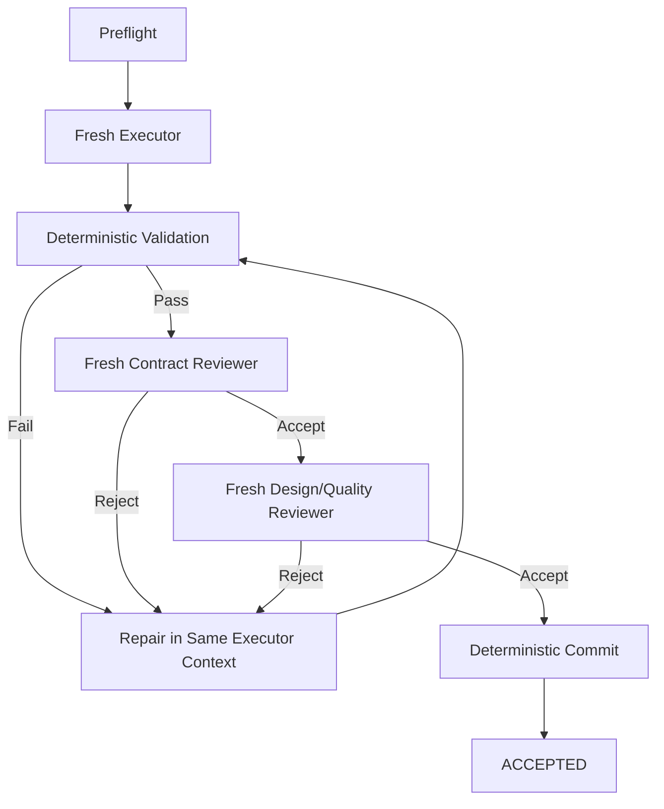

# 00 — Architecture Governance and Continuity Protocol

**Version introduced:** v0.4  
**Snapshot date:** 2026-08-13  
**Purpose:** Preserve architectural integrity as the project evolves across long conversations, different agents/sessions, external reference reviews, and Git-backed implementation.

---

## 1. Canonical-source rule

The Atlas repository on GitHub is the canonical artifact authority. `main` is the current canonical architecture state.

Chat remains the primary architecture/design reasoning workspace. It is **not** the canonical architecture.

The precedence order is:

```text
architecture documents on `main`
        ↓
recorded decisions / learnings
        ↓
current implementation once it exists
        ↓
conversation / model recollection
```

When conversational recollection or prompt text conflicts with the repository state on `main`, the repository wins until intentionally amended through the governance process.

A consequential architectural answer must never rely on "I think earlier we meant..." when the relevant source documents can be read.

> **Chat is the whiteboard. Atlas on GitHub is the artifact authority, and `main` is architectural truth.**

---

## 2. Mandatory grounding rule for material architecture work

Before recommending a material architectural change:

1. classify the discussion as `EXPLORATION`, `CANDIDATE`, or `CHANGE`;
2. identify the architectural areas the proposal touches;
3. read the relevant current canonical documents;
4. identify affected invariants and prior decisions;
5. check the learnings/course-corrections log for previously explored or reversed variants;
6. evaluate the proposal as a **delta** against the current architecture rather than redesigning from memory;
7. recommend `ACCEPT`, `DEFER`, or `REJECT` with rationale;
8. only if accepted, update the canonical documents surgically and record the decision.

For cross-cutting changes, the rolling monolith may be used as the retrieval source, but edits should still be applied to the modular documents first.

---

## 3. Conversation states

### `EXPLORATION`

An idea is being investigated or compared. No architecture modification is implied.

Examples:

- review an external repository for ideas;
- brainstorm a possible execution mode;
- compare two model-routing approaches.

Exploration may remain conversational and need not trigger document changes.

### `CANDIDATE`

An idea appears applicable enough that it may alter the architecture.

Before recommending adoption, the canonical architecture **must be consulted**.

Candidates do not silently overwrite current decisions.

### `CHANGE`

The proposal has been intentionally accepted.

A change requires:

- surgical updates to affected canonical documents;
- a decision record;
- an entry in the learnings/course-corrections log when the change reverses, supersedes, or meaningfully reframes prior thinking;
- consistency verification before the new snapshot is called canonical.

The user does not need to label these states explicitly; the architecture process should infer and state the transition when material.

---

## 4. Core architecture invariants

These are not immutable forever, but they require explicit challenge and amendment rather than casual drift.

1. **Workflow defines capability; policy defines authority.**
2. **Pre-implementation progressively reduces degrees of freedom.**
3. **Behavioral spec, system design, program design, and executable tickets have distinct responsibilities.**
4. **Downstream execution cannot silently rewrite approved upstream decisions.**
5. **Deterministic code owns deterministic workflow mechanics and authoritative state transitions.**
6. **Agent claims are evidence/proposals, never authoritative lifecycle truth.**
7. **Reviewers remain independent from builders; review and repair are separate responsibilities.**
8. **Human authority is represented explicitly by governance policy, not by prompt convention.**
9. **Features pay for seams.** Do not implement speculative generalization before a real second use case earns it.
10. **External repositories contribute evidence and candidates, not automatic architecture changes.**
11. **V1 complexity must be justified by a current problem or a very cheap invariant.** Future paths may be documented without being implemented.
12. **Models/harnesses are replaceable workers staffing durable project roles.** Historical performance informs but does not create authority.
13. **The canonical architecture must be reconstructable without the conversation.**
14. **Chat is never the sole source of an important architectural decision.**

Any proposal that materially touches one or more of these invariants should say which ones.

---

## 5. Candidate promotion test

Before promoting a candidate into the architecture, answer:

1. **What problem in our current design does this solve?**
2. **Does that problem exist now, or are we imagining a future problem?**
3. **Can we preserve the useful principle now while deferring the mechanism?**
4. **Does the proposal simplify an existing component or add a new noun/subsystem?**
5. **Is it grounded in working implementation, operational failure history, design prose, or speculation?**
6. **If implementation-grounded, what pressure caused the feature to exist?**
7. **Does it conflict with an accepted invariant or decision?**
8. **Have we considered/rejected a similar idea before?**
9. **What is the simplest version that preserves the benefit?**
10. **Can a concrete future trigger be named for deferred complexity?**

Recency, elegance, popularity, or a polished demo are not sufficient promotion criteria.

---

## 6. External-reference maturity model

External ideas should be tracked using two separate dimensions:

### Architectural disposition

```text
REUSE      code may be a practical donor after license/fit review
ADAPT      implementation or pattern is useful but must be reshaped
CONCEPT    idea is useful; do not assume code reuse
REFERENCE  revisit when implementing the affected subsystem
REJECT     deliberately incompatible or unnecessary
```

### Maturity in our design

```text
OBSERVED
    Interesting external idea.

CANDIDATE
    Appears to solve a problem we actually have.

ACCEPTED_PRINCIPLE
    Belongs in the architecture independent of exact mechanism.

IMPLEMENTATION_REFERENCE
    Grounding material to revisit when implementing the subsystem.

DEFERRED
    Valuable only after a named trigger occurs.

ADOPTED
    Actually implemented in our system.

REJECTED
    Considered and intentionally not pursued.
```

A new repository review should not silently change either dimension for prior references.

---

## 7. Surgical-delta rule

Future architecture versions should be generated as:

```text
current canonical snapshot
        +
accepted deltas
        ↓
surgical modifications
        ↓
consistency audit
        ↓
new snapshot
```

Do **not** regenerate the architecture wholesale from conversation memory.

The modular documents are edited first. The rolling monolith is generated from those sources afterward.

A version bump is appropriate when a meaningful architectural/process decision has been accepted. Minor typo/format corrections need not create a conceptual version change unless they alter meaning.

---

## 8. Snapshot consistency audit

Every substantial snapshot should verify at least:

### Structural consistency

- all numbered canonical documents are present;
- the rolling monolith contains the canonical documents exactly and in order;
- README/version labels match the actual snapshot;
- Markdown/code fences are balanced;
- checksums/package integrity succeed.

### Semantic consistency

- principles and concrete workflow do not contradict each other;
- artifact responsibilities remain non-overlapping;
- examples/config do not encode superseded policy;
- open questions that were resolved are marked resolved or removed;
- deferred ideas are not presented as V1 requirements;
- rejected ideas are not reintroduced without explicit reconsideration;
- terminology is consistent across documents;
- current standing can be reconstructed without reading the chat;
- new decisions are reflected in all affected documents, not only the decision log.

### Complexity audit

Ask:

- Did this version add an abstraction before a second real use case exists?
- Did an external reference introduce platform complexity that our V1 does not need?
- Could a mechanism be documented as a future path instead of implemented now?
- Did a new subsystem earn its operational cost?

---

## 9. Environment and artifact-authority health check

At every substantial architecture checkpoint, explicitly assess whether chat remains an appropriate primary design room.

### `CHAT_NATIVE`

Use while:

- work is predominantly architecture reasoning/comparison;
- canonical docs can be updated as manageable deltas;
- implementation details do not yet materially constrain architecture;
- a future agent can reconstruct current standing by reading the packet;
- snapshot packaging is cheap relative to the reasoning work.

### `GIT_READY`

Migration would materially improve work, but chat can still remain the reasoning interface.

Signals include:

- frequent multi-file architecture edits where real diffs would help;
- need for branches or competing architecture proposals;
- multiple agents/people need to consume or modify the packet independently;
- architecture starts naming concrete source interfaces/modules;
- version packaging becomes repetitive or error-prone;
- implementation is about to begin.

### `GIT_REQUIRED`

Continuing without a repository creates unacceptable architecture risk.

Triggers include:

- implementation code materially influences architecture decisions;
- architecture and implementation must evolve atomically;
- important decisions cannot be reconstructed from the packet alone;
- changes require reliable merge/diff/review history;
- multiple concurrent writers need conflict-safe coordination;
- artifact authority is ambiguous without repository history.

### `GIT_ACTIVE`

Git is in use as the artifact and history authority while chat remains the primary reasoning interface. Architecture mutations occur on branches and are reviewed as diffs before human-controlled merge into `main`.

### Current status

```text
GIT_ACTIVE — chat remains the primary architecture/design reasoning interface
```

Atlas has completed the artifact-authority transition anticipated by v0.4. The canonical architecture is the repository state on `main`; chat remains the primary venue for exploration, synthesis, and architecture/design reasoning.

---

## 10. Hidden-intent stop condition

If a consequential discussion reaches:

> “I think earlier we meant...”

and the answer cannot be resolved by reading the canonical packet, **stop architectural evolution** until the missing intent is reconstructed and recorded.

That is evidence that chat history has become an unsafe hidden dependency.

---

## 11. Current Git operating model

Atlas preserves the conversational design room while using Git as artifact authority:

```text
Chat / architecture discussion
        ↓
explicitly accepted CHANGE
        ↓
Git branch / patch
        ↓
diff + architecture consistency review
        ↓
human-controlled merge into `main`
```

Repository mutations are currently performed through coding agents such as Codex or through a manual Git workflow. Changes are made on branches, inspected as diffs, and reviewed through draft pull requests. Agents do not merge autonomously.

### Agent operating-contract routing

The repository-root `AGENTS.md` defines rules shared by builders, reviewers, and architecture agents. `architecture/AGENTS.md` layers architecture-evolution rules on top of that common contract and points back to this governance protocol rather than duplicating it.

Agents should leave observable evidence by naming the governing files they consulted and the validation they actually performed, including required behavior that was not directly verified. Repository authority does not license silent reconciliation: apparent contradictions among authoritative sources must be reported with their locations unless the task explicitly authorizes resolving them.

---

## 12. Instructions for future agents/sessions

When asked to continue this project:

1. follow the root `AGENTS.md` operating contract;
2. for architecture work, also follow `architecture/AGENTS.md`;
3. do not assume conversational memory is sufficient;
4. locate/read `architecture/00-architecture-governance.md` first;
5. identify the latest canonical snapshot/version;
6. read the relevant modular docs or rolling monolith before material recommendations;
7. respect recorded `ACCEPTED`, `DEFERRED`, `REJECTED`, and course-correction history;
8. treat external repositories as candidate evidence only;
9. propose deltas rather than rewriting architecture from memory;
10. use a branch and draft PR for repository mutations, and never merge autonomously.

> **The process is successful when a future agent can forget the conversation and still reconstruct the architecture, its rationale, and the legal way to evolve it from the repository/design packet alone.**

---

# 01 — Architectural Principles

## 1. Separate design judgment from execution mechanics

The system should concentrate fuzzy reasoning and high-cost decisions before implementation, then progressively constrain execution with approved contracts and objective validators.

```text
fuzzy intent
  ↓
behavioral contract
  ↓
system contract
  ↓
program contract
  ↓
execution graph
  ↓
implementation
  ↓
objective validation + independent review
```

The goal is not to eliminate reasoning. It is to put reasoning where it has the highest leverage and to reduce unnecessary degrees of freedom during implementation.

## 2. Workflow defines capability; policy defines authority

A workflow stage answers: **what can the system do?**

A policy/gate answers: **who is allowed to accept the result and advance?**

This prevents individual skills from hard-coding assumptions about autonomy.

Examples:

- Program design can always be generated.
- One profile may auto-accept it after agent review.
- Another may require human approval.
- Another may require human approval only if architecture materially changed.

## 3. One artifact, one abstraction level, one exclusive job

Each artifact must resolve a distinct class of uncertainty.

If two artifacts repeatedly restate one another, one of the abstraction boundaries is wrong.

The intended progression is:

1. **Decision discovery** — what is still unresolved?
2. **Behavioral spec** — what must become true?
3. **System design** — where does it fit and what boundaries/contracts change?
4. **Program design** — what shape will the code take?
5. **Execution compilation** — what independent vertical slices implement the approved design?

Each stage should reduce degrees of freedom without reopening resolved upstream decisions.

## 4. Downstream stages may discover problems, but cannot silently redesign upstream decisions

Implementation agents are allowed to discover that an approved design is invalid.

They are **not** allowed to self-authorize architectural changes.

If execution requires violating an approved contract, the correct state is:

```text
DESIGN_BLOCKED
    ↓
escalate
    ↓
amend upstream design
    ↓
review / approve
    ↓
resume
```

This preserves provenance and prevents architecture from drifting invisibly during implementation.

## 5. Agents reason; deterministic code governs

Use agents where judgment is required.

Use deterministic code for known mechanics:

- test/build/lint commands
- dependency graph traversal
- file-scope enforcement
- git status / diff / commit
- worktree lifecycle
- state transitions
- retry counters
- artifact existence/schema checks
- PR creation
- branch push

A model may propose a state change, but deterministic code should own authoritative state when practical.

## 6. Review and implementation are separate authorities

Reviewer responsibilities:

- inspect
- reason
- cite evidence
- accept/reject
- identify blocking vs non-blocking findings

Executor responsibilities:

- write
- repair
- validate

A reviewer should not silently fix the code it is judging.

## 7. Preserve builder context; refresh reviewer context

Within a ticket:

- Keep the same builder context across ordinary test failures and reviewer repair cycles, because implementation knowledge is useful state.
- Prefer fresh reviewer contexts on re-review, because prior conclusions create anchoring and confirmation bias.

## 8. Human involvement is an authority policy, not a workflow primitive

Do not build separate `safe`, `fast`, `refactor`, and `prototype` factories.

Build one workflow graph and configure authority/gates.

Human approval should be injected by policy at meaningful boundaries.

## 9. A draft PR is an appropriate factory output; merge initially is not

The factory should ideally produce:

> A draft PR that it believes is excellent, with evidence supporting that claim.

The initial definition of done should **not** be:

> The system merged its own code.

Human PR review remains the final authority until evidence from real use supports relaxing that rule for narrow classes of change.

## 10. Stable artifact semantics across profiles

Profiles may decide to:

- skip an artifact
- generate it
- review it
- human-approve it

But they should not change what the artifact means.

`program-design.md` must have the same semantic contract under every profile.

## 11. Risk can increase scrutiny automatically; it should not silently reduce requested scrutiny

At least initially, automatic classification should be advisory.

If later policy permits automatic routing:

- the classifier may raise minimum scrutiny when risk is detected;
- it should not silently downgrade a profile explicitly chosen by the user.

## 12. Build the smallest useful factory first

The first implementation should automate one bounded unit: a ready ticket.

Do not begin by building an enormous orchestration platform. Run real work, observe failure modes, and grow the control plane around evidence.

---

# 02 — End-to-End Workflow

## Overview

The architecture contains an **outer design-control loop** and an **inner execution-control loop**.

### Outer loop — design control

Question:

> Does the proposed system still represent what we actually want to build?

Authority:

> Human + reasoning agents, under configurable governance.

### Inner loop — execution control

Question:

> Does the implementation satisfy the approved contract?

Authority:

> Deterministic validators + bounded agents, with escalation when the contract itself proves invalid.

---

## Stage 0 — Intake and classification

Input:

- fuzzy goal
- existing repository context
- optional explicit workflow/profile selection

Output:

- recommended workflow depth
- recommended governance profile
- structured risk assessment
- resolved run configuration after human acceptance/override

Classifier behavior should initially be **recommend-only**.

Example:

```text
Goal: Add asynchronous device job scheduling

Recommended workflow: ARCHITECTURAL
Recommended governance: STANDARD

Why:
- crosses multiple modules
- introduces durable job state
- changes execution ownership
- affects failure/recovery semantics

Human gates:
- behavioral spec
- program design
- final PR

Conditional gates:
- system design if boundaries change
- tracer slice if implementation risk becomes high
```

The resolved run configuration is snapshotted into the planning directory and becomes part of the run's audit trail.

---

## Stage 1 — Decision discovery

Purpose:

> Determine which decisions actually need to be made before specification/design can stabilize.

Potential resolution modes:

```text
OPEN DECISION
    │
    ├── human judgment required ───► GRILL
    ├── factual uncertainty ───────► RESEARCH
    ├── codebase uncertainty ──────► EXPLORE
    └── experiential uncertainty ──► SPIKE
```

For very large/foggy work, use a Wayfinder-style frontier of currently answerable decisions rather than pretending the entire project can be decomposed up front.

Output is **resolved decisions/evidence**, not implementation tickets.

---

## Stage 2 — Behavioral specification

Question:

> What must become true?

The spec should be understandable and approvable without requiring implementation knowledge.

Suggested content:

- problem
- desired behavior
- user/operator stories
- acceptance outcomes
- constraints
- invariants
- out of scope
- observable behavior
- unresolved questions

Avoid:

- class names
- file layouts
- method signatures
- internal interfaces
- implementation structure

This artifact defines the **behavioral contract**.

---

## Stage 3 — System design

Question:

> Where does this change fit in the existing system?

Suggested content:

- current system
- proposed system
- affected components/modules
- system boundaries
- external contracts
- data ownership
- API/protocol contracts
- persistence/schema changes
- end-to-end flows
- failure/recovery behavior
- compatibility constraints
- security/operational concerns
- rejected alternatives

This is the architectural layer.

It should stop before detailed internal code shape.

---

## Stage 4 — Program design

Question:

> What shape should the implementation take inside the codebase?

Suggested content:

- file/module placement
- new vs modified files
- important types
- interfaces/contracts
- public method/function signatures
- ownership/state boundaries
- call stacks / interaction chains
- concurrency/lifetime assumptions
- test seams
- migration/expand-contract mechanics where relevant

No production method bodies.

Program design resolves the architecture-ish decisions that otherwise emerge invisibly during implementation.

A design review should explicitly challenge:

- shallow wrappers
- unjustified interfaces
- seams invented only for unit testing
- poor locality
- vocabulary drift
- state ownership ambiguity
- unnecessary new abstractions
- failure semantics

---

## Stage 5 — Execution compilation

Question:

> How can the approved design be built as independent, verifiable vertical slices?

This stage should be treated as a **compiler**, not another open-ended design step.

Inputs:

- approved spec
- approved system design when present
- approved program design when present

Outputs:

- ticket graph
- blocking relationships
- tracer slice where useful
- deterministic validation contracts
- explicit references to upstream sections

Tickets should reference upstream source-of-truth sections rather than copying them.

---

## Stage 6 — Optional tracer checkpoint

For high-risk or foundational changes, run one minimal end-to-end tracer slice before authorizing the remainder of the graph.

Possible policy:

```text
approved design
   ↓
tracer ticket factory
   ↓
automated validation/review
   ↓
HUMAN CHECKPOINT
   ↓
remaining tickets
```

This captures Dex's incremental steering principle without forcing human review of every ticket.

---

## Stage 7 — Ticket factory

Each ready ticket enters a bounded autonomous execution loop:

```text
preflight
→ executor
→ deterministic validators
→ contract reviewer
→ design/quality reviewer
→ bounded repair if rejected
→ accepted commit
```

Possible terminal states:

- `ACCEPTED`
- `FAILED`
- `DESIGN_BLOCKED`

`DESIGN_BLOCKED` is semantically distinct from a failed implementation attempt.

---

## Stage 8 — Feature runner

The feature runner owns dependency traversal.

Pseudo-flow:

```text
load approved ticket graph
while unblocked tickets exist:
    select next ticket
    run TicketFactory(ticket)

    if ACCEPTED:
        mark complete
        continue

    if DESIGN_BLOCKED:
        stop and escalate upstream

    if FAILED:
        stop and report
```

Parallel execution may be introduced later when tickets are truly independent and policy allows it.

---

## Stage 9 — Whole-feature validation and review

After all tickets are complete:

- full build/test/lint suite
- integration/system tests
- architecture/scope checks
- whole-branch spec compliance review
- whole-branch architecture/program-design drift review
- maintainability/standards review
- conditional ops/security/migration/UI review

This catches interactions that cannot be judged at individual ticket scope.

---

## Stage 10 — Package and create draft PR

The system should deterministically assemble evidence from the run:

- source planning bundle
- approved design versions
- completed tickets
- commits per ticket
- validation results
- automated reviewer outcomes
- repairs performed
- design amendments
- unresolved warnings

Then:

- push branch
- create draft PR
- attach or summarize evidence

This is a mechanical packaging step and belongs inside the factory.

---

## Stage 11 — Human PR review

Initial final authority:

> Human.

The factory should make the human review unusually high leverage by presenting a polished implementation plus provenance and validation evidence.

Merge remains a human action initially.

---

# 03 — Artifact Model

## Recommended directory layout

```text
<planning-root>/
└── <feature-slug>/
    ├── run.yaml
    ├── 00-state.md
    ├── 10-decisions.md
    ├── 20-spec.md
    ├── 30-system-design.md
    ├── 40-program-design.md
    │
    ├── evidence/
    │   ├── current-state.md
    │   └── research-*.md
    │
    ├── spikes/
    │   └── <spike-name>/
    │
    ├── tickets/
    │   ├── 01-tracer.md
    │   ├── 02-*.md
    │   └── ...
    │
    ├── reviews/
    │   ├── ticket-01-contract.json
    │   ├── ticket-01-design.json
    │   └── final-*.json
    │
    └── amendments/
        └── 001-*.md
```

## Planning root

`<planning-root>` is resolved from configuration (`artifacts.planning_root`), not fixed by this document. It takes one of two forms:

- **Repository-relative** — the default, `.planning/` inside the repository being changed. `.planning/` is preferred over `docs/` because these are working engineering artifacts. Durable architectural knowledge may later graduate into `CONTEXT.md`, `docs/adr/`, or permanent documentation.
- **External** — an absolute path or a separate planning repository, shared by many code repositories.

The external form exists because a change is not always confined to one repository. Where an organization has many small repositories rather than a monorepo, a single unit of work commonly spans several, and no one of them is an honest home for the artifacts describing it. Forcing such work into one repository's `.planning/` requires nominating an arbitrary owning repository, which misrepresents the change.

An external planning root is a location with an access model, not merely a path. A root reachable only by its author cannot be referenced by collaborators; a shared planning repository can. Configuration therefore records the root, and no artifact records an absolute path that resolves differently for different readers.

**An external root resolves to an already-usable local filesystem path.** Configuration names a directory that exists and is readable when a run begins. Cloning, authentication, fetch and push lifecycle, synchronization, remote locking, conflict resolution, and repository provisioning are **outside this architecture**. Where the planning root happens to be a checkout of a shared repository, keeping that checkout current is the operator's responsibility, not the factory's. The contract here concerns artifact location and reference semantics, not remote repository management.

### `repos`

A feature that affects more than one repository declares them. Each affected repository is named in the feature's `run.yaml` and mirrored into `00-state.md` frontmatter, so the question *which planning artifacts touched this repository* is answerable by query against the planning root rather than by search across repositories.

`repos` is **descriptive planning metadata**. It records what a body of work concerns. It grants no access, and it does not widen any agent's write scope.

### Planning scope is not execution scope

One planning effort may describe work spanning several repositories. Factory execution remains **repository-scoped**:

- An executable run operates against **one resolved repository and worktree**, with **one repository baseline**.
- Execution compilation may associate or partition tickets by target repository where a planning effort spans several, so that each executable ticket names its target unambiguously.
- Cross-repository atomic execution, synchronized branches, coordinated integration, multi-repository rollback, and multi-pull-request transaction semantics are **not** capabilities of this architecture. A planning effort spanning several repositories is executed as several repository-scoped runs.

The planning root and the execution scope are separate concerns. Widening the first does not widen the second.

### Consequences of an external root

These are costs, not defects, and are accepted deliberately:

- **Specification and code no longer share a commit.** With a repository-relative root, the approved contract and the change implementing it appear in one history; with an external root they do not. Correlation is by explicit reference, not by construction.
- **Review loses ambient context.** A reviewer reading a pull request cannot see the contract unless the planning root is resolvable in their environment. Contract review therefore depends on configuration being correct wherever review runs.
- **Atomicity is lost.** Repository-relative planning gives history, blame, and atomic spec-plus-code commits for free. An external root gives none of these unless it is itself version-controlled.

Where a repository benefits from a permanent local record — a public repository, or one whose readers cannot reach the planning root — a decision may **graduate** into that repository as an ADR under `artifacts.adr_path`. Graduation is a deliberate act producing a durable record, not an automatic mirror of planning state.

---

## `run.yaml`

Purpose:

> Immutable resolved configuration snapshot for this run.

Contains:

- selected workflow depth
- selected governance profile
- explicit overrides
- risk classification
- gate policy
- execution policy
- model roles
- artifact paths
- resolved planning root
- repository baseline
- affected repositories (`repos`)

Do not rely on changing global config to reconstruct historical behavior.

---

## `00-state.md`

Purpose:

> Human-readable state mirror, with machine-parseable frontmatter.

Example:

```yaml
---
feature: async-device-jobs
status: planning
phase: program-design
baseline: 89a1c732
revision: 4

repos:
  - device-service
  - job-scheduler

gates:
  spec: approved
  system_design: approved
  program_design: in_review
  tickets: pending

active_ticket: null
---
```

Authoritative machine state may eventually live in a structured state file/database, but a boring on-disk representation is useful for observability and recovery.

---

## `10-decisions.md`

Purpose:

> Durable record of important pre-spec decisions and their rationale.

Possible schema:

```markdown
## DEC-004 — Job execution ownership

Status: resolved
Source: grill
Decision: Worker owns device execution; scheduler only enqueues.
Why: ...
Alternatives: ...
Consequences: ...
```

This is not necessarily required for every small feature.

---

## `20-spec.md`

Owns:

> External/observable behavior.

Should answer:

- what problem exists?
- what must become true?
- what is explicitly not required?
- what invariants must hold?
- what behaviors constitute acceptance?

Must not become an implementation plan.

---

## `30-system-design.md`

Owns:

> System placement, boundaries, contracts, data ownership, and end-to-end behavior.

Should be architecture-level, not file/class-level.

---

## `40-program-design.md`

Owns:

> Internal code shape necessary to implement the approved system design.

Typical details:

```text
src/
  scheduling/
    JobScheduler.cs       MODIFY
    ScheduledJob.cs       NEW
    IJobQueue.cs          NEW

  workers/
    DeviceJobWorker.cs    NEW
```

and public/internal contracts such as important type signatures and call chains.

---

## `evidence/`

Purpose:

> Preserve factual findings that informed decisions without polluting normative design artifacts.

Examples:

- current code flow
- dependency inventory
- benchmark results
- external API constraints
- repository archaeology

Evidence is descriptive; specs/designs are normative.

---

## `spikes/`

Purpose:

> Isolated learning experiments used to reduce uncertainty.

A spike is not automatically production code and does not automatically require human review.

See `07-spikes-and-discovery.md` for detailed semantics.

---

## `tickets/*.md`

Purpose:

> Agent-grabbable vertical execution contracts.

Suggested frontmatter:

```yaml
---
id: async-jobs-02
status: ready
blocked_by:
  - async-jobs-01
risk: medium

references:
  spec: ../20-spec.md
  system_design: ../30-system-design.md
  program_design: ../40-program-design.md

validation:
  - dotnet test --filter JobCancellation
  - dotnet test

review:
  contract: required
  design: required
---
```

Human-readable body:

```markdown
# Cancellation

## What becomes true

A scheduled but not-yet-executing job can be cancelled.

## Acceptance

- Cancellation succeeds for an existing pending job.
- Cancelled jobs are never dispatched.
- Cancellation is idempotent.

## Relevant design

See `40-program-design.md#job-cancellation`.
```

Tickets should not duplicate upstream architecture/program design.

---

## `reviews/`

Prefer structured reviewer output where practical.

Example:

```json
{
  "decision": "reject",
  "findings": [
    {
      "severity": "blocking",
      "contract": "program-design §3.2",
      "problem": "Cancellation ownership moved into DeviceAdapter",
      "evidence": "..."
    }
  ]
}
```

This allows deterministic routing without requiring code to parse prose sentiment.

---

## `amendments/`

Approved upstream artifacts should not be silently edited by implementers.

A change in an approved contract should produce an explicit amendment containing:

- trigger/evidence
- affected artifact/section
- proposed change
- impact on tickets already completed
- required re-review/re-validation
- approval

The system may later fold approved amendments back into canonical documents, but provenance should remain visible.

---

# 04 — Control Plane, Policy Dimensions, and Gates

## Why the control plane exists

The control plane prevents autonomy policy from leaking into individual agents/skills.

Without it, one skill might ask for human approval, another might auto-advance, and another might open a PR based on whatever instructions happened to be in its prompt.

The control plane centralizes:

- workflow depth;
- governance / gate authority;
- execution policy;
- environment policy;
- model/harness roster;
- risk/classifier recommendations;
- reviewer requirements;
- retry limits;
- artifact locations;
- state-transition authority.

---

## Configuration dimensions

Keep these dimensions independent even if a named preset resolves several at once.

### `workflow`

Question:

> How much reasoning/artifact decomposition does this work warrant?

Possible starting values:

- `trivial`
- `normal`
- `architectural`
- `fog_of_war`

Example shapes:

```text
TRIVIAL
Goal → Ticket → Implement → Validate → PR
```

```text
NORMAL
Goal → Discovery → Spec → Program Design → Tickets → Factory
```

```text
ARCHITECTURAL
Goal → Discovery → Spec → System Design → Program Design → Tickets → Factory
```

```text
FOG_OF_WAR
Goal → Wayfinder / Research / Spikes → stabilize decisions → architecture pipeline
```

### `governance`

Question:

> Who has authority to advance through the selected workflow?

Possible starting postures:

- `exploratory`
- `standard`
- `high_assurance`
- `autonomous`

A security-sensitive small change might be `normal + high_assurance`.
A large personal experiment might be `architectural + autonomous`.

### `execution_policy`

Question:

> How aggressively does the execution factory operate?

Controls things such as:

- repair limits;
- concurrency/parallelism;
- mandatory vs conditional reviewers;
- tracer checkpoints;
- commit strategy;
- timeout/budget behavior.

### `environment_policy`

Question:

> Where/how does execution run and what isolation/retention rules apply?

**V1 default:** `local_worktree`.

Future values can be added only when a concrete runtime earns them.

### `roster`

Question:

> Which model/harness staffs each reasoning role?

Keep this separate from assurance. “High assurance” should not intrinsically mean one specific vendor/model.

### `preset`

A convenience name resolving the above dimensions, for example:

```yaml
preset: important_refactor
```

might resolve to:

```yaml
workflow: architectural
governance: standard
execution_policy: conservative
environment_policy: local_worktree
roster: frontier
```

Do not create combinatorial named profiles for every possible combination.

---

## Configuration hierarchy

Recommended precedence:

```text
global defaults
    <
repository configuration
    <
selected preset / explicit dimension choices
    <
explicit run overrides
```

Possible files:

```text
~/.factory/config.yaml
<repo>/.factory/config.yaml
<planning-root>/<feature>/run.yaml
<repo>/.factory/runs/<run-id>/run-manifest.json
```

`run.yaml` can preserve the human-visible intake/policy decision for the engineering effort.

`run-manifest.json` is the machine-canonical fully resolved execution snapshot for an actual factory run, including source/planning hashes and exact roster/config versions.

---

## Gate vocabulary

### `AUTO`

Output can advance immediately once deterministic prerequisites are satisfied.

### `AGENT_REVIEW`

A separate reviewer must approve before progression; no human approval required.

### `HUMAN`

Human approval required regardless of whether agent reviews pass.

### `CONDITIONAL`

Policy evaluates structured conditions to determine whether escalation is required.

### `HUMAN_IF_CHANGED`

Human approval required only if the stage introduces a material change relative to an approved baseline or specified semantic dimensions.

---

## Reviews and gates are different concepts

A review asks:

> Is this good/correct?

A gate asks:

> Who has authority to allow progression?

Example:

```yaml
program_design:
  reviews:
    - program_design_critic
    - testability_critic
  gate:
    authority: HUMAN
```

The human becomes the decision authority rather than the primary bug finder.

---

## Classifier behavior

Initial behavior:

> **Recommend; do not silently route.**

Classifier should produce structured evidence:

```yaml
risk:
  scope: high
  reversibility: medium
  architecture_change: true
  schema_change: false
  public_contract_change: true
  security_sensitive: false
  operational_impact: medium
  testability: high
```

Then the user accepts or overrides the recommendation.

An explicit user-selected assurance level should not be silently downgraded. Future policy may automatically raise minimum scrutiny for known high-risk conditions after the system earns that trust.

---

## Stable artifact semantics

Policy can decide whether an artifact is skipped/generated/reviewed/approved.

Policy should **not redefine the artifact's semantic meaning**.

For example, `program-design.md` means the same kind of thing under `exploratory` and `high_assurance`; only whether it is required/reviewed/human-approved changes.

This stability allows agents and deterministic tools to consume artifacts reliably across the system.

---

# 05 — Execution Factory

## Recommended initial factory boundary

Input:

> An approved, ready vertical ticket plus references to approved design artifacts.

Output:

> An accepted commit or an explicit terminal/escalation state.

Do not initially make the core factory responsible for inventing the feature design.

---

## Ticket factory

Suggested interface:

```text
factory run <ticket.md>
```

Conceptual pipeline:



Bounded repair attempts prevent infinite loops.

---

## Preflight

Deterministic checks should include as appropriate:

- ticket schema valid
- all referenced upstream artifacts exist
- required gates are approved
- blocking tickets are complete
- repository/worktree is clean enough to start
- baseline commit matches expected state
- ticket is not already active elsewhere
- validation commands are declared
- file-scope policy can be resolved

---

## Executor contract

The executor receives:

- ticket
- minimal referenced upstream design sections
- relevant repository context
- explicit allowed/expected scope
- validator commands
- previous repair feedback for this ticket

It may:

- implement
- run local exploratory commands
- repair failures
- report design conflicts

It may not:

- silently amend approved upstream contracts
- declare its own work accepted
- bypass mandatory validators
- mutate authoritative workflow state directly

---

## Deterministic validation

Known checks belong to code, not a “tester agent.”

Examples:

- build
- unit/integration tests
- linters/analyzers
- formatting
- architecture dependency checks
- schema validation
- generated-code consistency
- browser assertions where automatable
- touched-file scope checks

Result should be structured and stored.

---

## Repair loop

Ordinary failure:

```text
validator failure
→ feed exact evidence to same executor
→ repair
→ re-run all relevant deterministic checks
```

Reviewer rejection:

```text
fresh reviewer rejects
→ feed structured findings to same executor
→ repair
→ deterministic checks again
→ fresh review again
```

Why keep executor context?

> Implementation context is valuable state.

Why refresh reviewer context?

> Review context is dangerous state because of anchoring.

---

## Terminal state: `DESIGN_BLOCKED`

A crucial state distinct from `FAILED`.

Use when:

> The approved design cannot be implemented without violating an upstream contract or an assumption necessary for the design is false.

Example:

```text
DESIGN_BLOCKED
reason:
  Program design assumes DeviceManager is thread-safe; codebase evidence proves it is not.
impacted_contract:
  40-program-design.md#execution-lifetime
suggested_resolution:
  reconsider execution ownership
```

The feature runner stops and escalates to the design-control loop.

---

## Commit ownership

Commit should be performed by deterministic code after all required ticket gates pass.

Benefits:

- commit boundary exactly matches accepted ticket
- predictable message format
- no accidental unrelated staging
- easier rollback/bisect
- clean evidence mapping

---

## Feature runner

Suggested interface:

```text
factory run-feature <planning-root>/<feature>
```

Responsibilities:

- load ticket dependency graph
- resolve next unblocked ticket
- invoke ticket factory
- persist ticket state
- stop on terminal/escalation conditions
- enforce policy checkpoints
- optionally parallelize later

Parallelism should be conservative initially.

---

## Whole-feature factory

After all tickets are accepted:

```text
full deterministic validation
→ whole-feature contract review
→ architecture/program-design drift review
→ standards/maintainability review
→ conditional specialty reviews
→ package run evidence
→ push branch
→ create draft PR
```

---

## PR creation

PR creation belongs inside the factory because it is primarily packaging and state transition.

The factory has unusually rich information for the PR description:

- intent/spec
- approved architecture/design
- ticket graph
- commits
- validations
- review results
- repairs
- amendments
- unresolved warnings

The default should be a **draft PR**.

Human review remains the merge authority initially.

---

# 06 — Review and Validation Architecture

## Validation hierarchy

Not all verification is the same.

### Layer 1 — deterministic validators

Best evidence where available:

- compilation/build
- unit tests
- integration tests
- static analysis
- linters
- architecture checks
- schema checks
- generated artifact checks
- browser assertions
- diff/scope checks

These should run before LLM review so reviewers spend reasoning tokens on ambiguity rather than failures a command can prove.

### Layer 2 — independent semantic review

Required for things deterministic checks cannot fully judge:

- contract/spec compliance
- architecture drift
- maintainability
- unnecessary complexity
- missing edge cases
- inappropriate abstractions
- misleading tests

### Layer 3 — human authority

Used where policy requires human judgment or acceptance.

---

## Per-ticket review axes

Recommended default: two independent axes.

### Contract reviewer

Question:

> Did this ticket produce exactly the behavior required by the approved contracts?

Checks:

- ticket acceptance
- relevant spec sections
- relevant system/program-design sections
- missing behavior
- scope creep
- false-positive tests

### Design/quality reviewer

Question:

> Is this a good implementation for this codebase while respecting approved design?

Checks:

- architecture/program-design drift
- module boundaries
- state ownership
- unnecessary abstractions
- codebase conventions
- maintainability
- locality
- test seam quality
- readability

These axes should remain independent enough that one does not mask the other.

---

## Conditional reviewers

Do not create a reviewer for every conceivable concern.

Enable specialist reviewers based on structured change/risk signals.

Examples:

### Operations reviewer

Trigger when significant I/O or runtime dependency behavior changes.

Inspect:

- timeouts
- retries
- resource cleanup
- queue/database/network/file failure behavior
- backpressure
- unbounded growth
- degraded dependencies
- cancellation

### Security reviewer

Trigger for:

- auth/authz
- secrets
- trust boundaries
- untrusted input
- cryptography
- permission changes
- externally exposed endpoints

### Migration reviewer

Trigger for:

- schema migrations
- compatibility windows
- expand/contract changes
- backfills
- rollback considerations

### UI/browser verifier

Trigger for user-facing UI behavior that can benefit from browser-level verification.

---

## Reviewer output should be structured

Preferred conceptual schema:

```json
{
  "decision": "accept | reject",
  "findings": [
    {
      "severity": "blocking | warning",
      "category": "contract | design | quality | ops | security",
      "source": "40-program-design.md#job-cancellation",
      "problem": "...",
      "evidence": "...",
      "suggested_direction": "..."
    }
  ]
}
```

Deterministic orchestration should consume this structured output.

---

## Reviewer write policy

Default:

> Read-only repository access.

If a reviewer mutates code, the harness should detect and reject/restore the mutation.

Reviewer and executor roles should not blur.

---

## Whole-feature review

Ticket-level correctness is insufficient.

After all tickets:

1. full behavioral/spec compliance
2. architecture drift across combined change
3. program-design drift
4. cross-ticket interactions
5. dead/duplicate transition code
6. standards/maintainability
7. specialty review triggers
8. final diff scope

---

## Human review policy

Human review can occur at different points based on governance profile.

Potential gates:

- spec approval
- system design approval
- program design approval
- ticket graph approval
- tracer slice approval
- every N tickets
- design amendment approval
- final PR approval

The long-term goal is not “remove humans.”

The goal is:

> Spend human judgment only where it meaningfully changes outcomes.

---

# 07 — Decision Discovery, Research, Exploration, and Spikes

## Terminology decision: prefer `spike` for learning experiments

The word `prototype` is overloaded. It can imply:

- an exploratory throwaway experiment,
- a user-facing mockup that needs review,
- a candidate implementation likely to survive into production,
- or a proof-of-concept artifact.

For this architecture, **`spike` is the clearer default term for uncertainty-reduction work**.

A spike means:

> A bounded experiment whose primary output is knowledge/evidence, not production code.

A spike does **not** inherently require human review.

Whether a spike requires a human gate is a policy decision based on what decision it informs and how consequential that decision is.

---

## Decision discovery is a routing problem

Given an unresolved question, choose the cheapest valid resolution mechanism.

```text
OPEN QUESTION
    │
    ├── requires preference/tradeoff judgment ─► GRILL / HUMAN
    │
    ├── answer exists externally ──────────────► RESEARCH
    │
    ├── answer exists in repository ──────────► EXPLORE
    │
    └── answer requires observing behavior ───► SPIKE
```

This avoids asking humans factual questions agents can answer and avoids “researching” questions that require an empirical experiment.

---

## Grill

Use for decisions involving:

- product intent
- desired tradeoffs
- preference between valid alternatives
- unacceptable outcomes
- risk tolerance
- scope boundaries

The grill should act like a dependency-aware decision tree rather than a generic interview.

Ask only currently answerable questions whose upstream dependencies are resolved.

---

## Research

Use for external factual uncertainty.

Examples:

- framework/API behavior
- standards
- library constraints
- protocol semantics

Research produces evidence and citations, not authoritative product decisions.

---

## Repository exploration

Use for codebase uncertainty.

Examples:

- current ownership boundaries
- existing abstractions
- test seams
- hidden coupling
- actual call flow

Where useful, preserve findings under `evidence/` so later agents do not repeatedly rediscover the same facts.

---

## Spike

Use when an important unknown cannot be resolved confidently by inspection or research.

Examples:

- performance characteristic
- library interoperability
- concurrency semantics
- feasibility of a new API
- actual device/runtime behavior
- migration edge case

A good spike has:

```yaml
question: Can X satisfy Y under Z?
max_scope: bounded
success_evidence: explicit
production_code: prohibited | optional | candidate
retention: discard | preserve_evidence | candidate_for_rework
```

Its output should include:

- question
- method
- observations
- result
- confidence
- implications for upstream decisions

---

## Does a spike require human review?

Not inherently.

Examples:

### Auto-acceptable spike

Question:

> Does library A expose cancellation through API B?

Agent runs a tiny experiment and records definitive evidence.

No human review is necessarily useful.

### Human-gated consequence

Question:

> Which of two architectures should we adopt given the latency/cost tradeoff demonstrated by the spike?

The spike itself can complete automatically.

The **decision informed by the spike** may require human approval.

This reinforces the distinction:

> Evidence production and decision authority are separate concerns.

---

## Fog-of-war / Wayfinder mode

For genuinely large work, do not require full ticket decomposition before enough architectural decisions are known.

Maintain a frontier of currently resolvable questions.

Conceptually:

```text
known territory
   ↓
current decision frontier
   ↓
resolve one or several decisions
   ↓
new territory becomes visible
```

Only transition into normal spec/design/ticket compilation once enough uncertainty has collapsed.

This prevents premature decomposition and false precision.

---

# 08 — State, Governance, Amendments, and Recovery

## Single authoritative state owner

Agents should not independently decide that workflow phases are complete.

Prefer one deterministic state authority responsible for:

- current phase
- gate status
- active ticket
- dependency completion
- retry counters
- terminal/escalation states
- approved artifact versions

Agents produce evidence/proposals; the state machine applies valid transitions.

---

## Suggested high-level run states

```text
INTAKE
DISCOVERY
SPEC
SYSTEM_DESIGN
PROGRAM_DESIGN
TICKETING
READY_FOR_EXECUTION
EXECUTING
DESIGN_BLOCKED
FINAL_VALIDATION
PR_READY
AWAITING_HUMAN_REVIEW
COMPLETE
FAILED
```

Not every workflow depth uses every state.

---

## Ticket states

Possible starting model:

```text
PENDING
BLOCKED
READY
ACTIVE
REPAIRING
REVIEWING
ACCEPTED
DESIGN_BLOCKED
FAILED
```

The deterministic runner owns transition legality.

---

## Gate states

```text
NOT_REQUIRED
PENDING
AGENT_APPROVED
HUMAN_APPROVED
REJECTED
STALE
```

A gate can become `STALE` if an upstream amendment invalidates its prior approval.

---

## Approved artifacts are versioned contracts

Once an artifact passes its gate, downstream work should reference an immutable approved version/hash.

This prevents:

> “The design changed while ticket 3 was executing and nobody knows which version the implementation targeted.”

---

## Amendments

When execution discovers an invalid upstream assumption:

1. ticket enters `DESIGN_BLOCKED`;
2. evidence is recorded;
3. affected upstream artifact receives a proposed amendment;
4. policy determines required review/approval;
5. dependent ticket graph is recalculated;
6. already-completed work is checked for invalidation;
7. stale approvals are explicitly marked;
8. execution resumes only after valid re-approval.

---

## `HUMAN_IF_CHANGED`

This gate deserves explicit support rather than being a prompt convention.

Possible semantics:

```text
stage produces candidate artifact
  ↓
compare relevant semantic dimensions with approved/baseline artifact
  ↓
no material change
  → auto/agent authority may continue

material change
  → human gate required
```

Material dimensions should be explicit where possible.

Examples for system design:

- new component boundary
- changed data owner
- new external dependency
- schema/protocol change
- cross-layer dependency
- changed failure semantics

The LLM may classify whether change is material; deterministic policy decides what that classification implies.

---

## Run configuration is immutable provenance

At run start, resolve:

```text
global config
+ repo config
+ selected profile
+ explicit overrides
```

Then snapshot it into `run.yaml`.

Changing global settings later must not retroactively alter an active/historical run's governance semantics.

---

## Recovery and crash safety

The system should be restartable from on-disk state.

On restart:

1. read authoritative run state;
2. inspect repository/worktree reality;
3. reconcile interrupted active operation;
4. verify accepted commits still exist;
5. determine next legal transition;
6. never rely solely on conversational/model memory.

This is one of the strongest reasons to keep artifacts/state on disk.

---

## Auditability

A future observer should be able to answer:

- What did the user ask for?
- Which workflow/profile was selected?
- Why?
- Which decisions were human-approved?
- Which design version did each ticket implement?
- Which validators ran?
- Which reviews rejected work?
- What repairs occurred?
- Did any design assumptions fail?
- Why was the PR eventually considered ready?

The architecture should make these answers emergent from stored evidence rather than reconstructed from chat history.

---

# 09 — Illustrative Reference Configuration

This is intentionally illustrative rather than a frozen schema.

It reflects the current decision to keep **workflow, governance, execution, environment, and roster separate**, with optional presets for convenience.

```yaml
version: 0.2

artifacts:
  planning_root: .planning        # repository-relative, or an absolute path / planning repository
  permanent_docs: docs
  adr_path: docs/adr
  evidence_dir: evidence
  spikes_dir: spikes

factory:
  state_root: .factory/runs
  worktree_root: .factory/worktrees

validation:
  repo_default:
    - dotnet build
    - dotnet test

workflows:
  trivial:
    stages:
      - ticket
      - execute
      - final_review
      - pr

  normal:
    stages:
      - discovery
      - spec
      - program_design
      - tickets
      - execute
      - final_review
      - pr

  architectural:
    stages:
      - discovery
      - spec
      - system_design
      - program_design
      - tickets
      - execute
      - final_review
      - pr

  fog_of_war:
    stages:
      - wayfinder
      - discovery
      - spec
      - system_design
      - program_design
      - tickets
      - execute
      - final_review
      - pr

governance:
  exploratory:
    gates:
      spec: AUTO
      system_design: AUTO
      program_design: AGENT_REVIEW
      tickets: AUTO
      tracer: AUTO
      final_pr: HUMAN

  standard:
    gates:
      spec: HUMAN
      system_design: HUMAN_IF_CHANGED
      program_design: HUMAN
      tickets: AGENT_REVIEW
      tracer: CONDITIONAL
      final_pr: HUMAN

  high_assurance:
    gates:
      spec: HUMAN
      system_design: HUMAN
      program_design: HUMAN
      tickets: HUMAN
      tracer: HUMAN
      final_pr: HUMAN

  autonomous:
    gates:
      spec: AGENT_REVIEW
      system_design: AGENT_REVIEW
      program_design: AGENT_REVIEW
      tickets: AGENT_REVIEW
      tracer: AUTO
      final_pr: HUMAN

execution_policies:
  fast:
    max_repair_attempts: 2
    max_parallel_tickets: 1
    reviews:
      contract: required
      design: conditional
      ops: conditional
      security: conditional

  conservative:
    max_repair_attempts: 3
    max_parallel_tickets: 1
    reviews:
      contract: required
      design: required
      ops: conditional
      security: conditional
      migration: conditional

  # Future policy after sequential V1 proves reliable.
  parallel:
    maturity: deferred
    max_parallel_tickets: 2

environment_policies:
  local_worktree:
    maturity: v1
    type: local_worktree
    retain_on_failure: true

  # Documentation-only examples. Do not implement until a real need pays
  # for the second runtime and therefore the provider seam.
  isolated_container:
    maturity: deferred

  remote_vm:
    maturity: deferred

rosters:
  default:
    discovery:
      class: reasoning
    design:
      class: reasoning
    builder:
      class: coding
    contract_reviewer:
      class: reasoning
    design_reviewer:
      class: reasoning

presets:
  everyday_change:
    workflow: normal
    governance: standard
    execution_policy: conservative
    environment_policy: local_worktree
    roster: default

  important_refactor:
    workflow: architectural
    governance: high_assurance
    execution_policy: conservative
    environment_policy: local_worktree
    roster: default

routing:
  classifier_mode: recommend_only

  # These are recommendation/minimum-policy ideas, not silent V1 routing.
  recommendation_rules:
    - when:
        security_sensitive: true
      recommend_governance: high_assurance

    - when:
        architecture_change: true
        scope: high
      recommend_governance: high_assurance

human_if_changed:
  system_design:
    material_dimensions:
      - component_boundary
      - data_ownership
      - external_dependency
      - public_contract
      - schema
      - protocol
      - failure_semantics
      - cross_layer_dependency

specialty_review_triggers:
  ops:
    when_any:
      - network_io_changed
      - database_io_changed
      - file_io_changed
      - queue_behavior_changed
      - subprocess_behavior_changed

  security:
    when_any:
      - authentication_changed
      - authorization_changed
      - trust_boundary_changed
      - untrusted_input_changed
      - secret_handling_changed

pr:
  create: draft
  push_branch: true
  merge: human_only
```

## Configuration design notes

### Keep each dimension small

Start with a few meaningful workflow/governance/execution choices. Do not create a combinatorial catalog of named presets.

### Explicit overrides are useful, but visible

Example:

```text
factory start "goal" \
  --workflow architectural \
  --governance standard \
  --execution conservative \
  --override gate.program_design=AGENT_REVIEW
```

The resolved choice and override should be captured in the feature's `run.yaml` and the actual execution's immutable `run-manifest.json`.

### Policy should be inspectable before execution

A future command such as:

```text
factory explain-policy
```

could render:

- recommended/selected workflow;
- governance gates;
- execution policy;
- environment choice;
- roster;
- conditional/specialty reviewers;
- explicit overrides.

This is useful, but the CLI command itself is **not** a V1 requirement unless real usage demonstrates the need.

---

# 10 — Decisions, Rationale, and Open Questions

## Settled or strongly preferred decisions

### D-001 — Build a software factory, but start it at execution

**Decision:** Initial autonomous factory boundary begins with an approved vertical ticket and can run through draft PR creation.

**Why:** This captures the strongest SSSF leverage without asking post-hoc reviewers to compensate for poor architectural decisions.

---

### D-002 — Planning is a compiler pipeline, not one giant planning activity

**Decision:** Separate decision discovery, behavioral spec, system design, program design, and execution compilation.

**Why:** Each stage resolves a different class of uncertainty and prevents repeated redesign at increasingly detailed levels.

---

### D-003 — Program design is a first-class layer

**Decision:** Explicitly resolve file/module placement, important types, signatures, ownership, call chains, and test seams before implementation for work that warrants it.

**Why:** These decisions otherwise emerge implicitly during coding and are expensive to reverse in review.

---

### D-004 — Use Markdown files on disk as primary planning contracts

**Decision:** Specs, designs, and tickets live as filesystem-backed Markdown under the configured planning root rather than GitHub Issues as the canonical store. The default planning root is repository-relative `.planning/`; an external root is permitted where explicitly configured.

**Why:** Local files are portable, inspectable, versionable, agent-friendly, and usable without external tracker coupling.

**Refined by:** D-055 governs the location portion of this decision. The choice of filesystem-backed Markdown over an issue tracker is unchanged.

---

### D-005 — Separate workflow depth from governance profile

**Decision:** Model the amount of planning decomposition independently from how much authority the factory receives.

**Why:** Risk/assurance and task complexity are not the same dimension.

---

### D-006 — Gate authority is richer than boolean HITL

**Decision:** Support at least:

- `AUTO`
- `AGENT_REVIEW`
- `HUMAN`
- `CONDITIONAL`
- `HUMAN_IF_CHANGED`

**Why:** This allows realistic governance without proliferating workflows.

---

### D-007 — Classifier recommends; user selects/accepts initially

**Decision:** Automatic routing is advisory at first.

**Why:** The system has not yet earned authority to choose its own assurance level.

---

### D-008 — Profiles control execution policy too

**Decision:** Governance profiles can alter retries, parallelism, reviewers, checkpoints, push/PR behavior, etc., not just human gates.

**Why:** A profile represents the factory's operating posture.

---

### D-009 — Reviewer does not repair

**Decision:** Reviewer is read-only and emits structured findings; executor performs repairs.

**Why:** Separate authorities reduce self-approval and role collapse.

---

### D-010 — Preserve executor context during repairs, refresh reviewers

**Decision:** Same executor session can handle validator/reviewer repair loops; re-review should prefer fresh reviewer context.

**Why:** Implementation memory helps repairs while fresh reviewers reduce anchoring.

---

### D-011 — Add `DESIGN_BLOCKED` as a first-class state

**Decision:** Distinguish contract/design invalidation from ordinary implementation failure.

**Why:** “Try harder” is the wrong response when upstream assumptions are wrong.

---

### D-012 — PR creation belongs inside the factory; merge initially does not

**Decision:** Push and create a draft PR after final automated gates. Human remains merge authority.

**Why:** PR packaging is mechanical; final maintainability/product judgment still benefits from HITL.

---

### D-013 — Prefer `spike` over overloaded `prototype` for uncertainty-reduction experiments

**Decision:** Use **spike** to mean bounded learning experiment whose primary output is evidence.

**Why:** “Prototype” often implies a user-visible artifact or candidate product and can incorrectly imply required human review.

**Important:** A spike does not inherently require HITL. The consequential decision it informs may require HITL.

---

## Important open questions

### OQ-001 — Exact artifact schema

Need to validate through real usage:

- minimum useful fields
- frontmatter vs separate machine files
- how much duplication/reference is acceptable
- whether decision logs deserve their own file

---

### OQ-002 — Canonical machine state format

Options:

- YAML/JSON state file + human Markdown mirror
- SQLite/event log
- pure frontmatter initially

Recommendation: begin boring and file-based; add stronger machinery only after failure modes justify it.

---

### OQ-003 — Change detection for `HUMAN_IF_CHANGED`

Need a robust definition of “material change.”

Likely solution:

- stage-specific semantic dimensions
- structured agent classification with evidence
- deterministic policy mapping classification → gate

Avoid raw text-diff-only semantics.

---

### OQ-004 — Ticket sizing algorithm

Need empirical guidance for:

- context-window fit
- target changed-line scope
- dependency granularity
- tracer-slice selection

Do not overfit before trying real projects.

---

### OQ-005 — Parallel ticket execution

Likely defer initially.

Need confidence around:

- true independence
- merge conflicts
- shared state/files
- validator interference
- reviewer context

Sequential execution is safer for V1.

---

### OQ-006 — Whether final PR gate is always human

Initial answer: yes.

Long term, perhaps allow auto-merge for extremely narrow, well-characterized categories after sufficient evidence.

Do not design around that yet.

---

### OQ-007 — Model assignment policy — **STRUCTURALLY RESOLVED IN v0.3**

The architecture now separates role packages, task shapes, worker configurations, and rosters. Routing may depend on `role × task_shape`, while exact model/harness assignments remain empirical configuration rather than architecture.

Still intentionally open:

- which concrete workers should staff each role/task shape;
- evidence thresholds for recommending roster changes;
- how often roster telemetry should be reviewed.

Standing rule: telemetry may recommend; humans promote. See `17-agent-roles-rosters-and-model-policy.md` and `18-v0.3-decisions.md`.

---

### OQ-008 — Skill packaging

Likely custom skills:

- `discover` / modified grilling router
- `system-design`
- `program-design`
- `compile-tickets`
- possibly `preflight`

Existing Pocock primitives can remain available beneath these.

---

### OQ-009 — How much of pre-implementation belongs under deterministic orchestration

Current recommendation:

- same control plane may eventually orchestrate all stages;
- high-leverage design stages remain human-gated according to policy;
- autonomy can increase without changing artifact contracts.

The system should be able to automate generation while preserving separate acceptance authority.

---

## Suggested validation experiments before building a large orchestrator

Run the process manually on 5–10 meaningful changes and record:

1. Which artifact boundaries repeatedly duplicate information?
2. Where do implementers still make unexpected design decisions?
3. Which gates catch real problems vs produce ceremony?
4. How often does `DESIGN_BLOCKED` occur?
5. Which reviewer findings are useful vs noisy?
6. How many repair loops typically converge?
7. Which “human required” gates become routine rubber stamps?
8. Which classifier risk signals correlate with actual problems?
9. Are tickets genuinely vertical and independently verifiable?
10. What evidence would make the final PR review faster and safer?

Use those observations to evolve the system rather than copying a large pre-existing factory architecture wholesale.

---

## Current north-star statement

> Convert fuzzy engineering intent into progressively more constrained, durable contracts; preserve human authority at high-leverage decision points; let deterministic orchestration and bounded agents execute approved slices; and produce a draft PR backed by explicit evidence rather than model confidence alone.

---

# 11 — Runtime Topology

## Two orthogonal architectural views

The system has two independent ways of describing itself.

### Logical planes

- **Control plane** — config, workflow selection, policy, gates, lifecycle authority.
- **Reasoning plane** — discovery, design, implementation, review.
- **Deterministic plane** — git, tests, state transitions, validation, scope checks, packaging.

### Runtime tiers

- **Trusted supervisor** — owns durable authority and publication boundaries.
- **Workcell** — the execution boundary in which delegated engineering work occurs.
- **Worker phases** — bounded builder/reviewer/etc. roles invoked by the factory.

These axes are perpendicular, not competing models.

---

## Logical target topology

```text
                    USER
                     │
                     ▼
┌────────────────────────────────────┐
│         TRUSTED SUPERVISOR         │
│ intake + resolved config           │
│ workflow/governance policy         │
│ HITL gate authority                │
│ durable credentials                │
│ execution lifecycle                │
│ observability                      │
└─────────────────┬──────────────────┘
                  │
          PRE-IMPLEMENT PIPELINE
                  │
 decision discovery → spec
 → system design → program design
 → compiled vertical tickets
                  │
             APPROVED PACKET
                  │
                  ▼
┌────────────────────────────────────┐
│              WORKCELL              │
│ source baseline                    │
│ approved planning packet           │
│ factory runtime                    │
│ local trace/evidence               │
│ deterministic feature/ticket DAG   │
│ builder → validate → review        │
│          ↘ repair ↗                │
│ accepted local commits             │
└─────────────────┬──────────────────┘
                  │
             RESULT / EVIDENCE
                  │
                  ▼
┌────────────────────────────────────┐
│         TRUSTED SUPERVISOR         │
│ verify                             │
│ persist provenance                 │
│ push branch                        │
│ create draft PR                    │
└─────────────────┬──────────────────┘
                  │
             HUMAN PR REVIEW
                  │
                 MERGE
```

This is a **logical topology**. It does not require multiple machines, containers, VMs, or processes.

---

## V1 workcell

For V1, the preferred workcell is deliberately boring:

```text
local Git worktree
+
small factory process
+
approved planning packet
```

The worktree provides isolation from the developer's primary checkout while avoiding remote-runtime, lifecycle, credential, and recovery complexity before those problems exist.

The design should avoid unnecessarily embedding provider-specific vocabulary into domain contracts, but **V1 should not implement a generalized runtime/provider interface solely because future providers are imaginable**.

> **Features pay for seams. A real second runtime earns the provider abstraction.**

---

## Future runtime path — documented, not required

If a real need emerges for containers, local VMs, remote VMs, or hosted ephemeral sandboxes, use Warren/Inkwell as implementation references and derive the common contract from the two real implementations.

Potential future lifecycle concepts include:

```text
provision
populate
execute
observe
finalize
terminate
```

These are **design hypotheses/reference vocabulary**, not V1 interface requirements.

A future second runtime should trigger:

- explicit provider contract extraction;
- capability differences only if real differences exist;
- falsification tests proving run-domain logic does not leak provider details;
- boundary lint/enforcement where appropriate.

---

## Direct and mediated execution

### V1 normal path: direct execution

When an approved ticket already defines the work:

```text
approved ticket
    ↓
deterministic ticket factory
    ↓
builder → validation → reviewers → accepted commit
```

Do not pay orchestration-model cost to rediscover a known control decision.

### Future/exception path: mediated execution

A coordinator agent may become useful when choosing the next deterministic operation genuinely requires judgment, such as repeated `DESIGN_BLOCKED`, ambiguous recovery, or deciding whether to run a spike/split/escalate.

This is an **exception-handling intelligence layer**, not a V1 requirement or the center of normal execution.

---

## Isolation fan-out / best-of-N — future idea

Isolated competing workcells may eventually be valuable for:

- competing spikes;
- alternative design investigations;
- high-risk best-of-N attempts;
- roster/model comparisons.

Do **not** implement fan-out as routine V1 machinery. Revisit only after the single-workcell factory is reliable and a concrete use case justifies the additional cost, selection logic, and lifecycle complexity.

---

# 12 — Capabilities, Credentials, and Trust

## Core principle

> **Important boundaries should be mechanically verified or enforced at the cheapest appropriate layer.**

Prompt instructions alone are not sufficient for boundaries whose violation would invalidate trust in the run. However, V1 does not require OS-level capability isolation for every role if a simpler verified boundary reliably detects, restores, and fails unauthorized mutation.

Think in increasing strength:

```text
1. prompt convention
2. post-hoc verified boundary
3. preventive capability boundary
```

Use the strongest level justified by the actual risk and implementation cost.

---

## Trust zones

### Trusted supervisor

May own:

- Git push/PR credentials;
- long-lived configuration secrets;
- gate/HITL state authority;
- publication authority;
- execution-policy authority.

### V1 workcell

The local worktree receives the source/planning baseline required for the run and the tools necessary to execute delegated work.

If/when execution moves into an isolated/ephemeral runtime, prefer scoped short-lived credentials and keep powerful durable credentials outside that environment.

---

## Builder write boundary

Desired logical policy:

```yaml
builder:
  repo_read: true
  repo_write:
    allow:
      - src/**
      - tests/**
    deny:
      - .factory/**
      - .planning/**
      - factory/**
      - scripts/validation/**
  publish: false
  approve_gate: false
```

The `.planning/**` deny rule covers a repository-relative planning root. Where the planning root is external, it lies outside the builder's repository write scope entirely and is denied by that scope rather than by an explicit rule. A builder is never granted write access to the planning root under either arrangement: the artifacts it is judged against are not writable by it.

V1 may enforce this using **repository-state comparison and rollback/failure** rather than a perfect preventive filesystem sandbox.

The important invariant is that unauthorized mutation does not silently become accepted output.

Particularly sensitive targets include:

- factory/orchestration code deciding the current run;
- validator definitions/commands;
- governance/profile configuration;
- approved planning contracts;
- reviewer definitions;
- sealed evidence used by earlier gates.

---

## Reviewer boundary

Default logical policy:

```yaml
reviewer:
  repo_read: true
  repo_write: false
  publish: false
  approve_gate: propose_only
```

For V1, if a reviewer mutates the repository, the harness should detect the mutation, restore the repository to the pre-review state, and fail/reject the phase.

A later sandboxed runtime may make reviewer storage physically read-only if that becomes cheap and useful.

---

## Publish authority

Preferred logical boundary:

```text
WORKCELL
  produces code + evidence
  does not merge

TRUSTED SUPERVISOR
  verifies
  pushes branch
  creates draft PR

HUMAN
  reviews final PR
  merges initially
```

In a purely local V1 implementation, supervisor and workcell may be processes on the same machine. The distinction is about **authority**, not necessarily physical deployment.

---

## Factory self-modification

A worker must not gain acceptance by changing the mechanism evaluating the same run.

If implementation reveals that a validator, policy, workflow, or approved contract is wrong, treat that as upstream work/amendment with its own governance path rather than allowing the current builder to weaken the gate.

---

## Future stronger capability boundaries

If the workcell becomes an isolated VM/container, consider:

- read-only mounts for governance/factory/validator material;
- scoped tool capabilities;
- short-lived model credentials;
- no durable forge credentials inside the workcell;
- budget/resource caps;
- provider-native secret isolation.

These are **future hardening paths**, not reasons to delay a local verified-boundary V1.

---

# 13 — Runtime Protocol, State, and Evidence

## Durable contracts vs runtime protocol

Markdown remains ideal for decisions, behavioral specification, system design, program design, vertical tickets, amendments, and durable evidence summaries.

Phase-to-phase communication should use typed, schema-validated envelopes.

## Example builder envelope

```json
{
  "ticket": "async-jobs-03",
  "phase": "builder",
  "result": "completed",
  "changed_files": [
    "src/JobScheduler.cs",
    "tests/JobSchedulerTests.cs"
  ],
  "contract_deviations": [],
  "blockers": [],
  "evidence": ["evidence/build-03.json"]
}
```

## Example reviewer envelope

```json
{
  "ticket": "async-jobs-03",
  "phase": "contract_review",
  "verdict": "reject",
  "findings": [
    {
      "severity": "blocking",
      "contract_ref": "tickets/03.md#acceptance-2",
      "problem": "Cancelled jobs may still dispatch",
      "evidence": "..."
    }
  ]
}
```

Deterministic code consumes these envelopes and decides which state transition is legal.

## Machine-canonical runtime state

Suggested runtime layout:

```text
.factory/
  runs/
    <run-id>/
      run.json
      events.jsonl
      envelopes/
      evidence/
      logs/
```

A generated `<planning-root>/<feature>/00-state.md` may remain useful as a projection, but it is not authoritative for attempt counts, active ownership, retry state, or exact state transitions.

## Runtime state vs engineering truth

```text
ENGINEERING TRUTH
"what did we decide?"
→ versioned planning contracts

RUNTIME TRUTH
"what is executing right now?"
→ machine state / events / envelopes
```

---

# 14 — v0.2 Decisions and Open Questions — Current Standing

**Updated:** 2026-08-12 after deeper comparison against SSSF, Inkwell, and Warren.

This file is authoritative for the **current interpretation** of v0.2. Historical changes and reversals are preserved in `16-learnings-and-course-corrections.md`.

## Current decisions

### D-014 — `Workcell` is stable vocabulary; a provider seam is deferred

Use **workcell** as the provider-neutral concept for an execution context.

**Modified from earlier v0.2:** do **not** implement a generalized `WorkcellProvider` registry/interface until a second real runtime implementation forces the abstraction.

V1 expectation: local Git worktree.

Future runtime implementations may include containers/VMs/hosted sandboxes. When the second real implementation arrives, use Warren's domain-derived `RuntimeProvider` discipline and Inkwell's sandbox lifecycle as references.

### D-015 — Workcells produce; supervisors publish

Keep the logical authority boundary:

- execution produces code, commits, evidence, and findings;
- the supervisor/controller verifies and packages/publishes;
- the human initially retains final PR/merge authority.

V1 may run both logical roles on the same physical machine.

### D-016 — Important boundaries are mechanically verified or enforced

**Modified from earlier v0.2:** do not require preventive OS-level capability enforcement everywhere.

Use the cheapest appropriate mechanism:

1. prompt policy only for low-consequence conventions;
2. mechanical post-hoc verification/rollback/fail for important V1 repository boundaries;
3. preventive capabilities/read-only mounts/scoped credentials when the risk justifies them.

### D-017 — Typed runtime envelopes

Runtime agents return structured, schema-validated phase results. Prose can accompany evidence, but deterministic control does not parse conversational text to decide legal transitions when a typed contract is available.

### D-018 — Structured machine-canonical runtime state

Active run state lives in structured storage. Markdown may render a human-readable projection but is not the sole authority for attempts, ownership, or state transitions.

V1 starts with JSON + JSONL unless real needs justify SQLite.

### D-019 — Direct execution is the normal path

Approved compiled tickets invoke the deterministic factory directly.

### D-020 — Coordinator intelligence is exception handling

A coordinator agent is optional and used when selecting the next deterministic action genuinely requires judgment, such as `DESIGN_BLOCKED`, recovery ambiguity, or a need to choose between spike/replan/escalation.

Do not put a super-agent in the normal hot path merely to choose commands already determined by the workflow.

### D-021 — Fan-out / best-of-N is deferred

**Modified from earlier v0.2:** preserve isolated fan-out as a future execution/exploration strategy, but do not implement it in V1.

Trigger: a demonstrated use case where independent candidates materially improve outcomes enough to justify cost/selection complexity.

### D-022 — Configuration dimensions remain orthogonal

Keep separate concepts for:

```yaml
workflow: architectural
governance: standard
execution_policy: conservative
environment_policy: local_worktree
roster: frontier
preset: important_refactor
```

A named preset may resolve the dimensions, but the dimensions remain independently meaningful.

### D-023 — Agent output never has lifecycle authority by itself

An agent can report `completed`, `pass`, or `reject`; only the controller can author the authoritative state transition after validating the envelope/evidence.

Event/message origin is assigned by the trusted parse/control boundary, not self-declared by the agent.

### D-024 — Freeze resolved run inputs

At run start, snapshot the resolved workflow/governance/execution/environment/roster configuration, source baseline, planning contract hashes, explicit overrides, and factory version.

In-flight runs do not silently inherit later registry/config changes.

### D-025 — Work contracts belong to the project, not the agent

Specs, designs, tickets, amendments, and acceptance contracts are durable project artifacts. Agents/models/harnesses are replaceable consumers.

### D-026 — Features pay for seams

Do not create a swappable abstraction because the architecture diagram imagines multiple future implementations.

A real second implementation or concrete requirement pays for the seam.

When a seam is finally cut, require:

- a domain-derived contract;
- at least two real implementations;
- a falsification test describing what would prove the abstraction leaked;
- an enforcement check/lint where practical.

### D-027 — Reviewer findings should ratchet into deterministic validators

If a recurring quality problem becomes objectively machine-checkable, move it from repeated LLM review into a deterministic gate.

Use agents for remaining judgment, not for rediscovering invariant failures we can encode.

## V1 runtime scope

The preferred V1 is deliberately small:

```text
approved Markdown ticket
        ↓
local Git worktree
        ↓
small deterministic ticket factory
  builder
  deterministic validation
  contract review
  design/quality review
  bounded repair
  accepted commit
        ↓
feature runner
        ↓
integration/final review
        ↓
draft PR
        ↓
human review/merge
```

V1 supporting machinery:

- `run-manifest.json`;
- simple `run.json` state;
- ordered `events.jsonl`;
- typed envelopes;
- evidence directory;
- controller-owned state transitions;
- mechanically verified repository write boundaries;
- governance/HITL gates from the control plane.

## Explicitly deferred until proven necessary

- generalized workcell/provider registry;
- Kubernetes/remote VM runtime;
- best-of-N fan-out;
- preview environment manager;
- distributed/resumable remote event streaming;
- salvage subsystem for ephemeral workspace destruction;
- forge/plugin ecosystem;
- `factory prime` or self-describing CLI beyond what real agent ergonomics demand;
- staged multi-PR orchestration as the default delivery mode.

These are preserved as reference ideas, not implementation commitments.

## Open questions

1. Exact V1 ticket-factory implementation baseline: adapt SSSF vs build a very small custom kernel informed by SSSF + Masterplan/Warren.
2. Minimal typed-envelope schemas for builder, validators, reviews, `DESIGN_BLOCKED`, and final result bundles.
3. Exact local-worktree protection/rollback mechanism for V1.
4. Ticket sizing and the point at which a ticket should be split before execution.
5. Feature worktree vs ticket worktree once real usage provides evidence.
6. Exact semantics of `HUMAN_IF_CHANGED` and what constitutes a meaningful change.
7. How governance/profile recommendations are surfaced and approved at intake.
8. When execution/review parallelism becomes safe and useful.

## Current north star

> Convert fuzzy intent into progressively constrained durable contracts; preserve human authority at high-leverage decisions through explicit policy; execute approved tickets with a small deterministic factory and independent agents; keep agent claims separate from controller authority; collect objective evidence; and produce a high-confidence draft PR for final human judgment—while refusing to build speculative platform seams before real usage earns them.

---

# 15 — Reference Implementation Borrow Map

**Purpose:** Preserve the implementation provenance behind the architecture so that implementation can begin from known, working or at least concrete upstream patterns rather than re-inventing every mechanism from a blank page.

**Snapshot date:** 2026-08-12

This is not a dependency list and it is not an instruction to wholesale-fork any repository. It is a **subsystem donor map**: which source demonstrates a useful mechanism, what we intend to reuse or adapt, what concrete files should be re-read before implementation, and which parts of the upstream design we explicitly do **not** want.

## Classification vocabulary

| Label | Meaning |
|---|---|
| **REUSE** | Strong candidate for direct code reuse or close port, subject to license and fit review. |
| **ADAPT** | Working implementation is valuable, but our abstractions/policies differ enough that it should be reshaped. |
| **CONCEPT** | Take the engineering idea or contract, not the implementation. |
| **REFERENCE** | Use as a reality check / example while designing our own implementation. |
| **REJECT** | Explicitly avoid importing this facet into our architecture. |

## Maturity vocabulary

Architectural disposition is separate from whether we should implement something now. Each borrowed idea should also carry one of:

| Status | Meaning |
|---|---|
| **OBSERVED** | Interesting external idea; no local commitment. |
| **CANDIDATE** | Appears relevant to a problem we actually have. |
| **ACCEPTED_PRINCIPLE** | Belongs in our architecture independent of a specific mechanism. |
| **IMPLEMENTATION_REFERENCE** | Revisit when implementing the named subsystem. |
| **DEFERRED** | Valuable only after a documented trigger occurs. |
| **ADOPTED** | Actually implemented locally. |
| **REJECTED** | Considered and intentionally not pursued. |

A source can therefore be `ADAPT + DEFERRED`: worth learning from later, but not a V1 feature. See `16-learnings-and-course-corrections.md` for the promotion test and historical reversals.

Before copying code, pin an upstream commit and verify the license at that revision. MIT-licensed repos below are suitable candidates for direct reuse with required notices; sources without an explicit verified license in this snapshot should be treated as conceptual references only.

---

# 1. Disler — Super Simple Software Factory (SSSF)

Repository: https://github.com/disler/super-simple-software-factory  
License observed at snapshot: **MIT**

## Why it matters

This is the strongest current **implementation baseline for our inner deterministic execution factory**. Its central architecture matches our independent conclusion: deterministic code owns sequencing, retry, acceptance, and tracing; agents are bounded workers inside named phases; typed envelopes cross phase boundaries.

## Borrow map

| Facet | Action | How it maps to our design |
|---|---|---|
| Deterministic Python owning the phase graph | **REUSE / ADAPT** | Foundation of `TicketFactory` and later `FeatureFactory`. |
| Agent vs code phase distinction | **REUSE** | Tests/build/lint/git/state transitions are code phases; reasoning phases are agents. |
| Typed JSON phase envelopes | **REUSE / ADAPT** | Becomes our runtime protocol API; schemas will use our ticket/design semantics. |
| Bounded repair loops that preserve builder session | **ADAPT** | Keep builder context across repair; reviewer contexts remain fresh. |
| SQLite/event tracing | **ADAPT** | Strong reference for later observability; V1 may begin JSON/JSONL and grow into SQLite. |
| Agent roster/model configuration | **ADAPT** | Becomes our independent `roster` configuration dimension. |
| Phase permissions/config | **ADAPT** | Reference for mechanically verified write boundaries. V1 may use post-hoc detect/restore/fail; preventive capability enforcement is optional where risk justifies it. |
| Stamping/install scripts | **REFERENCE** | Useful pattern if our factory becomes portable across repos. Not required for V1. |
| Visualizer | **REFERENCE** | Helpful once factory runs become long/parallel; not on the critical path initially. |

## Concrete upstream areas to re-read before implementation

- `.claude/skills/sssf/SKILL.md` — hard rules / request routing.
- `.claude/skills/sssf/cookbooks/` — orchestration recipes.
- `.claude/skills/sssf/references/` — configuration, handoff, and observability contracts.
- `.claude/skills/sssf/templates/` — generated factory skeleton.
- `example` branch — actual stamped repo, generated app, traces, and real factory execution evidence.

When implementing, inventory the stamped `adws/` output generated by the skill as well; that is where the reusable runtime mechanics ultimately live.

## Explicitly do not import

- **REJECT:** its shallow `request → planner → builder` planning methodology as our main design pipeline.
- **REJECT:** letting a planner agent collapse behavioral specification, architecture, program design, and execution decomposition into one phase.
- **REJECT:** treating the factory's own reviewer as final merge authority.

## Likely implementation role

**Primary donor for:** `factory/ticket`, phase runner, envelopes, repair loops, roster abstraction, tracing, deterministic gates.

---

# 2. Disler — Inkwell / Factory In A Box

Repository: https://github.com/disler/inkwell-agent-sandboxes-and-software-factory  
License observed at snapshot: **MIT**

## Why it matters

Inkwell is the strongest concrete baseline for the **outer supervisor + isolated workcell runtime topology** added in v0.2. It demonstrates that sandbox lifecycle, factory workflow state, credentials, and result harvesting can be separate layers rather than one giant agent loop.

## Borrow map

| Facet | Action | How it maps to our design |
|---|---|---|
| Three-tier topology (host supervisor → sandbox/workcell → factory workers) | **ADAPT** | Direct basis for Trusted Supervisor / Workcell / Worker tiers. |
| Thin skill, fat deterministic recipes | **REUSE as principle** | Agents select commands; code implements commands. |
| Host-only powerful credentials | **REUSE as principle** | Workcells get scoped ephemeral credentials; supervisor retains publish/provider authority. |
| Per-run disposable inference credentials / budget cap | **ADAPT** | Environment policy should support short-lived scoped credentials and budgets. |
| Host run record spanning lifecycle processes | **ADAPT** | Reference for machine-canonical supervisor state. |
| Separate ADW/factory run IDs from sandbox run IDs | **REUSE as concept** | Environment lifecycle and factory execution are separate identity/state domains. |
| Harvest to a non-merged Git ref | **ADAPT** | Workcell result is harvested non-destructively; supervisor verifies before push/PR. |
| Fan-out across isolated boxes/configs | **REFERENCE / DEFERRED** | Preserve as a future spike/high-assurance option; do not implement in V1. |
| Direct execution vs resumable orchestrator agent | **ADAPT** | Direct path for compiled tickets; mediated coordinator only for ambiguity/exception handling. |
| Permission boundary patterns | **ADAPT** | Mechanically verify/enforce important boundaries at the cheapest appropriate layer; do not assume every boundary requires an OS sandbox. |
| Observability DB + external trace viewer | **REFERENCE** | Strong model for factory observability after core runtime exists. |

## Concrete upstream files/areas to re-read

The repository's `TREE.md` is intentionally a file-by-file architecture map and should be the first implementation-time entry point.

### Supervisor / sandbox lifecycle

- `just/sandbox/lifecycle/create.just`
- `just/sandbox/lifecycle/fill.just`
- `just/sandbox/lifecycle/setup.just`
- `just/sandbox/lifecycle/execute.just`
- `just/sandbox/lifecycle/observe.just`
- `just/sandbox/lifecycle/teardown.just`
- `just/sandbox/manage/harvest.just`
- `sandbox_mount/host/run_record.py`
- `sandbox_mount/guest/provision.sh`

### Factory runtime

- `adws/adw_*.py` — workflow chains.
- `adws/adw_modules/data_types.py` — typed envelopes.
- `adws/adw_modules/gates.py` — phase gates.
- `adws/adw_modules/quality.py` — deterministic quality checks.
- `adws/adw_modules/tracer.py` — trace DB.
- `adws/adw_modules/session.py`
- `adws/adw_modules/runner.py`
- `adws/adw_modules/permissions.py`
- `adws/adw_modules/git_helper.py`
- `adws/adw_sssf_config/` — roster/config examples.

### Agent-facing orchestration

- `.claude/skills/sssf-sandbox-orchestrator/`
- especially its deterministic command model / recipes and measured `references/gotchas.md`.

## Explicitly do not import

- **REJECT:** hard dependency on `exe.dev`.
- **REJECT:** hard dependency on OpenRouter.
- **REJECT:** the exact app/factory demo workflow as our engineering methodology.
- **REJECT:** “whole repo ships to VM” as a universal requirement; workcell population should be provider/policy driven.
- **REJECT:** best-of-N as normal operation.
- **REJECT:** manual teardown forever as a universal policy; lifecycle/retention belongs in environment policy.

## Likely implementation role

**Primary donor for:** supervisor/workcell/trust topology, credential boundary, harvest semantics, and future isolated-runtime patterns. **Implementation note:** do not extract a generalized workcell-provider framework in V1; local worktree is the first concrete runtime.

---

# 3. Matt Pocock — Skills for Real Engineers

Repository: https://github.com/mattpocock/skills  
License observed at snapshot: **MIT**

## Why it matters

This remains the best starting library for our **pre-implementation reasoning primitives** rather than our execution runtime. The skills are small, composable, deliberately editable, and already support local-file trackers/docs.

## Borrow map

| Facet | Action | How it maps to our design |
|---|---|---|
| `grilling` / `grill-with-docs` | **ADAPT strongly** | Core decision-discovery engine; humans resolve judgment, agents research facts. |
| domain modeling / `CONTEXT.md` / ADR discipline | **ADAPT** | Shared vocabulary and durable decisions feed all later artifacts. |
| research | **REUSE / ADAPT** | One resolver for factual uncertainty. |
| prototype | **ADAPT → spike semantics** | We prefer `spike`: bounded uncertainty reduction; code may be disposable. |
| `wayfinder` frontier/fog model | **ADAPT situationally** | Used only when effort is too foggy to spec in one session; not the default spine. |
| `to-spec` | **FORK / ADAPT** | Strip architecture/program-design decisions out; behavioral spec stays product/observable. |
| `to-tickets` | **FORK / ADAPT strongly** | Vertical tracer-bullet slices, blocking graph, agent-grabbable ticket sizing. Add validation contracts and on-drive Markdown authority. |
| local-file tracker support | **REUSE / ADAPT** | Strong baseline for our Markdown ticket/artifact storage preference. |
| TDD / testing seam philosophy | **ADAPT** | Execution agent chooses appropriate pre-agreed seams; avoid brittle mock-heavy unit decomposition. |
| `code-review` multi-axis approach | **ADAPT** | Contract/spec and standards/design become separate independent review axes. |

## Concrete upstream areas to re-read

- `skills/productivity/grilling/SKILL.md`
- `skills/engineering/grill-with-docs/`
- `skills/engineering/wayfinder/SKILL.md`
- `docs/engineering/wayfinder.md`
- `skills/engineering/to-spec/SKILL.md`
- `skills/engineering/to-tickets/SKILL.md`
- `skills/engineering/setup-matt-pocock-skills/` — especially local tracker/doc location configuration.
- `skills/engineering/code-review/SKILL.md`
- relevant TDD/domain-modeling/research skills.

## Explicitly do not import unchanged

- **REJECT:** `to-spec` owning system architecture and program design if our separate layers exist.
- **REJECT:** GitHub Issues as the primary ticket store; local Markdown is our default.
- **REJECT:** Wayfinder as the universal entry point. Upstream itself describes it as situational for foggy, session-scale work.
- **REJECT:** upstream `prototype` terminology as implying product prototype or mandatory HITL; our `spike` semantics are narrower.

## Likely implementation role

**Primary donor for:** discovery/grilling, domain language, research/spike behavior, fog-of-war mapping, behavioral-spec fork, vertical-ticket compiler, TDD/review reasoning.

---

# 4. HumanLayer / Dex Horthy — Advanced Context Engineering / WSFF

Repository/article: https://github.com/humanlayer/advanced-context-engineering-for-coding-agents/blob/main/wsff.md

**License note:** this snapshot did not find an explicit repository license file. Treat as a **conceptual/methodology source unless license is verified at implementation time**; do not copy prose/code mechanically.

## Why it matters

This is the strongest conceptual guardrail against building a beautifully engineered harness that automates the wrong design. It is the main source validating our separation of **Product/Behavioral Design → System Architecture → Program Design → Vertical Slices**, and the principle that high-leverage human judgment belongs upstream.

## Borrow map

| Facet | Action | How it maps to our design |
|---|---|---|
| Front-load alignment before implementation | **CONCEPT** | Basis for our thinking loop before autonomous execution. |
| Product/behavioral layer stays non-technical | **CONCEPT** | Behavioral spec answers what becomes true, not code shape. |
| System architecture as services/endpoints/schemas/queues/stores/data flow | **CONCEPT** | Direct definition of our system-design artifact boundary. |
| Program design as files/types/signatures/call stacks | **CONCEPT** | Direct definition of our program-design artifact boundary. |
| Human involvement in vertical slicing for important work | **ADAPT through policy** | Human gate or tracer checkpoint selected by governance/risk rather than mandatory for every run. |
| Human code review as final quality authority | **ADAPT** | Factory does heavy automated review; final PR remains human-controlled initially. |

## Explicitly adapt rather than copy

Our system intentionally pushes farther into autonomous implementation/review than Dex personally recommends, but **only after an approved design contract exists**. The reconciliation is:

> Human/agent collaboration owns high-leverage design decisions; deterministic factory + bounded agents own execution mechanics; human retains final publication/merge judgment.

## Likely implementation role

**Primary donor for:** abstraction boundaries, human-gate philosophy, design-before-code discipline, vertical slicing rationale.

---

# 5. Maciej Dziuba — Software Factory Playbook gist

Source: https://gist.github.com/Maciejdziuba/88890d7e0eeefa5a8738bbe9fd5e20b8

**License note:** no license was verified in this snapshot. Treat as **REFERENCE / CONCEPT only**.

## Why it matters

The gist is a useful concrete skill-shaped interpretation of Dex's Product → Architecture → Program Design → Vertical Slices workflow. It helped expose the missing **program design** layer in our earlier pipeline.

## Borrow map

- **CONCEPT:** explicit four-layer decomposition.
- **REFERENCE:** prompts/questions that clarify what belongs at each abstraction.
- **REFERENCE:** use it as a checklist when authoring our `system-design` and `program-design` skills.
- **REJECT:** blindly install the gist as the controlling workflow. Our artifact contracts, governance profiles, spike semantics, ticket compiler, and factory boundary are richer.

## Likely implementation role

**Secondary donor for:** skill ergonomics and questions at the architecture/program-design boundary.

---

# 6. obra — Superpowers

Repository: https://github.com/obra/superpowers  
License observed at snapshot: **MIT**

## Why it matters

Superpowers is strongest for **execution discipline**: isolated worktrees, fresh per-task agents, two-stage review, verification before completion, TDD, and structured branch finish behavior.

## Borrow map

| Facet | Action | How it maps to our design |
|---|---|---|
| `using-git-worktrees` | **ADAPT strongly** | Local worktree is the preferred V1 workcell implementation; no provider registry is required. |
| fresh subagent per task | **ADAPT** | Fresh ticket executor where beneficial; same builder session can persist across repair attempts. |
| two-stage spec/code-quality review | **ADAPT strongly** | Becomes independent contract review + design/quality review. |
| reviewer → implementer repair loop | **ADAPT** | Reviewer reports only; builder repairs; fresh re-review. |
| verification-before-completion | **REUSE as principle** | Claims of completion require actual evidence. |
| TDD workflow | **ADAPT** | Useful execution discipline at chosen seams; should not force pathological micro-tests everywhere. |
| branch finish workflow | **REFERENCE** | Useful for final integration/PR packaging behavior. |

## Concrete upstream areas to re-read

- `skills/subagent-driven-development/`
- `skills/requesting-code-review/`
- `skills/receiving-code-review/`
- `skills/verification-before-completion/`
- `skills/test-driven-development/`
- `skills/using-git-worktrees/`
- `skills/finishing-a-development-branch/`

## Explicitly do not import unchanged

- **REJECT:** `writing-plans`' default 2–5 minute micro-task plans with exact code as our primary decomposition. Program design + vertical tickets should constrain *what* without scripting every keystroke.
- **REJECT:** heavyweight two-review loops uniformly for trivial mechanical work. Upstream issue discussion already identifies the cost explosion; our execution policy should risk/complexity-gate reviewers.
- **REJECT:** `brainstorming` as a second overlapping discovery system if grilling/decision discovery is already authoritative.

## Likely implementation role

**Primary donor for:** local-worktree V1, task isolation, per-ticket review/repair behavior, verification discipline.

---

# 7. rasatpetabit — Masterplan

Repository: https://github.com/rasatpetabit/masterplan  
License observed at snapshot: **MIT**

## Why it matters

Masterplan is a valuable donor for **durable orchestration mechanics**. It is much closer to a real resumable state machine than prompt-only planning systems: state lives on disk, one layer owns durable writes, events are recorded, execution can resume after compaction/crash, and work is delegated to short-lived agents.

## Borrow map

| Facet | Action | How it maps to our design |
|---|---|---|
| Durable run bundle / state-on-disk | **ADAPT** | Confirms runtime state cannot live only in chat. |
| single durable state writer | **REUSE as invariant** | One control-plane component is authoritative for transitions. |
| `events.jsonl` | **ADAPT** | Strong V1 event-log pattern before/alongside SQLite. |
| pure `decideNextAction` / resume logic | **ADAPT strongly** | Model the next legal action as deterministic function of state/evidence/policy. |
| machine plan index separate from human plan | **ADAPT** | Supports our separation of human Markdown contracts from machine execution graph/protocol. |
| wave dispatch | **REFERENCE** | Useful later for dependency-aware parallel ticket execution. |
| short-lived subagents returning digests | **REFERENCE** | Helps contain context and trace size. |

## Concrete upstream areas to re-read

From the current architecture documentation:

- `docs/masterplan/<slug>/state.yml`
- `plan.index.json`
- `events.jsonl`
- `bin/masterplan.mjs`
- `lib/resume.mjs`
- `lib/dispatch-wave.mjs`
- surrounding atomic-write / state ownership mechanisms.

## Explicitly do not import

- **REJECT:** Masterplan's brainstorm → plan → execute methodology as our upstream engineering model.
- **REJECT:** making its run-bundle structure our engineering-truth artifact structure wholesale.
- **REJECT:** adding full wave/concurrency machinery before single-ticket reliability exists.

## Likely implementation role

**Primary donor for:** machine state, event log, single-writer invariant, resume/recovery, next-action computation, later parallel scheduling.

---

# 8. Tony Adamson — Groundwork

Repository: https://github.com/tony-adamson/groundwork  
License observed at snapshot: **MIT**

## Why it matters

Groundwork is small and lightly adopted, but it demonstrates several useful ideas in a compact form: evidence-first codebase analysis, explicit current-state → solution-design gating, minimal plans, and a conditional operations review for I/O-heavy changes.

## Borrow map

- **ADAPT:** evidence-first codebase analysis when current state is genuinely uncertain.
- **CONCEPT:** explicit approval between current-state understanding and proposed solution for architecture-sized work.
- **ADAPT strongly:** `ops-review` as a conditional reviewer when diffs touch network/database/files/subprocesses/queues.
- **REFERENCE:** intentionally skip heavy process for small tasks.

## Concrete upstream areas to re-read

- `codebase-analysis` skill.
- `solution-design` skill.
- `ops-review` skill.
- its reworked `planf3` only as a comparative example, not as our planning format.

## Explicitly do not import

- **REJECT:** mandatory `CURRENT_STATE.md` for every task.
- **REJECT:** adapted PlanF3 as our plan artifact.

## Likely implementation role

**Secondary donor for:** evidence collection and conditional operations review.

---

# 9. Disler — PlanF3

Repository: https://github.com/disler/planf3  
License observed at snapshot: **MIT**

## Why it remains on the map

PlanF3 is no longer a candidate architecture, but a few local ideas are worth preserving so they are not lost when we reject the overall package.

## Borrow map

- **ADAPT:** force explicit validation/test strategy before implementation.
- **ADAPT:** relevant existing/new file inventory during design/planning.
- **ADAPT:** preserve amendment history when implementation discoveries invalidate a prior plan.
- **CONCEPT:** durable plan artifacts survive agent context resets.

## Explicitly reject

- **REJECT:** one giant HTML artifact as planning/state/execution authority.
- **REJECT:** generated hero/problem/solution images as engineering machinery.
- **REJECT:** builder editing its own authoritative plan/status contract.
- **REJECT:** prompt instructions such as “loop until pass” as a substitute for a real control state machine.
- **REJECT:** token-maximalism as a design objective.

## Likely implementation role

**Minor donor only:** validation contracts, amendment provenance, file-impact inventory.

---

# 10. Jaymin West — Warren

Repository: https://github.com/jayminwest/warren

**License observed at snapshot:** **MIT**. Still pin and verify the exact implementation-time revision before copying code. Warren is currently an implementation/reference source, not a dependency.

## Why it matters

Warren is the strongest reference in the set for **production-ish control-plane/runtime failure history**: provider/runtime seams, durable run lifecycle, frozen agent configuration, event provenance, recovery/finalization, and philosophy around preventing abstraction sprawl. It should harden our runtime decisions without replacing our planning methodology or forcing its platform architecture into V1.

## Borrow map

| Facet | Action | Maturity | How it maps to our design |
|---|---|---|---|
| “Features pay for seams” | **CONCEPT** | **ACCEPTED_PRINCIPLE** | Do not build speculative provider/plugin abstractions; a real second implementation pays for the seam. |
| Agent-authored data cannot grant itself system-event authority | **ADAPT strongly** | **ACCEPTED_PRINCIPLE / V1** | Typed worker envelopes are claims; only the controller authors authoritative lifecycle transitions after validation. |
| Freeze rendered/resolved agent definition per run | **ADAPT** | **ACCEPTED_PRINCIPLE / V1** | Extend to frozen `run-manifest.json`: source/planning hashes + workflow/governance/execution/environment/roster + overrides + factory version. |
| Worklist belongs to project, not agent | **CONCEPT** | **ACCEPTED_PRINCIPLE** | Reinforces repo/on-drive Markdown contracts as engineering truth; models/harnesses remain replaceable workers. |
| Runtime contract derived from domain needs, not provider API | **ADAPT** | **IMPLEMENTATION_REFERENCE / DEFERRED** | Revisit only when a second real workcell runtime forces a seam. |
| Capability flags + registry | **REFERENCE** | **DEFERRED** | Valuable only once multiple real providers have behavioral differences. |
| Falsification test + boundary lint when cutting a seam | **ADAPT** | **ACCEPTED_PRINCIPLE, TRIGGERED** | Required Definition of Done when a real swappable seam is created. |
| Monotonic/resumable event streams | **REFERENCE** | **DEFERRED** | V1 can use ordered local JSONL; revisit for distributed/remote recovery. |
| `finalize` before `terminate`, salvage on failure | **CONCEPT** | **DEFERRED** | Future invariant for ephemeral workspaces where teardown can destroy unrecovered commits. |
| Preview environments | **REFERENCE** | **DEFERRED** | Potential future HITL review surface, especially UI changes. |
| Machine-first/self-describing CLI (`prime` pattern) | **REFERENCE** | **DEFERRED** | Revisit if agent ergonomics/doc drift become a real problem. |
| Reviewer/constitution findings compiled into gates | **CONCEPT** | **ACCEPTED_PRINCIPLE** | Reviewer-to-validator ratchet: stop spending tokens on recurring deterministic failures. |
| Forge/extension ecosystem | **REFERENCE** | **DEFERRED / DO NOT BUILD NOW** | Preserve generic domain vocabulary but let a second forge/integration pay for the seam. |
| Serial multi-PR plan runs | **REFERENCE** | **DEFERRED** | Possible future staged-migration delivery strategy, not the default feature flow. |

## Concrete upstream areas to re-read

- `docs/PHILOSOPHY.md` — minimal kernel, “features pay for seams,” seam contract rules, anti-goals.
- `docs/design/runtime-provider-contract.md` — historical design record for the shipped runtime seam; especially domain-derived contract/falsification criterion and `finalize` vs `terminate`.
- `src/runtime/contract.ts` — current runtime contract implementation; code wins if it diverges from the historical design record.
- `docs/design/agent-composition.md` — frozen rendered agent definitions and the Mind/Memory/Worklist/Body decomposition.
- `src/core/wire.ts` — event origin/provenance and failure/finalization vocabulary.
- `ACCEPTANCE.md` — current acceptance/release contract and scenario coverage.
- `docs/CONSTITUTION.md` — revisit for reviewer-to-gate/taste-compilation ideas if still present at the pinned revision.
- releases/changelog — valuable failure-history index; use it to identify which mechanisms were paid for by real incidents.

## Explicitly do not import

- **REJECT:** Warren as the replacement for our pre-implementation pipeline.
- **REJECT:** generalized provider/forge/extension seams before we have the second implementation that earns them.
- **REJECT:** Kubernetes/control-plane complexity as a V1 requirement.
- **REJECT:** serial PR workflows as the default implementation model.
- **REJECT:** its project-specific Seeds/Mulch ecosystem as a requirement for our on-drive Markdown artifact model.

## Likely implementation role

**Primary future donor for:** control-plane runtime contract, failure taxonomy/recovery lessons, event provenance, run freezing, and seam discipline.

**V1 donor for cheap invariants only:** controller-owned lifecycle authority, frozen run manifest, project-owned work contracts, features-pay-for-seams, reviewer-to-validator ratchet.

---


# 11. Nate B. Jones — Ringer

Repository: https://github.com/NateBJones-Projects/ringer

**License observed at snapshot:** **PolyForm Shield 1.0.0**. Treat Ringer primarily as a concept/reference source. Before copying source code, re-check the pinned revision and obtain legal/license clarity appropriate to the intended use. Do not assume MIT-style reuse rights.

## Why it matters

Ringer is the strongest current reference in this set for **evidence-informed worker staffing**: it separates model identity from harness/access/reasoning configuration, records task shape and per-attempt outcomes, distinguishes first-try success from retry-rescued success, and builds local model-performance views from executed verification rather than self-reported agent completion.

It also demonstrates a useful baseline-validator preflight and a much more elaborate optional model-steering lifecycle. We borrow the former early and preserve the latter as deferred prior art.

Ringer does **not** become a new architectural pillar or swarm-first execution requirement. It primarily informs `17-agent-roles-rosters-and-model-policy.md`.

## Borrow map

| Facet | Action | Maturity | How it maps to our design |
|---|---|---|---|
| Model vs harness vs access/plan vs explicit reasoning effort taxonomy | **CONCEPT / ADAPT** | **ACCEPTED_PRINCIPLE / V1** | Worker configuration provenance separates these fields instead of collapsing them into “model.” |
| Expected vs harness-observed model identity | **CONCEPT / ADAPT** | **ACCEPTED_PRINCIPLE / V1 where available** | Record identity drift rather than crediting results silently to expected config. |
| `task_type` performance slicing | **ADAPT** | **ACCEPTED_PRINCIPLE / V1** | Controlled `task_shape` taxonomy combined with role for staffing evidence. |
| Per-attempt raw outcome logging | **ADAPT strongly** | **ACCEPTED_PRINCIPLE / V1** | Structured attempt telemetry: result, retries, duration, tokens/cost when known, validator/reviewer outcomes. |
| First-try vs eventual pass rate | **ADAPT strongly** | **ACCEPTED_PRINCIPLE / V1 reporting** | Measures repair-lane dependence rather than hiding it behind final success. |
| User/workload-local evidence for routing | **CONCEPT** | **ACCEPTED_PRINCIPLE** | Another user's benchmark is not proof for our task mix; accumulate local evidence. |
| Evidence-based model promotion ladder | **ADAPT principle only** | **DEFERRED / HUMAN-GOVERNED** | Telemetry may recommend roster changes; humans approve. Do not copy Ringer's exact sample/threshold rules as doctrine. |
| Baseline validator preflight | **ADAPT strongly** | **ACCEPTED_PRINCIPLE / V1** | Execute declared baseline expectations before spending worker attempts. |
| Model-specific steering profiles and observation lifecycle | **REFERENCE** | **DEFERRED** | Preserve as future prior art if repeated model/harness quirks justify specialized steering. |
| Canonical-route/model catalog machinery | **REFERENCE** | **DEFERRED** | Useful only if route drift/catalog experimentation becomes a real staffing problem. |
| Automatic catalog exploration / model auditioning | **REFERENCE** | **DEFERRED** | Not needed to ship reliable software; future optimization layer only. |
| Swarm-first cheap-worker product philosophy | **REFERENCE / REJECT AS INVARIANT** | **REJECTED AS CORE RULE** | We route by evidence and task shape; strongest models may still be appropriate for implementation. |
| Executed check as truth; worker “done” is not evidence | **CONCEPT** | **ALREADY ACCEPTED** | Reinforces controller-owned truth and deterministic validation. |

## Concrete upstream areas to re-read

- `README.md` — manifests, `task_type`, retry/check semantics, baseline verifier, model scoreboard, routing philosophy, hard-won invariants.
- `docs/TAXONOMY.md` — normative separation of Model / Lab / Harness / Access-Plan / explicit reasoning effort and identity-drift handling.
- `docs/STEERING.md` — optional model-specific steering lifecycle; revisit only if the deferred trigger is reached.
- `docs/MODEL-NOTES.md` — example of keeping qualitative human judgment beside quantitative scores rather than pretending metrics explain everything.
- `config.sample.toml` — concrete harness/engine configuration patterns.
- model-performance/eval logging code around `ringer.py` — revisit if implementing the reporting layer rather than designing it from scratch.

## Explicitly do not import

- **REJECT:** Ringer's exact `3+ tasks` / first-try threshold as our promotion standard.
- **REJECT:** automatic roster promotion in V1.
- **REJECT:** swarm execution as our default factory topology.
- **REJECT:** expensive-planner/cheap-builder as a universal rule.
- **REJECT:** catalog exploration, autonomous bakeoffs, or steering infrastructure as prerequisites for the core factory.
- **REJECT:** direct source-code reuse without pinned-license review because the observed license is not MIT-style permissive.

## Likely implementation role

**Primary donor for:** role/task-shape telemetry concepts, model/harness identity taxonomy, first-try-vs-final success reporting, validator baseline preflight, and future evidence-informed roster review.

**Deferred reference for:** model-specific steering, catalog/model auditioning, and advanced automatic recommendation machinery.

---

# Cross-source implementation map

This is the most useful implementation-time view: **for each subsystem we plan to build, where should the engineer look first?**

| Our subsystem | Primary baseline | Secondary references | Starting posture |
|---|---|---|---|
| Decision discovery | Pocock grilling | Pocock domain-modeling, Wayfinder | Fork/adapt skills |
| Role packages / worker identity | Our design + Ringer taxonomy | SSSF/Inkwell roster config | Define locally; separate role from model/harness/access/reasoning |
| Roster / task-shape policy | Ringer | Inkwell/SSSF roster examples | Adapt concepts; human-governed assignments |
| Worker outcome telemetry | Ringer | SSSF/Inkwell tracing, Warren provenance | Simple local structured attempt log V1 |
| Behavioral spec | Pocock `to-spec` | HumanLayer product-design boundary | Fork and remove technical leakage |
| System design | HumanLayer WSFF | Maciej gist, Groundwork solution-design | New skill using concepts |
| Program design | HumanLayer WSFF | Maciej gist, Pocock architecture principles | New skill using concepts |
| Vertical ticket compiler | Pocock `to-tickets` | HumanLayer vertical slices | Fork/adapt heavily |
| Ticket execution engine | SSSF | Superpowers SDD | Adapt SSSF runtime around our ticket contract |
| Deterministic validators | SSSF | Superpowers verification, PlanF3 validation concept | Reuse pattern, repo-specific commands |
| Validator baseline preflight | Ringer | — | Adapt early; catch broken checks before worker attempts |
| Contract review | Pocock code-review + Superpowers spec review | SSSF reviewer phase | New bounded reviewer role |
| Design/quality review | Pocock + Superpowers | Groundwork ops-review conditional | New bounded reviewer roles |
| Runtime envelopes | SSSF / Inkwell | — | Reuse schema pattern, define our types |
| Machine run state | Masterplan | Warren, Inkwell run_record, SSSF tracing | JSON/JSONL V1; single authoritative controller |
| Resume/recovery | Masterplan | Warren failure/recovery records, Inkwell lifecycle state | Defer advanced recovery; adapt deterministic next-action logic when needed |
| Workcell runtime | Superpowers worktrees | Inkwell; Warren RuntimeProvider when a second runtime appears | **Local worktree V1. No generalized provider seam yet.** |
| Repository/role boundaries | SSSF + Inkwell | Warren/tool/OS capability patterns | V1 mechanically verifies important boundaries; strengthen preventively only where justified |
| Supervisor/controller lifecycle | Inkwell | Warren + Masterplan state mechanics | Keep logical authority boundary; V1 can be one local controller process |
| Credential boundary | Inkwell | — | Reuse principle strictly |
| Harvest/publish | Inkwell harvest | Superpowers branch finishing | Supervisor-only draft PR path |
| Fan-out / best-of-N | Inkwell | Superpowers parallel agents | **Deferred future policy**; no V1 implementation |
| Observability | Masterplan events.jsonl | SSSF/Inkwell trace, Warren event model | Start simple ordered JSONL; preserve upgrade path |

---

# Recommended implementation baseline strategy

## Do not begin from a blank repository if avoidable

A reasonable first technical spike should compare two starting points:

### Option A — SSSF-centered runtime

1. Clone/pin SSSF.
2. Strip its planning methodology from the runtime boundary.
3. Replace its plan input with our approved Markdown ticket + resolved contracts.
4. Keep/adapt phase runner, envelopes, gates, repair loops, roster, trace.
5. Add our contract/design reviewer semantics.
6. Run it in a local Git worktree; preserve provider-neutral vocabulary but **do not** extract a provider registry/interface yet.

**Why:** maximizes reuse of a concrete inner factory that already embodies our “code owns the loop” principle.

### Option B — small custom runtime using SSSF + Masterplan/Warren as references

1. Implement a minimal deterministic phase runner ourselves.
2. Borrow envelope/gate semantics from SSSF.
3. Borrow simple state/event mechanics from Masterplan; borrow controller-authority/run-freezing/failure lessons from Warren without importing its platform complexity.
4. Use a local Git worktree as the concrete V1 execution environment; extract a runtime seam only when a second real environment arrives.
5. Add model/harness adapters only as needed.

**Why:** may produce a much smaller system and avoid inheriting SSSF assumptions, at the cost of recreating more proven machinery.

### Decision criterion for that spike

Choose the approach that can implement this smallest credible flow with the least accidental coupling:

```text
factory run tickets/01.md
  → preflight approved contract
  → builder
  → deterministic test/build command
  → contract reviewer (read-only)
  → design/quality reviewer (read-only)
  → bounded builder repair
  → accepted local commit
  → structured result bundle
```

If adapting SSSF requires fighting its assumptions more than implementing this kernel directly, use SSSF as a reference rather than a base.

---

# Source-handling policy for implementation

When implementation begins:

1. **Pin exact upstream commits.** Do not code against moving `main` branches.
2. Record the commit in a future `references/upstreams.lock.yaml` or equivalent.
3. Verify licenses at those commits.
4. Preserve required copyright/license notices for copied MIT code.
5. For unlicensed articles/gists, copy **ideas**, not prose or source text.
6. For every imported subsystem, record:
   - upstream source/file;
   - copied vs adapted vs reimplemented;
   - local deviations;
   - tests proving the local contract.
7. Do not take an upstream behavior merely because it exists. Every borrowed mechanism must map to one of our documented architectural decisions.

Suggested future manifest:

```yaml
upstreams:
  sssf:
    repo: https://github.com/disler/super-simple-software-factory
    commit: <pin-at-implementation>
    license: MIT
    used_for:
      - phase_runner
      - envelopes
      - repair_loop

  inkwell:
    repo: https://github.com/disler/inkwell-agent-sandboxes-and-software-factory
    commit: <pin-at-implementation>
    license: MIT
    used_for:
      - supervisor_lifecycle
      - harvest
      - trust_boundary

  warren:
    repo: https://github.com/jayminwest/warren
    commit: <pin-at-implementation>
    license: MIT
    used_for:
      - seam_discipline
      - event_origin
      - run_freezing
      - future_runtime_reference

  ringer:
    repo: https://github.com/NateBJones-Projects/ringer
    commit: <pin-at-implementation>
    license: PolyForm-Shield-1.0.0  # observed at snapshot; verify pinned revision
    used_for:
      - model_identity_taxonomy_reference
      - role_task_shape_telemetry_reference
      - first_try_pass_metrics_reference
      - validator_baseline_preflight_reference
      - future_steering_reference
```

---

# Current confidence ranking

| Source | Confidence as implementation baseline | Confidence as conceptual source |
|---|---:|---:|
| SSSF | **High** for inner factory | High |
| Inkwell | **High** for runtime topology / supervisor examples | High |
| Pocock skills | **High** for pre-implementation skill starting points | High |
| Superpowers | Medium–High for execution/review mechanics | High |
| Masterplan | Medium–High for state/resume mechanics | High |
| Warren | Medium–High as future control-plane/runtime reference; low as V1 base | **High** for seam/failure-history/runtime principles |
| Ringer | Low as wholesale code baseline; license/fit require care | **High** for roster telemetry/model-identity/validator-preflight concepts |
| HumanLayer WSFF | Not intended as code baseline | **Very high** for design philosophy |
| Groundwork | Low–Medium as code baseline | Medium–High for selected practices |
| PlanF3 | Low | Medium for a handful of local ideas |
| Maciej gist | Not a code baseline | Medium–High as a concrete abstraction checklist |

The confidence labels describe **fit to our architecture**, not overall quality or popularity.

---

# North-star provenance statement

Our design is intentionally not a clone of any one system.

It combines:

- **Pocock's decision-discovery and vertical-ticket discipline**,
- **HumanLayer's abstraction hierarchy and front-loaded human judgment**,
- **Superpowers' isolated execution/review discipline**,
- **SSSF's deterministic agent-plus-code factory kernel**,
- **Masterplan's durable state/resume mechanics**,
- **Inkwell's supervisor/workcell/trust boundary**,
- **Warren's seam discipline, event trust, configuration freezing, and production-runtime failure history**,
- **Ringer's role/task-shape telemetry, model identity taxonomy, and evidence-informed staffing feedback loop**,
- plus selected evidence/review ideas from Groundwork and PlanF3.

The implementation goal is therefore not “build another SSSF” or “install all these skills.” It is:

> **Use working upstream mechanisms wherever they already satisfy our contracts, adapt them where our architecture is stricter, and write novel code only where the desired abstraction does not already exist.**

---

# 16 — Learnings, Course Corrections, and Design Promotion Log

**Purpose:** Preserve not only what the design currently says, but **how and why it changed**. This is intended to protect the project from recency bias, repeated rediscovery, and future agents mistaking superseded ideas for current commitments.

**Snapshot date:** 2026-08-13

---

## 1. Why this log exists

As more external systems were reviewed, a predictable risk emerged:

> **The freshest repository can look like the shiniest architecture.**

A useful reference implementation should challenge the design, but it should not silently become the new center of gravity merely because it is concrete or recently discovered.

The standing rule is therefore:

> **External repositories supply evidence, implementation donors, failure history, and candidate ideas. Our documented invariants remain the baseline until an idea explicitly earns promotion.**

---

# 2. Major learning sequence

## L-001 — PlanF3: durable planning is useful; presentation is not architecture

### Initial attraction

PlanF3 made several good ideas highly visible:

- persistent planning artifacts;
- explicit relevant-file inventory;
- phase-level validation commands;
- amendments;
- fresh execution context.

### Deeper conclusion

Its central artifact combines too many responsibilities, and its apparent "closed loop" is still largely an LLM being instructed to behave like a deterministic controller.

Generated visual identity/HTML/images appear optimized for legibility/demo value rather than implementation correctness.

### Standing result

**Keep:** durable artifacts, validators, amendment provenance, file-impact awareness.

**Reject:** one giant plan/state/execution artifact; image-heavy planning; builder-authoritative status; prompt-only loop enforcement.

---

## L-002 — HumanLayer + Pocock: planning is a compilation pipeline, not one phase

### Previous state

The user's existing pipeline was a hodgepodge of grilling/brainstorming feeding specs/plans/tickets/slices.

### Clarification

HumanLayer/Dex's Product → Architecture → Program Design → Vertical Slices distinction exposed a missing abstraction boundary. Pocock supplied strong primitives for grilling, research, domain language, fog-of-war exploration, and vertical ticket formation.

### Standing result

The pre-implementation pipeline became:

```text
decision discovery
→ behavioral spec
→ system design
→ program design
→ vertical ticket compilation
```

Each artifact has one exclusive job and should reduce degrees of freedom without repeating upstream content.

---

## L-003 — `prototype` terminology was too overloaded; use `spike`

### Initial wording

The design sometimes used `prototype` for uncertainty-reduction work.

### Concern

"Prototype" can imply a user-facing artifact that inherently requires human evaluation.

### Standing result

Use **spike** for bounded work whose primary output is reduced uncertainty/evidence rather than production functionality.

A spike does **not** inherently require HITL. The consequential decision it informs may still be human-gated by policy.

---

## L-004 — SSSF: code owns the loop; agents are bounded workers

### Strong contribution

SSSF validated the inner-factory principle:

```text
reasoning/judgment → agent phase
known sequencing/state/test/git mechanics → deterministic code
```

Typed envelopes, bounded repairs, deterministic gates, and preserving builder context across correction cycles are strong implementation references.

### Correction after deeper inspection

Earlier language implied SSSF mechanically prevents all unauthorized repository writes. Its permission model is better described as **post-hoc verified**: repository mutation can be detected/rolled back/failed after the agent call.

### Standing result

SSSF remains the strongest reference for the **inner ticket-factory mechanics**, but not necessarily the codebase to fork wholesale.

And our trust principle is softened from:

> capabilities always enforce roles

into:

> **important boundaries are mechanically verified or enforced at the cheapest appropriate layer.**

---

## L-005 — Inkwell: runtime topology is separate from factory logic

### Strong contribution

Inkwell clarified three nested responsibilities:

```text
trusted host/supervisor
→ isolated execution environment
→ deterministic factory + bounded workers
```

It also demonstrated useful patterns around host-only credentials, disposable inference credentials, non-destructive harvest, direct vs mediated execution, and isolated fan-out.

### Initial overreach

The first reaction promoted a generalized provider-independent `WorkcellProvider` and several sandbox features too aggressively.

### Course correction

Those patterns are valuable **references**, but Inkwell does not prove we need remote VMs, fan-out, best-of-N, or an in-box coordinator in V1.

### Standing result

Keep the **logical supervisor/workcell/worker topology** and the principle that publishing authority is separate from implementation authority.

V1 may implement the workcell as nothing more than a local Git worktree.

---

## L-006 — Warren: operational failure history is valuable, but freshness must not redefine the system

Warren introduced the greatest recency-bias risk because it is more operationally mature and contains many elegant runtime concepts.

The design was therefore re-evaluated against existing invariants before accepting Warren-derived changes.

### Warren ideas that survived the skepticism test

#### A. Features pay for seams — **ACCEPTED PRINCIPLE**

Do not build a provider/plugin seam speculatively. A real second implementation pays for it.

#### B. Agent output is not lifecycle authority — **ACCEPTED INVARIANT**

Warren contains a concrete hardening case where agent-authored stream content had to be prevented from masquerading as trusted system lifecycle events.

This maps directly to our typed-envelope design:

```text
agent says "pass"
        ≠
controller marks PASS
```

#### C. Freeze resolved run configuration — **ACCEPTED / V1**

Warren freezes rendered agent definitions on the run. We extend that to a full resolved run manifest containing source/planning baselines and effective policy/roster settings.

#### D. Worklist belongs to project, not agent — **ACCEPTED PRINCIPLE**

Our Markdown tickets/specs/designs are project contracts. Models, harnesses, and sessions are replaceable workers.

#### E. Review findings should become gates when possible — **ACCEPTED OPERATING PRINCIPLE**

Repeated objective review findings should migrate into deterministic validators.

### Warren ideas deliberately demoted

#### General `WorkcellProvider` contract — **DEFERRED**

The contract is an excellent future reference, but our V1 currently has one real runtime: local worktree.

Trigger for promotion: second actual runtime.

#### Provider capability flags/registry — **DEFERRED WITH THE SEAM**

Useful once providers genuinely differ.

#### Boundary falsification tests/lint gates — **REQUIRED WHEN A SEAM IS CUT**

Do not create tests for speculative abstraction boundaries; when a real seam exists, make its falsification/enforcement part of Definition of Done.

#### Full resumable provider event streaming — **DEFERRED**

V1 can use ordered local JSONL events. Remote cursor reconciliation belongs to future distributed execution.

#### `finalize → salvage → terminate` — **FUTURE EPHEMERAL-RUNTIME INVARIANT**

Critical if ephemeral workspaces can disappear; unnecessary ceremony around a durable local worktree.

#### Preview environments — **FUTURE REVIEW UX**

Potentially valuable, not core architecture.

#### `factory prime` — **FUTURE AGENT ERGONOMICS**

Self-describing machine-first CLI is attractive but should be built only if real usage demonstrates documentation drift/agent-discovery problems.

#### Forge/plugin ecosystem — **DO NOT BUILD NOW**

Avoid speculative GitHub/GitLab/Azure DevOps abstraction. Keep domain vocabulary generic enough not to poison future options, but let a second forge pay for the seam.

#### Serial multi-PR plan runs — **FUTURE DELIVERY STRATEGY**

Potentially valuable for staged migrations; not the default vertical-ticket feature model.

---


## L-007 — Ringer: measure staffing outcomes; do not turn the factory into an auto-benchmarking platform

Ringer was reviewed specifically because the design already had a `roster` dimension but had not yet specified how model/harness choices should be represented or improved over time.

### Strong contribution

Ringer separates several things that are easy to conflate:

```text
trained model
harness / agent shell
access or billing route
explicit reasoning effort
```

It also records `task_type`, per-attempt outcomes, duration/tokens, retries, and executed-check verdicts, then distinguishes **first-try pass rate** from final retry-rescued pass rate.

This sharpened our roster design substantially.

### Accepted additions

#### A. Role and worker are different — **ACCEPTED PRINCIPLE / V1**

A role such as `builder` defines authority/responsibility. A worker configuration defines the model/harness/access/reasoning implementation currently staffing that role.

#### B. Route by role × task shape — **ACCEPTED PRINCIPLE / V1**

A mechanical edit and an architectural refactor may both use the `builder` role while justifying different worker configurations.

Keep the task-shape taxonomy small until evidence proves further categories useful.

#### C. Track first-try and eventual success separately — **ACCEPTED / V1 TELEMETRY**

Final pass rate can hide expensive repair dependence. Preserve attempts so the factory can calculate first-try success, eventual success, repair count, reviewer rejection, duration, and cost/tokens when known.

#### D. Our workload generates our staffing evidence — **ACCEPTED PRINCIPLE**

External benchmarks are leads, not proof. A model that performs well on someone else's task mix remains unproven for our role/task shape until local evidence accumulates.

#### E. Validator baseline preflight — **ACCEPTED / V1**

Where a ticket declares expected baseline behavior for a validator, execute the validator before spending worker attempts. A contradictory baseline result means the check/ticket is wrong or already satisfied.

### Deliberately constrained

#### Automatic promotion/demotion — **REJECTED FOR V1**

Telemetry may produce evidence-backed roster recommendations. It does not modify roster defaults by itself.

Human review remains the promotion mechanism initially.

#### Ringer's exact promotion thresholds — **NOT ADOPTED**

The specific sample-count/first-try thresholds are lightweight heuristics suitable to Ringer's product, not universal statistical truth for this factory.

#### Model-specific steering lifecycle — **DEFERRED**

Ringer demonstrates a thoughtful candidate/confirmed/refuted/stale steering model. Preserve it in the borrow map as prior art, but implement nothing beyond optional notes until repeated local evidence shows generic role packages are insufficient.

#### Catalog exploration / autonomous bakeoffs — **DEFERRED**

Interesting optimization layer; not required for reliable software delivery.

#### Swarm-first cheap-worker philosophy — **REJECTED AS AN INVARIANT**

The standing rule is instead:

> Use the least expensive worker configuration that accumulated evidence shows is adequate for the role/task shape/risk, without weakening deterministic validation, review, or governance.

### License/provenance note

Ringer's observed license at this snapshot is PolyForm Shield 1.0.0 rather than MIT. Treat it primarily as a concept/reference source and re-check any pinned revision before source-code reuse.

### Standing result

v0.3 adds `17-agent-roles-rosters-and-model-policy.md` and `18-v0.3-decisions.md`.

The Ringer review changes **how we staff and learn from workers**, not the core planning pipeline, ticket factory, supervisor boundary, or governance model.

---

# 3. The promotion framework for external ideas

Every external idea should have two independent classifications.

## Architectural disposition

```text
REUSE
ADAPT
CONCEPT
REFERENCE
REJECT
```

## Maturity in our design

```text
OBSERVED
    Interesting external idea.

CANDIDATE
    Appears applicable to a problem we actually have.

ACCEPTED_PRINCIPLE
    Belongs in the architecture independent of a specific mechanism.

IMPLEMENTATION_REFERENCE
    Revisit when implementing the affected subsystem.

DEFERRED
    Valuable only after a named triggering condition occurs.

ADOPTED
    Actually implemented locally.

REJECTED
    Considered and intentionally not pursued.
```

This prevents `ADAPT` from being misread as "build this immediately."

---

# 4. Promotion test

Before a new idea becomes core architecture, answer:

1. **What existing problem in our design does this solve?**
2. **Does the problem exist now, or are we imagining a future problem?**
3. **Can we preserve the principle without implementing the mechanism yet?**
4. **Does it simplify an existing component or add a new noun/subsystem?**
5. **Is it grounded in working implementation or only design prose?**
6. **If implementation-grounded, what pressure/failure caused it to exist?**
7. **Does it conflict with a previously accepted invariant?**
8. **Can it wait until a concrete trigger makes the need obvious?**

The burden of proof is higher for a new subsystem than for a cheap invariant.

---

# 5. Current minimalism rule

The intended V1 is **not** a general software-factory platform.

It is:

```text
planning contracts
      ↓
approved ticket
      ↓
local worktree
      ↓
small deterministic ticket factory
      ↓
validated + independently reviewed commit
      ↓
feature integration
      ↓
draft PR
      ↓
human
```

V1 should include only the supporting machinery needed to make that reliable:

- control/governance policy;
- frozen run manifest;
- typed envelopes;
- controller-owned state transitions;
- simple state/evidence/event persistence;
- deterministic validators;
- mechanical verification of important write boundaries;
- bounded repairs;
- independent reviewers;
- `DESIGN_BLOCKED` escalation;
- stable role packages + small task-shape taxonomy;
- frozen worker/model/harness provenance;
- per-attempt outcome telemetry for later human roster review;
- validator baseline preflight where declared.

Everything else must earn its way in.

---

# 6. Future ideas to retain in comments/docs without implementing now

Keep these searchable so implementation teams know prior art exists:

- container/VM/hosted workcells;
- formal runtime-provider contract;
- provider capability registry;
- isolated best-of-N;
- remote resumable event cursors;
- salvage-before-destroy;
- live preview review surfaces;
- machine-self-describing `factory prime` command;
- staged multi-PR delivery;
- forge/provider abstraction;
- stronger preventive OS/filesystem capability enforcement.

For each, the reference implementation borrow map should name which upstream files to revisit if/when the trigger occurs.

---

# 7. Current meta-learning

The strongest architecture is not the union of every good idea found in every repository.

It is the **smallest coherent set of mechanisms that preserves our core invariants and solves problems we actually have**, while retaining enough provenance to cheaply recover proven patterns when new requirements appear.

The reference repositories are therefore treated as:

- **Pocock / HumanLayer:** planning and abstraction donors;
- **Superpowers:** execution/review discipline donor;
- **SSSF:** inner factory mechanics donor;
- **Inkwell:** supervisor/workcell/trust-topology donor;
- **Masterplan:** durable-state/resume donor;
- **Warren:** production-runtime failure-history and future control-plane donor;
- **Ringer:** model-identity / roster-telemetry / validator-preflight reference donor;
- **Groundwork / PlanF3 / Maciej gist:** selective idea/checklist donors.

No single repository is the architecture.

---

## L-008 — The architecture itself needs governance once chat becomes a hidden dependency risk

### Trigger

After v0.3, the architecture had become coherent enough that losing or subtly drifting it became a more serious risk than generating additional ideas. Long conversational context introduces failure modes such as compression, recency bias, partial recollection, and quiet rewriting of earlier decisions.

### Key distinction

The conversation is useful as a **reasoning environment**, but must not be the architecture's memory system.

### Standing result

v0.4 introduces `00-architecture-governance.md` as a process constitution for future architecture work.

Material changes now follow:

```text
EXPLORATION
  ↓
CANDIDATE
  ↓
read canonical affected docs
  ↓
pressure-test against invariants/history
  ↓
ACCEPT / DEFER / REJECT
  ↓
if accepted: surgical document delta + decision record + consistency audit
```

The current architecture must be reconstructable without chat history.

### Migration-health model

Architecture checkpoints now explicitly classify the working environment as:

```text
CHAT_NATIVE
GIT_READY
GIT_REQUIRED
```

At v0.4 the project is **CHAT_NATIVE, approaching GIT_READY**. The transition should be driven by implementation/diff/concurrency needs rather than arbitrary conversation length.

This historical status is superseded by L-009.

### Course-correction rule

Future snapshots should never be regenerated wholesale from remembered conversation. They are created from the current canonical snapshot plus accepted deltas.

This turns context compression from a potential architecture-loss event into a recoverable inconvenience: future agents are expected to re-read the canonical packet.

---

## L-009 — Git is now the artifact authority; agent instructions are shared repository state

### Transition

Atlas has completed the Git-authority transition anticipated by v0.4. The GitHub repository is now the canonical artifact authority, and `main` is the current canonical architecture state. Chat remains the primary architecture/design reasoning room.

### Operating consequence

Repository mutations are performed through coding agents such as Codex or a manual Git workflow, reviewed as branch diffs through draft pull requests, and merged only under human control.

The root `AGENTS.md` is the shared repository-wide operating contract for architecture and coding agents. Architecture-specific evolution rules layer on top through `architecture/AGENTS.md`. Tool-specific files should point to the root contract rather than creating competing instruction sets.

### Standing result

Future agents must ground material work in repository state, implement only explicitly accepted architecture changes, edit modular documents surgically before regenerating the rolling monolith, and stop when a request conflicts with current architecture or invariants.

---

## L-010 — Calibration Run 001 validated constraint layering and exposed contract-observability gaps

### Evidence scope

Calibration Run 001 was one manual execution-factory simulation. Its results are empirical evidence for refining the process, not proof that every future workflow must have the same shape.

### Observations

- The planning pipeline successfully constrained the implementer; the executor described the work as almost entirely implementation of an already-designed solution.
- Behavioral, system-design, program-design, and execution-ticket constraints each materially reduced uncertainty.
- Concrete acceptance tests and delivery checks were valuable, while repeated restatements of closed constraints added less value than one authoritative constraint section.
- The rolling-monolith separator and absence of a prefix or suffix leaked into implementation because the derived-artifact format lacked an explicit authoritative definition.
- Some externally observable process behavior was not tested at the actual public boundary, showing that acceptance contracts should be mapped to the appropriate validation boundary.
- Execution-environment preflight caused more friction than product or design ambiguity.
- The root agent contract mixed repository-wide execution rules with architecture-document evolution rules.

### Accepted consequence

The root contract now contains shared repository rules, while `architecture/AGENTS.md` contains architecture-specific evolution rules. Agents must name grounding sources, report what validation did and did not establish, and surface contradictions among authoritative sources rather than silently reconciling them.

This refinement preserves the canonical-source rule and architecture governance. It does not establish an "execution first at all costs" mandate. Architecture work may still resolve contradictions, preserve rationale, clarify authority boundaries, record failure modes, and reduce future ambiguity; the existing features-pay-for-seams and current-problem tests remain the controls against speculative architecture.

---

## L-011 — The single-repository assumption was never stated, and was wrong for the intended user

### How it surfaced

While designing the discovery skill's artifact output, the question *where does the decision log go* had no satisfactory answer. `03-artifact-model.md` prescribed `.planning/` inside the repository being changed. The intended user's work spans many small repositories, and a single unit of work commonly touches several.

### The finding

The assumption was **one run, one repository**, and it was never written down as an assumption. It appeared instead as a fixed path in the artifact model, a repository-relative default in the reference configuration, and a `.planning/**` deny rule in two capability documents. Nothing recorded that these depended on a claim about how repositories are organized.

An assumption embedded in four incidental places, and stated in none, is invisible until something contradicts it.

### What was rejected on the way

- **Distributing a copy of each decision into every affected repository.** This reproduces the problem an external root solves — several partial records that drift, and no answer to which is authoritative.
- **A pointer file in each repository naming the planning root as a local path.** A path meaningful only on its author's machine is worse than absent: it resolves to nothing for every other reader while appearing authoritative.

Both were proposed and both failed the same test — a record is only useful to a reader who can reach what it points at.

### Accepted consequence

The planning root became configuration (D-055), a feature declares the repositories it affects (D-056), the costs of an external root are recorded rather than mitigated (D-057), and an external root is treated as a location with an access model rather than a path (D-058).

### Standing result

Where the architecture fixes a location, it should say what it assumes about the surrounding organization. A default is legitimate; an unstated structural premise is not.

---

# 17 — Agent Roles, Rosters, Model Policy, and Outcome Telemetry

**Added in:** v0.3  
**Purpose:** Define how reasoning roles are packaged, how concrete model/harness workers staff those roles, how task shape influences routing, and how the factory collects enough evidence to improve staffing decisions without automatically changing policy.

---

## 1. Core separation

Do not overload one configuration object with responsibility, permissions, model identity, retries, and cost posture.

Keep these concepts distinct:

```text
ROLE PACKAGE
"What is this worker responsible for and allowed to do?"

TASK SHAPE
"What kind of cognitive work is this invocation performing?"

WORKER CONFIGURATION
"Which model + harness + access route + reasoning setting is actually invoked?"

ROSTER
"Which worker configuration normally staffs each role/task-shape combination?"

EXECUTION POLICY
"How many attempts, reviewers, checkpoints, budgets, etc.?"

PRESET
"Which named combination of workflow/governance/execution/environment/roster should this effort use?"
```

This preserves one stable engineering workflow while allowing model staffing to evolve independently.

---

# 2. Role packages

A **role package** defines behavior and authority independent of whichever model currently staffs it.

Example roles:

- `discovery_researcher`
- `spike_worker`
- `system_design_critic`
- `program_design_critic`
- `builder`
- `contract_reviewer`
- `design_reviewer`
- conditional specialist reviewers such as `ops_reviewer`, `security_reviewer`, or `migration_reviewer`

A role package may define:

```yaml
roles:
  builder:
    prompt: roles/builder.md
    skills:
      - tdd
      - repo-conventions
    tools:
      - shell
      - editor
    writes:
      allow:
        - src/**
        - tests/**
      deny:
        - .planning/**
        - .factory/**
        - factory/**
        - scripts/validation/**

  contract_reviewer:
    prompt: roles/contract-reviewer.md
    skills:
      - contract-compliance
    tools:
      - shell_readonly
    writes: []
```

The role package should not contain model-specific prompting quirks unless a real need later earns that mechanism.

---

# 3. Task shapes

A role alone is too coarse for model selection.

The same `builder` role may perform very different kinds of work:

```text
mechanical_edit
bounded_bug_fix
feature_implementation
architectural_refactor
test_hardening
migration
```

Likewise a researcher might perform:

```text
factual_lookup
codebase_investigation
architecture_investigation
benchmark_spike
```

Task shape describes **the cognitive/workload character of this invocation**, not its authority.

## Starting taxonomy

Keep V1 controlled and small. Suggested initial values:

```text
mechanical_edit
bounded_bug_fix
feature_implementation
architectural_refactor
test_hardening
code_review
factual_research
architecture_investigation
spike
migration
```

Do not create dozens of categories before real telemetry proves they matter.

If a task is hard to classify, use the closest stable category and preserve optional tags for later analysis rather than proliferating the primary taxonomy.

---

# 4. Worker configuration identity

Model identity must not be conflated with the harness invoking it.

A worker configuration should be able to answer:

- what trained model was used?
- which harness/agent shell invoked it?
- through which access/billing route?
- what explicit reasoning effort/configuration was requested?
- what local worker configuration version was resolved?

Example:

```yaml
workers:
  frontier_coder:
    model: <model-id>
    harness: codex
    access: chatgpt_oauth
    reasoning: high

  economical_coder:
    model: <model-id>
    harness: opencode
    access: openrouter_api
    reasoning: medium

  frontier_reasoner:
    model: <model-id>
    harness: claude_code
    access: subscription
    reasoning: high
```

Exact provider/model names are configuration, not architecture.

## Identity provenance

The run record should preserve both:

- the **expected/resolved** identity from configuration;
- the **observed/reported** identity when the harness exposes it.

If those disagree, the run should record the mismatch rather than silently crediting results to the expected model.

This is primarily for trustworthy telemetry, not runtime gate authority.

---

# 5. Rosters

A **roster** maps roles and optionally task shapes to worker configurations.

Example:

```yaml
rosters:
  default:
    defaults:
      discovery_researcher: frontier_reasoner
      spike_worker: frontier_coder
      builder: standard_coder
      contract_reviewer: frontier_reasoner
      design_reviewer: frontier_reasoner

    assignments:
      builder:
        mechanical_edit: economical_coder
        bounded_bug_fix: standard_coder
        feature_implementation: standard_coder
        architectural_refactor: frontier_coder

      discovery_researcher:
        factual_research: economical_reasoner
        architecture_investigation: frontier_reasoner
```

A named roster represents a staffing posture, not an assurance level.

High assurance may require additional reviews or HITL gates without changing the model roster at all.

---

# 6. Routing precedence

Recommended resolution order:

```text
explicit invocation override
        ↓
explicit run/ticket worker override
        ↓
roster role + task-shape assignment
        ↓
roster role default
        ↓
global worker fallback
```

Presets may select a roster, but they should not erase the independent meaning of the roster dimension.

All resolved choices are frozen into the run manifest.

---

# 7. V1 selection policy

V1 model selection is configuration-driven.

The system may **recommend** a worker/roster based on known task shape, risk, or accumulated telemetry, but it does not autonomously promote a model into a new default lane.

The same conservative policy used for workflow/governance classification applies here:

> **Evidence may recommend a roster change. Humans approve roster changes initially.**

No automatic model promotion is required for the factory to function.

---

# 8. Builder/reviewer diversity

Independence is primarily about fresh context and independent evaluation, not vendor diversity for its own sake.

Possible future policy:

```yaml
review_independence:
  fresh_context: required
  different_worker_config: preferred
  different_model_family: optional
```

Do not force different vendors/models unless evidence shows correlated blind spots justify the added cost/complexity.

A fresh reviewer using the same strong model can still provide meaningful independent evaluation because it does not inherit the builder's conversational rationalization.

---

# 9. Outcome telemetry

Every agent invocation should produce enough structured metadata to evaluate the staffing policy later.

Minimum useful record:

```yaml
run_id: ...
ticket_id: ...
role: builder
task_shape: bounded_bug_fix

worker:
  config_id: standard_coder
  model_expected: ...
  model_observed: ...
  harness: ...
  access: ...
  reasoning: high

attempt:
  number: 1
  outcome: failed_validation

performance:
  duration_ms: ...
  input_tokens: ...
  output_tokens: ...
  estimated_cost: ...

validation:
  deterministic_pass: false
  contract_review: not_run
  design_review: not_run

failure_class:
  - test_failure
```

Do not make token/cost availability mandatory when a harness cannot report it. Preserve `unknown` rather than guessing.

---

# 10. Metrics that matter

For each meaningful `role × task_shape × worker configuration` slice, calculate when enough samples exist:

- tasks completed;
- attempts;
- **first-try pass rate**;
- eventual pass rate;
- average/median repair attempts;
- deterministic-validation failure rate;
- contract-review rejection rate;
- design-review rejection rate;
- `DESIGN_BLOCKED` rate;
- median duration to accepted outcome;
- median tokens/cost where available;
- last-seen timestamp;
- model/harness identity drift warnings.

## Why first-try pass rate matters

Final pass rate alone can hide expensive repair dependence.

Example:

```text
Worker A
first-try: 94%
final:     98%

Worker B
first-try: 63%
final:     98%
```

Both eventually succeed at the same rate, but Worker B may consume substantially more repair time/tokens and may impose more reviewer churn.

The first-try/final gap is therefore a useful measure of **repair-lane dependency**.

---

# 11. Human-reviewed roster recommendations

Telemetry should generate reviewable recommendations rather than edit config.

Example:

```text
ROSTER REVIEW

builder × mechanical_edit

Current: standard_coder
  42 tasks
  98% first-try
  100% final
  $0.39 median accepted cost

Candidate: economical_coder
  37 tasks
  95% first-try
  100% final
  $0.07 median accepted cost

Recommendation:
Consider promoting economical_coder for builder × mechanical_edit.

No configuration changed.
```

The human can then update a version-controlled roster deliberately.

---

# 12. Review cadence

Do not inspect the scoreboard after every few invocations.

Prefer a combination of evidence volume and elapsed time, for example:

```text
roster review is due when

≥ N new comparable executions exist since last review

OR

review interval elapsed and meaningful new evidence exists
```

`N` is deliberately not frozen in architecture. A starting operational value such as 20–30 comparable executions can be tested later.

The same review may surface regressions:

```text
Worker X first-try success on architectural_refactor
fell materially across the most recent evidence window.
```

Again: surface evidence; do not silently reroute production work.

---

# 13. Model/harness changes and evidence freshness

Historical results are not timeless truth.

A model version, harness behavior, reasoning default, tool policy, or access route can change.

Therefore:

- preserve exact identity/version information where available;
- mark identity uncertainty rather than backfilling assumptions;
- support recency windows in future reports;
- avoid treating stale historical evidence as permanently authoritative.

Do not build a complex decay algorithm in V1. Preserve the data needed to reason about freshness later.

---

# 14. Model-specific steering — documented future capability

Some models/harnesses may eventually show persistent, repeatable quirks that benefit from worker-specific steering.

Possible future lifecycle:

```text
observation
  ↓
candidate steering rule
  ↓
validated / confirmed
  ↓
active
  ↓
model/harness change
  ↓
stale / reverify

or

refuted
```

Possible distinction:

```text
DRIVER GUIDANCE
Advice to the controller/orchestrator about how to present work to a worker.

WORKER GUIDANCE
Instruction injected into the worker itself.
```

**V1 decision:** do not build steering machinery.

At most, preserve optional human notes per worker configuration. Promote this subsystem only after repeated evidence demonstrates that generic role packages are insufficient.

---

# 15. Validator preflight

Before spending a worker attempt, the factory should be able to prove that ticket validation commands are sane against the baseline when their expected baseline behavior is knowable.

Example:

```text
NEW behavior validator
baseline result expected: FAIL

UNCHANGED regression validator
baseline result expected: PASS
```

If the baseline result contradicts the declared expectation, the ticket/validator should be corrected before implementation begins.

This prevents agent repair loops from burning attempts against an impossible or already-satisfied contract.

Suggested ticket metadata:

```yaml
validation:
  - command: dotnet test --filter NewCancellationBehavior
    baseline_expectation: fail

  - command: dotnet test --filter ExistingSchedulerRegression
    baseline_expectation: pass
```

Not every validator requires a baseline expectation. Use it where the semantics are meaningful and deterministic.

---

# 16. Relationship to execution truth

Worker telemetry is evidence, not lifecycle authority.

```text
worker reports success
        ↓
telemetry records worker outcome
        ↓
deterministic validators/review gates execute
        ↓
controller decides legal state transition
```

A high-performing model does not get permission to skip validators or reviews.

Model policy optimizes staffing **inside** the existing governance and execution contracts; it does not supersede them.

---

# 17. V1 scope

Implement only what the initial factory needs:

1. stable role package identifiers;
2. small task-shape taxonomy;
3. concrete worker configurations separating model/harness/reasoning/access identity;
4. roster role/task-shape mappings;
5. frozen resolved worker config in `run-manifest.json`;
6. per-attempt outcome telemetry;
7. metrics/reporting sufficient for manual roster review;
8. validator baseline preflight where declared by tickets.

Explicitly defer:

- automatic roster promotion;
- catalog-driven model discovery;
- autonomous model bakeoffs;
- sophisticated evidence decay;
- model-specific steering lifecycle;
- forced cross-model reviewer diversity;
- a dedicated model-benchmarking platform.

---

# 18. Reference implementation provenance

The strongest current reference for this subsystem is **Ringer**:

- repository: `https://github.com/NateBJones-Projects/ringer`
- useful concepts: task-type performance slices, first-try vs eventual pass rate, model/harness/access/reasoning identity separation, raw attempt logs, evidence-based routing recommendations, baseline validator preflight, and optional model-specific steering.

Borrow the **measurement and separation principles**, not Ringer's exact promotion thresholds or its swarm-first product architecture.

See `15-reference-implementation-borrow-map.md` for implementation-time file pointers and disposition.

---

# North-star rule

> **Use the least expensive worker configuration that accumulated evidence shows is adequate for a particular role and task shape—but keep the deterministic contract, review policy, and human governance unchanged, and require a human to approve staffing-policy changes until the system earns greater autonomy.**

---

# 18 — v0.3 Decisions — Roles, Rosters, and Evidence-Informed Model Policy

**Snapshot date:** 2026-08-12  
**Relationship to v0.2:** Additive refinement. v0.2 remains the baseline for methodology, governance, execution factory, runtime topology, trust, and minimalism. v0.3 adds the staffing/telemetry layer without expanding the autonomous authority of the factory.

## D-028 — Role package and worker configuration are separate concepts

A role package defines responsibility, instructions/skills, tool authority, and write boundaries.

A worker configuration defines model, harness, access route, reasoning settings, and model-specific invocation parameters.

Changing which model staffs `builder` must not redefine what a builder is allowed to do.

## D-029 — Model, harness, access route, and reasoning effort are separate provenance fields

Do not use a harness/product name as a proxy for model identity.

Preserve expected/resolved identity and observed/reported identity where available. Record disagreement instead of silently attributing results.

## D-030 — Model routing may depend on role × task shape

Role alone is too coarse for efficient staffing.

A `builder × mechanical_edit` invocation may justifiably use a different worker configuration from `builder × architectural_refactor` while preserving identical role authority.

V1 uses a deliberately small task-shape taxonomy.

## D-031 — Rosters are configuration, not governance

A roster answers who staffs work.

Governance answers who may authorize progression.

High assurance does not automatically imply a specific model/vendor, and a cheaper worker does not receive weaker validation merely because it is cheaper.

## D-032 — Freeze exact resolved worker configuration per invocation/run

The run manifest and attempt telemetry preserve the effective worker configuration used for each role/task instance.

In-flight work does not silently inherit later roster/model configuration changes.

## D-033 — Track first-try and eventual success separately

Final pass rate alone hides repair dependence.

Telemetry should preserve enough data to compute at least:

- first-try pass rate;
- eventual pass rate;
- repair attempts;
- validation/review rejection rates;
- duration;
- cost/tokens where available;
- `DESIGN_BLOCKED` frequency.

## D-034 — Telemetry recommends; humans promote

The factory may generate evidence-backed roster recommendations.

V1 does **not** autonomously promote, demote, or reroute default worker assignments based on observed performance.

Roster changes remain explicit human-reviewed configuration changes.

## D-035 — Evidence is local to our workload unless proven otherwise

External benchmarks and another project's scoreboard can inform experiments but do not establish that a worker is proven for our role/task shape.

The factory should accumulate its own outcome telemetry and use that as the primary staffing evidence.

## D-036 — Validator preflight is part of executable-ticket quality

Where a validator has a meaningful declared baseline expectation, run it against the unmodified baseline before spending implementation attempts.

A contradictory baseline result means the validator/ticket should be corrected rather than asking workers to repair against an invalid contract.

## D-037 — Model-specific steering is deferred

Preserve the concept and provenance in documentation.

Do not build steering candidate/confirmation/staleness machinery until repeated telemetry demonstrates that stable model/harness-specific behavior materially affects outcomes and cannot be handled cleanly by generic role packages.

## D-038 — Model policy never weakens the execution contract

A worker with excellent historical performance still passes through the same deterministic validators, reviewer requirements, governance gates, and controller-owned lifecycle transitions required by policy.

Model selection optimizes staffing; it does not create authority.

## V1 staffing/telemetry scope

```text
role package
   +
task shape
   ↓
roster lookup
   ↓
resolved worker config
   ↓
agent invocation
   ↓
attempt telemetry
   ↓
deterministic validation/review
   ↓
controller outcome
   ↓
periodic human roster review
```

Implement:

- role IDs/packages;
- small task-shape taxonomy;
- worker configs;
- roster mappings;
- frozen provenance;
- per-attempt telemetry;
- simple reporting/scoreboard data;
- baseline validator preflight when specified.

Defer:

- auto-promotion;
- auto-demotion;
- model-catalog exploration;
- autonomous bakeoffs;
- steering lifecycle;
- sophisticated statistical promotion thresholds;
- generalized model benchmarking as a product.

## v0.3 north star

> **Treat models and harnesses as replaceable workers staffing durable roles. Measure how each configuration performs on our actual task shapes, preserve first-try and eventual outcomes, and use that evidence to inform deliberate human roster changes without weakening deterministic validation, independent review, or governance.**

---

# 19 — v0.4 Decisions — Architecture Governance and Migration Discipline

**Snapshot date:** 2026-08-13  
**Relationship to v0.3:** Additive process refinement. v0.4 does not change the core engineering methodology, runtime architecture, or roster/model policy. It defines how those architectures may safely evolve across long conversations and Git-backed development.

## D-039 — Chat is a reasoning workspace, not the canonical architecture

The versioned architecture packet is authoritative over conversational recollection.

If chat and canonical documentation conflict, documentation wins until intentionally amended.

## D-040 — Material architecture proposals must be grounded against current canonical documents

Before recommending a material change, identify and read the affected architecture, prior decisions, and course corrections.

Do not reason solely from remembered conversation when authoritative artifacts exist.

## D-041 — Architecture ideas move through explicit maturity states

Use:

```text
EXPLORATION → CANDIDATE → ACCEPT / DEFER / REJECT
```

Only accepted changes modify canonical architecture.

The user does not need to label each state manually; the process should identify when a proposal crosses the boundary.

## D-042 — Future architecture versions are surgical deltas

Create new versions from:

```text
current canonical snapshot + accepted changes
```

Do not rewrite the entire architecture from conversational memory.

Modular files are canonical edit sources; the rolling monolith is generated afterward.

## D-043 — Core architecture invariants are explicitly enumerated

`00-architecture-governance.md` records the current invariants that require intentional amendment, including deterministic state authority, upstream/downstream contract boundaries, independent review, policy-owned human authority, features-pay-for-seams, external-reference skepticism, and reconstructability without chat.

## D-044 — Every substantial snapshot includes semantic and structural consistency audits

Verification must go beyond ZIP/checksum integrity.

It should also detect:

- contradictory policies;
- stale examples/config;
- resolved questions still marked open;
- deferred ideas accidentally promoted to V1;
- terminology drift;
- accepted decisions reflected only in decision logs but not implementation-facing docs.

## D-045 — Architecture environment health is explicitly classified

Use:

```text
CHAT_NATIVE
GIT_READY
GIT_REQUIRED
GIT_ACTIVE
```

The classification is reassessed at substantial checkpoints.

## D-046 — Original v0.4 status was `CHAT_NATIVE`, approaching `GIT_READY`

At the original v0.4 snapshot, reasoning remained reconstructable from the packet and was primarily conceptual architecture work.

Git was to become the canonical artifact authority when implementation began to constrain architecture, repository diffs/branches materially improved change review, or multiple writers needed concurrent access. D-049 records that this transition has now occurred.

## D-047 — Hidden conversational intent is a stop condition

If an important question cannot be resolved from canonical artifacts and requires uncertain reconstruction from old chat context, stop evolving that area until the missing intent is recovered and documented.

## D-048 — Git artifact authority does not require abandoning chat as the architecture room

The operating model is:

```text
chat reasoning
→ explicitly accepted CHANGE
→ Git branch/patch
→ diff/review
→ human-controlled canonical merge
```

Git is the artifact/history authority; conversational tools remain useful for synthesis and architectural reasoning.

## D-049 — Atlas on GitHub is now the canonical artifact authority

The transition anticipated by v0.4 has occurred. `main` is the current canonical architecture state, while chat remains the primary architecture/design reasoning interface.

## D-050 — Repository mutations use branch and pull-request review

Coding agents such as Codex or a manual Git workflow may apply explicitly accepted changes on branches. The final diff is reviewed through a draft pull request, and agents never merge autonomously.

## D-051 — `AGENTS.md` is the shared agent operating contract

The repository-root `AGENTS.md` defines the concise shared rules for architecture and coding agents. Tool-specific compatibility files should import or point to it rather than duplicate a competing instruction set.

## D-052 — Agent operating contracts are layered by scope

D-051 is refined: the repository-root `AGENTS.md` contains rules shared by builders, reviewers, and architecture agents, while `architecture/AGENTS.md` contains architecture-evolution rules layered on top. Tool-specific compatibility files continue to enter through the root contract rather than duplicating either layer.

## D-053 — Agent grounding and validation evidence must be observable

For material work, agents name the governing repository files they consulted. Before opening or updating a draft PR, they record validation actually performed, results, required behavior not directly verified, and remaining uncertainty or limitations.

Agent reports remain evidence rather than lifecycle authority. This requirement improves traceability; it does not make agent self-certification authoritative.

## D-054 — Repository authority permits explicit dissent, not silent reconciliation

When authoritative repository sources appear to contradict one another, agents report the conflicting files and sections rather than silently choosing or reconciling them. If implementation would violate an approved contract or an approved assumption is false, agents stop, report the evidence and affected contract, and identify the smallest decision requiring reconsideration, using `DESIGN_BLOCKED` where appropriate.

The canonical-source rule remains intact. This decision does not create an "execution first at all costs" mandate or weaken architecture governance; architecture may legitimately be refined to preserve rationale, clarify authority, record failure modes, reduce ambiguity, or resolve an explicitly authorized contradiction.

## v0.4 north star

> **Preserve the architecture by making its evolution explicit, grounded, versioned, and reconstructable. Use chat for reasoning, `main` for canonical truth, and branches and pull requests for reviewable change.**

---

# 20 — v0.5 Decisions

v0.5 addresses one question the earlier versions answered by assumption: **where planning artifacts live.**

Every prior version assumed one run, one repository — the planning directory sitting beside the code it describes. That assumption is correct for a monorepo and wrong for an organization of many small repositories, where a single unit of work commonly spans several and none of them is an honest home for the artifacts describing it.

This version makes the planning root a configured value with two legitimate forms, records what is lost by choosing the second, and draws an explicit boundary: planning may span repositories, execution does not.

---

## D-055 — The planning root is configured, not fixed

`artifacts.planning_root` resolves the planning root. It takes one of two forms:

- **Repository-relative** — `.planning/` inside the repository being changed. This remains the default and the recommended arrangement wherever the work is confined to one repository.
- **External** — an absolute path or a separate planning repository, shared across many code repositories.

`03-artifact-model.md` describes the layout *within* a feature directory; that layout is unchanged. Only its parent is configurable.

The default is unchanged deliberately. An external root is a considered departure with real costs (D-057), not a neutral alternative.

---

## D-056 — A feature declares the repositories it affects

A feature affecting more than one repository names them in `run.yaml`, mirrored into `00-state.md` frontmatter as `repos`.

This exists so that *which planning artifacts touched this repository* is answerable by query against a single planning root, rather than by search across every repository. Without it, an external root makes the reverse lookup impossible; with it, the external root answers a question the repository-relative arrangement cannot answer at all — a change spanning five repositories has one record, not five partial ones.

`repos` is descriptive. It does not grant access, and it does not widen any builder's write scope.

---


## D-057 — The costs of an external planning root are accepted, not denied

Choosing an external root gives up properties the repository-relative arrangement provides for free:

- **Specification and code no longer share a commit.** Correlation becomes explicit reference rather than construction. A reader cannot recover from history alone which revision of a contract a change implemented.
- **Review loses ambient context.** A reviewer sees the diff without the contract unless the planning root resolves in their environment. Contract review therefore acquires a configuration dependency it did not have.
- **Atomicity is lost.** History, blame, and atomic spec-plus-code commits are no longer free. A version-controlled planning root recovers history but never atomicity across the two.

These are recorded rather than mitigated. An arrangement that misrepresents where a change lives is worse than one that loses commit-level correlation, but the loss is real and a future version may revisit it.

---

## D-058 — An external planning root is a location with an access model

A planning root reachable only by its author cannot be referenced by anyone else. A root that is a shared repository can.

Two consequences:

- **No artifact records an absolute path that resolves differently for different readers.** References within the planning root are relative to it; references to the planning root come from configuration.
- **Nothing in the workflow may depend on properties peculiar to one storage choice.** Plain files in a directory tree, portable across a local directory and a cloned repository alike.

This constrains the design without requiring shared-root machinery to be built. The single-author case is the one that must work; the shared case is the one that must not be foreclosed.

**Configuration resolves to an already-usable local filesystem root.** An external planning root is a directory that exists and is readable when a run begins. This architecture takes no responsibility for cloning, authentication, fetch and push lifecycle, synchronization, remote locking, conflict resolution, or repository provisioning. Where the root is a checkout of a shared repository, keeping it current is the operator's concern.

Those responsibilities may be earned later if a real implementation requires them. At this stage the contract is about artifact location and reference semantics, not remote repository management.

---

## D-059 — Decisions may graduate into a repository as ADRs

Where a repository benefits from a permanent local record — a public repository, or one whose readers cannot reach the planning root — a decision may be written into it as an ADR under `artifacts.adr_path`.

Graduation is deliberate and selective. It is **not** a mirror of planning state: an automatic copy into every affected repository would reproduce the problem an external root exists to solve, replacing one honest record with several partial ones that drift.

The planning root remains authoritative. A graduated ADR is a durable local record of a decision, not a second source of truth about it.

---

## D-060 — Planning scope is not execution scope

A planning effort may span several repositories. Factory execution does not.

An executable run operates against one resolved repository and worktree, against one repository baseline. Where a planning effort spans several repositories, it is executed as several repository-scoped runs, and execution compilation may associate or partition tickets by target repository so that each executable ticket names its target unambiguously.

Cross-repository atomic execution, synchronized branches, coordinated integration, multi-repository rollback, and multi-pull-request transaction semantics are **not** capabilities of this architecture and are not introduced by v0.5.

This is stated because it would otherwise be inferred. Widening where artifacts live is not an argument for widening what a run may touch, and "features pay for seams" applies with full force: no multi-repository orchestration seam has been paid for.

Runtime state under `.factory/` remains scoped to the repository a run executes against. Planning artifacts may sit outside that repository; runtime state does not.

---

## v0.5 north star

> **The artifact layout is fixed; its location is configured. Where work spans repositories, the planning root spans them too — while execution stays repository-scoped, and what that costs is written down rather than assumed away.**
